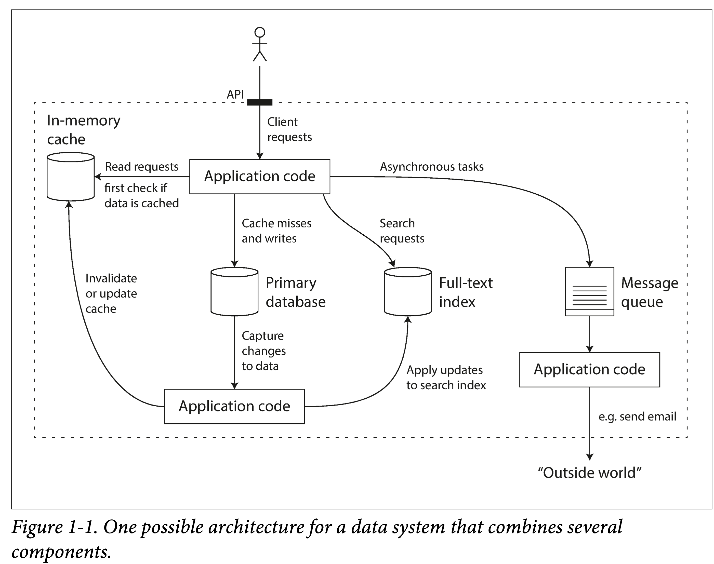
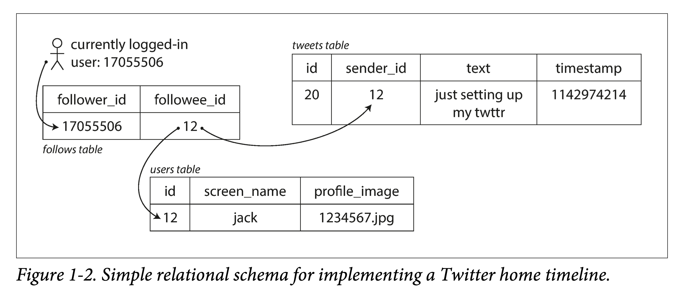
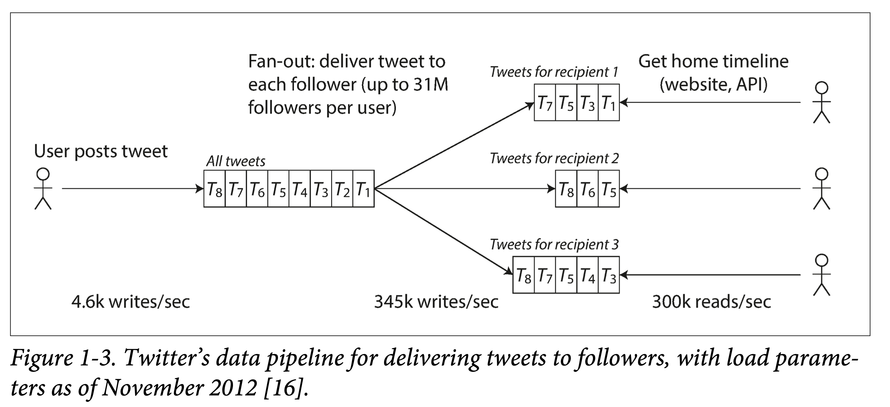
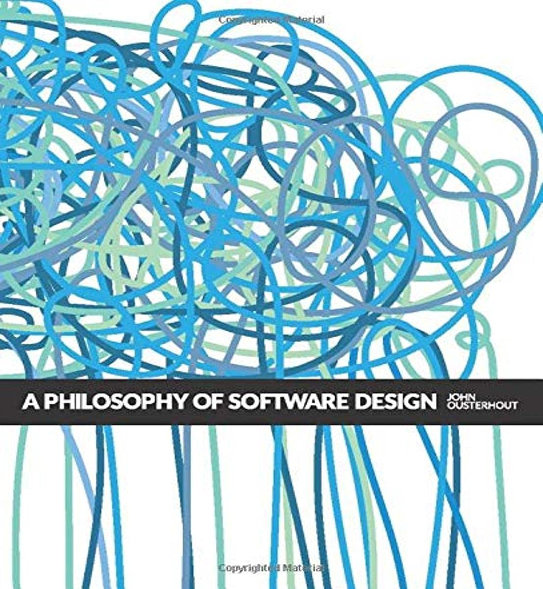

# DDIA 逐章精读（一）：可靠、可扩展、可维护

# 本书为什么以数据系统为主题

**数据系统**（data system）是一种模糊的统称。在信息社会中，一切皆可信息化，或者，某种程度上来说——数字化。这些数据的采集、存储和使用，是构成信息社会的基础。我们常见的绝大部分应用背后都有一套数据系统支撑，比如微信、京东、微博等等。

因此，作为 IT 从业人员，有必要系统性的了解一下现代的、分布式的数据系统。学习本书，能够学习到数据系统的背后的原理、了解其常见的实践、进而将其应用到我们工作的系统设计中。

## 常见的数据系统有哪些

- 存储数据，以便之后再次使用——**数据库**
- 记住一些非常“重”的操作结果，方便之后加快读取速度——**缓存**
- 允许用户以各种关键字搜索、以各种条件过滤数据——**搜索引擎**
- 源源不断的产生数据、并发送给其他进程进行处理——**流式处理**
- 定期处理累积的大量数据——**批处理**
- 进行消息的传送与分发——**消息队列**

这些概念如此耳熟能详以至于我们在设计系统时拿来就用，而不用去想其实现细节，更不用从头进行实现。当然，这也侧面说明这些概念抽象的多么成功。

## 数据系统的日益复杂化

但这些年来，随着应用需求的进一步复杂化，出现了很多新型的数据采集、存储和处理系统，它们不拘泥于单一的功能，也难以生硬的归到某个类别。随便举几个例子：

1. **Kafka**：可以作为存储持久化一段时间日志数据、可以作为消息队列对数据进行分发、可以作为流式处理组件对数据反复蒸馏等等。
2. **Spark**：可以对数据进行批处理、也可以化小批为流，对数据进行流式处理。
3. **Redis**：可以作为缓存加速对数据库的访问、也可以作为事件中心对消息的发布订阅。

我们面临一个新的场景，以某种组合使用这些组件时，在某种程度上，便是创立了一个新的数据系统。书中给了一个常见的对用户数据进行采集、存储、查询、旁路等操作的数据系统示例。从其示意图中可以看到各种 Web Services 的影子。

但就这么一个小系统，在设计时，就可以有很多取舍：

1. 使用何种缓存策略？是旁路还是写穿透？
2. 部分组件机器出现问题时，是保证可用性还是保证一致性？
3. 当机器一时难以恢复，如何保证数据的正确性和完整性？
4. 当负载增加时，是增加机器还是提升单机性能？
5. 设计对外的 API 时，是力求简洁还是追求强大？

因此，有必要从根本上思考下如何评价一个好数据系统，如何构建一个好的数据系统，有哪些可以遵循的设计模式？有哪些通常需要考虑的方面？

书中用了三个词来回答：**可靠性（Reliability）、可伸缩性（Scalability）、可维护性（Maintainability）**

# 可靠性

如何衡量可靠性？

- **功能上**
    1. 正常情况下，应用行为满足 API 给出的行为
    2. 在用户误输入/误操作时，能够正常处理
- **性能上**
    
    在给定硬件和数据量下，能够满足承诺的性能指标。
    
- **安全上**
    
    能够阻止未授权、恶意破坏。
    

可用性也是可靠性的一个侧面，云服务通常以多少个 9 来衡量可用性。

---

两个易混淆的概念：**Fault（系统出现问题）** and **Failure（系统不能提供服务）**

不能进行 Fault-tolerance 的系统，积累的 fault 多了，就很容易 Failure。

如何预防？混沌测试：如 Netflix 的 [chaosmonkey](https://netflix.github.io/chaosmonkey/)。

## 硬件故障

在一个大型数据中心中，这是常态：

1. 网络抖动、不通
2. 硬盘老化坏道
3. 内存故障
4. 机器过热导致 CPU 出问题
5. 机房断电

数据系统中常见的需要考虑的硬件指标：

- **MTTF mean time to failure**
    
    单块盘 平均故障时间 5 ~10 年，如果你有 1w+ 硬盘，则均匀期望下，每天都有坏盘出现。当然事实是硬盘会一波一波坏。
    

解决办法，增加冗余度：

机房多路供电，双网络等等。

对于数据：

**单机**：可以做RAID 冗余。如：EC 编码。

**多机**：多副本 or  EC 编码。

## 软件错误

相比硬件故障的随机性，软件错误的相关性更高：

1. 不能处理特定输入，导致系统崩溃。
2. 失控进程（如循环未释放资源）耗尽 CPU、内存、网络资源。
3. 系统依赖组件变慢甚至无响应。
4. 级联故障。

在设计软件时，我们通常有一些**环境假设**，和一些**隐性约束**。随着时间的推移、系统的持续运行，如果这些假设不能够继续被满足；如果这些约束被后面维护者增加功能时所破坏；都有可能让一开始正常运行的系统，突然崩溃。

### 人为问题

系统中最不稳定的是人，因此要在设计层面尽可能消除人对系统影响。依据软件的生命周期，分几个阶段来考虑：

- **设计编码**
    1. 尽可能消除所有不必要的假设，提供合理的抽象，仔细设计 API
    2. 进程间进行隔离，对尤其容易出错的模块使用沙箱机制
    3. 对服务依赖进行熔断设计
- **测试阶段**
    1. 尽可能引入第三方成员测试，尽量将测试平台自动化
    2. 单元测试、集成测试、e2e 测试、混沌测试
- **运行阶段**
    1. 详细的仪表盘
    2. 持续自检
    3. 报警机制
    4. 问题预案
- **针对组织**
    
    科学的培训和管理
    

## 可靠性有多重要？

事关用户数据安全，事关企业声誉，企业存活和做大的基石。

# 可伸缩性

可伸缩性，即系统应对负载增长的能力。它很重要，但在实践中又很难做好，因为存在一个基本矛盾：**只有能存活下来的产品才有资格谈伸缩，而过早为伸缩设计往往活不下去**。

但仍是可以了解一些基本的概念，来应对**可能会**暴增的负载。

## 衡量负载

应对负载之前，要先找到合适的方法来衡量负载，如**负载参数（load parameters）**：

- 应用日活月活
- 每秒向Web服务器发出的请求
- 数据库中的读写比率
- 聊天室中同时活跃的用户数量

书中以 Twitter 2012年11 披露的信息为例进行了说明：

1. 识别主营业务：发布推文、首页 Feed 流。
2. 确定其请求量级：发布推文（平均 4.6k请求/秒，峰值超过 12k请求/秒），查看其他人推文（300k请求/秒）

单就这个数据量级来说，无论怎么设计都问题不大。但 Twitter 需要根据用户之间的关注与被关注关系来对数据进行多次处理。常见的有推拉两种方式：

1. **拉**。每个人查看其首页 Feed 流时，从数据库现**拉取**所有关注用户推文，合并后呈现。
2. **推**。为每个用户保存一个 Feed 流视图，当用户发推文时，将其插入所有关注者 Feed 流视图中。

前者是 Lazy 的，用户只有查看时才会去拉取，不会有无效计算和请求，但每次需要现算，呈现速度较慢。而且流量一大也扛不住。

后者实现算出视图，而不管用户看不看，呈现速度较快，但会引入很多无效请求。

最终，使用的是一种推拉结合的方式，这也是外国一道经典的系统设计考题。

## 描述性能

注意和系统负载区分，系统负载是从用户视角来审视系统，是一种**客观指标**。而系统性能则是描述的系统的一种**实际能力**。比如：

1. **吞吐量（throughput）**： 每秒可以处理的单位数据量，通常记为 QPS。
2. **响应时间（response time）**： 从用户侧观察到的发出请求到收到回复的时间。
3. **延迟（latency）**：日常中，延迟经常和响应时间混用指代响应时间；但严格来说，延迟只是只请求过程中排队等休眠时间，虽然其在响应时间中一般占大头；但只有我们把请求真正处理耗时认为是瞬时，延迟才能等同于响应时间。

响应时间通常以百分位点来衡量，比如 p95，p99和 p999，它们意味着95％，99％或 99.9％ 的请求都能在该阈值内完成。在实际中，通常使用滑动窗口滚动计算最近一段时间的响应时间分布，并通常以折线图或者柱状图进行呈现。

## 应对负载

在有了描述和定义负载、性能的手段之后，终于来到正题，如何应对负载的不断增长，即使系统具有可伸缩性。

1. **纵向伸缩（scaling up）or 垂直伸缩（vertical scaling）**：换具有更强大性能的机器。e.g.  大型机机器学习训练。
2. **横向伸缩（scaling out）or 水平伸缩（horizontal scaling）**：“并联”很多廉价机，分摊负载。 e.g. 马斯克造火箭。

负载伸缩的两种方式：

- **自动**
    
    如果负载不好预测且多变，则自动较好。坏处在于不易跟踪负载，容易抖动，造成资源浪费。
    
- **手动**
    
    如果负载容易预测且不长变化，最好手动。设计简单，且不容易出错。
    

针对不同应用场景：

首先，如果规模很小，尽量还是用性能好一点的机器，可以省去很多麻烦。

其次，可以上云，利用云的可伸缩性。甚至如 Snowflake 等基础服务提供商也是 All In 云原生。

最后，实在不行再考虑自行设计可伸缩的分布式架构。

两种服务类型：

- **无状态服务**
    
    比较简单，多台机器，外层罩一个 gateway 就行。
    
- **有状态服务**
    
    根据需求场景，如读写负载、存储量级、数据复杂度、响应时间、访问模式，来进行取舍，设计合乎需求的架构。
    

**不可能啥都要，没有万金油架构**！ 但同时：万变不离其宗，组成不同架构的原子设计模式是有限的，这也是本书稍后要论述的重点。

# 可维护性

从软件的整个生命周期来看，维护阶段绝对占大头。

但大部分人都喜欢挖坑，不喜欢填坑。因此有必要，在刚开就把坑开的足够好。有三个原则：

- ***可维护性（Operability）***
    
    便于运维团队无痛接手。
    
- ***简洁性（Simplicity）***
    
    便于新手开发平滑上手：这需要一个合理的抽象，并尽量消除各种复杂度。如，层次化抽象。
    
- ***可演化性（*Evolvability）***
    
    便于后面需求快速适配：避免耦合过紧，将代码绑定到某种实现上。也称为**可扩展性（extensibility）**，**可修改性（modifiability）** 或**可塑性（plasticity）**。
    

## **可运维性（Operability）：人生苦短，关爱运维**

有效的运维绝对是个高技术活：

1. 紧盯系统状态，出问题时快速恢复。
2. 恢复后，复盘问题，定位原因。
3. 定期对平台、库、组件进行更新升级。
4. 了解组件间相互关系，避免级联故障。
5. 建立自动化配置管理、服务管理、更新升级机制。
6. 执行复杂维护任务，如将存储系统从一个数据中心搬到另外一个数据中心。
7. 配置变更时，保证系统安全性。

系统具有良好的可维护性，意味着将**可定义**的维护过程编写**文档和工具**以自动化，从而解放出人力关注更高价值事情：

1. 友好的文档和一致的运维规范。
2. 细致的监控仪表盘、自检和报警。
3. 通用的缺省配置。
4. 出问题时的自愈机制，无法自愈时允许管理员手动介入。
5. 将维护过程尽可能的自动化。
6. 避免单点依赖，无论是机器还是人。

## **简洁性（Simplicity）：复杂度管理**

推荐一本书：[A Philosophy of Software Design](https://book.douban.com/subject/30218046/) ，讲述在软件设计中如何定义、识别和降低复杂度。

复杂度表现：

1. 状态空间的膨胀。
2. 组件间的强耦合。
3. 不一致的术语和[命名](https://www.qtmuniao.com/2021/12/12/how-to-write-code-scrutinize-names/)。
4. 为了提升性能的 hack。
5. 随处可见的补丁（ workaround）。

需求很简单，但不妨碍你实现的很复杂 😉：过多的引入了**额外复杂度**（*accidental* complexity
）——非问题本身决定的，而由实现所引入的复杂度。

通常是问题理解的不够本质，写出了“**流水账**”（没有任何**抽象，abstraction**）式的代码。

如果你为一个问题找到了合适的抽象，那么问题就解决了一半，如：

1. 高级语言隐藏了机器码、CPU 和系统调用细节。
2. SQL 隐藏了存储体系、索引结构、查询优化实现细节。

如何找到合适的抽象？

1. 从计算机领域常见的抽象中找。
2. 从日常生活中常接触的概念找。

总之，一个合适的抽象，要么是**符合直觉**的；要么是和你的读者**共享上下文**的。

本书之后也会给出很多分布式系统中常用的抽象。

## 可演化性：降低改变门槛

系统需求没有变化，说明这个行业死了。

否则，需求一定是不断在变，引起变化的原因多种多样：

1. 对问题阈了解更全面
2. 出现了之前未考虑到的用例
3. 商业策略的改变
4. 客户爸爸要求新功能
5. 依赖平台的更迭
6. 合规性要求
7. 体量的改变

应对之道：

- 项目管理上
    
    敏捷开发
    
- 系统设计上
    
    依赖前两点。合理抽象，合理封装，对修改关闭，对扩展开放。
