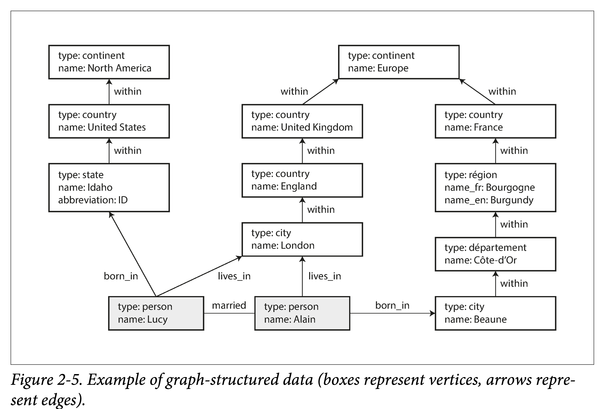

# DDIA 逐章精读（二）：数据模型和查询语言

# 概要

本节围绕两个主要概念来展开。

如何分析一个**数据模型**：

1. 基本考察点：数据基本元素，和元素之间的对应关系（一对多，多对多）
2. 利用几种常用模型来比较：（最为流行的）关系模型，（树状的）文档模型，（极大自由度的）图模型。
3. schema 模式：强 Schema（写时约束）；弱 Schema（读时解析）

如何考量**查询语言**：

1. 如何与数据模型关联、匹配
2. 声明式（declarative）和命令式（imperative）

## 数据模型

> A **data model** is an [abstract model](https://en.wikipedia.org/wiki/Abstract_model) that organizes elements of [data](https://en.wikipedia.org/wiki/Data) and standardizes how they relate to one another and to the properties of real-world entities.。         
 —[https://en.wikipedia.org/wiki/Data_model](https://en.wikipedia.org/wiki/Data_model)
> 

**数据模型**：如何组织数据，如何标准化关系，如何关联现实。

它既决定了我们构建软件的方式（**实现**），也左右了我们看待问题的角度（**认知**）。

作者开篇以计算机的不同抽象层次来让大家对**泛化的**数据模型有个整体观感。

大多数应用都是通过不同的数据模型层级累进构建的。


每层模型核心问题：如何用下一层的接口来对本层进行建模？

1. 作为**应用开发者，** 你将现实中的具体问题抽象为一组对象、**数据结构（data structure）** 以及作用于其上的 API。
2. 作为**数据库管理员（DBA）**，为了持久化上述数据结构，你需要将他们表达为通用的**数据模型（data model）**，如文档数据库中的XML/JSON、关系数据库中的表、图数据库中的图。
3. 作为**数据库系统开发者**，你需要将上述数据模型组织为内存中、硬盘中或者网络中的**字节（Bytes）** 流，并提供多种操作数据集合的方法。
4. 作为**硬件工程师**，你需要将字节流表示为二极管的电位（内存）、磁场中的磁极（磁盘）、光纤中的光信号（网络）。

> 在每一层，通过对外暴露简洁的**数据模型**，我们**隔离**和**分解**了现实世界的**复杂度**。
> 

这也反过来说明了，好的数据模型需有两个特点：

1. 简洁直观
2. 具有组合性

第二章首先探讨了关系模型、文档模型及其对比，其次是相关查询语言，最后探讨了图模型。


# 关系模型与文档模型

## 关系模型

关系模型无疑是当今最流行的数据库模型。

关系模型是 [埃德加·科德（](https://zh.wikipedia.org/wiki/%E5%9F%83%E5%BE%B7%E5%8A%A0%C2%B7%E7%A7%91%E5%BE%B7)[E. F. Codd](https://en.wikipedia.org/wiki/E._F._Codd)）于 1969 年首先提出，并用“[科德十二定律](https://zh.wikipedia.org/wiki/%E7%A7%91%E5%BE%B7%E5%8D%81%E4%BA%8C%E5%AE%9A%E5%BE%8B)”来解释。但是商业落地的数据库基本没有能完全遵循的，因此关系模型后来通指这一类数据库。特点如下：

1. 将数据以**关系**呈现给用户（比如：一组包含行列的二维表）。
2. 提供操作数据集合的**关系算子**。

**常见分类**

1. 事务型（TP）：银行交易、火车票
2. 分析型（AP）：数据报表、监控表盘
3. 混合型（HTAP）：

关系模型诞生很多年后，虽有不时有各种挑战者（比如上世纪七八十年代的**网状模型** network model 和**层次模型** hierarchical model ），但始终仍未有根本的能撼动其地位的新模型。

直到近十年来，随着移动互联网的普及，数据爆炸性增长，各种处理需求越来越精细化，催生了数据模型的百花齐放。

## NoSQL 的诞生

NoSQL（最初表示Non-SQL，后来有人转解为Not only SQL），是对不同于传统的关系数据库的数据库管理系统的统称。根据 [DB-Engines 排名](https://db-engines.com/en/ranking)，现在最受欢迎的 NoSQL 前几名为：MongoDB，Redis，ElasticSearch，Cassandra。

其催动因素有：

1. 处理更大数据集：更强伸缩性、更高吞吐量
2. 开源免费的兴起：冲击了原来把握在厂商的标准
3. 特化的查询操作：关系数据库难以支持的，比如图中的多跳分析
4. 表达能力更强：关系模型约束太严，限制太多

## 面向对象和关系模型的不匹配

核心冲突在于面向对象的**嵌套性**和关系模型的**平铺性**（？我随便造的）。

当然有 ORM 框架可以帮我们搞定这些事情，但仍是不太方便。


换另一个角度来说，关系模型很难直观的表示**一对多**的关系。比如简历上，一个人可能有多段教育经历和多段工作经历。

**文档模型**：使用 Json 和 XML 的天然嵌套。

**关系模型**：使用 SQL 模型就得将职位、教育单拎一张表，然后在用户表中使用外键关联。

在简历的例子中，文档模型还有几个优势：

1. **模式灵活**：可以动态增删字段，如工作经历。
2. **更好的局部性**：一个人的所有属性被集中访问的同时，也被集中存储。
3. **结构表达语义**：简历与联系信息、教育经历、职业信息等隐含一对多的树状关系可以被 JSON 的树状结构明确表达出来。

 

## 多对一和多对多

是一个对比各种数据模型的切入角度。

region 在存储时，为什么不直接存储纯字符串：“Greater Seattle Area”，而是先存为 region_id → region name，其他地方都引用 region_id？

1. **统一样式**：所有用到相同概念的地方都有相同的拼写和样式
2. **避免歧义**：可能有同名地区
3. **易于修改**：如果一个地区改名了，我们不用去逐一修改所有引用他的地方
4. **本地化支持**：如果翻译成其他语言，可以只翻译名字表。
5. **更好搜索**：列表可以关联地区，进行树形组织

类似的概念还有：面向抽象编程，而非面向细节。

关于用 ID 还是文本，作者提到了一点：ID 对人类是**无意义**的，无意义的意味着不会随着现实世界的将来的改变而改动。

这在关系数据库表设计时需要考虑，即如何控制**冗余（duplication）**。会有几种**范式（normalization）** 来消除冗余。

文档型数据库很擅长处理一对多的树形关系，却不擅长处理多对多的图形关系。如果其不支持 Join，则处理多对多关系的复杂度就从数据库侧移动到了应用侧。

如，多个用户可能在同一个组织工作过。如果我们想找出在同一个学校和组织工作过的人，如果数据库不支持 Join，则需要在应用侧进行循环遍历来 Join。


文档 vs 关系

1. 对于一对多关系，文档型数据库将嵌套数据放在父节点中，而非单拎出来放另外一张表。
2. 对于多对一和多对多关系，本质上，两者都是使用外键（文档引用）进行索引。查询时需要进行 join 或者动态跟随。

## 文档模型是否在重复历史？

### 层次模型 **（hierarchical model）**

20 世纪 70 年代，IBM 的信息管理系统 IMS。

> A **hierarchical database model** is a [data model](https://en.wikipedia.org/wiki/Data_model) in which the data are organized into a [tree](https://en.wikipedia.org/wiki/Tree_data_structure)-like structure. The data are stored as **records** which are connected to one another through **links.** A record is a collection of fields, with each field containing only one value. The **type** of a record defines which fields the record contains.  — wikipedia
> 

几个要点：

1. 树形组织，每个子节点只允许有一个父节点
2. 节点存储数据，节点有类型
3. 节点间使用类似指针方式连接

可以看出，它跟文档模型很像，也因此很难解决多对多的关系，并且不支持 Join。

为了解决层次模型的局限，人们提出了各种解决方案，最突出的是：

1. 关系模型
2. 网状模型

### 网状模型（network model）

network model 是 hierarchical model 的一种扩展：允许一个节点有多个父节点。它被数据系统语言会议（CODASYL）的委员会进行了标准化，因此也被称为 CODASYL 模型。

多对一和多对多都可以由路径来表示。访问记录的唯一方式是顺着元素和链接组成的链路进行访问，这个链路叫**访问路径** （access path）。难度犹如在 n-维空间中进行导航。

内存有限，因此需要严格控制遍历路径。并且需要事先知道数据库的拓扑结构，这就意味着得针对不同应用写大量的专用代码。

### 关系模型

在关系模型中，数据被组织成**元组（tuples）**，进而集合成**关系（relations）**；在 SQL 中分别对应行（rows）和表（tables）。

- 不知道大家好奇过没，明明看起来更像表模型，为什叫**关系模型**？
    
    表只是一种实现。
    
    关系（relation）的说法来自集合论，指的是几个集合的笛卡尔积的子集。
    
    R ⊆ （D1×D2×D3 ··· ×Dn）
    
    （关系用符号 R 表示，属性用符号 Ai 表示，属性的定义域用符号 Di 表示）
    

其主要目的和贡献在于提供了一种**声明式**的描述数据和构建查询的方法。

即，相比网络模型，关系模型的查询语句和执行路径相解耦，**查询优化器**（Query Optimizer 自动决定执行顺序、要使用的索引），即将逻辑和实现解耦。

举个例子：如果想使用新的方式对你的数据集进行查询，你只需要在新的字段上建立一个索引。那么在查询时，你并不需要改变的你用户代码，查询优化器便会动态的选择可用索引。

## 文档型 vs 关系型

根据数据类型来选择数据模型

|  | 文档型 | 关系型 |
| --- | --- | --- |
| 对应关系 | 数据有天然的一对多、树形嵌套关系，如简历。 | 通过外键+ Join 可以处理 多对一，多对多关系 |
| 代码简化 | 数据具有文档结构，则文档模型天然合适，用关系模型会使得建模繁琐、访问复杂。
但不宜嵌套太深，因为只能手动指定访问路径，或者范围遍历 | 主键，索引，条件过滤 |
| Join 支持 | 对 Join 支持的不太好 | 支持的还可以，但 Join 的实现会有很多难点 |
| 模式灵活性 | 弱 schema，支持动态增加字段 | 强 schema，修改 schema 代价很大 |
| 访问局部性 | 1. 一次性访问整个文档，较优 <br/>2. 只访问文档一部分，较差 | 分散在多个表中 |


对于高度关联的数据集，使用文档型表达比较奇怪，使用关系型可以接受，使用图模型最自然。

### 文档模型中 Schema 的灵活性

说文档型数据库是 schemaless 不太准确，更贴切的应该是 **schema-on-read。**

| 数据模型 |  | 编程语言 |  | 性能 & 空间 |
| --- | --- | --- | --- | --- |
| schema-on-read | 写入时不校验，而在读取时进行动态解析。 | 弱类型 | 动态，在运行时解析 | 读取时动态解析，性能较差。写入时无法确定类型，无法对齐空间利用率较差。 |
| schema-on-write | 写入时校验，数据对齐到 schema | 强类型 | 静态，编译时确定 | 性能和空间使用都较优。 |

文档型数据库使用场景特点：

1. 有多种类型的数据，但每个放一张表又不合适。
2. 数据类型和结构又外部决定，你没办法控制数据的变化。

### 查询时的数据局部性

如果你同时需要文档中所有内容，把文档顺序存会效率比较高。

但如果你只需要访问文档中的某些字段，则文档仍需要将文档全部加载出。

但运用这种局部性不局限于文档型数据库。不同的数据库，会针对不同场景，调整数据物理分布以适应常用访问模式的局部性。

- 如 Spanner 中允许表被声明为嵌入到父表中——常见关联内嵌
- HBase 和 Cassandra 使用列族来聚集数据——分析型
- 图数据库中，将点和出边存在一个机器上——图遍历

### 关系型和文档型的融合

- MySQL 和 PostgreSQL 开始支持 JSON
    
    原生支持 JSON 可以理解为，MySQL 可以理解 JSON 格式。如 Date 格式一样，可以把某个字段作为 JSON 格式，可以修改其中的某个字段，可以在其中某个字段建立索引。
    
- RethinkDB 在查询中支持 relational-link Joins
    
    

科德（Codd）：**nonsimple domains**，记录中的值除了简单类型（数字、字符串），还可以一个嵌套关系（表）。这很像 SQL 对 XML、JSON 的支持。

# 数据查询语言

获取动物表中所有鲨鱼类动物。

```jsx
function getSharks() { var sharks = [];
	for (var i = 0; i < animals.length; i++) { 
		if (animals[i].family === "Sharks") {
	    sharks.push(animals[i]);
		}
	}
	return sharks; 
}
```

```sql
SELECT * FROM animals WHERE family = 'Sharks';
```

|  | 声明式（declarative）语言 | 命令式（imperative）语言 |
| --- | --- | --- |
| 概念 | 描述控制逻辑而非执行流程  |  描述命令的执行过程，用一系列语句来不断改变状态 |
| 举例 | SQL，CSS，XSL | IMS，CODASYL，通用语言如 C，C++，JS |
| 抽象程度 | 高 | 低 |
| 解耦程度 | 与实现解耦。 <br/>可以持续优化查询引擎性能； | 与实现耦合较深。
| 解析执行 | 词法分析→ 语法分析 → 语义分析 <br/>生成执行计划→ 执行计划优化 | 词法分析→ 语法分析 → 语义分析 <br/>中间代码生成→ 代码优化 → 目标代码生成 |
| 多核并行 | 声明式更具多核潜力，给了更多运行时优化空间 | 命令式由于指定了代码执行顺序，编译时优化空间较小。 |

> Q：相对声明式语言，命令式语言有什么优点？
>    1. 当描述的目标变得复杂时，声明式表达能力不够。
>    2. 实现命令式的语言往往不会和声明式那么泾渭分明，通过合理抽象，通过一些编程范式（函数式），可以让代码兼顾表达力和清晰性。

## 数据库以外：Web 中的声明式

**需求**：选中页背景变蓝。

```html
<ul>
	<li class="selected">
		<p>Sharks</p> 
		<ul>
			<li>Great White Shark</li> 
			<li>Tiger Shark</li> 
			<li>Hammerhead Shark</li>
		</ul>
	</li>
	<li> 
		<p>Whales</p>
		<ul>
			<li>Blue Whale</li>
			<li>Humpback Whale</li>
			<li>Fin Whale</li>
		</ul> 
	</li>
</ul>
```

如果使用 CSS，则只需（CSS selector）：

```css
li.selected > p { 
	background-color: blue;
}
```

如果使用 XSL，则只需（XPath selector）：

```css
<xsl:template match="li[@class='selected']/p"> 
	<fo:block background-color="blue">
		<xsl:apply-templates/>
	</fo:block>
</xsl:template>
```

但如果使用 JavaScript（而不借助上述 selector 库）：

```jsx
var liElements = document.getElementsByTagName("li"); 
for (var i = 0; i < liElements.length; i++) {
	if (liElements[i].className === "selected") { 
		var children = liElements[i].childNodes; 
		for (var j = 0; j < children.length; j++) {
			var child = children[j];
			if (child.nodeType === Node.ELEMENT_NODE && child.tagName === "P") {
				child.setAttribute("style", "background-color: blue");
      }
		} 
	}
}
```

## MapReduce 查询

**Google 的 MapReduce 模型**

1. 借鉴自函数式编程。
2. 一种相当简单的编程模型，或者说原子的抽象，现在不太够用。
3. 但在大数据处理工具匮乏的蛮荒时代（03年以前），谷歌提出的这套框架相当有开创性。


**MongoDB  的 MapReduce 模型**

MongoDB 使用的 MapReduce 是一种介于

1. **声明式**：用户不必显式定义数据集的遍历方式、shuffle 过程等执行过程。
2. **命令式**：用户又需要定义针对单条数据的执行过程。

两者间的混合数据模型。

**需求**：统计每月观察到鲨类鱼的次数。

**查询语句**：

**PostgresSQL**

```sql
SELECT date_trunc('month', observation_timestamp) AS observation_month, 
	sum(num_animals) AS total_animals
FROM observations
WHERE family = 'Sharks' GROUP BY observation_month;
```

**MongoDB**

```jsx
db.observations.mapReduce(
	function map() { // 2. 对所有符合条件 doc 执行 map
		var year = this.observationTimestamp.getFullYear();
		var month = this.observationTimestamp.getMonth() + 1; 
		emit(year + "-" + month, this.numAnimals); // 3. 输出一个 kv pair
	},
	function reduce(key, values) { // 4. 按 key 聚集
		return Array.sum(values);    // 5. 相同 key 加和
	},
  {
		query: { family: "Sharks" }, // 1. 筛选
		out: "monthlySharkReport"    // 6. reduce 结果集
	} 
);
```

上述语句在执行时，经历了：筛选→ 遍历并执行 map → 对输出按 key 聚集（shuffle）→ 对聚集的数据注意 reduce → 输出结果集。

MapReduce 一些特点：

1. **要求 Map 和 Reduce 是纯函数**。即无任何副作用，在任意地点、以任意次序执行任何多次，对相同的输入都能得到相同的输出。因此容易并发调度。
2. **非常底层、但表达力强大的编程模型**。可基于其实现 SQL 等高级查询语言，如 Hive。

但要注意：

1. 不是所有的分布式 SQL 都基于 MapReduce 实现。
2. 不是只有 MapReduce 才允许嵌入通用语言（如 js）模块。
3. MapReduce 是有一定**理解成本**的，需要熟悉其执行逻辑才能让两个函数紧密配合。

MongoDB 2.2+ 进化版，*aggregation pipeline:*

```jsx
db.observations.aggregate([
	{ $match: { family: "Sharks" } },
	{ $group: {
		_id: {
			year:  { $year:  "$observationTimestamp" },
			month: { $month: "$observationTimestamp" }
		},
		totalAnimals: { $sum: "$numAnimals" } }}
]);
```

# 图模型

- 文档模型的适用场景？
    
    你的数据集中存在着大量**一对多**（one-to-many）的关系。
    
- 图模型的适用场景？
    
    你的数据集中存在大量的**多对多**（many-to-many）的关系。
    

## 基本概念

图数据模型的基本概念一般有三个：**点**，**边**和附着于两者之上的**属性**。

常见的可以用图建模的场景：

| 例子 | 建模 | 应用 |
| --- | --- | --- |
| 社交图谱 | 人是点， follow 关系是边 | 六度分隔，信息流推荐 |
| 互联网 | 网页是点，链接关系是边 | PageRank |
| 路网 | 交通枢纽是点，铁路/公路是边 | 路径规划，导航最短路径 |
| 洗钱 | 账户是点，转账关系是边 | 判断是否有环 |
| 知识图谱 | 概念时点，关联关系是边 | 启发式问答 |

- 同构（*homogeneous*）数据和异构数据
    
    图中的点可以都具有相同类型，但是，也可以具有不同类型，并且更为强大。
    

本节都会以下图为例，它表示了一对夫妇，来自美国爱达荷州的 Lucy 和来自法国 的 Alain。他们已婚，住在伦敦。



有多种对图的建模方式：

1. 属性图（property graph）：比较主流，如 Neo4j、Titan、InfiniteGraph
2. 三元组（triple-store）：如 Datomic、AllegroGraph

## 属性图（PG，Property Graphs）

| 点(vertices, nodes, entities) | 边(edges, relations, arcs) |
| --- | --- |
| 全局唯一 ID | 全局唯一 ID |
| 出边集合 | 起始点 |
| 入边集合 | 终止点 |
| 属性集（kv 对表示） | 属性集（kv 对表示） |
| 表示点类型的 type？ | 表示边类型的 label |

- Q：有一个疑惑点，为什么书中对于 PG 点的定义中没有 Type ？
    
    如果数据是异构的，应该有才对；莫非是通过不同的属性来标记不同的类型？
    

如果感觉不直观，可以使用我们熟悉的 SQL 语义来构建一个图模型，如下图。（Facebook TAO 论文中的单机存储引擎便是 MySQL）

```sql
// 点表
CREATE TABLE vertices (
	vertex_id integer PRIMARYKEY, properties json
);

// 边表
CREATE TABLE edges (
	edge_id integer PRIMARY KEY,
	tail_vertex integer REFERENCES vertices (vertex_id), 
	head_vertex integer REFERENCES vertices (vertex_id),
	label text,
	properties json
);

// 对点的反向索引，图遍历时用。给定点，找出点的所有入边和出边。
CREATE INDEX edges_tails ON edges (tail_vertex);
CREATE INDEX edges_heads ON edges (head_vertex);
```

图是一种很灵活的建模方式：

1. 任何两点间都可以插入边，没有任何模式限制。
2. 对于任何顶点都可以高效（思考：如何高效？）找到其入边和出边，从而进行图遍历。
3. 使用多种**标签**来标记不同类型边（关系）。

相对于关系型数据来说，**可以在同一个图中保存异构类型的数据和关系，给了图极大的表达能力！**

这种表达能力，根据图中的例子，包括：

1. 对同样的概念，可以用不同结构表示。如不同国家的行政划分。
2. 对同样的概念，可以用不同粒度表示。比如 Lucy 的现居住地和诞生地。
3. 可以很自然的进行演化。

将异构的数据容纳在一张图中，可以通过**图遍历**，轻松完成关系型数据库中需要**多次 Join** 的操作。

## Cypher 查询语言

Cypher 是 Neo4j 创造的一种查询语言。

Cypher 和 Neo 名字应该都是来自 《黑客帝国》（The Matrix）。想想 Oracle。

Cypher 的一大特点是可读性强，尤其在表达路径模式（Path Pattern）时。

结合前图，看一个 Cypher 插入语句的例子：

```sql
CREATE
  (NAmerica:Location {name:'North America', type:'continent'}),
  (USA:Location      {name:'United States', type:'country'  }),
  (Idaho:Location    {name:'Idaho',         type:'state'    }),
  (Lucy:Person       {name:'Lucy' }),
  (Idaho) -[:WITHIN]->  (USA)  -[:WITHIN]-> (NAmerica),
  (Lucy)  -[:BORN_IN]-> (Idaho)
```

如果我们要进行一个这样的查询：找出所有从美国移居到欧洲的人名。

转化为图语言，即为：给定条件， BORN_IN 指向美国的地点，并且 LIVING_IN 指向欧洲的地点，找到所有符合上述条件的点，并且返回其名字属性。

用 Cypher 语句可表示为：

```sql
MATCH
  (person) -[:BORN_IN]->  () -[:WITHIN*0..]-> (us:Location {name:'United States'}),
  (person) -[:LIVES_IN]-> () -[:WITHIN*0..]-> (eu:Location {name:'Europe'})
RETURN person.name
```

注意到：

1. 点 `()`，边 `-[]→`，标签\类型 `：`，属性 `{}`。
2. 名字绑定或者说变量：`person`
3. 0 到多次通配符： `*0...`

正如声明式查询语言的一贯特点，你只需描述问题，不必担心执行过程。但与 SQL 的区别在于，SQL 基于关系代数，Cypher 类似正则表达式。

无论是 BFS、DFS 还是剪枝等实现细节，都不需要关心。

## 使用 SQL 进行图查询

前面看到可以用 SQL 存储点和边，以表示图。

那可以用 SQL 进行图查询吗？

Oracle 的 [PGQL](https://docs.oracle.com/en/database/oracle/property-graph/20.4/spgdg/property-graph-query-language-pgql.html)：

```sql
CREATE PROPERTY GRAPH bank_transfers
     VERTEX TABLES (persons KEY(account_number))
     EDGE TABLES(
                  transactions KEY (from_acct, to_acct, date, amount)
                  SOURCE KEY (from_account) REFERENCES persons
                  DESTINATION KEY (to_account) REFERENCES persons
                  PROPERTIES (date, amount)
       )
```

其中有一个难点，就是如何表达图中的路径模式（graph pattern），如**多跳查询**，对应到 SQL 中，就是不确定次数的 Join：

```sql
() -[:WITHIN*0..]-> ()
```

使用 SQL:1999 中 recursive common table expressions （PostgreSQL, IBM DB2, Oracle, and SQL Server 支持）的可以满足。但是，相当冗长和笨拙。

## **Triple-Stores and SPARQL**

**Triple-Stores**，可以理解为三元组存储，即用三元组存储图。


其含义如下：

| Subject | 对应图中的一个点 |
| --- | --- |
| Object | 1. 一个原子数据，如 string 或者 number。<br/>2. 另一个 Subject。 |
| Predicate | 1. 如果 Object 是原子数据，则  <Predicate, Object> 对应点附带的 KV 对。<br/>2. 如果 Object 是另一个 Object，则 Predicate 对应图中的边。 |

仍是上边例子，用 Turtle triples (一种 **Triple-Stores** 语法**）**表达为**：**

```scheme
@prefix : <urn:example:>.
_:lucy     a       :Person.
_:lucy     :name   "Lucy".
_:lucy     :bornIn _:idaho.
_:idaho    a       :Location.
_:idaho    :name   "Idaho".
_:idaho    :type   "state".
_:idaho    :within _:usa.
_:usa      a       :Location
_:usa      :name   "United States"
_:usa      :type   "country".
_:usa      :within _:namerica.
_:namerica a       :Location.
_:namerica :name   "North America".
_:namerica :type   "continent".
```

一种更紧凑的写法：

```scheme
@prefix : <urn:example:>.
_:lucy     a: Person;   :name "Lucy";          :bornIn _:idaho
_:idaho    a: Location; :name "Idaho";         :type "state";     :within _:usa.
_:usa      a: Location; :name "United States"; :type "country";   :within _:namerica.
_:namerica a :Location; :name "North America"; :type "continent".
```

### 语义网（The **Semantic Web**）

万维网之父Tim Berners Lee于1998年提出，知识图谱前身。其目的在于对网络中的资源进行结构化，从而让计算机能够**理解**网络中的数据。即不是以文本、二进制流等等，而是通过某种标准结构化互相关联的数据。

**语义**：提供一种统一的方式对所有资源进行描述和**结构化**（机器可读）。

**网**：将所有资源勾连起来。

下面是**语义网技术栈**（Semantic Web Stack）：


其中 **RDF** （*ResourceDescription Framework，资源描述框架*）提供了一种结构化网络中数据的标准。使发布到网络中的任何资源（文字、图片、视频、网页），都能以统一的形式被计算机理解。即，不需要让资源使用方深度学习抽取资源的语义，而是靠资源提供方通过 RDF 主动提供其资源语义。

感觉有点理想主义，但互联网、开源社区都是靠这种理想主义、分享精神发展起来的！

虽然语义网没有发展起来，但是其**中间数据交换**格式 RDF 所定义的 SPO三元组(Subject-Predicate-Object) 却是一种很好用的数据模型，也就是上面提到的 **Triple-Stores。**

### RDF 数据模型

上面提到的 Turtle 语言（SPO三元组）是一种简单易读的描述 RDF 数据的方式， RDF 也可以基于 XML 表示，但是要冗余难读的多（嵌套太深）：

```xml
<rdf:RDF xmlns="urn:example:"
	xmlns:rdf="http://www.w3.org/1999/02/22-rdf-syntax-ns#">
	<Location rdf:nodeID="idaho"> 
		<name>Idaho</name>
		<type>state</type>
		<within>
			<Location rdf:nodeID="usa">
				<name>United States</name>
				<type>country</type>
				<within>
					<Location rdf:nodeID="namerica"> 
						<name>North America</name>
						<type>continent</type>
			    </Location>
		    </within>
      </Location>
    </within>
	</Location>
	<Person rdf:nodeID="lucy">
		<name>Lucy</name>
		<bornIn rdf:nodeID="idaho"/>
	</Person>
</rdf:RDF>
```

为了标准化和去除二义性，一些看起来比较奇怪的点是：无论 subject，predicate 还是 object 都是由 URI 定义，如

```json
lives_in 会表示为 <http://my-company.com/namespace#lives_in>
```

其前缀只是一个 namespace，让定义唯一化，并且在网络上可访问。当然，一个简化的方法是可以在文件头声明一个公共前缀。

### **SPARQL 查询语言**

有了语义网，自然需要在语义网中进行遍历查询，于是有了 RDF 的查询语言：SPARQL Protocol and RDF Query Language, pronounced “sparkle.”

```json
PREFIX : <urn:example:>
SELECT ?personName WHERE {
  ?person :name ?personName.
  ?person :bornIn  / :within* / :name "United States".
  ?person :livesIn / :within* / :name "Europe".
}
```

他是 Cypher 的前驱，因此结构看起来很像：

```json
(person) -[:BORN_IN]-> () -[:WITHIN*0..]-> (location)   # Cypher
?person   :bornIn /        :within*        ?location.   # SPARQL
```

但 **SPARQL** 没有区分边和属性的关系，都用了 Predicates。

```json
(usa {name:'United States'})   # Cypher
?usa :name "United States".    # SPARQL
```

虽然语义网没有成功落地，但其技术栈影响了后来的知识图谱和图查询语言。

### 图模型和网络模型

图模型是网络模型旧瓶装新酒吗？

否，他们在很多重要的方面都不一样。

|  模型 | 图模型（Graph Model） | 网络模型（Network Model） |
| --- | --- | --- |
| 连接方式 | 任意两个点之间都有可以有边 | 指定了嵌套约束 |
| 记录查找 | 1. 使用全局 ID <br/>2. 使用属性索引。<br/>3. 使用图遍历。 | 只能使用路径查询 |
| 有序性 | 点和边都是无序的 | 记录的孩子们是有序集合，在插入时需要考虑维持有序的开销 |
| 查询语言 | 即可命令式，也可以声明式 | 命令式的 |

## 查询语言前驱：Datalog

有点像 triple-store，但是变了下次序：(*subject*, *predicate*, *object*) → *predicate*(*subject*, *object*).
之前数据用 Datalog 表示为：

```json
name(namerica, 'North America').
type(namerica, continent).

name(usa, 'United States').
type(usa, country).
within(usa, namerica).

name(idaho, 'Idaho').
type(idaho, state).
within(idaho, usa).

name(lucy, 'Lucy').
born_in(lucy, idaho).
```

查询从*美国迁移到欧洲的人*可以表示为：

```json
within_recursive(Location, Name) :- name(Location, Name). /* Rule 1 */
within_recursive(Location, Name) :- within(Location, Via), /* Rule 2 */ 
                                    within_recursive(Via, Name).

migrated(Name, BornIn, LivingIn) :- name(Person, Name), /* Rule 3 */ 
                                    born_in(Person, BornLoc),
                                    within_recursive(BornLoc, BornIn),
                                    lives_in(Person, LivingLoc),
                                    within_recursive(LivingLoc, LivingIn).
?- migrated(Who, 'United States', 'Europe'). /* Who = 'Lucy'. */
```

1. 代码中以大写字母开头的元素是**变量**，字符串、数字或以小写字母开头的元素是**常量**。下划线（_）被称为匿名变量
2. 可以使用基本 Predicate 自定义 Predicate，类似于使用基本函数自定义函数。
3. 逗号连接的多个谓词表达式为且的关系。


基于集合的逻辑运算：

1. 根据基本数据子集选出符合条件集合。
2. 应用规则，扩充原集合。
3. 如果可以递归，则递归穷尽所有可能性。

Prolog（Programming in Logic的缩写）是一种逻辑编程语言。它创建在逻辑学的理论基础之上。

## 参考

1. 声明式(declarative) vs 命令式(imperative)**：**[https://lotabout.me/2020/Declarative-vs-Imperative-language/](https://lotabout.me/2020/Declarative-vs-Imperative-language/)
2. **[SimmerChan](https://www.zhihu.com/people/simmerchan)** 知乎专栏，知识图谱，语义网，RDF：[https://www.zhihu.com/column/knowledgegraph](https://www.zhihu.com/column/knowledgegraph)
3. MySQL 为什么叫“关系”模型：[https://zhuanlan.zhihu.com/p/64731206](https://zhuanlan.zhihu.com/p/64731206)
