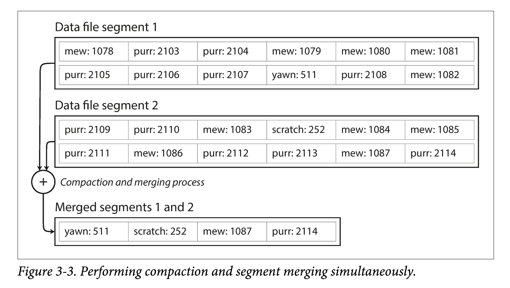

# DDIA 逐章精读（三）：存储和查询

第二章讲了上层抽象：数据模型和查询语言。
本章下沉一些，聚焦数据库底层如何处理查询和存储。这其中，有个**逻辑链条**：
> 使用场景→ 查询类型 → 存储格式。

查询类型主要分为两大类：

| 引擎类型 | 请求数量 | 数据量 | 瓶颈 | 存储格式 | 用户 | 场景举例 | 产品举例 |
| --- | --- | --- | --- | --- | --- | --- | --- |
| OLTP | 相对频繁，侧重在线交易 | 总体和单次查询都相对较小 | Disk Seek | 多用行存 | 比较普遍，一般应用用的比较多 | 银行交易 | MySQL |
| OLAP | 相对较少，侧重离线分析 | 总体和单次查询都相对巨大 | Disk Bandwidth | 列存逐渐流行 | 多为商业用户 | 商业分析 | ClickHouse |

其中，OLTP 侧，常用的存储引擎又有两种流派：

| 流派 | 主要特点 | 基本思想 | 代表 |
| --- | --- | --- | --- |
| log-structured 流 | 只允许追加，所有修改都表现为文件的追加和文件整体增删 | 变随机写为顺序写 | Bitcask、LevelDB、RocksDB、Cassandra、Lucene |
| update-in-place 流 | 以页（page）为粒度对磁盘数据进行修改 | 面向页、查找树 | B族树，所有主流关系型数据库和一些非关系型数据库 |

此外，针对 OLTP， 还探索了常见的建索引的方法，以及一种特殊的数据库——全内存数据库。

对于数据仓库，本章分析了它与 OLTP 的主要不同之处。数据仓库主要侧重于聚合查询，需要扫描很大量的数据，此时，索引就相对不太有用。需要考虑的是存储成本、带宽优化等，由此引出列式存储。

# 驱动数据库的底层数据结构

本节由一个 shell 脚本出发，到一个相当简单但可用的存储引擎 Bitcask，然后引出 LSM-tree，他们都属于日志流范畴。之后转向存储引擎另一流派——B 族树，之后对其做了简单对比。最后探讨了存储中离不开的结构——索引。

首先来看，世界上“最简单”的数据库，由两个 Bash 函数构成：

```bash
#!/bin/bash
db_set () {
	echo "$1,$2" >> database
}

db_get () {
	grep "^$1," database | sed -e "s/^$1,//" | tail -n 1
}
```

这两个函数实现了一个基于字符串的 KV 存储（只支持 get/set，不支持 delete）：

```bash
$ db_set 123456 '{"name":"London","attractions":["Big Ben","London Eye"]}' 
$ db_set 42 '{"name":"San Francisco","attractions":["Golden Gate Bridge"]}'
$ db_get 42
{"name":"San Francisco","attractions":["Golden Gate Bridge"]}
```

来分析下它为什么 work，也反映了日志结构存储的最基本原理：

1. set：在文件末尾追加一个 KV 对。
2. get：匹配所有 Key，返回最后（也即最新）一条 KV 对中的 Value。

可以看出：写很快，但是读需要全文逐行扫描，会慢很多。典型的以读换写。为了加快读，我们需要构建**索引：**一种允许基于某些字段查找的额外数据结构。

索引从原数据中构建，只为加快查找。因此索引会耗费一定额外空间，和插入时间（每次插入要更新索引），即，重新以空间和写换读取。

这便是数据库存储引擎设计和选择时最常见的**权衡（trade off）**：

1. 恰当的**存储格式**能加快写（日志结构），但是会让读取很慢；也可以加快读（查找树、B族树），但会让写入较慢。
2. 为了弥补读性能，可以构建索引。但是会牺牲写入性能和耗费额外空间。

存储格式一般不好动，但是索引构建与否，一般交予用户选择。

## 哈希索引

本节主要基于最基础的 KV 索引。

依上小节的例子，所有数据顺序追加到磁盘上。为了加快查询，我们在内存中构建一个哈希索引：

1. Key 是查询 Key
2. Value 是 KV 条目的起始位置和长度。


看来很简单，但这正是 [Bitcask](https://docs.riak.com/riak/kv/2.2.3/setup/planning/backend/bitcask/index.html "Bitcask") 的基本设计，但关键是，他 Work（在小数据量时，即所有 key 都能存到内存中时）：能提供很高的读写性能：

1. 写：文件追加写。
2. 读：一次内存查询，一次磁盘 seek；如果数据已经被缓存，则 seek 也可以省掉。

如果你的 key 集合很小（意味着能全放内存），但是每个 key 更新很频繁，那么 Bitcask 便是你的菜。举个栗子：频繁更新的视频播放量，key 是视频 url，value 是视频播放量。

> 但有个很重要问题，单个文件越来越大，磁盘空间不够怎么办？
>
> 在文件到达一定尺寸后，就新建一个文件，将原文件变为只读。同时为了回收多个 key 多次写入的造成的空间浪费，可以将只读文件进行紧缩（ compact ），将旧文件进行重写，挤出“水分”（被覆写的数据）以进行垃圾回收。
    


当然，如果我们想让其**工业可用**，还有很多问题需要解决：

1. **文件格式**。对于**日志**来说，CSV 不是一种紧凑的数据格式，有很多空间浪费。比如，可以用 length + record bytes 。
2. **记录删除**。之前只支持 put\get，但实际还需要支持 delete。但日志结构又不支持更新，怎么办呢？一般是写一个特殊标记（比如墓碑记录，tombstone）以表示该记录已删除。之后 compact 时真正删除即可。
3. **宕机恢复**。在机器重启时，内存中的哈希索引将会丢失。当然，可以全盘扫描以重建，但通常一个小优化是，对于每个 segment file， 将其索引条目和数据文件一块持久化，重启时只需加载索引条目即可。
4. **记录写坏、少写**。系统任何时候都有可能宕机，由此会造成记录写坏、少写。为了识别错误记录，我们需要增加一些校验字段，以识别并跳过这种数据。为了跳过写了部分的数据，还要用一些特殊字符来标识记录间的边界。
5. **并发控制**。由于只有一个活动（追加）文件，因此写只有一个天然并发度。但其他的文件都是不可变的（compact 时会读取然后生成新的），因此读取和紧缩可以并发执行。

乍一看，基于日志的存储结构存在折不少浪费：需要以追加进行更新和删除。但日志结构有几个原地更新结构无法做的优点：

1. **以顺序写代替随机写**。对于磁盘和 SSD，顺序写都要比随机写快几个数量级。
2. **简易的并发控制**。由于大部分的文件都是**不可变（immutable）**的，因此更容易做并发读取和紧缩。也不用担心原地更新会造成新老数据交替。
3. **更少的内部碎片**。每次紧缩会将垃圾完全挤出。但是原地更新就会在 page 中留下一些不可用空间。

当然，基于内存的哈希索引也有其局限：

1. **所有 Key 必须放内存**。一旦 Key 的数据量超过内存大小，这种方案便不再 work。当然你可以设计基于磁盘的哈希表，但那又会带来大量的随机写。
2. **不支持范围查询**。由于 key 是无序的，要进行范围查询必须全表扫描。

后面讲的 LSM-Tree 和 B+ 树，都能部分规避上述问题。

- 想想，会如何进行规避？
    
    

## SSTables 和 LSM-Trees

这一节层层递进，步步做引，从 SSTables 格式出发，牵出 LSM-Trees 全貌。

对于 KV 数据，前面的 BitCask 存储结构是：

1. 外存上日志片段
2. 内存中的哈希表

其中外存上的数据是简单追加写而形成的，并没有按照某个字段有序。

假设加一个限制，让这些文件按 key 有序。我们称这种格式为：SSTable（Sorted String Table）。

这种文件格式有什么优点呢？

**高效的数据文件合并**。即有序文件的归并外排，顺序读，顺序写。不同文件出现相同 Key 怎么办？


**不需要在内存中保存所有数据的索引**。仅需要记录下每个文件界限（以区间表示：[startKey, endKey]，当然实际会记录的更细）即可。查找某个 Key 时，去所有包含该 Key 的区间对应的文件二分查找即可。


**分块压缩，节省空间，减少 IO**。相邻 Key 共享前缀，既然每次都要批量取，那正好一组 key batch 到一块，称为 block，且只记录 block 的索引。

### 构建和维护 SSTables

SSTables 格式听起来很美好，但须知数据是乱序的来的，我们如何得到有序的数据文件呢？

这可以拆解为两个小问题：

1. 如何构建。
2. 如何维护。

**构建 SSTable 文件**。将乱序数据在外存（磁盘 or SSD）中上整理为有序文件，是比较难的。但是在内存就方便的多。于是一个大胆的想法就形成了：

1. 在内存中维护一个有序结构（称为 **MemTable**）。红黑树、AVL 树、条表。
2. 到达一定阈值之后全量 dump 到外存。

**维护 SSTable 文件**。为什么需要维护呢？首先要问，对于上述复合结构，我们怎么进行查询：

1. 先去 MemTable 中查找，如果命中则返回。
2. 再去 SSTable 按时间顺序由新到旧逐一查找。

如果 SSTable 文件越来越多，则查找代价会越来越大。因此需要将多个 SSTable 文件合并，以减少文件数量，同时进行 GC，我们称之为**紧缩**（ Compaction）。

**该方案的问题**：如果出现宕机，内存中的数据结构将会消失。 解决方法也很经典：WAL。

### 从 SSTables 到 LSM-Tree

将前面几节的一些碎片有机的组织起来，便是时下流行的存储引擎 LevelDB 和 RocksDB 后面的存储结构：LSM-Tree：


这种数据结构是 Patrick O’Neil 等人，在 1996 年提出的：[The Log-Structured Merge-Tree](https://www.cs.umb.edu/~poneil/lsmtree.pdf "The Log-Structured Merge-Tree")。

Elasticsearch 和 Solr 的索引引擎 Lucene，也使用类似 LSM-Tree 存储结构。但其数据模型不是 KV，但类似：word → document list。

### 性能优化

如果想让一个引擎工程上可用，还会做大量的性能优化。对于 LSM-Tree 来说，包括：

**优化 SSTable 的查找。**常用 [**Bloom Filter**](https://www.qtmuniao.com/2020/11/18/leveldb-data-structures-bloom-filter/)。该数据结构可以使用较少的内存为每个 SSTable 做一些指纹，起到一些初筛的作用。

**层级化组织 SSTable**。以控制 Compaction 的顺序和时间。常见的有 size-tiered 和 leveled compaction。LevelDB 便是支持后者而得名。前者比较简单粗暴，后者性能更好，也因此更为常见。


对于 RocksDB 来说，工程上的优化和使用上的优化就更多了。在其 [Wiki](https://github.com/facebook/rocksdb/wiki "rocksdb wiki") 上随便摘录几点：

1. Column Family
2. 前缀压缩和过滤
3. 键值分离，BlobDB

但无论有多少变种和优化，LSM-Tree 的核心思想——**保存一组合理组织、后台合并的 SSTables** ——简约而强大。可以方便的进行范围遍历，可以变大量随机为少量顺序。

## B 族树

虽然先讲的 LSM-Tree，但是它要比 B+ 树新的多。

B 树于 1970 年被 R. Bayer and E. McCreight [提出](https://dl.acm.org/doi/10.1145/1734663.1734671 "b tree paper")后，便迅速流行了起来。现在几乎所有的关系型数据中，它都是数据索引标准一般的实现。

与 LSM-Tree 一样，它也支持高效的**点查**和**范围查**。但却使用了完全不同的组织方式。

其特点有：

1. 以页（在磁盘上叫 page，在内存中叫 block，通常为 4k）为单位进行组织。
2. 页之间以页 ID 来进行逻辑引用，从而组织成一颗磁盘上的树。


**查找**。从根节点出发，进行二分查找，然后加载新的页到内存中，继续二分，直到命中或者到叶子节点。 查找复杂度，树的高度—— O(lgn)，影响树高度的因素：分支因子（分叉数，通常是几百个）。


**插入 or 更新**。和查找过程一样，定位到原 Key 所在页，插入或者更新后，将页完整写回。如果页剩余空间不够，则分裂后写入。

**分裂 or 合并**。级联分裂和合并。

- 一个记录大于一个 page 怎么办？
    
    树的节点是逻辑概念，page or block 是物理概念。一个逻辑节点可以对应多个物理 page。
    

### 让 B 树更可靠

B 树不像 LSM-Tree ，会在原地修改数据文件。

在树结构调整时，可能会级联修改很多 Page。比如叶子节点分裂后，就需要写入两个新的叶子节点，和一个父节点（更新叶子指针）。

1. 增加预写日志（WAL），将所有修改操作记录下来，预防宕机时中断树结构调整而产生的混乱现场。
2. 使用 latch 对树结构进行并发控制。

### B 树的优化

B 树出来了这么久，因此有很多优化：

1. 不使用 WAL，而在写入时利用 Copy On Write 技术。同时，也方便了并发控制。如 LMDB、BoltDB。
2. 对中间节点的 Key 做压缩，保留足够的路由信息即可。以此，可以节省空间，增大分支因子。
3. 为了优化范围查询，有的 B 族树将叶子节点存储时物理连续。但当数据不断插入时，维护此有序性的代价非常大。
4. 为叶子节点增加兄弟指针，以避免顺序遍历时的回溯。即 B+ 树的做法，但远不局限于 B+ 树。
5. B 树的变种，分形树，从 LSM-tree 借鉴了一些思想以优化 seek。

## B-Trees 和 LSM-Trees 对比

| 存储引擎 | B-Tree | LSM-Tree | 备注 |
| --- | --- | --- | --- |
| 优势 | 读取更快 | 写入更快 |  |
| 写放大 | 1. 数据和 WAL<br/>2. 更改数据时多次覆盖整个 Page | 1. 数据和 WAL<br/>2. Compaction | SSD 不能过多擦除。因此 SSD 内部的固件中也多用日志结构来减少随机小写。 |
| 写吞吐 | 相对较低：<br/>1. 大量随机写。 | 相对较高：<br/>1. 较低的写放大（取决于数据和配置）<br/>2. 顺序写入。<br/>3. 更为紧凑。 |  |
| 压缩率 | 1. 存在较多内部碎片。 | 1. 更加紧凑，没有内部碎片。<br/>2. 压缩潜力更大（共享前缀）。 | 但紧缩不及时会造成 LSM-Tree 存在很多垃圾 |
| 后台流量 | 1. 更稳定可预测，不会受后台 compaction 突发流量影响。 | 1. 写吞吐过高，compaction 跟不上，会进一步加重读放大。<br/>2. 由于外存总带宽有限，compaction 会影响读写吞吐。<br/>3. 随着数据越来越多，compaction 对正常写影响越来越大。 | RocksDB 写入太过快会引起 write stall，即限制写入，以期尽快 compaction 将数据下沉。 |
| 存储放大 | 1. 有些 Page 没有用满 | 1. 同一个 Key 存多遍 |  |
| 并发控制 | 1. 同一个 Key 只存在一个地方<br/>2. 树结构容易加范围锁。 | 同一个 Key 会存多遍，一般使用 MVCC 进行控制。 |  |

## 其他索引结构

**次级索引（secondary indexes）**。即，非主键的其他属性到该元素（SQL 中的行，MongoDB 中的文档和图数据库中的点和边）的映射。

### **聚集索引和非聚集索引（cluster indexes and non-cluster indexes）**

对于存储数据和组织索引，我们可以有多种选择：

1. 数据本身**无序**的存在文件中，称为 **堆文件（heap file）**，索引的值指向对应数据在 heap file 中的位置。这样可以避免多个索引时的数据拷贝。
2. 数据本身按某个字段有序存储，该字段通常是主键。则称基于此字段的索引为**聚集索引**（clustered index），从另外一个角度理解，即将索引和数据存在一块。则基于其他字段的索引为**非聚集索引**，在索引中仅存数据的引用。
3. 一部分列内嵌到索引中存储，一部分列数据额外存储。称为**覆盖索引（covering index）**
 或 **包含列的索引（index with included columns）**。

索引可以加快查询速度，但需要占用额外空间，并且牺牲了部分更新开销，且需要维持某种一致性。

### **多列索引**（**Multi-column indexes**）。

现实生活中，多个字段联合查询更为常见。比如查询某个用户周边一定范围内的商户，需要经度和纬度二维查询。

```sql
SELECT * FROM restaurants WHERE latitude > 51.4946 AND latitude < 51.5079
                            AND longitude > -0.1162 AND longitude < -0.1004;
```

可以：

1. 将二维编码为一维，然后按普通索引存储。
2. 使用特殊数据结构，如 R 树。

### **全文索引和模糊索引（Full-text search and fuzzy indexes）**。

前述索引只提供全字段的精确匹配，而不提供类似搜索引擎的功能。比如，按字符串中包含的单词查询，针对笔误的单词查询。

在工程中常用 [Apace Lucene](https://lucene.apache.org/ "Apace Lucene") 库，和其包装出来的服务：[Elasticsearch](https://www.elastic.co/cn/ "Elasticsearch")。他也使用类似 LSM-tree 的日志存储结构，但其索引是一个有限状态自动机，在行为上类似 Trie 树。

### 全内存数据结构

随着单位内存成本下降，甚至支持持久化（*non-volatile memory，*NVM，如 Intel 的 [傲腾](https://www.intel.cn/content/www/cn/zh/products/details/memory-storage/optane-dc-persistent-memory.html "傲腾")），全内存数据库也逐渐开始流行。

根据是否需要持久化，内存数据大概可以分为两类：

1. **不需要持久化**。如只用于缓存的 Memcached。
2. **需要持久化**。通过 WAL、定期 snapshot、远程备份等等来对数据进行持久化。但使用内存处理全部读写，因此仍是内存数据库。

> VoltDB, MemSQL, and Oracle TimesTen 是提供关系模型的内存数据库。RAMCloud 是提供持久化保证的 KV 数据库。Redis and Couchbase 仅提供弱持久化保证。
> 

内存数据库存在优势的原因不仅在于不需要读取磁盘，而在更于不需要对数据结构进行**序列化、编码**后以适应磁盘所带来的**额外开销**。

当然，内存数据库还有以下优点：

1. **提供更丰富的数据抽象**。如 set 和 queue 这种只存在于内存中的数据抽象。
2. **实现相对简单**。因为所有数据都在内存中。

此外，内存数据库还可以通过类似操作系统 swap 的方式，提供比物理机内存更大的存储空间，但由于其有更多数据库相关信息，可以将换入换出的粒度做的更细、性能做的更好。

基于**非易失性存储器**（non-volatile memory，NVM） 的存储引擎也是这些年研究的一个热点。

# 事务型还是分析型

术语 **OL**（Online）主要是指交互式的查询。

术语**事务**（ transaction ）由来有一些历史原因。早期的数据库使用方多为商业交易（commercial ），比如买卖、发工资等等。但是随着数据库应用不断扩大，交易\事务作为名词保留了下来。

> 事务不一定具有 ACID 特性，事务型处理多是随机的以较低的延迟进行读写，与之相反，分析型处理多为定期的批处理，延迟较高。

下表是一个对比：

| 属性 | OLTP | OLAP |
| --- | --- | --- |
| 主要读取模式 | 小数据量的随机读，通过 key 查询 | 大数据量的聚合（max,min,sum, avg）查询 |
| 主要写入模式 | 随机访问，低延迟写入 | 批量导入（ETL）或者流式写入 |
| 主要应用场景 | 通过 web 方式使用的最终用户 | 互联网分析，为了辅助决策 |
| 如何看待数据 | 当前时间点的最新状态 | 随着时间推移的 |
| 数据尺寸 | 通常 GB 到 TB | 通常 TB 到 PB |

一开始对于 AP 场景，仍然使用的传统数据库。在模型层面来说，SQL 足够灵活，能够基本满足 AP 查询需求。但在实现层面，传统数据库在 AP 负载中的表现（大数据量吞吐较低）不尽如人意，因此大家开始转向在专门设计的数据库中进行 AP 查询，我们称之为**数据仓库**（Data Warehouse）。

## 数据仓库

对于一个企业来说，一般都会有很多偏交易型的系统，如用户网站、收银系统、仓库管理、供应链管理、员工管理等等。通常要求**高可用**与**低延迟**，因此直接在原库进行业务分析，会极大影响正常负载。因此需要一种手段将数据从原库导入到专门的**数仓**。

我们称之为 **ETL：extract-transform-load**。


一般企业的数据量达到一定的量级才会需要进行 AP 分析，毕竟在小数据量尺度下，用 Excel 进行聚合查询都够了。当然，现在一个趋势是，随着移动互联网、物联网的普及，接入终端的类型和数量越来越多，产生的数据增量也越来越大，哪怕初创不久的公司可能也会积存大量数据，进而也需要 AP 支持。

AP 场景下的**聚合查询**分析和传统 TP 型有所不同。因此，需要构建索引的方式也多有不同。

### 同样接口后的不同

TP 和 AP 都可以使用 SQL 模型进行查询分析。但是由于其负载类型完全不同，在查询引擎实现和存储格式优化时，做出的设计决策也就大相径庭。因此，在同一套 SQL 接口的表面下，两者对应的数据库实现结构差别很大。

虽然有的数据库系统号称两者都支持，比如之前的 Microsoft SQL Server 和 SAP HANA，但是也正日益发展成两种独立的查询引擎。近年来提的较多的 HTAP 系统也是类似，其为了 serve 不同类型负载底层其实有两套不同的存储，只不过系统内部会自动的做数据的冗余和重新组织，对用户透明。

## AP 建模：星状型和雪花型

AP 中的处理模型相对较少，比较常用的有**星状模型**，也称为**维度模型**。


如上图所示，星状模型通常包含一张**事件表（*fact table*）**和多张**维度表（*dimension tables*****）**。事件表以事件流的方式将数据组织起来，然后通过外键指向不同的维度。

星状模型的一个变种是雪花模型，可以类比雪花（❄️）图案，其特点是在维度表中会进一步进行二次细分，讲一个维度分解为几个子维度。比如品牌和产品类别可能有单独的表格。星状模型更简单，雪花模型更精细，具体应用中会做不同取舍。

在典型的数仓中，事件表可能会非常宽，即有很多的列：一百到数百列。

# 列存

前一小节提到的**分维度表**和**事实表**，对于后者来说，有可能达到数十亿行和数 PB 大。虽然事实表可能通常有几十上百列，但是单次查询通常只关注其中几个维度（列）。

如查询**人们是否更倾向于在一周的某一天购买新鲜水果或糖果**：

```sql
SELECT
  dim_date.weekday,
  dim_product.category,
  SUM(fact_sales.quantity) AS quantity_sold
FROM fact_sales
  JOIN dim_date ON fact_sales.date_key = dim_date.date_key
  JOIN dim_product ON fact_sales.product_sk = dim_product.product_sk
WHERE
  dim_date.year = 2013 AND
  dim_product.category IN ('Fresh fruit', 'Candy')
GROUP BY
  dim_date.weekday, dim_product.category;
```

由于传统数据库通常是按行存储的，这意味着对于属性（列）很多的表，哪怕只查询一个属性，也必须从磁盘上取出很多属性，无疑浪费了 IO 带宽、增大了读放大。

于是一个很自然的想法呼之欲出：每一个列分开存储好不好？


不同列之间同一个行的字段可以通过下标来对应。当然也可以内嵌主键来对应，但那样存储成本就太高了。

## 列压缩

将所有数据分列存储在一块，带来了一个意外的好处，由于同一属性的数据相似度高，因此更易压缩。

如果每一列中值阈相比行数要小的多，可以用**位图编码（ *[bitmap encoding](https://en.wikipedia.org/wiki/Bitmap_index "bitmap encoding")* ）**。举个例子，零售商可能有数十亿的销售交易，但只有 100,000 个不同的产品。


上图中，是一个列分片中的数据，可以看出只有 {29, 30, 31, 68, 69, 74} 六个离散值。针对每个值出现的位置，我们使用一个 bit array 来表示：

1. bit map 下标对应列的下标
2. 值为 0 则表示该下标没有出现该值
3. 值为 1 则表示该下标出现了该值

如果 bit array 是稀疏的，即大量的都是 0，只要少量的 1。其实还可以使用 **[游程编码](https://zh.wikipedia.org/zh/%E6%B8%B8%E7%A8%8B%E7%BC%96%E7%A0%81 "游程编码")（RLE， Run-length encoding）** 进一步压缩：

1. 将连续的 0 和 1，改写成 `数量+值`，比如 `product_sk = 29` 是 `9 个 0，1 个 1，8 个 0`。
2. 使用一个小技巧，将信息进一步压缩。比如将同值项合并后，肯定是 0 1 交错出现，固定第一个值为 0，则交错出现的 0 和 1 的值也不用写了。则 `product_sk = 29`  编码变成 `9，1，8`
3. 由于我们知道 bit array 长度，则最后一个数字也可以省掉，因为它可以通过 `array len - sum(other lens)` 得到，则 `product_sk = 29`  的编码最后变成：`9，1`

位图索引很适合应对查询中的逻辑运算条件，比如：

```sql
WHERE product_sk IN（30，68，69）
```

可以转换为 `product_sk = 30`、`product_sk = 68`和 `product_sk = 69`这三个 bit array 按位或（OR）。

```sql
WHERE product_sk = 31 AND store_sk = 3
```

可以转换为 `product_sk = 31`和 `store_sk = 3`的 bit array 的按位与，就可以得到所有需要的位置。

### 列族

书中特别提到**列族（column families）**。它是 Cassandra 和 HBase 中的的概念，他们都起源于自谷歌的 [BigTable](https://en.wikipedia.org/wiki/Bigtable "BigTable") 。注意到他们和**列式（column-oriented）存储**有相似之处，但绝不完全相同：

1. 同一个列族中多个列是一块存储的，并且内嵌行键（row key）。
2. 并且列不压缩（存疑？）

因此 BigTable 在用的时候主要还是面向行的，可以理解为每一个列族都是一个子表。

### 内存带宽和向量化处理

数仓的超大规模数据量带来了以下瓶颈：

1. 内存处理带宽
2. CPU 分支预测错误和[流水线停顿](https://zh.wikipedia.org/wiki/%E6%B5%81%E6%B0%B4%E7%BA%BF%E5%81%9C%E9%A1%BF "流水线停顿")

关于内存的瓶颈可已通过前述的数据压缩来缓解。对于 CPU 的瓶颈可以使用：

1. 列式存储和压缩可以让数据尽可能多地缓存在 L1 中，结合位图存储进行快速处理。
2. 使用 SIMD 用更少的时钟周期处理更多的数据。

## 列式存储的排序

由于数仓查询多集中于聚合算子（比如 sum，avg，min，max），列式存储中的存储顺序相对不重要。但也免不了需要对某些列利用条件进行筛选，为此我们可以如 LSM-Tree 一样，对所有行按某一列进行排序后存储。

> 注意，不可能同时对多列进行排序。因为我们需要维护多列间的下标间的对应关系，才可能按行取数据。
> 

同时，排序后的那一列，压缩效果会更好。

### 不同副本，不同排序

在分布式数据库（数仓这么大，通常是分布式的）中，同一份数据我们会存储多份。对于每一份数据，我们可以按不同列有序存储。这样，针对不同的查询需求，便可以路由到不同的副本上做处理。当然，这样也最多只能建立副本数（通常是 3 个左右）列索引。

这一想法由 C-Store 引入，并且为商业数据仓库 Vertica 采用。

## 列式存储的写入

上述针对数仓的优化（列式存储、数据压缩和按列排序）都是为了解决数仓中常见的读写负载，读多写少，且读取都是超大规模的数据。

> 我们针对读做了优化，就让写入变得相对困难。
> 

比如 B 树的**原地更新流**是不太行的。举个例子，要在中间某行插入一个数据，**纵向**来说，会影响所有的列文件（如果不做 segment 的话）；为了保证多列间按下标对应，**横向**来说，又得更新该行不同列的所有列文件。

所幸我们有 LSM-Tree 的追加流。

1. 将新写入的数据在**内存**中 Batch 好，按行按列，选什么数据结构可以看需求。
2. 然后达到一定阈值后，批量刷到**外存**，并与老数据合并。

数仓 Vertica 就是这么做的。

## 聚合：数据立方和物化视图

不一定所有的数仓都是列式存储，但列式存储的种种好处让其变得流行了起来。

其中一个值得一提的是**物化聚合（materialized aggregates，或者物化汇总）**。

> 物化，可以简单理解为持久化。本质上是一种空间换时间的 tradeoff。
> 

数据仓库查询通常涉及聚合函数，如 SQL 中的 COUNT、SUM、AVG、MIN 或 MAX。如果这些函数被多次用到，每次都即时计算显然存在巨大浪费。因此一个想法就是，能不能将其缓存起来。

其与关系数据库中的**视图**（View）区别在于，视图是**虚拟的、逻辑存在**的，只是对用户提供的一种抽象，是一个查询的中间结果，并没有进行持久化（有没有缓存就不知道了）。

物化视图本质上是对数据的一个摘要存储，如果原数据发生了变动，该视图要被重新生成。因此，如果**写多读少**，则维持物化视图的代价很大。但在数仓中往往反过来，因此物化视图才能较好的起作用。

物化视图一个特化的例子，是**数据立方**（data cube，或者 OLAP cube）：按不同维度对量化数据进行聚合。


上图是一个按**日期和产品分类**两个维度进行加和的数据立方，当针对日期和产品进行汇总查询时，由于该表的存在，就会变得非常快。

当然，现实中，一个表中常常有多个维度，比如 3-9 中有日期、产品、商店、促销和客户五个维度。但构建数据立方的意义和方法都是相似的。

但这种构建出来的视图只能针对固定的查询进行优化，如果有的查询不在此列，则这些优化就不再起作用。

> 在实际中，需要针对性的识别（或者预估）每个场景查询分布，针对性的构建物化视图。