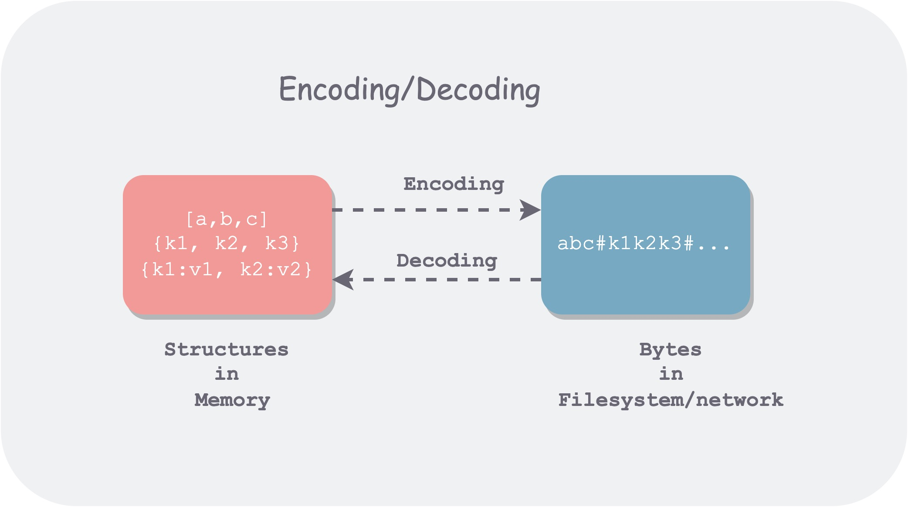
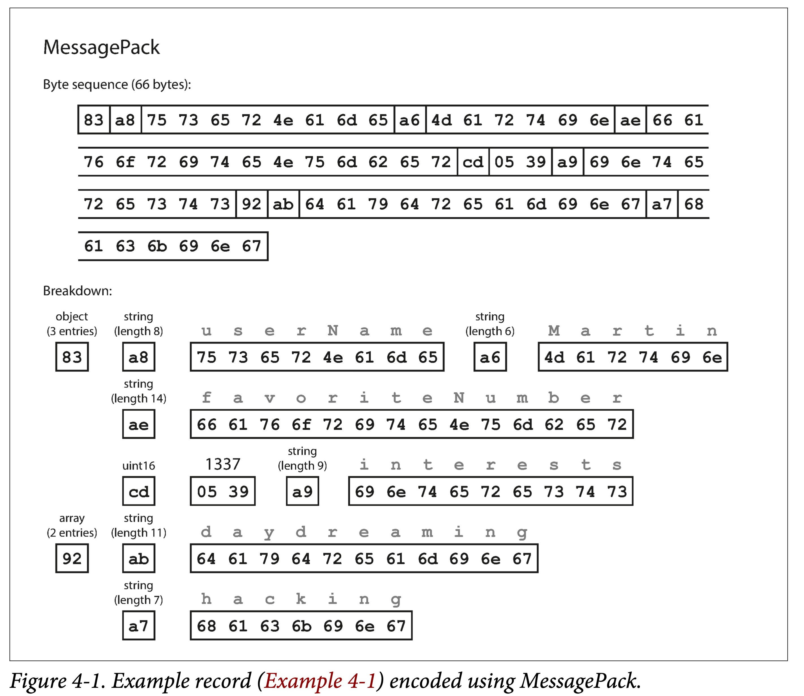
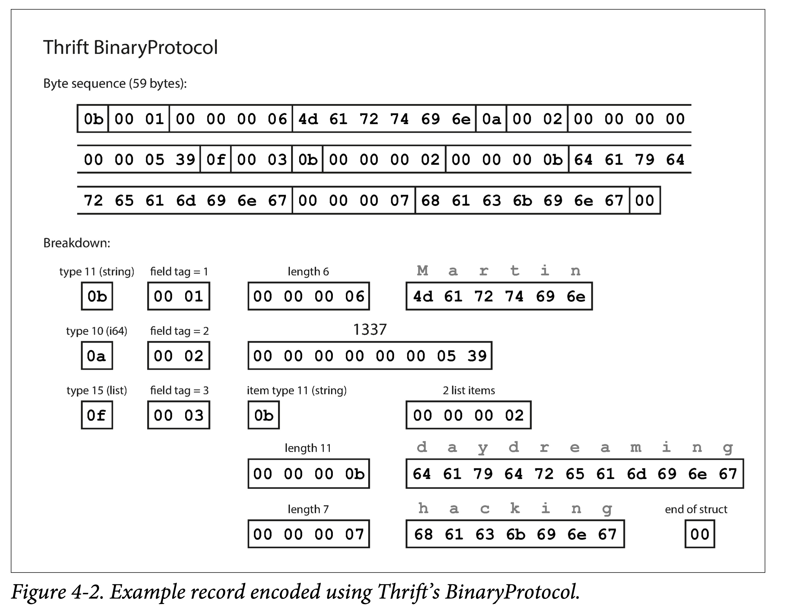
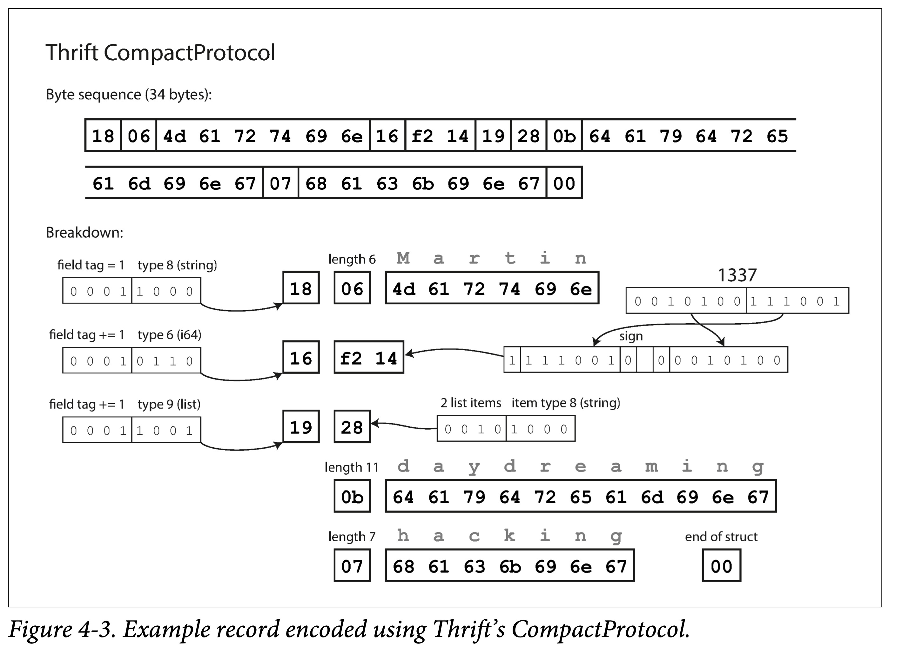
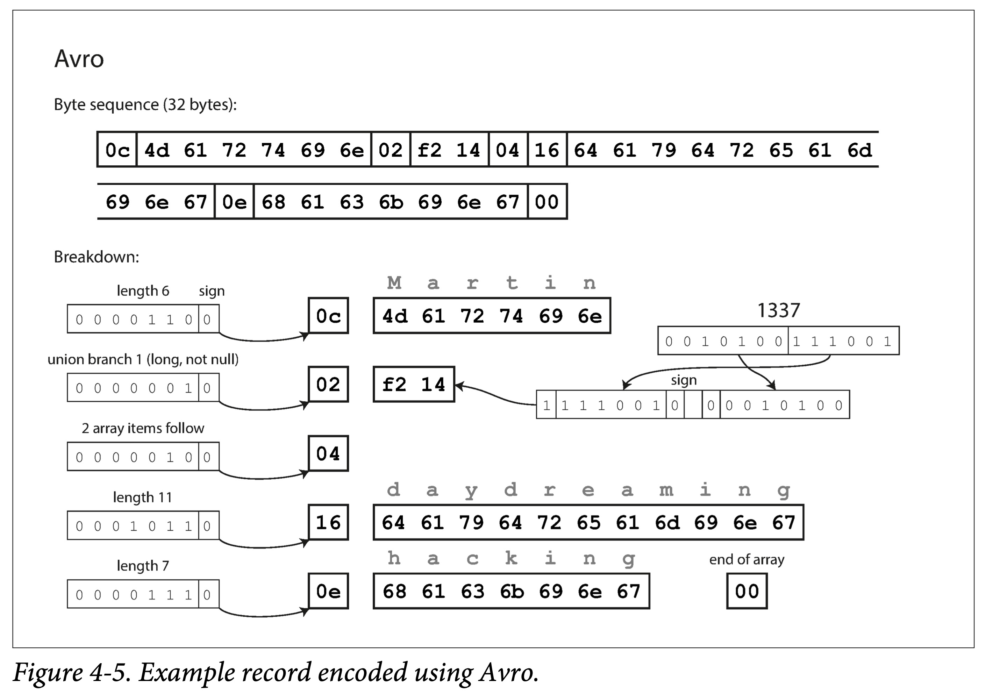
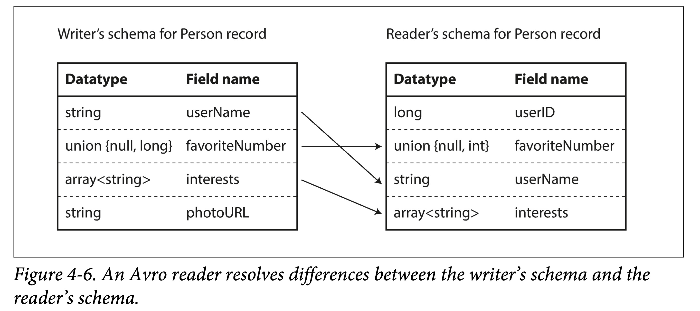
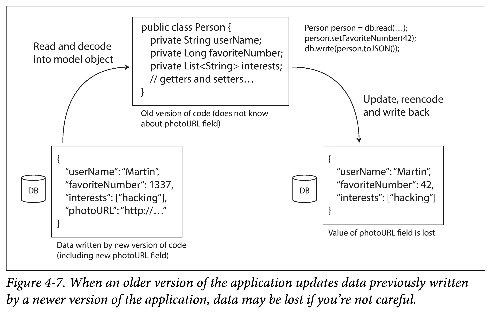

# DDIA 逐章精读（四）：编码和演进

第三章讲了存储引擎，本章继续下探，探讨编码相关问题。

所有涉及跨进程通信的地方，都需要对数据进行**编码**（**Encoding**），或者说**序列化**（**Serialization**）。因为持久化存储和网络传输都是面向字节流的。序列化本质上是一种“**降维**”操作，将内存中高维的数据结构降维成单维的字节流，于是底层硬件和相关协议，只需要处理一维信息即可。


编码主要涉及两方面问题：

1. 如何编码能够节省空间、提高性能。
2. 如何编码以适应数据的演化和兼容。

第一小节，以几种常见的编码工具（JSON，XML，Protocol Buffers 和 Avro）为例，逐一探讨了其如何进行编码、如何进行多版本兼容。这里引出了两个非常重要的概念：

1. 向后兼容 (backward compatibility)：当前代码可以读取旧版本代码写入的数据。
2. 向前兼容(forward compatibility)：当前代码可以读取新版本代码写入的数据。

> 翻译成中文后，很容易混淆，主要原因在于“后”的歧义性，到底指**身后**（过去），还是指**之后**（将来），私以为还不如翻译为，*兼容过去*和*兼容将来*。但为了习惯，后面行文仍然用向后/前兼容。
> 

其中，向后兼容比较常见，因为时间总是向前流逝，版本总是升级，那么升级之后的代码总要处理历史积压的数据，自然会产生向后兼容的问题。向前兼容比较少见，书中给出的例子是多实例滚动升级，但其持续时间也很短。

第二小节，结合几个具体的应用场景：数据库、服务和消息系统，来分别谈了相关数据流中涉及到的编码与演化。

# 数据编码的格式



编码（Encoding）有多种称谓，如**序列化（serialization）**或 **编组（marshalling）**。对应的，解码（Decoding）也有多种别称，**解析（Parsing）**，**反序列化（deserialization）**，**反编组 (unmarshalling）。**

- 为什么内存中数据和外存、网络中的会有如此不同呢？
    
    在内存中，借助编译器，我们可以将内存解释为各种数据结构；但在文件系统和网络中，我们只能通过 seek\read 等几个有限的操作来流式的读取字节流。那 mmap 呢？
    
- 编码和序列化撞车了？
    
    在事务中，也有序列化相关的术语，所以这里专用编码，以避免歧义。
    
- 编码（encoding）和加密（**encryption**）？
    
    研究的范畴不太一样，编码是为了持久化或者传输，着重点在格式和演化；而加密是为了安全，着重点在于安全、防破解。
    

## 编程语言内置

很多编程语言内置了一些缺省的编码方法：

1. Java 有 `java.io.Serializable`
2. Ruby 有 `Marshal`
3. Python 有 `pickle`

如果你确定你的数据只会被某种特定的语言所读取，那么这种内置的编码方法很好用。比如深度学习研究员因为基本都用 Python，所以常会把数据以 [pickle](https://docs.python.org/zh-cn/3/library/pickle.html "pickle 官方文档") 的格式传来传去。

但这些编程语言内置的编码格式有以下缺点：

1. 和特定语言绑定
2. 安全问题
3. 兼容性支持不够
4. 效率不高

## JSON、XML 及其二进制变体

JSON，XML 和 CSV 属于常用的**文本编码**格式，其好处在于肉眼可读，坏处在于不够紧凑，占空间较多。

JSON 最初由 JavaScript 引入，因此在 Web Service 中用的较多，当然随着 web 的火热，现在成为了比较通用的编码格式，比如很多日志格式就是 JSON 的。

XML 比较古老了，比 JSON 冗余度还高，有时候配置文件中会用，但总体而言用的越来越少了。

CSV （以逗号\TAB、换行符分割）还算紧凑，但是表达能力有限。数据库表导出有时会用。

除了不够紧凑外，**文本编码（text encoding）** 还有以下缺点：

1. 对**数值类型支持不够**。CSV 和 XML 直接不支持，万物皆字符串。JSON 虽区分字符串和数值，但是不进一步区分细分数值类型。可以理解，毕竟文本编码嘛，主要还是面向字符串。
2. **对二进制数据支持不够**。支持 Unicode，但是对二进制串支持不够，可能会显示为乱码。虽然可以通过 Base64 编码来绕过，但有点做无用功的感觉。
3. **XML和 JSON 支持额外的模式**。模式会描述数据的类型，告诉你如何理解数据。配合这些模式语言，虽然可以让 XML 和 JSON 变得强大，但是大大增加了复杂度。
4. **CSV 没有任何模式**。

凡事讲究够用，很多场景下需要数据可读，并且不关心编码效率，那么这几种编码格式就够用了。

### 二进制编码

如果数据只被单一程序读取，不需要进行交换，不需要考虑易读性等问题。则可以用二进制编码，在数据量到达一定程度后，二进制编码所带来的空间节省、速度提高都很可观。

因此，JSON 有很多二进制变种：MessagePack、BSON、BJSON、UBJSON、BISON 和 Smile 等。

对于下面例子，

```json
{
    "userName": "Martin",
    "favoriteNumber": 1337,
    "interests": ["daydreaming", "hacking"]
}
```

如果用 MessagePack 来编码，则为：



可以看出其基本编码策略为：使用类型，长度，bit 串，顺序编码，去掉无用的冒号、引号、花括号。

从而将 JSON 编码的 81 字节缩小到了 66 字节，微有提高。

## Thrift 和 Protocol Buffers

Thrift 最初由 Facebook，ProtoBuf 由 Google 在 07~08 年左右开源。他们都有对应的 RPC 框架和编解码工具。表达能力类似，语法也类似，在编码前都需要由接口定义语言（IDL）来描述模式：

```protobuf
struct Person {
    1: required string       userName,
    2: optional i64          favoriteNumber,
    3: optional list<string> interests
}
```

```protobuf
message Person {
    required string user_name       = 1;
    optional int64  favorite_number = 2;
    repeated string interests       = 3;
}
```

IDL 是编程语言无关的，可以利用相关代码生成工具，可以将上述 IDL 翻译为指定语言的代码。即，集成这些生成的代码，无论什么样的语言，都可以使用同样的格式编解码。

这也是不同 service 可以使用不同编码语言，且能够互相通信的基础。

此外，Thrift 还支持多种不同的编码格式，常用的有：Binary、Compact、JSON。可以让用户自行在：编码速度、占用空间、可读性方便进行取舍。



可以看出其特点：

1. **使用 field tag 编码**。field tag 其实蕴含了字段**类型**和**名字**。
2. 使用类型、tag、长度、bit 数组的顺序编码。



相比 Binary Protocol，Compact Protocol 由以下优化：

1. filed tag 只记录 delta。
2. 从而将 field tag 和 type 压缩到一个字节中。
3. 对数字使用变长编码和[Zigzag编码](img/ch04-fig04.png)。

ProtoBuf 与 Thrift Compact Protocol 编码方式很类似，也用了变长编码和 Zigzag 编码。但 ProtoBuf 对于数组的处理与 Thrift 显著不同，使用了 repeated 前缀而非真数组，好处后面说。


### 字段标号和模式演变

**模式**，即有哪些字段，字段分别为什么类型。

随着时间的推移，业务总会发生变化，我们也不可避免的**增删字段**，**修改字段类型**，即**模式演变**。

在模式发生改变后，需要：

1. **向后兼容**：新的代码，在处理新的增量数据格式的同时，也得处理旧的存量数据。
2. **向前兼容**：旧的代码，如果遇到新的数据格式，不能 crash。
- ProtoBuf 和 Thrift 是怎么解决这两个问题的呢？
    
    **字段标号** + **限定符**（optional、required）
    
    向后兼容：新加的字段需为 optional。这样在解析旧数据时，才不会出现字段缺失的情况。
    
    向前兼容：字段标号不能修改，只能追加。这样旧代码在看到不认识的标号时，省略即可。
    

### 数据类型和模式演变

修改数据类型比较麻烦：只能够在相容类型中进行修改。

如不能将字符串修改为整形，但是可以在整形内修改： 32 bit 到 64 bit 整形。

ProtoBuf 没有列表类型，而有一个 repeated 类型。其好处在于**兼容数组类型**的同时，支持将可选（optional）**单值字段**，修改为**多值字段**。修改后，旧代码在看到新的多值字段时，只会使用最后一个元素。

Thrift 列表类型虽然没这个灵活性，但是可以**嵌套**呀。

## Avro

Apache Avro 是 Apache Hadoop 的一个子项目，专门为数据密集型场景设计，对模式演变支持的很好。支持 **Avro IDL** 和 **JSON** 两种模式语言，前者适合人工编辑，后者适合机器读取。

```protobuf
record Person {
    string                userName;
    union { null, long }  favoriteNumber = null;
    array<string>         interests;
}
```

```json
{
    "type": "record",
    "name": "Person",
    "fields": [
        {"name": "userName", "type": "string"},
        {"name": "favoriteNumber", "type": ["null", "long"], "default": null},
        {"name": "interests", "type": {"type": "array", "items": "string"}}
    ]
}
```

可以看到 Avro 没有使用字段标号。

- 仍是编码之前例子，Avro 只用了 32 个字节，为什么呢？
    
    他没有编入类型。
    



因此，Avro 必须配合模式定义来解析，如 Client-Server 在通信的握手阶段会先交换数据模式。

### 写入模式和读取模式

- 没有字段标号，Avro 如何支持模式演进呢？
    
    答案是**显式的**使用两种模式。
    

即，在对数据进行编码（写入文件或者进行传输）时，使用模式 A，称为**写入模式**（writer schema）；在对数据进行解码（从文件或者网络读取）时，使用模式 B，称为**读取模式**（reader schema），而两者不必相同，只需兼容。

也就是说，只要模式在演进时，是**兼容**的，那么 Avro 就能够处理向后兼容和向前兼容。

**向后兼容**：新代码读取旧数据。即读取时首先得到旧数据的写入模式（即旧模式），然后将其与读取模式（即新模式）对比，得到转换映射，即可拿着此映射去解析旧数据。

**向前兼容**：旧代码读取新数据。原理类似，只不过是需要得到一个逆向映射。

在由写入模式到读取模式建立映射时有一些规则：

1. **使用字段名来进行匹配**。因此写入模式和读取模式字段名顺序不一样无所谓。
2. **忽略多出的字段**。
3. **对缺少字段填默认值**。



### 模式演化规则

- 那么如何保证写入模式的兼容呢？
    1. 在增删字段时，只能添加或删除具有默认值的字段。
    2. 在更改字段类型时，需要 Avro 支持相应的类型转换。

Avro 没有像 ProtoBuf、Thrift 那样的 optional 和 required 限定符，是通过 union 的方式，里指定默认值，甚至多种类型：

```c
union {null, long, string} field;
```

**注**：默认值必须是联合的第一个分支的类型。

更改字段名和在 union 中添加类型，都是向后兼容，但是不能向前兼容的，想想为什么？

### 如何从编码中获取写入模式

对于一段给定的 Avro 编码数据，Reader 如何从其中获得其对应的写入模式？

这取决于不同的应用场景。

- **所有数据条目同构的大文件**
    
    典型的就是 Hadoop 生态中。如果一个大文件所有记录都使用相同模式编码，则在文件头包含一次写入模式即可。
    
- **支持模式变更的数据库表**
    
    由于数据库表允许模式修改，其中的行可能写入于不同模式阶段。对于这种情况，可以在编码时额外记录一个模式版本号（比如自增），然后在某个地方存储所有的模式版本。
    
    解码时，通过版本去查询对应的写入模式即可。
    
- **网络中发送数据**
    
    在两个进程通信的握手阶段，交换写入模式。比如在一个 session 开始时交换模式，然后在整个 session 生命周期内都用此模式。
    

### 动态生成数据中的模式

Avro 没有使用字段标号的一个好处是，不需要手动维护字段标号到字段名的映射，这对于动态生成的数据模式很友好。

书中给的例子是对数据库做导出备份，注意和数据库本身使用 Avro 编码不是一个范畴，此处是指导出的数据使用 Avro 编码。

在数据库表模式发生改变前后，Avro 只需要在导出时依据当时的模式，做相应的转换，生成相应的模式数据即可。但如果使用 PB，则需要自己处理多个备份文件中，字段标号到字段名称的映射关系。其本质在于，Avro 的数据模式可以和数据存在一块，但是 ProtoBuf 的数据模式只能体现在生成的代码中，需要手动维护新旧版本备份数据与PB 生成的代码间的映射。

### 代码生成和动态语言

Thrift 和 Protobuf 会依据语言无关的 IDL 定义的模式，生成给定语言的编解码的代码。这对静态语言很有用，因为它允许利用 IDE 和编译器进行类型检查，并且能够提高编解码效率。

**上述思路本质上在于，将模式内化到了生成的代码中。**

但对于动态语言，或者说解释型语言，如 JavaScript、Ruby 或 Python，由于没有了编译期检查，生成代码的意义没那么大，反而会有一定的冗余。这时 Avro 这种支持不生成代码的框架就节省一些，它可以将模式写入数据文件，读取时利用 Avro 进行动态解析即可。

## 模式的优点

**模式的本质是显式类型约束，即，先有模式，才能有数据。**

相比于没有任何类型约束的文本编码 JSON，XML 和 CSV，Protocol Buffers，Thrift 和 Avro 这些基于显式定义二进制编码优点有：

1. 省去字段名，从而更加紧凑。
2. 模式是数据的注释或者文档，并且总是最新的。
3. 数据模式允许不读取数据，仅比对模式来做低成本的兼容性检查。
4. 对于静态类型来说，可以利用代码生成做编译时的类型检查。

模式演化 vs 读时模式

# 几种数据流模型

数据可以以很多种形式从一个系统流向另一个系统，但不变的是，流动时都需要编码与解码。

在数据流动时，会涉及编解码双方模式匹配问题，上一小节已经讨论，本小节主要探讨几种进程间典型的数据流方式：

1. 通过数据库
2. 通过服务调用
3. 通过异步消息传递

## 经由数据库的数据流

访问数据库的程序，可能：

1. **只由同一个进程访问**。则数据库可以理解为该进程向将来发送数据的中介。
2. **由多个进程访问**。则多个进程可能有的是旧版本，有的是新版本，此时数据库需要考虑向前和向后兼容的问题。

还有一种比较棘手的情况：在某个时刻，你给一个表增加了一个字段，较新的代码写入带有该字段的行，之后又被较旧的代码覆盖成缺少该字段的行。这时候就会出现一个问题：我们更新了一个字段 A，更新完后，却发现字段 B 没了。



### 不同时间写入的数据

对于应用程序，可能很短时间就可以由旧版本替换为新版本。但是对于数据，旧版本的代码写入的数据量，经年累月，可能很大。在变更了模式之后，由于这些旧模式的数据量很大，全部更新对齐到新版本的代价很高。

这种情况我们称之为：**数据的生命周期超过了其对应代码的生命周期**。

在读取时，数据库一般会对缺少对应列的旧数据：

1. 填充新版本字段的**默认值**（default value）
2. 如果没有默认值则填充**空值**（nullable）

后返回给用户。一般来说，在更改模式时（比如 alter table），数据库不允许增加既没有默认值、也不允许为空的列。

### 存储归档

有时候需要对数据库做备份到外存。在做备份（或者说快照）时，虽然会有不同时间点生成的数据，但通常会将各种版本数据转化、对齐到最新版本。毕竟，总是要全盘拷贝数据，那就顺便做下转换好了。

之前也提到了，对于这种场景，生成的是一次性的不可变的备份或者快照数据，使用 Avro 比较合适。此时也是一个很好地契机，可以将数据按需要的格式输出，比如面向分析的按列存储格式：[Parquet](https://parquet.apache.org/docs/file-format/ "Parquet")。

## 经由服务的数据流：REST 和 RPC

通过网络通信时，通常涉及两种角色：服务器（server）和客户端（client）。

通常来说，暴露于公网的多为 HTTP 服务，而 RPC 服务常在内部使用。

服务器也可以同时是客户端：

1. 作为客户端访问数据库。
2. 作为客户端访问其他服务。

对于后者，是因为我们常把一个大的服务拆成一组功能独立、相对解耦的服务，这就是 **面向服务的架构（service-oriented architecture，SOA）**，或者最近比较火的**微服务架构（micro-services architecture）**。这两者有一些不同，但这里不再展开。

服务在某种程度上和数据库类似：允许客户端以某种方式存储和查询数据。但不同的是，数据库通常提供某种灵活的查询语言，而服务只能提供相对死板的 API。

### web 服务

当服务使用 HTTP 作为通信协议时，我们通常将其称为 **web 服务**。但其并不局限于 web，还包括：

1. 用户终端（如移动终端）通过 HTTP 向服务器请求。
2. 同组织内的一个服务向另一个服务发送 HTTP 请求（微服务架构，其中的一些组件有时被称为中间件）。
3. 不同组织的服务进行数据交换。一般要通过某种手段进行验证，比如 OAuth。

有两种设计 HTTP API 的方法：REST 和 SOAP。

1. **REST 并不是一种协议，而是一种设计哲学**。它强调简单的 API 格式，使用 URL 来标识资源，使用 HTTP 的动作（GET、POST、PUT、DELETE ）来对资源进行增删改查。由于其简洁风格，越来越受欢迎。
2. SOAP 是基于 XML 的协议。虽然使用 HTTP，但目的在于独立于 HTTP。现在提的比较少了。

### RPC 面临的问题

RPC 想让调用远端服务像调用本地（同进程中）函数一样自然，虽然设想比较好、现在用的也比较多，但也存在一些问题：

1. 本地函数调用要么成功、要么不成功。但是 RPC 由于经过网络，可能会有各种复杂情况，比如请求丢失、响应丢失、hang 住以至于超时等等。因此，可能需要重试。
2. 如果重试，需要考虑**幂等性**问题。因为上一次的请求可能已经到达了服务端，只是请求没有成功返回。那么多次调用远端函数，就要保证不会造成额外副作用。
3. 远端调用延迟不可用，受网络影响较大。
4. 客户端与服务端使用的编程语言可能不同，但如果有些类型不是两种语言都有，就会出一些问题。

REST 相比 RPC 的好处在于，它不试图隐去网络，更为显式，让使用者不易忽视网络的影响。

### RPC 当前方向

尽管有上述问题，但其实在工程中，大部分情况下，上述情况都在容忍范围内：

1. 比如局域网的网络通常比较快速、可控。
2. 多次调用，使用幂等性来解决。
3. 跨语言，可以使用 RPC 框架的 IDL 来解决。

但 RPC 程序需要考虑上面提到的极端情况，否则可能会偶然出一个很难预料的 BUG。

另外，基于二进制编码的 RPC 通常比基于 HTTP 服务效率更高。但 HTTP 服务，或者更具体一点，RESTful API 的好处在于，生态好、有大量的工具支持。而 RPC 的 API 通常和 RPC 框架生成的代码高度相关，因此很难在不同组织中无痛交换和升级。

因此，如本节开头所说：暴露于公网的多为 HTTP 服务，而 RPC 服务常在内部使用。

### 数据编码和 RPC 的演化

通过服务的数据流通常可以假设：所有的服务器先更新，然后服务端再更新。因此，只需要在请求里考虑后向兼容性，在响应中考虑前向兼容性：

1. Thrift、gRPC（Protobuf）和 Avro RPC 可以根据编码格式的兼容性规则进行演变。
2. RESTful API 通常使用 JSON 作为请求响应的格式，JSON 比较容易添加新的字段来进行演进和兼容。
3. SOAP 按下不表。

对于 RPC，服务的兼容性比较困难，因为一旦 RPC 服务的 SDK 提供出去之后，你就无法对其生命周期进行控制：总有用户因为各种原因，不会进行主动升级。因此可能需要长期保持兼容性，或者提前通知和不断预告，或者维护多个版本 SDK 并逐渐对早期版本进行淘汰。

对于 RESTful API，常用的兼容方法是，将版本号做到 URL 或者 HTTP 请求头中。

## 经由消息传递的数据流

前面研究了编码解码的不同方式：

1. 数据库：一个进程写入（编码），将来一个进程读取（解码）
2. RPC 和 REST：一个进程通过网络（发送前会编码）向另一个进程发送请求（收到后会解码）并同步等待响应。

本节研究介于数据库和 RPC 间的**异步消息系统**：一个存储（消息 broker、消息队列来临时存储消息）+ 两次 RPC（生产者一次，消费者一次）。

与 RPC 相比，使用消息队列的优点：

1. 如果消费者暂时不可用，可以充当暂存系统。
2. 当消费者宕机重启后，自动地重新发送消息。
3. 生产者不必知道消费者 IP 和端口。
4. 能将一条消息发送给多个消费者。
5. 将生产者和消费者解耦。

### 消息队列

书中用的是**消息代理**（Message Broker），但另一个名字，消息队列，可能更为大家熟知，因此，本小节之后行文都用消息队列。

过去，消息队列为大厂所垄断。但近年来，开源的消息队列越来越多，可以适应不同场景，如 RabbitMQ、ActiveMQ、HornetQ、NATS 和 Apache Kafka 等等。

消息队列的**送达保证**因实现和配置而异，包括：

1. **最少一次 （at-least-once）**：同一条数据可能会送达多次给消费者。
2. **最多一次（at-most-once）**：同一条数据最多会送达一次给消费者，有可能丢失。
3. **严格一次（exactly-once）**：同一条数据保证会送达一次，且最多一次给消费者。

消息队列的逻辑抽象叫做 **Queue** 或者 **Topic**，常用的消费方式两种：

1. 多个消费者互斥消费一个 Topic
2. 每个消费者独占一个 Topic

**注**：我们有时会区分这两个概念：将点对点的互斥消费称为 Queue，多点对多点的发布订阅称为 Topic，但这并不通用，或者说没有形成共识。

一个 Topic 提供一个单向数据流，但可以组合多个 Topic，形成复杂的数据流拓扑。

消息队列通常是面向**字节数组**的，因此你可以将消息按任意格式进行编码。如果编码是前后向兼容的，同一个主题的消息格式，便可以进行灵活演进。

### 分布式的 Actor 框架

**Actor 模型**是一种基于消息传递的并发编程模型。 Actor 通常是由状态（State）、行为（Behavior）和信箱（MailBox，可以认为是一个消息队列）三部分组成：

1. 状态：Actor 中包含的状态信息。
2. 行为：Actor 中对状态的计算逻辑。
3. 信箱：Actor 接受到的消息缓存地。

由于  Actor 和外界交互都是通过消息，因此本身可以并行的，且不需要加锁。

分布式的 Actor 框架，本质上是将消息队列和 actor 编程模型集成到一块。自然，在 Actor 滚动升级是，也需要考虑前后向兼容问题。
