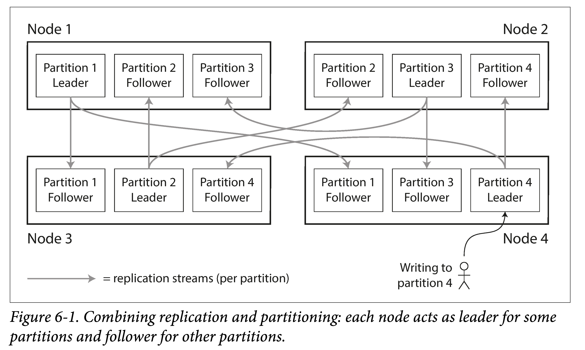
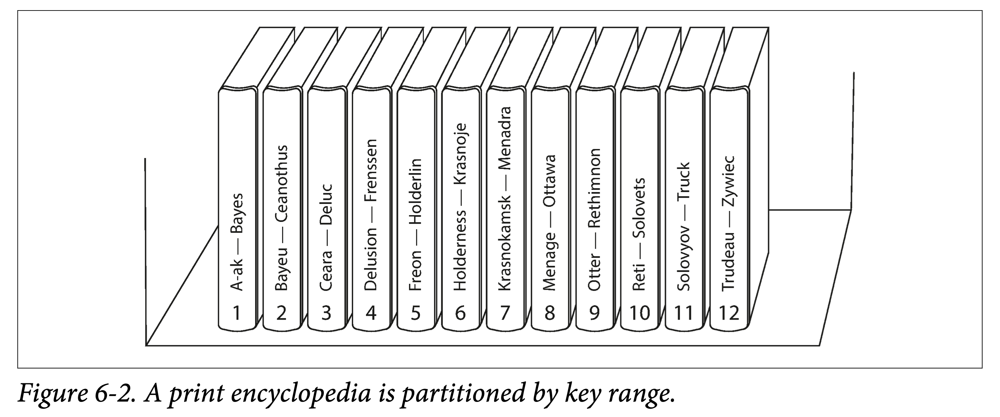
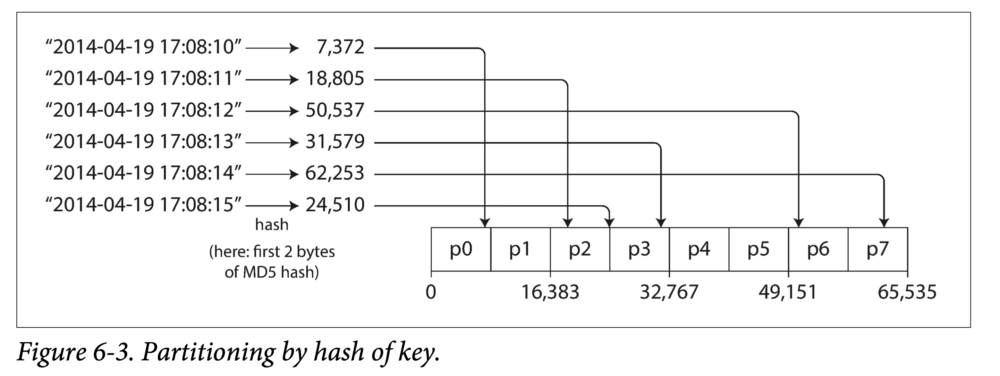
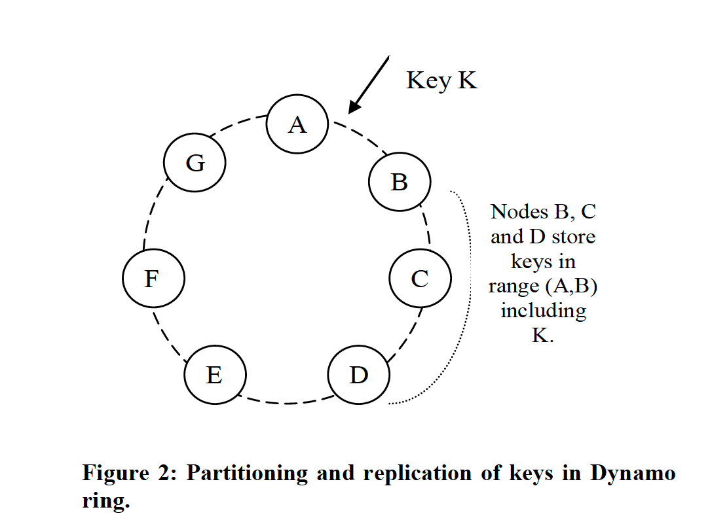
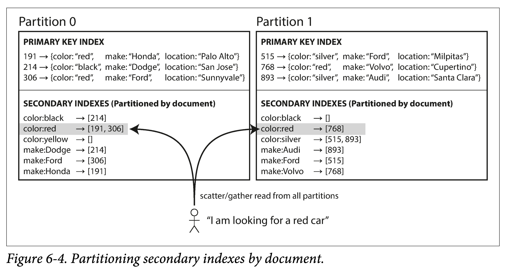
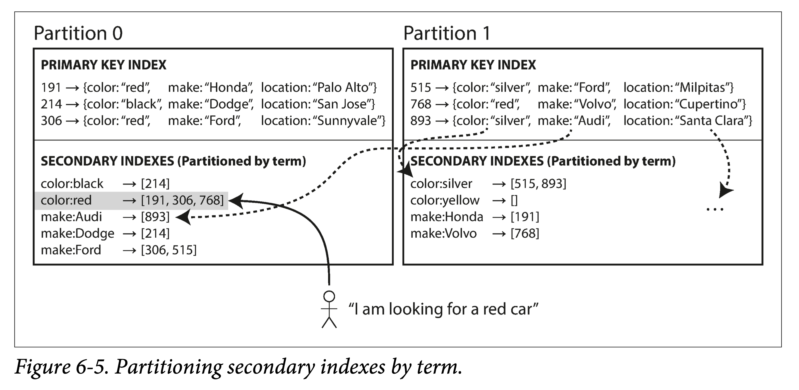
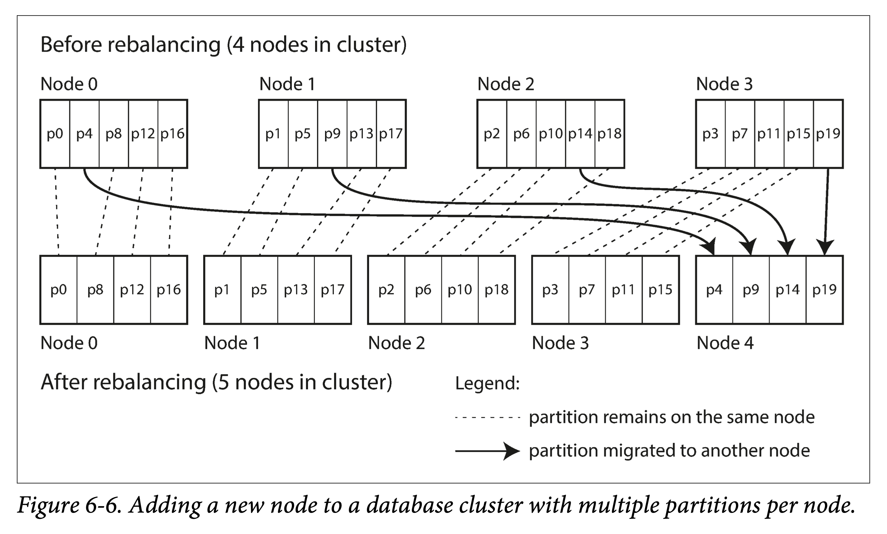
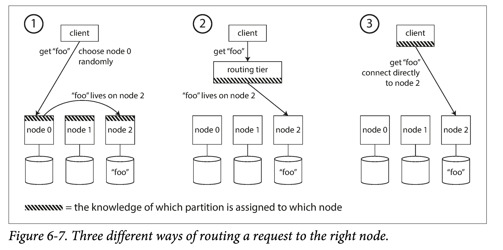
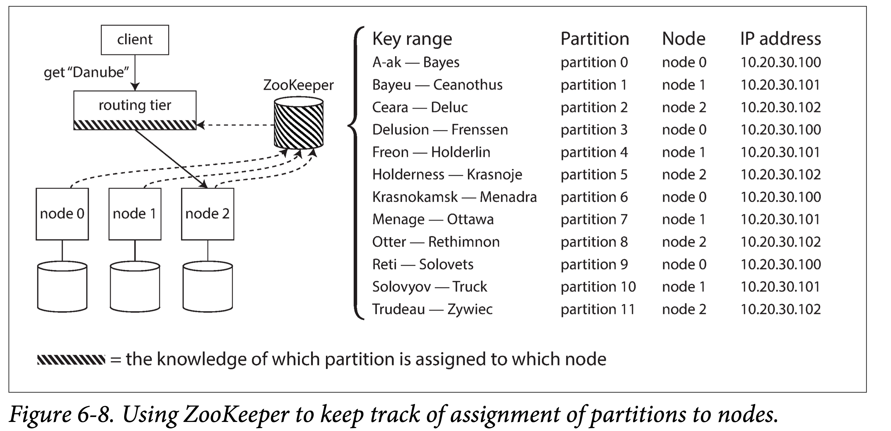

# DDIA 逐章精读（六）: 分区（Partition)

上一章主要讲复制，本章转向分片。这是两个相对正交但勾连的两个概念：

1. **分片（Partition）**：解决数据集尺度与单机容量、负载不匹配的问题，分片之后可以利用多机容量和负载。
2. **复制（Replication**）：系统机器一多，单机故障概率便增大，为了防止数据丢失以及服务高可用，需要做多副本。

> 分片，Partition，有很多别称。通用的有 Shard；具体到实际系统，HBase 中叫 Region，Bigtable 中叫 tablet，等等。本质上是对数据集的一种逻辑划分，后面行文，分片和分区可能混用，且有时为名词，有时为动词。
> 

通常来说，数据系统在分布式系统中会有三级划分：数据集（如 Database、Bucket）——分片（Partition）——数据条目（Row、KV）。通常，每个分片只属于一个数据集，每个数据条目只属于一个分片。单个分片，就像一个小点的数据库。但是，跨分区的操作的，就要复杂的多。

本章首先会介绍数据集**切分的方法**，并讨论索引和分片的配合；然后将会讨论分片**再平衡**（rebalancing），集群节点增删会引起数据再平衡；最后，会探讨数据库如何将请求**路由**到相应的分片并执行。

# 分片和复制

分片通常和复制结合使用。每个分片有多个副本，可以分散到多机上去（更泛化一点：多个容错阈）；同时，每个机器含有多个分片，但通常不会有一个分片的两个副本放到一个机器上。

如果使用多副本使用主从模型，则分片、副本、机器关系如下：

1. 从一个分片的角度看，主副本在一个机器上，从副本们在另外机器上。
2. 从一个机器的角度看，既有一些主副本分片，也有一些从副本分片。实践中，也会尽量保证主副本在集群中均匀分布，避免过多的集中到一台机器上。想想为什么？

由于分区方式和复制策略相对正交，本章会暂时忽略复制策略（在上章讲过），专注分析分区方式。

# 键值对集的分片

键值对是数据的一种最通用、泛化的表示，其他种类数据库都可以转化为键值对表示：

1. 关系型数据库，primary key → row
2. 文档型数据库，document id → document
3. 图数据库，vertex id → vertex props, edge id → edge props

因此，接下来主要针对键值对集合的分区方式，则其他数据库在构建存储层时，可以首先转化为 KV 对，然后进行分区。

**分片（Partition）**的本质是对数据集合的划分。但在实践中，可以细分为两个步骤：

1. 对数据集进行**逻辑**划分
2. 将逻辑分片调度到**物理**节点

因此，在分片时，有一些基本要求：

1. 分片过程中，要保证每个分片的数据量多少尽量均匀，否则会有**数据偏斜**（**skew**），甚而形成**数据热点**。
2. 分片后，需要保存路由信息，给一个 KV 条目，能知道去**哪个**机器上去查；稍差一些，可以知道去**哪几个**机器上去找；最差的，如果需要去所有机器逐一查询，但性能一般不可接受。

这两条是互相依赖和制约的。比如说，假设分片数目确定，为了分片均匀，每来一条数据，我们可以等概率随机选择一个分片；但在查询每个数据条目时，就得去所有机器上都查一遍。

保存所有数据条目路由信息，有三种常用的策略：

1. 通过某种固定规则，比如哈希，算出一个位置。
2. 使用内存，保存所有数据条目到机器的映射。
3. 结合两种，首先通过规则算出到逻辑分片的映射，然后通过内存保存逻辑分片到物理节点的映射。

本节主要讨论根据数据条目（Data Item）算出逻辑分区（Partition），常见的有两种方式：按键范围分区，按键哈希分区。

## 按键范围（Key Range）分区

对于 KV 数据来说，Key 通常会有个定义域，且在定义域内可（按某种维度）排序。则，将该连续的定义域进行切分，保存每个切分的上下界，在给出某个 Key 时，就能通过比较，定位其所在分区。

如，百科全书系列，通常是按照名词的字母序来分册的，每个分册可理解为该系列的一个分区，查阅时，可根据字母排序来首先找到所在分册，再使用分册目录查阅。图书馆图书的索引编号也是类似道理。

由于键并不一定在定义域内均匀分布，因此简单按照定义域等分，并不能将数据等分。因此，需要按照数据的分布，动态调整分区的界限，保证分区间数据大致均匀。这个调整的过程，既可以手动完成 ，也可以自动进行。

按键范围分区好处在于可以进行**快速的范围查询（Rang Query）**。如，某个应用是保存传感器数据，并将时间戳作为键进行分区，则可轻松获取一段时间内（如某年，某月）的数据。

但坏处在于，数据分散不均匀，且容易造成热点。可能需要动态的调整的分区边界，以维护分片的相对均匀。

仍以传感器数据存储为例，以时间戳为 Key，按天的粒度进行分区，所有最新写入都被路由到最后一个分区节点，造成严重的写入倾斜，不能充分利用所有机器的写入带宽。一个解决办法是**分级**或者**混合**，使用拼接主键，如使用传感器名称+时间戳作为主键，则可以将同时写入的多个传感器的数据分散到多机上去。

## 按键散列（Hash）分区

为了避免数据倾斜和读写热点，许多数据系统使用散列函数对键进行分区。

因此，选择散列函数的**依据**是，使得数据散列尽量均匀：即给定一个 Key，经过散列函数后，以等概率在哈希区间（如 `[0, 2^32-1)`）内产生一个值。即使原 Key 相似，他的散列值也能均匀分布。

而加密并不在考虑之列，因此并不需要多么复杂的加密算法，如，Cassandra 和 MongoDB 使用 MD5，Voldemort 使用 Fowler-Noll-Vo 函数。

选定哈希函数后，将原 Key 定义域映射到新的散列值阈，而散列值是均匀的，因此可以对散列值阈按给定分区数进行等分。

还有一种常提的哈希方法叫做**[一致性哈希](https://zh.m.wikipedia.org/zh-hans/%E4%B8%80%E8%87%B4%E5%93%88%E5%B8%8C)**。其特点是，会考虑逻辑分片和物理拓扑，将数据和物理节点按同样的哈希函数进行哈希，来决定如何将哈希分片路由到不同机器上。它可以避免在内存中维护**逻辑分片到物理节点的映射**，而是每次计算出来。即用一套算法同时解决了我们在最初提出的逻辑分片和物理路由的两个问题。 比较经典的数据系统，[Amazon Dynamo](https://www.qtmuniao.com/2020/06/13/dynamo/) 就用了这种方式。

如果不使用一致性哈希，我们需要在元数据节点中，维护逻辑分片到物理节点的映射。则在某些物理节点宕机后，需要调整该映射并手动进行数据迁移，而不能像一致性哈希一样，半自动的增量式迁移。

哈希分片在获取均匀散列能力的同时，也丧失了基于键高效的范围查询能力。如书中说，MongoDB 中选择基于哈希的分区方式，范围查询就要发送到所有分区节点；Riak 、Couchbase 或 Voldmort 干脆不支持主键的上的范围查询。

一种折中方式，和上小节一样，使用组合的方式，先散列，再顺序。如使用主键进行散列得到分区，在每个分区内使用其他列顺序存储。如在社交网络上，首先按 user_id 进行散列分区，再使用 update_time 对用户事件进行顺序排序，则可以通过 (user_id, update_timestamp) 高效查询某个用户一段事件的事件。

小结一下，两种分区方式区别在于，一个使用应用相关值（ `Key` ）分区，一个使用应用无关值（`Hash(key)`）分区，前者支持高效范围查询，后者可以均摊负载。但可使用多个字段，组合使用两种方式，使用一个字段进行分区，使用另一个字段在分区内进行排序，兼取两者优点。

## 负载偏斜和热点消除

在数据层，可以通过哈希将数据均匀散列，以期将对数据的请求均摊；但如果在应用层，不同数据条目的负载本就有倾斜，存在对某些键的热点。那么仅在数据层哈希，就不能起到消除热点的作用。

如在社交网络中的大 V，其发布的信息，天然会引起同一个键（假设键是用户 id）大量数据的写入，因为可能会有针对该用户信息的大量评论和互动。

此时，就只能在应用层进行热点消除，如可以用拼接主键，对这些大 V 用户主键进行“分身”，即在用户主键开始或者结尾添加一个随机数，两个十进制后缀就可以增加 100 中拆分可能。但这无疑需要应用层做额外的工作，请求时需要进行拆分，返回时需要进行合并。

可能之后能开发出检测热点，自动拆分合并分区，以消除倾斜和热点。

# 分片和次级索引

**次级索引（secondary index）**，即主键以外的列的索引；由于分区都是基于主键的，在针对有分区的数据建立次级索引时，就会遇到一些困难。

关于次级索引，举个例子，对于某个用户表（id, name, age, company），我们按用户 id（如身份证）对所有用户数据进行分区。但我们常常会根据名字对用户进行查询，为了加快查询，于是需要基于 name 字段，建立次级索引。

在关系型和文档型数据库中，次级索引很常见。在 KV 存储中，为了降低实现复杂度，一般不支持。但大部分场景，因为我们不可能只按单一维度对数据进行检索，因此次级索引很有用。尤其对于搜索场景，比如 Solr 和 Elasticsearch，次级索引（在搜索领域称为**倒排索引**）更是其实现基石。

在有分区的数据中，常见的建立次级索引的方法有：

1. 本地索引（local index），书中又称 document-based index
2. 全局索引（global index），书中又称 term-based index

> 注：书中给的 document-based、term-based 两个名词（包括 document 和 term）是从搜索中来的。由于搜索中都是 term→ document id list 的映射，document-based 是指按 document id 进行分区，每个分区存的索引都是本地的 document ids，而不管其他分区，因此是本地索引，查询时需要发到所有分区逐个查询。term-based  是指按 term 进行分区，则每个倒排索引都是存的全局的 document id list，因此查询的时候只需要去 term 所在分区查询即可。
> 

## 本地索引

书中举了一个维护汽车信息数据例子：每种汽车信息由 (id, color, make, location) 四元组构成。首先会根据其主键 id 进行分区，其次为了方便查询，需要对汽车颜色（ color ）和制造商（make）字段（文档数据库中称为**field，字段**；关系型数据库中称为 **column，列**，图数据库中称为 **property，属性**）建立次级索引。

次级索引会对每个数据条目建立一个索引条目，这给数据库的实现带来了一些问题：

1. 当数据库已有数据时，建立索引，何时针对存量数据构建索引。
2. 当数据库中数据条目发生更改时，如何维护数据和索引的一致性，尤其是多客户端并发修改时。

本地**索引（local index）**，就是对每个数据分区独立地建立次级索引，即，次级索引只针对本分区数据，而不关心其他分区数据。本地索引的**优点**是维护方便，在更新数据时，只需要在该分区所在机器同时更新索引即可。但**缺点**是，查询效率相对较低，所有基于索引的查询请求，都要发送到所有分区，并将结果合并，该过程也称为 **scatter/gather** 。但即使用多分区并发（而非顺序）进行索引查询优化，也仍然容易在某些机器上发生**长尾请求**（由于机器负载过高或者网络问题，导致改请求返回特别慢，称为长尾请求），导致整个请求过程变慢。

但由于实现简单，本地索引被广泛使用，如 MongoDB，Riak ，Cassandra，Elasticsearch ，SolrCloud 和 VoltDB 都使用本地索引。

## 全局索引

为了避免查询索引时将请求发到所有分区，可以建立**全局索引**，即每个次级索引条目都是针对全局数据。但为了避免索引查询热点，我们会将索引数据本身也分片，分散到多个机器上。

当然，与数据本身一样，对于索引进行分区，也可基于 Range 或基于 Hash，同样也是各有优劣（面向扫描还是均匀散列）。

全局索引能避免索引查询时的 scatter/gather 操作，但维护起来较为复杂，因为每个数据的插入，可能会影响多个索引分区（基于该数据不同字段可能会有多个二级索引）。因此，为了避免增加写入延迟，在实践中，全局索引多为异步更新。但由此会带来短暂（有时可能会比较长）的数据和索引不一致。如果想要保证强一致性，需要引入跨分区的分布式事务（实现复杂度高，且会带来较大的性能损耗），但并不是所有数据库都支持。

# 分片均衡

数据库在运行过程中，数据和机器都会发生一些变化：

1. 查询吞吐增加，需要增加机器以应对增加的负载。
2. 数据集变大，需要增加磁盘和 RAM 来存储增加数据。
3. 有机器故障，需要其他机器来接管故障机器数据。

所有这些问题都会引起数据分片在节点间的迁移，我们将之称为：**均衡（rebalancing）**。对于 rebalancing 我们期望：

1. 均衡后负载（存储、读写）在节点间均匀分布
2. 均衡时不能禁止读写，并且尽量减小影响
3. 尽量减少不必要的数据移动，尽量降低网络和磁盘 IO

## 均衡策略

分区策略会影响均衡策略。比如动态分区、静态分区，对应的均衡策略就不太一样；此外，分区的粒度和数量也会影响均衡策略。

### 不要使用：hash mod N

在说如何进行均衡之前，先说下不应该怎样做。

之前提到过，分区包括**逻辑分区**和**物理调度**两个阶段，此处说的是将两者合二为一：假设集群有 N 个节点，编号 `0 ~ N-1`，一条键为 key 的数据到来后，通过 `hash(key) mod N` 得到一个编号 n，然后将该数据发送到编号为 n 的机器上去。

为什么说这种策略不好呢？因为他不能应对机器数量的变化，如果要增删节点，就会有大量的数据需要发生迁移，否则，就不能保证数据在 `hash(key) mod N` 标号的机器上。在大规模集群中，机器节点增删比较频繁，这种策略更是不可接受。

### 静态分区

静态分区，即，逻辑分区阶段的**分区数量是固定的**，并且最好让分区数量大于（比如高一个数量级）机器节点。相比**动态分区**策略（比如，允许分区分裂和合并），固定数量分区更容易实现和维护。

书中没有提，但是估计需要在类似元信息节点，维护逻辑分区到物理节点的映射，并根据此映射信息来发现不均衡，进而进行调度。

在静态分区中，让分区数量远大于机器节点的好处在于：

1. **应对将来可能的扩容**。加入分区数量等于机器数量，则将来增加机器，仅就单个数据集来说，并不能增加其存储容量和吞吐。
2. **调度粒度更细，数据更容易均衡**。举个例子，假设只有 20 个分区，然后有 9 个机器，假设每个分区数据量大致相同，则最均衡的情况，也会有两个机器数的数据量比其他机器多 50%；
3. **应对集群中的异构性**。比如集群中某些节点磁盘容量比其他机器大，则可以多分配几个分区到该机器上。

但当然，也不能太大，因为每个分区信息也是有管理成本的：比如元信息开销、均衡调度开销等。一般来说，可以取一个你将来集群可能扩展到的最多节点数量作为初始分区数量。

对于数据量会超预期增长的数据集，静态分区策略就会让用户进退两难，已经有很多数据，重新分区代价很大，不重新分区又难以应对数据量的进一步增长。

### 动态分区

对于按键范围（key range）进行分区的策略来说，由于数据在定义域内并**不均匀分布**，如果固定分区数量，则天然地难以均衡。因此，按范围分区策略下，都会支持动态分区。按生命周期来说：

1. 开始，数据量很少，只有一个分区。
2. 随着数据量不断增长，单个分区超过一定**上界**，则按尺寸一分为二，变成两个新的分区。
3. 如果某个分区，数据删除过多，少于某个**下界**，则会和相邻分区合并（合并后超过上界怎么办？）。

动态分区好处在于，小数据量使用少量分区，减少开销；大数据量增加分区，以均摊负载。

但同时，小数据量时，如果只有一个分区，会限制写入并发。因此，工程中有些数据库支持**预分区**（pre-splitting），如 HBase 和 MongoDB，即允许在空数据库中，配置最少量的初始分区，并确定每个分区的起止键。

另外，散列分区策略也可以支持动态分区，即，在**哈希空间中**对相邻数据集进行合并和分裂。

### 与节点成比例分区

前文所述，

1. 静态均衡的分区数量一开始就固定的，但是单分区尺寸会随着总数量增大而增大。
2. 动态均衡会按着数据量多少进行动态切合，单分区尺寸相对保持不变，一直于某个设定的上下界。

但他们的分区数量都和集群节点数量没有直接关系。而另一种均衡策略，则是保持**总分区数量**和节点数量成正比，也即，保持每个节点分区数量不变。

假设集群有 m 个节点，每个节点有 n 个分区，在此种均衡策略下，当有新节点加入时，会从 m*n 个分区中随机选择 n 个分区，将其一分为二，一半由新节点分走，另一半留在原机器上。

随机选择，很容易产生有倾斜的分割。但如果 n 比较大，如 Cassandra 默认是 256，则新节点会比较容易均摊负载。

- 为什么？
    
    是因为可以从每个节点选同样数量的分区吗？比如说 n = 256， m = 16，则可以从每个节点选 16 分区吗？
    

随机选择分区，要求使用基于哈希的分区策略，这也是最接近原始一致性哈希的定义的方法。（同样存疑。

## 运维：自动均衡还是手动均衡

在实践中，均衡是自动进行还是手动进行需要慎重考虑。

1. **自动进行**。系统自动检测是否均衡，然后自动决策搬迁策略以及搬迁时间。
2. **手动进行**。管理员指定迁移策略和迁移时间。

数据均衡是一项非常昂贵且易出错的操作，会给网络带来很大压力，甚至影正常负载。自动均衡诚然可以减少运维，但在实践中，如何有效甄别是否真的需要均衡（比如网络抖动了一段时间、节点宕机又重启、故障但能修复）是一个很复杂的事情，如果做出错误决策，就会带来大量无用的数据搬迁。

因此，数据均衡通常会半自动的进行，如系统通过负载情况给出搬迁策略，由管理员审核没问题后，决定某个时间段运行（避开正常流量高峰），Couchbase、Riak 和 Voldemort 便采用了类似做法。

# 请求路由

在我们将分区放到节点上去后，当客户端请求到来时，我们如何决定将请求路由到哪台机器？这势必要求我们**以某种方式**记下：

1. 数据条目到逻辑分区的映射。
2. 逻辑分区到物理机器的映射。

这在我们之前已经讨论过。

其次，是在哪里记下这些路由（映射）信息，泛化一下，是一个**服务发现**（service discovery）问题。概括来说，由内而外，有几种方案：

1. **每个节点都有全局路由表**。客户端可以连接集群中任意一个节点，如该节点恰有该分区，则处理后返回；否则，根据路由信息，将其路由合适节点。
2. **由一个专门的路由层来记录**。客户端所有请求都打到路由层，路由层依据分区路由信息，将请求转发给相关节点。路由层只负责请求路由，并不处理具体逻辑。
3. **让客户端感知分区到节点映射**。客户端可以直接根据该映射，向某个节点发送请求。

无论记在何处，都有一个重要问题：如何让相关组件（节点本身、路由层、客户端）及时感知（分区到节点）的映射变化，将请求正确的路由到相关节点？也即，如何让所有节点就路由信息快速达成一致，业界有很多做法。

**依赖外部协调组件**。如 Zookeeper、Etcd，他们各自使用某种共识协议保持高可用，可以维护轻量的路由表，并提供发布订阅接口，在有路由信息更新时，让外部所有节点快速达成一致。

**使用内部元数据服务器**。如三节点的 Meta 服务器，每个节点都存储一份路由数据，使用某种共识协议达成一致。如 TiDB 的 Placement Driver。

**使用某种协议点对点同步**。如 Dynamo 、Cassandra 和 Riak 使用流言协议（Gossip Protocol），在集群内所有机器节点间就路由信息进行传播，并最终达成一致。

更简单一些，如 Couchbase 不支持自动的负载均衡，因此只需要使用一个路由层通过心跳从集群节点收集到所有路由信息即可。

当使用路由层（或者 Proxy 层，通常由多个实例构成），或者客户端将请求随机发动到某个集群节点时，客户端需要确定一个具体 IP 地址，但这些信息变化相对较少，因此直接使用 DNS 或者反向代理进行轮询即可。

## 并行查询执行

大部分 NoSQL 存储，所支持的查询都不太负载，如基于主键的查询、基于次级索引的 scatter/gather 查询。如前所述，都是针对单个键值非常简单的查询路由。

但对于关系型数据库产品，尤其是支持 **大规模并行处理（MPP, Massively parallel processing）**数仓，一个查询语句在执行层要复杂的多，可能会：

1. Stage：由多个阶段组成。
2. Partition：每个阶段包含多个针对每个分区的并行的子查询计划。

数仓的大规模的快速并行执行是另一个需要专门讨论的话题，由于多用于支持 BI，因此其优化具有重要意义，本书后面第十章会专门讨论。