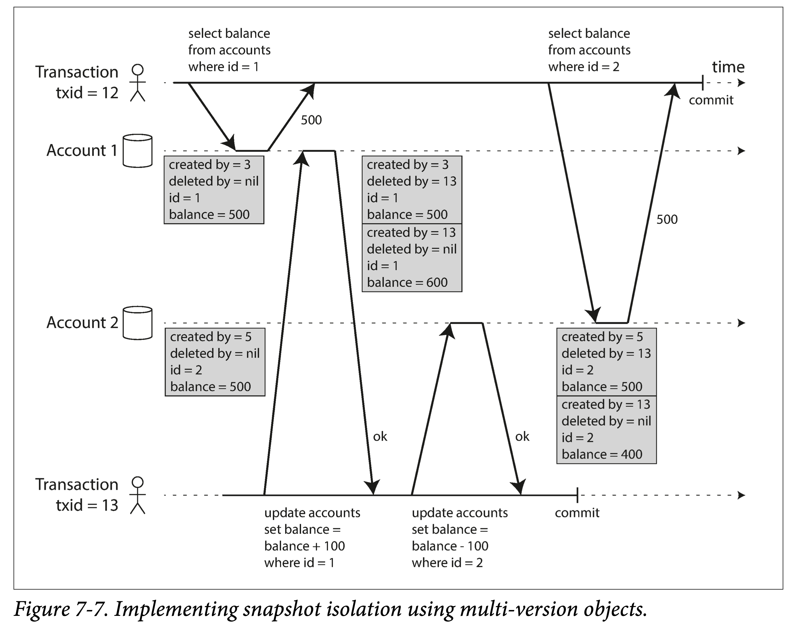

# DDIA 逐章精读（七）: 事务（transaction)

在分布式数据系统中，任何问题都有可能发生：

1. 系统侧：数据库系统和硬件系统任何时间都有可能发生故障
2. 应用侧：使用数据库的应用程序任何时刻都有可能故障。
3. 网络侧：应用程序和数据库间，数据库的多个节点间，随时都有可能断开连接。
4. 多个客户端：并发写入时，可能会有竞态条件和相互覆盖。
5. 半读：一个客户端可能会读到部分更新的数据库。

复杂度不会凭空消失，只会发生转移。如果数据库对这些故障不做任何处理，应用层就需要处理上述所有相关问题，会极大增加应用侧编程复杂度。**事务**，就是数据库为了解决类似的问题，所提供的一种保证，以**简化应用层的编程模型**。

简单来说，**事务**就是将一组语句（或者说操作）打包成一个逻辑单元进行执行，并提供一种保证，这一组操作要么全部成功（ **commit**，应用到数据库里），要么全部失败（被动 **abort**，或者主动 **rollback**），而不会存在只执行了一半的中间状态。此外，如果多个客户端的事务并发执行，会涉及到隔离性的问题，一般来说，数据库允许用户在隔离级别和性能之间做选择。

也可以从**时间**和**空间**两个角度来理解事务，从生命周期（时间）来讲，事务要保证一组操作的整体性；从并发控制（空间），事务要做好多个事务间的并发控制。

有了这种语义上的保证，用户在发现事务失败后，可以放心的进行重试，直到成功，就可以确定事务中的所有操作都生效了。但任何便利性都是有代价的，事务便是在一定程度上牺牲了性能和可用性。

本章首先讨论事务的基本概念，然后针对隔离级别（并发控制）做了详细探讨，包括读已提交、快照隔离和可串行化。事务保证和是否分布式在概念上相对正交，但在实现上，分布式系统中事务的实现难度要大的多。

# 棘手的概念

一般来说，现代关系型数据库和一些非关系型数据库，所支持的事务，大多都遵循第一个 SQL 数据库—— IBM System R 所引入的规范。

但近些年来，NoSQL 的发展对事务的概念造成了一些冲击。2000 年后，为了支持大规模分布式数据的存储，NoSQL 引入了分区、冗余，同时部分放弃了对原事务的完整支持，但通过重新定义”事务“，仍然号称支持事务。或者为了商业的宣传，引入相近的名词。

于是出现了两种极端的观点，一是认为事务与可伸缩性不可兼得，大型分布式系统都必须放弃事务支持以保持高可用性和高性能；一是提出事务是保证高要求的应用不丢数据的必要条件。

两种观点都有失偏颇，和任何技术一样，事务有其优点和局限性，为了理解事务背后相关权衡，有必要探究下事务的详细内涵。

## ACID 的含义

说到事务，大家第一反应是 Theo Härder 和 Andreas Reuter 于 1983 提出的 ACID。虽然 ACID 最初提出是为了为数据库中的容错保证给出一种相对精确的描述，但不同数据库对 ACID 的支持并不相同，尤其是 Isolation —— 隔离性。如今，ACID 更多的沦为一个 PR 术语。

下面，将逐一探究 Atomicity、Consistency、Isolation 和 Durability 的精确含义，以此来对事务所要做出的保证建立一个基本的认识。

### 原子性（Atomicity）

“原子”一般指最小单位，不可再分。在并发编程中，原子性通常和可见性关联，即一个线程无法看到另一个线程执行的原子操作的中间结果。

但，ACID 的隔离性是描述**多个客户端**并发的所需要解决的问题，而原子性更多的是描述**单个客户端**\线程内，一组操作可以被原子的执行，如果执行到一半失败，已经执行的操作可以被全部回滚。

因此，ACID 中原子性所提供的保证是：**在发生错误时，会回滚该事务所有已经写入的变更**。

这个保证很重要，否则用户在执行到一半出错时，很难知道哪些操作已经生效、哪些操作尚未生效。有了此保证，用户如果发现出错，可以安全的进行重试。

### 一致性（Consistency）

**一致性**，是一个被广泛使用的词，在不同上下文中，有不同含义：

1. **多副本**。第五章讨论了多副本一致性，以及最终一致性的问题。
2. **一致性哈希**。是一种分区和调度的方式，在增删机器后，可以较小代价的进行副本迁移和均衡。
3. **CAP 定理**。一致性指的是线性一致性，是多副本间一致性的一种特例。
4. **ACID**。数据库在应用程序的视角处于某种”一致性的状态“。

因此，我们使用该术语时，一定要明确其所属上下文，进而明确其含义。具体到 ACID 中，一致性是对某些**不变性（invariants）** 的维持，所谓不变性，即某些约束条件。如，在银行账户中，在任何时刻，账户余额须等于收入减去支出。

不同于 ACID 中其他性质，一致性是需要**应用侧**和**数据库侧**共同维护的：

1. 应用侧需要写入满足应用侧视角约束要求的数据。
2. 数据库侧需要保证多次写入前后，尤其是遇到问题时，维持该约束。

因此，一致性可以表述为，应用侧依赖数据库提供的原子性、隔离性来实现一致性。可见，一致性并非数据库事务本身的一种特性，更多的是应用侧的一种属性。据此，乔・海勒斯坦（Joe Hellerstein）认为，在 Härder 与 Reuter 的论文中，“ACID 中的 C”是“用来凑数的”。

### 隔离性（Isolation）

多个客户端并发访问数据库时，如果访问的数据没有交集，是可以随意并发的。但如果有交集，则会产生**并发问题**，或称**竞态条件**（race condition）。


设有一个计数器，且数据库没有内置原子的自增操作，有两个用户，各自读取当前值，加 1 后写回。如图，期望计数器由 42 变为 44，但由于并发问题，最终变成了 43。

ACID 中隔离性是指，每个事务的执行是互相隔离的，每个事务都可以认为自己是系统中唯一正在运行的事务，因此传统上，教科书将事务隔离形式称为：**可串行化（Serializability）**。即，如果所有事务都串行执行，则任意时刻必然只有一个事务在执行，从而在根本上消除任何并发问题。

但在实践中，很少用这么强的隔离性，实际上隔离性强弱类似于一个光谱，数据库系统提供商一般会实现其中几个，用户可以根据业务情况在隔离性和性能间进行选择。

下一节，会详细讨论除可串行化外的几种**弱隔离级别**。

### 持久性（Durability）

持久性是一种保证，即事务一旦提交，即使服务器宕机重启、甚至发生硬件故障，已经提交的事务所写入的数据就不会丢失。

在单机数据库中，持久性意味着以数据页（Page）或日志形式（WAL）写入了非易失性存储。在多副本（Replication）数据库中，持久性意味着写入了多数节点。

但，**持久性**都只能做到某种程度的保证，而非绝对保证，比如：

1. 对于单机，可以容忍宕机。但磁盘坏了就完犊子。
2. 对于多机，可以容忍少数副本损坏，但是多数副本完后也没辙。

因为在现实世界中，存储所涉及到的所有环节，都不是完美的：

- 写入磁盘后宕机，虽然数据没丢，但机器修复或磁盘转移前，数据服务都是不可用的。但冗余（Replication）系统可以解决该问题。
- 一个关联性故障，如软件 bug 或者机房断电，可以同时摧毁一个机房中的所有副本。因此多副本的内存数据库仍要定期持久化到外存。
- 异步复制系统中，当主副本不可用时，由于没来得及同步到多数节点，最近的写入主副本成功的数据可能会丢失。
- 当突然断电时，固态硬盘可能不能保证数据已完整刷盘，甚至用户显式调用 fsync 也无济于事。此外，硬盘驱动可能也会有 bug。
- 磁盘上的数据可能会随着时间逐渐损坏，甚至副本数据也可能同时损坏，此时就只能依赖于备份了。

在实践中，要通过多种手段，比如强制刷盘、校验码、异地复制、定时备份等多种手段来保证数据的持久性，但也只能做到大概率的保证（比如五个九），而非绝对保证。

## 单对象和多对象操作

总结来说，在 ACID 中，原子性和隔离性是数据库对用户进行多个写入时需要提供的保证，并且它们通常假设一个事务中会同时修改多个对象（rows、documents 和 records）。相比**单对象事务**（single-object transaction），这种**多对象事务**（multi-objects transaction）是一种更强的保证，且更常用，因为通常多个写入不会只针对单个对象。

设有电子邮件情景，邮箱首页需要如下语句来展示未读邮件数：

```sql
SELECT COUNT(*) FROM emails WHERE recipient_id = 2 AND unread_flag = true
```

如果邮件过多，为了加快查询，可以使用额外字段将未读邮件数存储存储起来（术语：[denormalization](https://en.wikipedia.org/wiki/Denormalization)），但每次新增、读过邮件之后都要更新该计数值。

如下图，用户 1 插入一封邮件，然后更新未读邮件数；用户 2 先读取读取邮件列表，后读取未读计数。但邮箱列表中显示有新邮件，但未读计数却显示 0。


隔离性可以避免此问题，使用户 2 要么看到用户 1 的所有更新，要么看不到任何更新。

下图，说明了原子性保证。如果是事务执行过程中发生错误，原子性会保证如果计数器更新失败，新增的邮件也会被撤销。


在多对象事务中，一个关键点是如何确定多个操作是否属于同一事务：

1. 从**物理上来考虑**。可以通过 TCP 连接来确定，在同一个连接中，`BEGIN TRANSACTION` 和  `COMMIT`语句之间的所有内容，可以认为属于同一个事务。但会有一些 corner case，如在客户端提交请求后，服务器确认提交之前，网络中断，连接断开，此时客户端则无从得知事务是否被成功提交。
2. **从逻辑上来考虑**。使用事务管理器，为每个事务分配一个唯一标识符，从而对操作进行分组。

实际中基本上使用第二种方法。

有一些非关系型数据库，虽然提供 Batch 操作接口，但它们并不一定有事务语义，即可能有些对象成功，另外一些对象操作却失败。

### 单对象写入

当只更改单个对象时，仍会面临原子性和隔离性的问题。假设，在文档数据库中，你正在写入一个 20 KB 的 JSON 文档：

1. 如果发送了前 10 kb 数据后，网络断开，数据库是否已经存储了这不完整的 10k 数据？
2. 如果该操作是正在覆盖一个老版本同 id 数据，覆盖一半时电源发生故障，数据库是否会存在一半旧值一半新值？
3. 如果有另一个客户端同时在读取该文档，是否会看到半更新状态？

这些问题都非常棘手，如果数据库不提供任何保证，用户侧得写很多的错误处理逻辑。因此，一般的数据库哪怕不支持完整的事务，也会提供针对单个对象的原子性和隔离性。比如，可以使用写前日志来保证原子性，使用锁来保证隔离性。

其他一些数据库，也会提供更复杂的原子支持，如原子的自增操作，从而避免图 7-1 中的交错更新。另一种更泛化的原子性保证是提供单个对象上的 CAS 操作，允许用户原子的执行针对单个对象的 read-modify-write 操作。当然，如果咬文嚼字一下，**原子自增**（atomic increment），在 ACID 中应该是属于隔离性（Isolation）的范畴，此处的原子自增其实是多线程的概念。

有的 NoSQL 数据库将上述支持宣传为”轻量级事务“，甚而 PR 成”ACID”。但这是极其不负责任的，通常来说，事务是一种将针对**多个对象**的**多个操作**封装为一个执行单元的机制。

### 界定对多对象事务的需求

由于跨机器的分布式事务很难实现、且非常损失性能（可能在一个数量级），很多分布式数据库选择不支持多对象事务。但有些场景确实需要多对象事务，因此一些数据库多将是否打开事务设为一个开关。

因此，在用户侧，在数据库选型时，有必要审视一下是否真的需要多对象事务，键值对模型和单对象事务是否能够满足需求。一些情况下，是足够的，但更多的情景，需要协同更新多个对象：

1. 在关系型数据库中，一些表通常会有一些外键。在更新时，需要进行同步更新。
2. 在文档型数据库中，相关的数据通常会放到一个文档中，但由于大部分文档数据库不支持 Join，因此不得不使用前文提到的 denormalization 对信息进行冗余存储，便产生了同步更新需求。
3. 在支持次级索引的数据库中，数据和对应的多个索引需要进行同步更新。

如果没针对多对象事务，上述保证只能在应用侧实现，徒增复杂度，而且容易出错。

### 故障和终止

如前所述，事务的一个重要特点是在执行到一半时，可以安全的终止并重试。事务的设计哲学是：当出现违反原子性、隔离性和持久性的危险时，就**丢弃而非保留**已经发生的修改。

但，另一些场景，如多副本中的无主模型，就采用了“**尽力而为**”的模型，即尽可能的保证完成任务，如不能完成，也不会回滚已经发生的修改。因此，应用侧需要处理这种半完成的状态。

尽管无脑重试被终止的事务简单且有效，但并不万能：

1. 事务已经被成功提交，但返回给用户时出错。用户如果简单重试，就会使该事务中的操作执行两次，从而造成数据冗余，除非用户在应用代码侧进行去重（如多次执行这些语句，效果一样）。
2. 由于系统负载过高，而造成事务执行失败。如果无脑重试，会进一步加重系统负担。此时可以使用指数后退方式重试，并且限制最大重试次数。
3. 一些临时错误，如死锁、异常、网络抖动和故障切换时，重试才有效；对于一些永久故障，重试是没有意义的。
4. 某事务在数据库之外如有副作用，重试事务时，会造成副作用的多次发生。如果某个事务的副作用是发送邮件，则肯定不希望事务每次重试时都发送一次电子邮件。如果想进行多个系统间的协同，可以考虑两阶段提交。
5. 如果客户端在写入数据时故障，则所有该客户端正在执行的事务所涉及的数据修改都会丢失。

# 几种弱隔离级别

如果两个事务修改的数据没有交集，则可以安全的并发；否则，就会出现竞态条件。一旦出现并发 BUG，通常很难复现和修复。单客户端的并发已经足够麻烦，多客户端并发访问更加剧了并发问题。

数据库试图通过**事务隔离**（transaction isolation）来给用户提供一种隔离保证，从而降低应用侧的编程复杂度。最强的隔离性，**可串行化**（Serializability），可以对用户提供一种保证：**任意时刻，可以认为只有一个事务在运行**。

初学者对几种隔离级别的递进关系通常难以理解，往往是找不到一个合适的角度。我的经验是，从实现的角度对几种隔离级别进行理解，会简单一些。如 ANSI SQL 定义的四种隔离级别：**读未提交**（Read Uncommited）、**读已提交（**Read Commited）、**可重复读**（Repeatable Read）和**可串行化**（Serializability），可以从使用锁实现事务的角度来理解。

最强的隔离性——可串行化，可以理解为全局一把大排它锁，每个事务在启动时获取，在提交、回滚或终止时释放，但无疑这种隔离级别性能最差。而其他几种弱隔离级别，可以理解为是为了提高性能，缩小了加锁的粒度、减小了加锁的时间，从而牺牲部分一致性换取性能。从上锁的强弱考虑，我们有**互斥锁**（Mutex Lock，又称写锁）和**共享锁**（Shared Lock，又称读锁）；从上锁的长短来考虑，我们有**长时锁**（Long Period Lock，事务开始获取锁，到事务结束时释放）和**短时锁**（Short Period Lock，访问时获取，用完旋即释放）；从上锁的粗细来考虑，我们有对象锁（Row Lock，锁一行）和谓词锁（Predicate Lock，锁一个范围）。

但这没有覆盖到到另一个常见的隔离级别——**快照隔离**（Snapshot Isolation），因为它引出了另一种实现族——MVCC。由于属于不同的实现，快照隔离和可重复读在隔离级别的光谱上属于一个偏序关系，不能说谁强于谁。

接下来几个小节，将依次考察读已提交、快照隔离、可重复读三个隔离级别。以及隔离级别不够导致的几种现象——**更新丢失**（Lost Update）、**写偏序**（Write Skew）和**幻读**（Phantom Read）。

## 读已提交

性能最好的隔离级别就是不上任何锁，但会存在**脏读**和**脏写**的问题。为了避免脏写，可以给要更改的对象加长时写锁，但读数据时并不加锁，此时的隔离级别称为**读未提交**（RU，Read Uncommitted）。但此时仍然会有脏读，为了避免脏读，可以对要读取的对象加短时读锁，此时的隔离级别是**读已提交**（RC，Read Committed），他提供了两个保证：

1. 从数据库读取时，只能读到已经提交的数据（即没有脏读，no dirty reads）
2. 往数据库写入时，只能覆盖已经提交的数据（即没有脏写，no dirty writes）

### 无脏读

如果一个事务 A 能够读到另一个未提交事务 B 的中间状态，则称有**脏读**（dirty reads）。在读已提交的隔离级别的运行的事务，不会有脏读。举个例子：


在用户 1 的事务提交前，用户 2 看到的 x 值一直是 2。

如果允许脏读会有什么问题？举两个例子：

1. 一个事务如果更新多个对象，脏读则可能让另外的事务看到中间不一致的状态。如前文举的未读邮件数的例子。
2. 如果事务终止，回滚所有操作，允许脏读会让另外的事务读取到被回滚的数据。

### 无脏写

如果两个事务并发更新相同对象，且事务 A 修改了一个对象，但尚未提交，此时如果另一事务 B 同样修改该对象，并且覆盖了 A 未提交的值，则称**有脏写**（dirty writes）。在**读已提交**隔离级别运行的事务，为了防止脏写，通常会推迟（重试或者加锁）后面修改同一对象的事务到前一个事务提交或终止。

通过禁止脏写，可以避免一些并发产生的不一致问题：

1. 如果多个事务同时更新相交的多个对象，脏写可能会产生错误的结果。如下图二手车销售，购买汽车需要两个步骤：更新购买列表、将发票发给买家。如果 Alice 和 Bob 的购买事务允许脏写，则可能出现 Bob 买到了商品，但发票给了 Alice。
2. 但读已提交并不能防止如图 7-1 中的计数器的竞态条件（是一种更新丢失）。两个事务都是读的已提交的数据（因此不是脏读），且写入时，另一个事务写入发生在前一个事务之后（因此不是脏写），但仍然不能避免写入丢失的问题（只增加了一次）。


### 实现

读已提交是一个常见的隔离级别，是 Oracle 11g、PostgreSQL、SQL Server 2012、MemSQL 和其他许多数据库的默认设置。

那如何实现读已提交的隔离级别呢？

首先说**脏写**，最简单、常见的方法是使用**行锁**（起源于关系型数据库），即针对单条数据的长时写锁（Long Period Write Lock）。当事务想要修改某对象时，需要先获取该对象的锁，如果已被获取，则等待，如果成功获取，则可以写入数据，待事务提交时释放锁。

其次说**脏读**，也可以使用针对单条数据的短时读锁来解决脏读问题。读锁可以并发，但和上述写锁是互斥的。这可以确保有脏数据（未提交的更改）时，其他事务针对该对象的读取会被阻塞。但使用行锁的性能也并不是很好，因为一个长写事务，可能会把其他要读取该对象的读事务都“饿死”，损失性能和延迟。

因此，当今大多数据库会走另一条路子，即非锁的形式实现读已提交。如某种方式将旧值记住，在有针对某对象写的事务进行时，其他针对同一对象的事务中的读取都会拿到旧值。当更改事务提交时，其后事务才能看到该对象的新值。将其泛化一下，就是我们常说的 MVCC。

## 快照隔离和重复读

粗看**读已提交**已经能够满足事务的定义，比如能够终止事务、能够实现某种程度上的隔离，但仍然会产生一些并发问题。

如图，考察这样一种场景，Alice 分两个账户，各存了 500 块钱，但如果其两次分别查看两个账户期间，发生了一笔转账交易，则两次查看的余额加起来并不等于 1000。


这种异常被称为**不可重复读**（non-repeatable read）或者**读倾斜**（read skew，skew 有点被过度使用）。读已提交的隔离级别允许出现不可重复读问题，如上述例子，每次读取到的都是已提交的内容。

例子中的不一致情况，只是暂时的。但在某些情况下，这种暂时的不一致也是不可接受的：

1. **备份**。备份可能需要花费很长时间，而备份过程中可能会有读写存在，从而造成备份时的不一致。如果之后再利用此备份进行恢复，则会造成永久的不一致。
2. **分析型查询和完整性检查**。这个操作和备份一样，耗时都会比较长，如果中间有其他事务并发导致出现不一致的现象，就会导致返回的结果有问题。

**快照隔离**（snapshot isolation）级别能够解决上述问题，使用此级别，每个事务都可以取得一个某个时间点的**一致性快照**（consistent snapshot），在整个事务期间，读到的状态都是该时间点的快照。其他事务的修改并不会影响到该快照上。

快照隔离级别在数据库中很常用，PostgreSQL、使用 InnoDB 引擎的 MySQL、Oracle、SQL Server 等都支持。

### 快照隔离的实现

和读已提交一样，快照隔离也使用加锁的方式来防止脏写，但在进行读取不使用锁。快照隔离的一个关键原则是“读不阻塞写，写不阻塞读”，从而允许用户在进行长时间查询时，不影响新的写入。

为了实现快照隔离，保证读不阻塞写，且避免脏读，数据库需要对同一个对象保留多个已提交的版本，我们称之为**多版本并发控制**（**MVCC，multi-version concurrency control**）。

如果一个数据只需要实现到读已提交级别，那么保留两个版本就够了；但要实现快照隔离级别，一般使用 MVCC。相对于锁，MVCC 是另一个进行事务实现的流派，而且近些年来更受欢迎。当然，MVCC 是一种思想或者协议，具体到实现，有 MVTO（Timestamp Ordering）、MVOCC（Optimistic Currenccy Control）、MV2PL（2 Phrase Lock），即基于多版本，加上一种避免写写冲突的方式。

具体来说，使用 MVCC 流派，也可以实现读未提交、读已提交、快照隔离、可串行化等隔离级别。

1. **读已提交**在查询语句粒度使用单独的快照，快照粒度更小，因此性能更好。
2. **快照隔离**在事务粒度使用相同的快照（主要解决**不可重复读**问题）。

MVCC 的基本要点为：

1. 每个事务开始时会获取一个自增的、唯一的事务 ID（txid），该 txid = max(existing tx id) + 1。
2. 该事务在修改数据时，不会修改以前版本，而会新增一个具有 txid 版本的数据。
3. 该事务只能访问到所有版本 ≤ txid 的数据。
4. 在写入时，如果发现某个数据存在 > txid 的版本，则存在写写冲突。

下图是 PostgreSQL 中基于 MVCC 实现快照隔离的示意图，其场景仍是两个账户，每个账户各有 500 块钱。本例中是通过使用两个版本信息：created by 和 deleted by，来标记一个数据版本的生命周期。



使用 delete by 进行标记删除的原因在于，可能还有正在进行的事务（txid < deleted by）可能会访问该对象。之后，会有专门进行 GC 进程对这些数据进行真正的回收，当然删除时需要确认所有正在进行的事务 txid > deleted by。

- 个人认为不使用 delete by 也能达到标记删除的效果？
  新的版本数据存在后，自动就使得老版本不可见。之后，只要确定没有事务正在访问老版本数据，即可进行 gc。通过 min(current tx) > latest version 即可判定没有事务访问了。

### 可见性规则

在事务中进行读取时，对于每个对象来说，需要**控制**其版本对事务的可见性，以保证该事务能够看到一致性的视图。

使用 MVCC，每个对象都有多个版本。上一节粗略说到该事务只能访问到所有版本 ≤ txid 的数据。展开来讲：

1. 事务开始时，所有正在进行（已经开始但未提交或中止）的事务，所做的任何写入都会被忽略。
2. 被中止的事务，所做的任何写入都会被忽略。
3. 具有较晚事务 ID 的事务所做的任何写入都会被忽略。
4. 剩余其他的数据，对此事务都可见。

如果事务 txid 是严格自增的，则可以理解为，对于 txid = x 的事务来说：

1. 对于所有 txid < x 的事务，如果已经中止或**正在进行**，则其所写数据不可见。
2. 对于所有 txid > x 的事务，所写数据皆不可见。

从另外一个角度来讲，如果一个对象的版本：

1. 在事务开始时，创建该版本的事务已经提交。
2. 未被标记删除，或被标记删除的事务尚未提交。

则该对象版本对改事务可见。

长时间运行的事务，可能会导致某些标记删除的对象版本不能够真正的被回收。但如果此类事务不太多，则代价并不大，只是需要维护一些对象的多个版本。

## 索引和快照隔离

当数据有多个版本时，如何给数据建立索引？一个简单的方法是将索引指向对象的所有版本，然后在查询时使用再进行版本过滤。当某个对象的所有版本对任何事务都不再可见时，相应的索引条目也可以被同时删除。

在实践中，有很多优化。如 PostgreSQL 的一个优化是，如果某个对象更新前后的数据都在一个物理页中，则对应的索引指向可以不用更新。

CouchDB、Datomic 和 LMDB 中使用一种 **仅追加 / 写时拷贝（append-only/copy-on-write）**的 B 树变体，是一种**多版本技术**的变体。[boltdb](https://www.qtmuniao.com/2020/11/29/bolt-data-organised/) 参考了 LMDB，也可以归为此类，此类 B 族树每次修改，都会引起叶子节点（所有数据都会落到叶子节点）到根节点的一条路径的全部修改（叶子节点变了，其父节点内容——指针也要修改，从而引起级联修改），如果发生节点的分裂或合并，会引起更大范围的更新。

这种方式在更新时不会覆盖老的页，每个数据修改都会新生成一个树根，每个树根所代表的树可以视作一个版本的快照。使用某个树根就相当于使用某个版本快照，其所能访问到的数据都属于同一个版本，而无须再进行版本过滤。当然，这类系统也需要后台常驻的 compaction 和 GC。

### 可重复读和命名困惑

在 1975 年 System R 定义 ANSI SQL 标准的隔离级别时，只定义了 RU、RC、RR 和 Serializability。当时，快照隔离还没有被发明，但是上述四种级别汇总有一个和快照隔离类似的级别：RR、Repeatable Read、可重复读。

因此，虽然快照隔离级别很有用，尤其是只读事务，但很多数据库虽然实现了快照隔离，但却另有称谓。比如 Oracle 将 SI 称为  **可串行化（Serializable）**，PostgreSQL 和 MySQL 将 SI 称为  **可重复读（repeatable read）**。因为这样可以符合 SQL 标准要求，以号称兼容 SQL 标准。

但严格来说，SQL 对隔离级别的定义是有问题的，比如标准依赖于实现、几个隔离级别不连续、模糊不精确。很多数据库都号称实现了**可重复读**级别，但它们提供的保证却存在着很大差异。虽然一些文献中有对可重复读进行了精确定义，但大部分实现并不严格满足此定义。到最后，没有人知道可重复读的真正含义。

## 防止更新丢失

**读已提交**和**快照隔离**，只是定义了从**只读事务**的视角，在有并发写入时，哪些数据是可见的，即解决了**读写冲突**。但我们忽略了包含并发写的多个事务的一些冲突情况。当然，产生脏写的**写写冲突**已经讨论过，但还有其他几类冲突，比较有名的是**更新丢失**（lost update），典型的例子如并发更新计数器。

更新丢失发生的关键在于，两个事务中都有读后写序列（读取 - 修改 - 写入序列，写偏序也是这个序列，但是针对多个对象），即**写依赖于之前的读**。如果读到的内容被其他事务修改，则本事务稍后的依赖于此读的写就会发生问题。如：

1. 并发更新计数器和账户余额。
2. 复合值的并发修改（如 json 文档中的列表字段，需要先读出，加一个字段后写回）。
3. 两个用户同时修改 wiki 页面，并且都是修改后将页面完整覆写回。

可以看出，这是一个普遍存在的问题，因此也诞生了很多方案来解决此问题。

### 原子写

有些数据库提供原子的（**针对单个对象的**）read-modify-write 操作，因此，如果应用层逻辑能用这个原子操作表达，就可以避免更新丢失。如大多数关系型数据库都可以使用此种原子操作对计数器进行安全并发更新：

```sql
UPDATE counters SET value = value + 1 WHERE key = 'foo';
```

与关系数据库类似，

1. 文档数据库如 MongoDB，提供对文档局部的原子更新操作。
2. KV 存储如 Redis，支持对复合数据结构优先队列的原子更新。

原子操作的通常实现方式为，在读取某对象时，获取其互斥锁，从而阻止其他事务读取该对象。这种实现有时也被称为**游标稳定性**（cursor stability）。如[下图](https://www.ibm.com/docs/zh/informix-servers/12.10?topic=level-cursor-stability-isolation)，在 `fetch a row` 处，数据库会释放上一行的互斥锁，同时获取该行的互斥锁，以阻止其他事务对改行进行读取或者修改。如果此处只获取短时读锁，则会退化成读已提交级别。

```cpp
set isolation to cursor stability
declare cursor for SELECT * FROM customer
open the cursor
while there are more rows
       fetch a row
   do work
end while
close the cursor
```

其他粗暴的实现包括，让所有针对同一个对象的操作都在一个线程上执行，从而将对任何单个对象的执行序列化。

另外，ORM 框架很容易不使用原子操作来执行 read-modify-write 序列，常常会产生隐含的 bug。

### 显式上锁

即应用在有针对单个对象的 read-modify-write 序列时，将是否上锁的决策交给应用层，通常的 SQL 语法是：

```sql
select xx where xx for update;
```

书中举了一个多人下棋游戏，有几个玩家可以同时移动相同的棋子，由于规则限制，单个原子操作是不够的。但此时，可以使用数据库提供的语法来显式上锁，从而防止两个玩家移动有交集的棋子集。

```sql
BEGIN TRANSACTION;
SELECT * FROM figures
WHERE name = 'robot' AND game_id = 222 FOR UPDATE;
-- Check whether move is valid, then update the position -- of the piece that was returned by the previous SELECT. UPDATE figures SET position = 'c4' WHERE id = 1234;
COMMIT;
```

但需要根据应用需求进行合理的加锁——不要过度、也不要忘记。

### 自动检测更新丢失

除了使用锁的（**悲观**）方式（在数据库层或应用层）强制 read-modify-write 原子的执行；还可以使用**乐观**方式，允许其并发执行，检测到更新丢失后进行重试。

在使用 SI 隔离级的基础上，可以高效的对更新丢失进行检测。事实上，PostgreSQL 的可重复读，Oracle 的可串行化和 SQL Server 的快照隔离级别，都能够自动检测更新丢失的冲突，并中止后面的事务。但 MySQL 的 InnoDB 的快照隔离级别并不检测是否有更新丢失，有些人认为，**快照隔离**级别需要检测更新丢失冲突，从这个角度来讲，MySQL 没有提供严格的快照隔离。

相对于应用层主动上锁来说，自动检测更新丢失可以减少很多心智负担，避免写出一些察觉不到的 bug。

### Compare-and-set

在不提供事务的数据库中，有时候会支持 CAS 操作，前面单对象写入中提到了该概念。使用 CAS 操作也能避免更新丢失，保证 read-modify-write 的原子性。

例如，在文档数据库的维基百科场景中，可以使用数据库提供的 CAS 操作，来对 wiki 页面进行原子的更新，仅当发现内容没有被修改时，才写会修改后的内容。

```sql
-- This may or may not be safe, depending on the database implementation
UPDATE wiki_pages SET content = 'new content' WHERE id = 1234 AND content = 'old content';
```

对于上述语句，如果数据库支持从快照中读取数据，则仍然没有办法防止丢失更新。

### 多副本和冲突解决

在多副本数据库中，解决更新丢失问题会更难一些，尤其如果多个副本允许并发写入。

在多主和无主模型中，允许数据进行并发的写入和异步的同步，因此难以保证所有的数据即时收敛成一致。之前提到的锁和 CAS 操作都是针对单份数据，因此在此情况下都不适用。

但如之前章节提到，可以允许并发写入和异步更新，如果有冲突就用多版本来解决，最后使用用户代码或者特殊数据结构来合并冲突。

特殊的，当多个操作满足“交换律”时，原子操作可以在多副本数据中进行正常的工作，如计数器场景就满足交换律。Riak 2.0 之后就支持并发的更新，并且会自动合并结果，而不会有更新丢失。

另一方面，**后者胜**（LWW，last write win）的冲突解决策略是会造成更新丢失的。虽然，很多多副本数据库默认使用 LWW 进行冲突解决。

## 写偏序和幻读

当不同事务试图并发地更新**单个对象**时，就会出现前面小节已经讨论过的的**脏写**和**更新丢失**问题。为了保持数据一致性，既可以在数据库层面自动的解决，也可以通过在应用层面显式的使用原子操作或加锁来解决。

但除了上述并发写入问题，还有一些更奇妙的冲突例子，你没猜错，这里会涉及到**多个对象**的访问。

考察一个医生值班的场景，医院通常会要求几名医生同时值班，即使有特殊情况，也要保证有不少于一名医生值班。假设在某天，轮到 Alice 和 Bob 两人值班，不巧的是，他们都感觉身体不适，并且恰好同时发起请假。


假定数据库运行在快照隔离级别下，Alice 和 Bob 同时查询了今天值班情况，发现有多于一人值班，然后先后提交了休假申请，并且都通过了。这并没有违反快照隔离级别，但确实造成了问题——今天没有人值班了。

### 写偏序的特点

上述异常称为**写偏序**（write skew），它显然不属**脏写**和**更新丢失**，因为这两个事务在更新不同的对象，这里的竞态条件稍微有点不明显，但
的确存在竞态条件，因为如果顺序执行，不可能出现没人值班的后果。另一个常见的例子是黑白棋翻转。

从单对象到多对象的角度来看，写偏序可以算作是更新丢失的一种泛化。写偏序本质也是 read-modify-write，虽然是涉及多个对象，但本质仍然是**一个事务的写入会导致另外一个事务读取到的信息失效**。补充一句，写偏序是由 MVCC 实现的快照隔离级别的特有的缺陷，它是由于读依赖同一个不变的快照引起的。

解决更新丢失的很多手段，都难以直接用到解决写偏序上：

1. 由于涉及多个对象，针对单对象的原子操作不能使用。
2. 在快照隔离中，想要真正避免写偏序需要真正的可串行化。
3. 虽然有些数据库允许指定约束（constraints），但往往是单对象的简单约束，如唯一性、外键约束。当然，可以使用触发器来在应用层维护多对象约束，以解决上述问题。
4. 如果没有办法使用可串行的化的隔离级别，还可以利用数据库提供的（for update）机制进行显式的加锁。

```sql
BEGIN TRANSACTION;

SELECT * FROM doctors
	WHERE on_call = true
	AND shift_id = 1234 FOR UPDATE;

UPDATE doctors
	SET on_call = false
	WHERE name = 'Alice'
	AND shift_id = 1234;

COMMIT;
```

### 其他写偏序例子

写偏序初看起来不好理解，但只要把握住写偏序的特点：

1. 涉及多个对象。
2. 一个事务的写入会使得另外事务的读取失效，进而影响其写入决策。

就能发现很多写偏序的例子。

**会议室预定系统**

基本流程是先检查是否有冲突的预定（同一个会议室、同一个时间段），如果没有，则创建会议。语句如下：

```sql
BEGIN TRANSACTION;
-- Check for any existing bookings that overlap with the period of noon-1pm
SELECT COUNT(*) FROM bookings
	WHERE room_id = 123 AND
		end_time > '2015-01-01 12:00' AND start_time < '2015-01-01 13:00';

-- If the previous query returned zero:
INSERT INTO bookings
	(room_id, start_time, end_time, user_id)
	VALUES (123, '2015-01-01 12:00', '2015-01-01 13:00', 666);

COMMIT;
```

但在快照隔离级别下，使用上述语句，不能避免多个用户并发预定时，预定到同一个会议室的时段。为了避免此冲突，就需要上可串行化级别了。

**多人棋类游戏**

之前提到的多人棋类游戏，对棋子对象加锁，虽然可以防止两个玩家同时移动同一个棋子，却不能避免两个玩家将不同棋子移到一个位置。

**抢注用户名**

在每个用户具有唯一用户名的网站上，两个用户可能会并发的尝试创建具有相同名字的账户。如果使用检查是否存在该名字 → 没有则注册该名字流程，在快照隔离级别下，是没法避免两个用户注册到相同用户名的。当然，可以通过对用户名列加唯一性约束来保证该特性，这样，第二个事务在提交时会因为违反唯一性约束而终止。

**防止一钱多花**

允许用户花钱和点券的服务，通常会在用户消费时检查其没有透支，导致余额变为负数。可以通过在账户余额中插入一个临时项目来实现：列出用户中所有项目，并检查总和是否为正。但有写偏序时，可能会导致两个支出项目各自检查都合法，但加在一块就超支了。

### 幻读会导致写偏序

上述例子都可以归纳为以下模式：

1. 通过 select 语句 + 条件过滤出符合条件的所有行。
2. 依赖上述结果，应用侧代码决定是否继续。
3. 如果应用侧决定继续，就执行更改（插入、更新或者删除），并提交事务。

步骤 3 会导致另一个事务的步骤 1 失效，即如果另一个事务此时重新执行 1 的 select 查询，会得到不同的结果，进而影响步骤 2 是否继续的决策。

当然，这些步骤可能以不同的顺序发生，如可以首先写入，然后进行 select 查询，根据查询结果决定事务是否提交。

对于医生值班的例子，我们可以通过 for update 语句来锁住步骤 1 中查询到的结果；但对于其他例子，步骤 1 查询结果集为空，则无法锁住任何东西。

这种一个事务的写入会改变另一个事务的查询结果的现象，称为**幻读**。快照隔离能够避免只读事务中的幻读，但对于读写事务，就很可能出现由幻读引起的写偏序问题。

### 物化冲突

幻读在步骤 1 读不到任何对象来进行加锁。那很自然的一个想法就是，能不能手动引入一些对象槽来代表不存在的对象，从而是的加锁成为可能。

在预定会议室的例子中，可以创建一个会议室号 + 时间段表，比如每 15 分钟一个时间段。可以在该表中插入未来几个月中所有可预订的会议室号 + 时间段。如果现在一个事务想要预定某个会议室的某个时间段，便可在该表中将对应对象都锁住，然后执行预定的操作。

需要强调的是，该表只用于防止同时预定同一个会议室的同一个时间段，并不用来存储预定相关信息，可以理解为是个**锁表**，每一行都是一把锁。

这种方法称为**物化冲突**（materializing conflicts），因为它将幻读转化为数据库物理中实实在在的表和行。但如何对冲突进行合理的物化，很难且易出错。并且，此方法会将解决冲突的细节暴露给了应用层（因为应用层需要感知物化出来的表）。因此，这是最不得以的一种方法，如果数据库本就支持可串行化，则大多数情况下，可以直接使用可串行隔离级别。

# 可串行化

前两节列举了很多由于隔离级别不够造成的异常，比如脏写、脏读、不可重复读、更新丢失、写偏序和幻读等等。读已提交能够避免脏写和脏读，快照隔离在此基础上，可以避免不可重复读。但更新丢失、写偏序和幻读等问题，在上述隔离级别，仍然难以解决。

而且，弱隔离级别有一些固有的问题：

1. 从数据库侧，弱隔离级别的真正含义难以理解，且不同数据库产品实现的也千差万别。
2. 从应用侧，很难判断当前代码在特定隔离级别上，是否会有竞态条件和并发问题。如果应用代码很复杂，更难看出问题。
3. 从工具侧，没有比较好用的工具来帮助检测我们的代码在特定隔离级别的竞态条件。对有竞态条件的代码测试是非常难以编写，尤其对于很小概率出现的错误来说，更是难以复现。

解决这些问题，最容易想起的就是——使用最强隔离级别，可串行化。在此种隔离级别下，所有事务的行为像顺序执行，则从根本上避免了各种竞态条件。

但可串行化有很多弱点，要了解这一点，需要逐一考察可串行化当前主要实现方法：

1. 物理上真正的对所有事务进行串行的执行。
2. **两阶段锁**（2PL，two-phase locking），曾经几十年中唯一的可用选项。
3. **乐观并发控制**（OCC，Optimistic concurrency control），如可串行化的快照隔离。

本章主要针对单机数据库探讨上述实现，到第九章时，将会将这些理论扩展到多机。

## 物理上串行

虽然实现可串行化最直观的做法就是将所有事务串行的执行。但在过去几十年，单线程事务的性能基本是不可用的。直到 2007 年左右，一些软硬件的的发展，才促成了单线程事务的真正落地：

1. **RAM 足够大且便宜**。从而促使某些场景的数据可以都放内存中，即，使用内存数据库。由于不需要每次事务都执行 IO（定期 backup 可能还是需要），单线程事务只需访问内存，因此性能还可以接受。
2. **AP、TP 场景的界定和区分**。数据库设计人员发现，在 TP 场景下，读写事务通常持续时间较短、用到的数据规模较小；对比来说，AP 场景通常只包含读取操作。因此可以让长时间、大范围的 AP 场景运行在独立于主事务循环外的**只读事务**上，然后只读事务使用一个一致性的快照即可不影响主循环。

VoltDB/H-Store, Redis, and Datomic 实现了物理上的串行执行事务。由于避免了多线程间用锁同步的开销，单线程的事务某些场景下可能性能更好，但在吞吐上可能受制于单核 CPU 的上限。此外，为了充分利用单核，相比传统形式，会对事务结构重新组织（如存储过程）。

### 将事务封装成存储过程

在数据库发展早期阶段，人们试图将数据库事务设计成为包含整个用户交互流程。如果整个交互流程都从属于一个事务，那么它们就可以被原子的提交，这么抽象看起来很干净。

但人的交互所引入延迟远大于计算机 CPU 时钟周期甚至 IO 延迟，因此 OLTP 型数据库多会避免在单个事务中包含人的交互，以求单个事务能够较快的执行结束。在 Web 上，这意味着，不能让单个事务跨多个请求。但如果只允许单次请求执行一个语句，一个完整流程通常会包含多个语句，从而包含多次 RPC\HTTP 请求，会在通信上耗费太多时间。

因此，单线程串行事务系统不允许交互式的多语句事务。用户需要将多语句封装为存储过程一次性提交给数据库。如果数据都在内存中，则存储过程可以被快速的执行。


TODO：存储过程需要 if、while 都判断分支，来依赖之前结果进行决策，否则就只能实时交互。

### 存储过程的优缺点

存储过程从 1999 年就进了 SQL 标准（SQL/PSM），但由于种种原因，一直为人所诟病：

1. 每个数据库厂商都有自己的存储过程语言支持（Oracle 有 PL/SQL，SQL Server 有 T-SQL，PostgreSQL 有 PL/pgSQL 等），且语法陈旧，迭代缓慢。
2. 相比本地应用代码，存储过程运行在数据库服务器中，难以进行调试、测试和监控。
3. 数据库通常对性能表现更敏感，一个写的不好的存储过程可能会拖累整个数据库的执行。

现代的存储过程放弃了 PL/SQL，转而使用通用编程语言：VoltDB 使用 Java 或 Groovy，Datomic 使用 Java 或 Clojure，而 Redis 使用 Lua。从而在某种程度上部分克服上述缺点。

对于内存数据库的单线程事务，使用存储过程可以获得不错的吞吐：

1. 内存数据库和存储过程避免了 IO
2. 单线程避免了锁开销

值得一提的是，VoltDB 还使用存储过程进行跨节点的数据同步：不是将改动复制到多个节点上，而是在每个节点执行同样的存储过程。当然，这要求存储过程具有确定性：在不同节点的不同时间执行，需要产生相同的结果。如，在存储过程中，获取当前时间戳，就要用特殊 API。

### 对数据进行分区

单线程事务受限于单个 CPU 吞吐，为了提高写入吞吐，处理较大数据量，可以将数据进行分区。VoltDB 支持对数据以某种方式（猜测是用户指定一个分区函数）对数据进行分区。

需要注意的是，分区方式要谨慎选择，以使绝大部分事务都局限于单个分区上。对于跨分区事务，由于需要进行额外协调（如上分布式锁），以串行执行。这会带来严重的性能损失，要尽量避免。

如，VoltDB 据称支持每秒 1000 的跨分区写入，比单机事务低几个数量级，且不能通过增加机器来平滑扩展。

能否对数据进行分区，取决于数据建模方式。如键值数据可以方便的进行分区，但具有**多个**次级索引的数据就很难，因为数据只能按照一种顺序来存储，而多个索引总会带来跨分区访问。

### 串行执行小结

在某些特定约束场景下，对事务进行真正物理上的串行执行，已经成为一种可串行化隔离级别的实现方案。这些约束包括：

1. **所有**事务都必须小（摸数据少）而快（延迟低）。因为只要有一个慢，就会拖累所有其他事务。
2. **活跃数据**能够全部装入内存，沉寂数据可以放在磁盘。总之，需要最少化 IO，以保证所有事务能够快速的执行。
3. 单核 CPU 能够处理所有写入吞吐，或者，能够将事务局限在单个分区，不需要跨分区协调。
4. 只允许**有限的**跨分区事务。

## 两阶段锁

在历史上的大约三十年时间里，只有一种广泛使用的可串行化实现：**两阶段锁**（2PL，two phase locking）。需要明确的是，本文所称 2PL 其实是**严格两阶段锁**（**SS2PL, strong strict two-phase locking**）。

这里，就我的理解稍微澄清下概念。两阶段锁，其实就是将使用锁的过程分为两个阶段，通常称为**扩张阶段**和**收缩阶段**。在扩张阶段（事务的整个执行过程），只会申请锁，在收缩阶段（事务提交时），只会释放锁。从另一个角度理解，每个事务都是访问数据库的一个数据对象子集，扩张阶段就是逐渐拿到该子集所有相关对象的所有权，收缩阶段就是将持有对象所有权释放。而 **S2PL**（Strict 2PL），是在 2PL 的基础上，将写锁保持到事务结束； **SS2PL**（Strong 2PL 或 Strong Strict 2PL）是将读写锁都保持到事务结束。这里仅简单做下**概念上**区分，具体背后理论，还是挺庞杂，感兴趣可以自行找相关书和论文读读。

TDOO：2PL 并非拿到所有的锁，才开始进行读写操作？而是按需拿锁，提交时集中放锁。

为了和书中保持一致，下面仍然称 2PL。

> 2PL 和 2PC 听起来很像，但它们不是一个东西，只是恰好都有两个阶段而已。

在防止脏写一节，提到了锁。但 2PL 中的锁会严格一些：

1. 如果所有事务都没有写入，允许多事务并发读取一个对象。
2. 只要任何一个事务有写入，就会将其**独占**到事务**结束**，不允许其他任何事务**读或写**。

2PL 不允许读写并发、写写并发，而快照隔离却正好相反，即读写互相不阻塞。另一方面，2PL 通过阻止读写并发，可以避免**更新丢失**和**写偏序**等并发问题。

### 两阶段锁的实现

2PL 用于 MySQL（InnoDB）和 SQL Server 中实现可串行化隔离级别，以及 DB2 中实现可重复读隔离级别。

通过对每个对象进行加锁，可以实现单个对象的读写互斥。锁可以处于**共享模式**（shared mode）或者**互斥模式**（exclusive mode），具体来说：

1. 如果某个事务想**读取**一个对象，需要首先获取该对象的**共享锁**。多个事务可以同时获取同一个对象的共享锁。但若某个事务持有该对象的互斥锁，则所有需要读写该对象的事务都得等待。
2. 如果某个事务想**写入**一个对象，需要首先获取该对象的**互斥锁**。任何其他事务都不能同时持有该对象的任何种类的锁。因此，如果该对象上已经有锁，该事务必须先等待其释放。
3. 如果某个事务要先**读取**，再**写入**某个对象，可以先获取其共享锁，然后将其升级为互斥锁。升级互斥锁和获取互斥锁的条件相同。
4. 当某个事务获取锁之后，必须**持有**到事务结束（中止或者提交）。这也是上面两阶段定义的由来。

由于每个对象都要上锁，而一个事务通常会访问多个对象，因此很可能造成**死锁**：多个事务持有锁，并且互相等待对方的锁。

### 两阶段锁的性能

两阶段锁的最大问题在于其性能，这也是其没有被所有人都接受原因。两阶段锁的实现下，事务的吞吐要比其他弱隔离级别低的多。维护大量锁的开销是一个原因，更重要的原因是**并发性**的降低。

**延迟不稳定**。按照 2PL 的实现定义，任何有竞态条件的事务都要通过锁进行物理上串行化的执行，类似于 DAG 的拓扑排序。因此，基于 2PL 的实现，其响应延迟会相当不稳定。由于没有对等待时长进行限制，虽然你的事务很短，但系统中任何长事务都可能对你的执行造成影响。

**死锁更加频繁**。尽管基于锁实现的**读已提交**隔离级别会发生死锁，但其发生频次远不如基于 2PL 实现的**可串行化**隔离级别。这也会造成额外的性能问题：死锁被检测到，会引发重试；如果死锁频繁，则会浪费巨大的性能。

### 谓词锁

前面所提到的锁，其实遗漏了一个很关键的细节——锁的粒度。

在之前小节，我们讲到，**幻读**是一个事务改变另一个更事务的查询结果，而一个具有可串行化隔离级别的数据库，需要避免幻读。在会议室预定例子中，这意味着，在一个事务查询某个时间段可用会议室时，另外的事务不能更新该时间段的同会议室的使用情况。

如何实现这一点？从概念上讲，我们需要一个**谓词锁（predicate lock）**。它通常是共享模式，但粒度更大——不再限于单个对象，而需要囊括所有符合条件的查询结果。

```sql
SELECT * FROM bookings
WHERE room_id = 123 AND
      end_time > '2018-01-01 12:00' AND
      start_time < '2018-01-01 13:00';
```

如何使用谓词锁？和共享锁类似，只不过粒度更大一些。

1. 当某个事务需要读取匹配条件的所有对象时，需要获得该查询条件的**共享谓词锁**。如果有任何其他事务持有该范围内对象的互斥锁，则该事务需要等待其结束。
2. 当某个事务想要写入（插入、更新或者删除）某个对象时，上互斥锁前，需要检查是否有其他事务持有包含该对象的谓词锁。如果有，则该事务需要等待其结束。

谓词锁的一个关键点是，可以锁住一个对象集合，该对象集中的对象甚至不必已存在，但将来可能会被添加。通过谓词锁，2PL 可以解决幻读问题。

### 索引范围锁

如果活跃事务比较多，谓词锁的性能会非常差，因为锁冲突的检查会（TODO：谓词锁代表的集合可能是离散的、非连续的几个集合的并集，只能线性检查？）非常耗时。因此，大多数 2PL 的数据库使用了谓词锁的一个近似——**索引范围锁**（index-range locking，也称为 next-key locking）。

通过适当**放大锁住的对象集**来简化谓词锁。如当有多个条件进行**与**的时候，只锁一个条件。仍以会议室预定为例，假设你想预定一个中午十二点到下午一点的 123 会议室。相对于该条件上的谓词锁，锁定 123 会议室或者锁定十二点到一点的所有会议室，也是安全的，因为后者的对象集包括前者。

只锁定单个条件的好处在于，你可能在该条件上有索引。则可以将谓词锁，转化为一个在该索引上的范围锁、甚至单个索引对象锁。相比谓词锁，可以更快的判断冲突：

1. 假设索引在会议室编号 `room_id` 上，并且使用此索引查询 123 会议室的所有预定，则可将共享锁加在该索引项上。
2. 假设索引在时间段上，则可以将十二点到一点的所有索引条目上加共享锁。

无论那种方式，都使用单个条件将共享锁加在了相应的索引上；如果另一个事务想要修改相关房间或者相应时间段的会议室预定，则其必定需要**同步更新索引**。此时，索引上锁的存在会保证这些事务串行的执行。

这种方式也可以避免幻读和写偏序。相比谓词锁，索引范围锁虽然锁住的范围大，但实现开销较低。但谓词相关的索引并不总是能找到，此时可以简单的退化成整张表上的共享锁。这样做虽然有损性能，但是实现简单且安全。

## 可串行的快照隔离

前面小节详细聊了下数据库中隔离级别的图景：

1. 在光谱一侧，我们有很好的隔离级别——可串行化，但其实现要么性能差（两阶段锁），要么不可扩展（物理上串行执行）。
2. 在光谱另一个侧，我们有一些相对较弱的隔离级别，它们性能较好，但会有各种竞态条件（更新丢失、写偏序、幻读等等）。

难道说强隔离级别和高性能两者不可得兼吗？

2008 年，Michael Cahill 在其博士论文中提出了一种新型的可串行化实现方案：**可串行的快照隔离**（SSI，serializable snapshot isolation）。今天，无论单机数据库（PostgreSQL 9.1+ 的可串行化隔离级别）和分布式数据库（FoundationDB 使用了类似算法）都有 SSI 的身影。相比其他实现方式，SSI 还相对不太成熟，但其表现出的性能优势，使其隐隐然有成为可串行化默认实现的趋势。

### 乐悲观并发控制

2PL 是一种**悲观**（*pessimistic*）的并发控制机制，就像多线程编程中的**互斥锁**（mutual exclusion）。其背后哲学是，当可能有不好的事情（如并发）发生时，先悲观的等待到条件好转（其他事务释放锁），再进行执行。而物理上的串行执行，是将这种悲观哲学提升到了极致，等价于每个事务在执行时都持有了整个数据库级别的互斥锁。为了弥补这种悲观带来的性能损失，需要保证每个事务执行足够快。

SSI 是一种**乐观**（*optimistic*）的并发控制机制，类比多线程编程中的乐观锁。其相应哲学是，当存在潜在危险时，仍然不做任何检查去大胆的执行。当事务提交时，再进行冲突检测，如果存在冲突，则回退重试。将乐观发展到极致，则是不上任何锁，但为了给这种乐观进行兜底，需要在执行完后进行检查。

乐观并发控制并不是一种新思想，其优缺点被充分的讨论过：

1. 如果系统负载接近上限，且争用很多，乐观并发控制会导致事务大量中止和重试，从而进一步加重系统负载。
2. 如果系统很空闲，且争用较少，乐观并发控制性能较好，因为其避免了锁的开销。此外，可以调换满足交换律的原子操作顺序，来减少争用。如并发增加的计数器场景。

SSI，顾名思义，基于快照隔离。即在 SSI 隔离级别中，所有的读取都针对一份一致性的快照，这是其区别于早期乐观并发控制之处。在快照隔离之上，增加写写冲突检测算法，以决定哪些事务需要中止重试，是为 SSI。

### 基于失效前提的决策

在之前讨论写偏差时，我们观察到一种一再发生的模式：**读取 - 决策 - 写入**。

1. 读取：事务首先从数据库中读取到一些数据。
2. 决策：考察读到的数据，做出某种决策。
3. 写入：将对应决策造成结果写回数据库。

即，这里面存在一个因果关系，读为因，写为果。如果在提交时，发现决策的**前提**（*premise*，如：“今天有两名医生排到了值班”）不再满足，则后面写入失去意义。因此为了提供可串行化的隔离级别，需要识别这种因果关系，并且能够在提交时检测前提是否失效，以决定是否中止事务。

那如何检测前提是否失效呢？

1. 在读取时，要检测读到的数据版本是否为最新版本。（读之前，可能有未提交的写入）
2. 在写入时，要检测写入的数据是否覆盖了其他事务的读取。（读之后，可能发生了写入）

代入之前的例子，其实是从上述模式的不同阶段来考虑这个冲突的。


### MVCC 读取的过时检测

快照隔离通常通过**多版本并发控制**（MVCC）来实现。当事务基于 MVCC 数据库中的某个一致性的快照进行读取时，会忽略其他事务潜在的任何修写入。

在下图中，事务 43 在查询时，认为 Alice `on_call = true`，但在事务 43 提交时，事务 42 已经先一步提交，并且导致 Alice `on_call = false`。


为了避免这种异常，数据库需要跟踪由于 MVCC 读所**忽略的写入集合**（读时发现有更新的未提交版本），如果在提交时检测到这些写入集存在已经提交的对象，则本事务必须终止。

延迟到提交时检测，而不是发现过时读取立即终止，是因为事务并不知道之后是否会发生基于这些读取的写入操作。

总结：**读取时，检测写读冲突，延到提交时，看有冲突的写入是否已提交**。

### 影响之前读取的写入检测

即，在一个事务写入某对象时，需要检测是否该数据被另一个事务读取过（TODO：提交时检测？检测读取是否提交？）。


在 2PL 中，我们讨论了索引范围锁，可以基于索引对某个条件范围整体上锁。此处为了检测冲突，使用了类似的技术，但不会真的锁定，只是进行了记录。

如上图，假设在班次编号 `shift_id` 上存在索引，事务 42、43 在读取了对应数据后，会在 `shift_id = 1234` 的索引条目上记下事务编号，并在事务和所有并发事务完成时，删除标记。当事务发生写入时，需要通知读过该索引的所有事务（通过标记可以知道）：你读到的数据过期了。该过程类似于上锁，但并不真正的等待，而是简单通知。

如上图，事务 43 会在写入数据时，会通知事务 42 其所读取的数据过期；事务 42 在写入时，也会通知事务 43。但事务 42 首先发起提交，尽管事务 43 的写入影响了 42，但 43 未提交，此时 42 会提交成功。但 43 在提交时，发现收到通知的事务已经提交，则 43 只能中止，然后重试。

总结：**在写入时，利用之前在对应索引范围记下的读取事务编号记录冲突，在提交时，看有冲突的读取是否已经提交**。

### 可串行快照隔离的性能

一如既往，实现的细节会影响其性能表现，如事务读写跟踪粒度：

1. 如果细粒度跟踪，虽然能精确的检测到真正的冲突，减少重试，但会有显著的记录开销。
2. 如果粗粒度的跟踪，虽然性能会好，但会导致更多的冲突和重试。

在某些情况下，即使一个事务读到的信息被另外一个事务的写入覆盖，仍然能保证可串行化的隔离级别。这取决于事务读到这些信息后，用来做了什么，*PostgreSQL* 便根据这个原则来减少不必要的重试。

和 2PL 相比，SSI 的最大优点是，不会通过锁来阻塞有依赖关系的事务并发执行。SSI 就想运行在快照隔离级别一样，读不阻塞写，写不阻塞读。只是追踪记录，在提交时决定是否提交或重试。这种设计是的查询延迟更可预测。尤其是，只读事务可以工作在一致性快照上，而不受影响，这对读负载很重的场景很有吸引力。

相比物理上的串行化，SSI 能够进行平滑扩展。如 FoundationDB 就可以利用多机并行进行冲突检测，从而通过加机器获取很高的吞吐。

事务的中止率会显著影响 SSI 性能。长时间的读写事务大概率会引起冲突，并重试。因此 SSI 要求**读写事务**尽可能的短。尽管如此，SSI 仍然比物理串行化以及两阶段锁对慢事务更友好。
