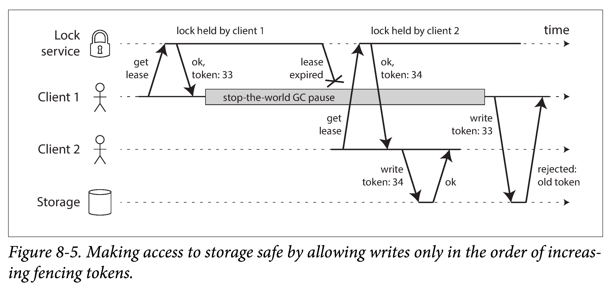

# DDIA 逐章精读（八）: 分布式系统中的麻烦事（The Trouble with Distributed Systems）

之前几章都在谈系统如何处理出错：副本故障切换、副本数据滞后、事务的并发控制。但前几张考虑到的情况：机器宕机、网络延迟都相对较**理想**。在实际大型分布式系统中，情况会更为悲观，可能会出错组件的一定会出错，而且出错的方式会更为复杂。任何大型系统的运维人员想必对此都有深有体会。

构建分布式系统和单机软件完全不同。在分布式系统中，系统有一千种奇妙的出错方法，本章将会探讨其中的一部分。我们会发现，在单机中我们以为是无比自然的假设，在分布式系统中，都可能不成立。作为工程师，我们总期望能构建能够处理任何可能故障的系统，但在实践中，一切都是**权衡**。不过，我们首先需要知道，可能会遇到哪些问题，才能进而选择：**是否要在目标场景下解决这些问题、还是为了降低系统复杂度忽略这些问题**。

本章将会探讨计算机网络的痼疾、时钟和时间、以什么程度避免上述问题等等。所有上述问题的原因都隐藏的很深，本章会探索如何理解分布式系统当前所处状态、如何定位分布式系统问题原因所在。

# 故障和部分失败

在单机上编程，其行为通常可预测。如果程序运行有问题，通常不是计算机硬件的问题，一般是代码代码写的不够好。而且：

1. 当硬件没问题时，确定的行为总会产生确定的结果
2. 一旦硬件有问题，通常会造成整个系统故障

总结来说，单机系统通常具有一种很好地特性：**要么正常运行、要么出错崩溃，而不会处于一种中间状态**。这也是计算机的最初设计目标：始终正确的进行计算。

但在构建分布式系统时，系统行为边界变得模糊起来。在分布式系统中，有很多我们习以为常的假设都不复存在，各种各样的异常问题都会出现。其中最令人难受的是：**部分失败**（partial failure），即系统的一部分正常工作，另一部分却以某种诡异的方式出错。这些问题，多数都是由于连接不同主机的**异步网络**所引入的。

## 云计算与超算

在构建大型计算系统的选择上一个光谱：

1. 在光谱一侧，是**高性能计算**（HPC，*high-performance computing*）。使用上千个 CPU 构建的超级计算机，用于计算密集型工作，如天气预报、分子动力学模拟。
2. 在光谱另一侧，是**云计算**（cloud computing）。云计算不是一个严谨的术语，而是一个偏口语化的形象指代。通常指将通用的廉价的计算资源，通过计算机网络收集起来进行池化，然后按需分配给多租户，并按实际用量进行计费。
3. 传统的企业**自建的数据中心**位于光谱中间。

不同构建计算系统的哲学，有着不同的处理错误的方式。对于高性能计算（也称超算）来说，通常会定期将状态持久化到外存。如果其中一个节点出现故障，通常会停止整个集群负载。当节点故障修复后，从故障前的最近快照重新开始运行。可以看出，超算更像是单机系统而非分布式系统。

但在本章，我们将重点放到以网络连接的多机系统中，这样的系统与单机应用与诸多不同之处：

1. **在线离线**。互联网应用多为**在线**（online）服务，需要给用户提供随时可用、低延迟服务。在这种场景下，重启以恢复任务或者服务是不可接受的。但在离线任务中，如天气状况模拟。
2. **专用通用**。超算多用**专用硬件**（*specialized hardware*）构建而成。组件本身很可靠，组件间通信也很稳定——多通过共享内存或 RDMA 的方式。与之相反，云服务多由通用机器组网而成，通过堆数量达到与超算相当的性能，经济但故障率高。
3. **组网方式**。大型数据中心的网络通常基于 IP 和以太网，通常按 Clos 拓扑组网，以提供比较高的**对分带宽**（bisection bandwidth）。超算常用专用的网络拓扑，如多维网格、环面拓扑（*toruses*），能够为已知的 HPC 负载提供更好的性能。
4. **故障常态化**。系统越是庞大，系统中有组件出错的概率便越高。在上千个节点组成的系统中，可以认为任何时刻，总有组件存在故障。在遇到故障时，如果在整个系统层面，仅简单选择放弃重试的策略，则系统可能不是在重试，就是在重试的路上，花在有效的工作时间少之又少。
5. **容错**。当部分节点故障时，如果系统仍能作为一个整体而正常工作，将会对运维十分友好。如，对于滚动升级，虽然单个经历了重启，但是多个节点组成的系统渐次重启时，整体仍然能对外正常工作。在云上，如果某个虚拟机有点慢，我们可以销毁它，再拉起一台（如果故障节点是少数，期望会更快）。
6. **本地异地**。多地部署的大型系统，多通过互联网通信（虽然也有专用网络），但总体来说，相对局域网更慢且易出错。相对的，我们对于超算有个基本预期——其多个节点都靠的很近。

为了让分布式系统能够工作，就必须假设故障一定会存在，并在设计层面考虑各种出错处理。即，**我们要基于不可靠的组件构建一个可靠系统**。如果仅仅觉得故障相对少见，就不处理对应的边角情况，即使面对的系统再小，遇到相应故障也会一触即溃。

因此，**面向容错进行设计**是对分布式系统软件的基本要求，为此，我们首先要了解**分布式系统中的常见问题**，并依此设计、编写、**测试**你的系统。

> 但在实践中，任何设计都是取舍（tradeoff），容错是有**代价**（昂贵、损失性能、系统复杂度提升等等）的。因此，充分了解你的系统应用场景，才能做出合理的容错实现，过犹不及。

## 基于不可靠组件构建可靠系统

乍一看，这是违反直觉的：想要整个系统可靠，起码其组件得可靠吧。但在工程领域，这种思想并不鲜见。如：

1. 纠错码能够容忍信道中偶尔一两个比特的误传。
2. IP 层不可靠，但 TCP 层却基于 IP 层提供了相对可靠的传输保证。

不过，所有容错都是有限度的。如纠错码也没办法处理信号干扰造成的大量信息丢失，TCP 可以解决 IP 层的丢包、重复和乱序问题，但没办法对上层隐藏解决这些问题带来的通信时延。

但，通过处理一些常见的基本错误，可以简化上层的设计。

# 不可靠的网络

首先需要明确，本书讨论系统范畴是 share-nothing 架构：**所有机器不共享资源（如内存、磁盘），通信的唯一途径就是网络**。share-nothing 不是唯一的系统构建方式，但相比来说，他是最经济的，不需要特殊的硬件，并且可以通过异地冗余做高可用。但同时，构建这种风格的系统复杂度也最高。

互联网和数据中心（多是以太网）的内部网络多是**异步封包网络**（**asynchronous packet networks**）。在这种类型网络中，一个机器向其他机器发送数据包时，不提供任何保证：你不知道数据包什么时候到、甚至不知道它是否能够到。具体来说，当我们的应用发送网络请求后，可能会面临以下诸多情况：

1. 请求没有发出去就丢了（比如你的网线可能被拔了）
2. 请求可能先排了会队，稍后才被发出去（比如网络或接收方负载过高）
3. 对端节点挂了（比如遇到异常宕机或者断电了）
4. 对端节点临时无响应（比如正在进行 GC），但稍后又能正常工作
5. 对端节点处理了你的请求，但应答在网络回程中丢了（比如网关配错了）
6. 对端节点处理了你的请求，但应答被推迟了（比如网络或你的机器负载过高）


因此，在异步网络中，当你发送出一个请求，并在一段时间内没有收到应答，任何事情都有可能发生：由于没有收到任何信息，你无从得知具体原因是什么。甚至，你都不知道你的请求是否已被送达处理。

应对这种情况的惯常做法是——**超时**（timeout）。即，设定一个时限，到点后，我们便认为这个请求废了。但在实际上，该请求可能只是还在排队、可能稍后到到达远端节点、甚至可能最终还会收到应答。

## 实践中的网络故障

虽然我们的网络已经有几十年的历史，但人们仍然没有找到一种使其变得更为可靠的方法。

有很多研究和经验表明，**即使在专门管理的数据中心，网络问题也相当普遍**。一项研究关于中型数据中心的研究表明，平均每月有 12 次网络故障，其中一半是单机失联，另一半是机架整个失联。另一项关于组件故障率的研究，包括 TOR 交换机、聚合交换机和负载均衡器。发现，增加网络冗余并不能如预期般减少故障，因为这不能避免造成网络中断的最主要原因——**人为故障**（如配置错误）。

像 EC2 的**云服务**，以网络暂时故障频发而著称；对比来说，管理良好的**自建数据中心**可能会相对稳定。但没有人能够真正逃脱网络故障：

- 如交换机软件升级引发的拓扑重置，会导致期间网络延迟超过一分钟。
- 鲨鱼可能会咬断海底光缆。
- 有些奇葩的网口会只传送单向流量（即使一个方向通信正常，你也不能假设对向通信没问题

虽然，上述情况可能都比较极端。但如果你的软件不做任何处理或者处理不全，网络问题一旦发生，你将面临各种**难以定位**莫名其妙的问题，并且可能会导致服务停止和数据丢失。

不过，处理网络错误并不一定意味着网络出现了问题仍然要让系统能够正常工作（即容忍，tolerating it）。如果你确定你的环境里，网络问题很少发生，你甚至可以让系统在出现问题时**停止运行**，并打印一条错误提示信息给用户。但要保证，在网络恢复之后，服务也能够恢复，并且不会造成意外损失。为此，你需要使用混沌测试工具来主动模拟各种网络异常，在交付前确保你的软件有足够的鲁棒性。

## 故障检测

在很多系统里，我们需要**自动检测故障节点**，并据此做出一些决策：

- 负载均衡器需要停止对故障节点流量的分发。
- 在单主模型的分布式数据库中，如果主节点故障，需要选出一个从节点顶上。

不幸的是，由于网络的不确定性，你很难准确的判断一个远端节点是否发生了故障。当然，在某些特定的场景下，你可以通过一些旁路信号，来获取一些信息，来判断确实发生了故障：

- **操作系统通知**。如果你能触达**服务**所在**机器**，但发现没有进程在监听预期端口（比如对应服务进程挂了），操作系统会通过发送 RST 或 FIN 包来关闭 TCP 连接。但是如果对端节点在处理你的请求时整个宕机了，就很难得知你请求的具体处理进度。
- **daemon 脚本通知**。可以通过一些 daemon **脚本**，在本机服务进程死掉之后，主动通知其他节点。来避免其他节点通过发送请求超时来判断此节点宕机。当然这前提是，服务进程挂了，但所在节点没挂。
- **数据链路层面**。如果你是管理员，并且能访问到你数据中心的网络交换机，可以在数据链路层判断远端机器是否宕机。当然如果你访问不到交换机，那这种方法就不太行。
- **IP 不可达**。如果路由器发现你要发送请求的 IP 地址不可达，它会直接回你一个 ICMP 不可达包。但路由器也并不能真正判断是否该机器不可用了。

尽管有上述手段可以快速检测远端节点是否宕机，但你并不能依赖它们。因为，即使 TCP 层已经收到某个请求的 ACK，但对端服务仍有可能在应用层面没有处理完该请求就宕机了。因此，如果你想确定某个请求**确实成功**了，只能在应用层进行**显式确认**。

当然，如果对端出错，你可能会很快收到一个错误，但你并不能指望在任何情况下都能很快得到错误回复——可能过了一段时间我们仍然没有得到任何回复。因此，在应用代码里，必须设置一个**合理的超时时限**和重试次数。直到，你确认没有再重试的必要——即不管远端节点是否存活，我在重试几次后，都认为它不可用了（或者暂时不可用）。

## 超时和无界延迟（unbounded delays）

如上所述，超时是应用层唯一能动用的检测网络故障的手段，但另一个问题随之而来：**超时间隔**要设置多久呢？总的来说：

1. 不能太长：过长会浪费很多时间在等待上。
2. 不能太短：太短会造成误判，误将网络抖动也视为远端节点失败。

超时间隔是要视具体情况而定，通常会通过实验，给相应场景设置一个合适的值。

过早将一个正常节点视为故障会有诸多问题：

1. **多次执行**。如果节点已经成功执行了**某动作**，但却被认为故障，在另一个节点进行重试，可能会导致次动作被执行两次（如发了两次邮件）。
2. **恶性循环**。如果系统本就处于高负载状态，此时还频繁错误的在其他节点上重试，可能会造成恶性循环，重试过多导致系统负载加重，系统负载加重反过来造成通信延迟增加，从而造成更多误判。

设有一个理想的网络系统，能够保证所有的网络**通信延迟不超过 d**：所有的网络包要么在 d 时间内送达对端、要么就会丢失，即不可能在超过 d 的时限后才到。如果网络能提供此种保证，则应用层可大为简化：假设我们预估出单个请求最大处理时间 r，则 2d+r 是一个很好超时间隔。

然而，实际中的网络基本上都不提供此种保证，尤其是常见的——**异步网络**。并且，大多数服务也很难保证在所有请求的处理时间都不超过某个上界。

### 网络拥塞和数据包排队

在路网里，视交通拥堵情况，两点间的通行时间可能会有很大差异。类似的，在计算机网络中，数据包的延迟大小也通常和排队相关，且有很多环节可能会造成排队：


1. **去程网络排队**。如果多个节点试图将数据包同时发给一个目的端，则交换机得将他们**排队**以逐个送达目的端（如上图）。如果流量进一步增大，超过交换机的处理能力，则其可能会随机进行丢包。
2. **目的机器排队**。当数据包到达目的端时，如果目标机器 CPU 负载很高，操作系统会将进来的数据包进行排队，直到有时间片分给他们。目的机器负载的不同决定了对应数据包被处理的延迟。
3. **虚拟机排队**。在虚拟化环境中，由于多个虚拟机共用物理机，因此经常会整体让出 CPU 一段时间的情况。在让出 CPU 等待期间，是不能处理任何外部请求的，又会进一步给网络请求的排队时延增加变数。
4. **TCP 流控**。TCP 流量控制（又称拥塞避免或反压，backpressure，一种负反馈调节）为了避免网络过载或者目的端过载，会限制发送方的发送频率，也即，有些请求可能还没发出去就要在本机排队。

此外，TCP 中存在**超时重传**机制，虽然重传本身对应用层不可见，但是超时重传带来的延迟却是无法掩盖的。

> **TCP 和 UDP**

> 一些对延迟敏感的场景，如视频会议和 IP 语音，常使用 UDP。由于 UDP 不需要提供额外保证，因此不需要做超时重传和流量控制，因此可以避免 TCP 很多排队造成的延迟。

> 当然，如果用户仍然需要某种程度的可靠性，可以基于 UDP 在应用层有针对性地做一些优化，比如在视频会议中，如果网络不好，可以主动问下：能再说一遍嘛？这是一种常用的思想，通用场景，可以使用屏蔽底层复杂度的协议；特化场景，可以使用相对底层、粗糙的协议，自己在应用层做有针对性地封装。是一个实现复杂度和效率的 tradeoff。

所有上述因素，都能造成网络延迟变化，且一个基本现象是：**网络流量越满，单个请求延迟抖动越大**。

在公有云或者多租户系统中（比如几个人共用一个物理开发机），由于通信链路上的很多物理资源（交换机、网卡、CPU）都是共享的（虽然会做一定的**资源隔离**），如果其他用户突然运行某种巨占资源的任务（比如跑 MapReduce），则你的网络请求延迟就会变的非常不稳定。

**静态设置**。在这种环境中，如果你要为远端故障检测设置超时时间，就只能使用做实验的方式，经过足够长的时间，统计请求延迟分布。进而结合应用需求，在**检测过久**（设置长超时间隔）和**故障误报**（设置过短超时间隔）做一个权衡。

**动态调整**。当然，相比预先配置固定死超时间隔，更好的方式是，通过类似时间窗口的方式，不断监测过去一段时间内的**请求时延**和**抖动情况**，来获取请求时延的分布情况，进而动态调整超时间隔。 **Phi 累积故障检测算法**（The Φ Accrual Failure Detector）便是这样一种算法，Akka and Cassandra 中都用到了此种算法，它的工作原理和 TCP 重传间隔的动态调整类似。

## 同步网络和异步网络

如果我们的底层网络传输数据包时能够保证延迟上界、且不会丢包，那么基于此构建分布式系统将会容易的多。那为什么不在硬件层面解决相关问题让网络更可靠，从而让分布式软件免于关心这些复杂的细节呢？

为了回答这个问题，我们先来看一种历史产物——**固定电话网**（*fixed-line telephone network*，非 VOIP、非蜂窝网络）。在固话线路中，高延迟音频帧和意外断线都是非常罕见的。固话网会为每一次通话预留**稳定低延迟**和**充足的带宽**链路以传输语音。如果计算机网络中也采用类似的技术，生活不会很美好吗？

当你在固网内拨打电话时，会建立一条贯穿贯穿全链路的保证足量带宽的固定链路，我们称之为**电路**（circuit），该电路会保持到通话结束才释放。以 ISDN 网络为例，其每秒能容纳 4000 帧语音信号，当发起通话时，它会在每个方向为每帧数据分配 16 比特空间。因此，在整个通话期间，两端各自允许每 250 微秒（250us \* 4000 = 1s）发送 16 比特语音数据。

这种网络是**同步**（*synchronous*）的：尽管数据也会通过多个路由节点，但由于通信所需的资源（如上述 16 bit 空间）已经在下一跳中被提前预留出来了，因此这些数据帧不会面临排队问题。由于不存在排队，则端到端的最大延迟是固定的。我们也称此种网络为**有界网络**（bounded network）。

### 计算机网络为什么不能同样稳定？

电话电路和 TCP 连接有很大不同：

1. 电路中的固定带宽一旦被预留，则其他任何电路不能够使用。
2. TCP 连接中的数据包，只要余量允许，都有可能使用到任何网络带宽。

应用层给到 TCP 的任意大小的数据，都会在尽可能短的时间内被发送给对端。如果一个 TCP 连接暂时空闲，则他不会占用任何网络带宽。相比之下，在打电话时即使不说话，电路所占带宽也得一直被预留。

如果数据中心和互联网使用**电路交换**（*circuit-switched*）网络，他们应该能够建立一条保证稳定最大延迟的数据链路。但是事实上，由于以太网和 IP 网采用**封包交换**协议（*packet-switched protocols*，常翻译为**分组交换**，但我老感觉它不太直观），没有电路的概念，只能在数据包传送的时候对其进行排队，也不得不忍受由此带来的无界延迟。

那为什么数据中心网络和互联网要使用封包交换协议呢？答曰，为了应对互联网中无处不在的**突发流量**（*bursty traffic*）。在电话电路中，音频传输所需带宽是固定的；但在互联网中，各种多媒体数据（如电子邮件、网页、文件）所需带宽却是差异极大且动态变化的，我们对他们的唯一要求就是传地尽可能快。

设想你使用电路网络传输一个网页，你需要为它预留带宽，如果你预留过低，则传输速度会很慢；如果你预留过高，则可能电路都没法建立（带宽余量不够，就没法建立连接），如果建立了，也会浪费带宽。互联网数据的**丰富性**和**异构性**，让使用电路网络不太可能。

不过，也有一些尝试来建立同时支持电路交换和封包交换的网络，如 ATM。**IB 网络**（InfiniBand）与 ATM 有一些类似之处，它在链路层实现了端到端的流量控制，从而减少了排队。具体来说，IB 使用 **QoS （**quality of service，对数据包区分优先级并进行调度）控制和**准入控制**（admission control，对发送方进行速率控制），在封包网络上模拟电路交换，或者提供概率意义上的有界时延。

但，现有的数据中心网络和互联网都不支持 QoS。因此，我们在设计分布式系统时，不能对网络传输的时延和稳定性有任何假设。我们必须要假定我们面对的网络会发生网络拥塞、会产生排队、会有无界延迟，在这种情况下，没有放之四海而皆准的**超时间隔** 。针对不同的具体情况，需要通过经验或者实验来确定它。

> **通信时延和资源利用**
>
> 泛化一下，可以认为是**资源的动态分配（**dynamic resource partitioning**）**导致了**时延的不稳定**。
>
> 设你有一条能够承载 10000 路通话的线路，其上的每个电路都要占其中一路。基于此，可以认为该线路是一种能够被至多 10000 个用户共享的资源，并且该资源以一种**静态**（static）的方式被分配：无论该线路中现在有包含你在内的 10000 个人在通话、还是只有你一个人在通话，被分配给你的资源都是固定的：1/10000。
>
> 与之对应，互联网中的通信会**动态的**（dynamically）共享网络资源。每个发送者都会将数据包尽可能快的推送到数据线路上，但在任意时刻，哪个数据包被真正发送（即资源分配给谁），则由交换机来动态决定。这种做法的劣势在于排队，但优势在于能够最大化线路资源利用。一条线路的造价是固定的，如果对其利用率越高，则单位数据发送成本越低。
>
> 类似的情形还发生在 CPU 的分时复用里。如果在多个线程间动态的共享每个 CPU，则一个线程使用 CPU 时，其他线程必须排队等待，且排队时间不确定。这种使用 CPU 的方式，比分配给每个线程固定的时间片要高效。类似的，使用虚拟化的方式共享同一台物理机，也会有更好的硬件利用率。
>
> 在资源静态分配的环境中，如专用的硬件、互斥的带宽分配，有界延迟能够被保证。但是，这种方式是以降低资源利用率为代价的，换句话说，更贵。反之，通过多租户方式动态的共享资源，更便宜，但代价是**不稳定的延迟**（*variable delays*）。**不稳定的延迟并非什么不可变的自然法则，而仅是一种代价和收益权衡的结果罢了**。

# 不可靠的时钟

**时钟**（clocks）和**时间**（time）都很重要。应用程序会以很多种形式依赖时钟，举例来说：

1. 某个请求是否超时？
2. 该服务的 99 分位的响应时间是多少？
3. 该服务过去五分钟的平均 QPS 是多少？
4. 用户在我们网站上花了多长时间？
5. 这篇文章什么时候发布的？
6. 提醒邮件什么时刻发出？
7. 该缓存条目何时超时？
8. 日志中这条错误消息的时间戳是什么？

例子 1-4 测量的是**时间间隔**（durations），例子 5-8 描述的是**时间点**（points in time）。在分布式系统中，时间是一个棘手的问题。因为两个机器间的通信不是瞬时完成的，虽然我们知道一条消息的接收时间一定小于发送时间，但由于**通信延迟的不确定性**，我们无法知道具体晚了多久。因此，发生在分布式系统内多个机器的事件，很难准确地确定其先后顺序。

更进一步，网络中的每个机器都有自己的系统时钟，通常是用**石英振荡器**做成的特殊硬件计时的，并且通常是独立供电的，即使系统宕机、断电也能持续运转。但这种时钟通常不是非常准确，即有的机器可能走的稍微快一些，有的可能就慢一些。因此，实践中，常通过 **NTP**（网络时间协议）对机器进行自动校准。其大致原理是，首先使用更精确时钟（如 GPS 接收器）构建一组**可信服务器**作为时钟源（比如阿里云的源），然后再利用这组服务器通过网络校准其他机器。

## 单调时钟和日历时钟

当代的计算机通常支持两类时钟：**日历时钟**（time-of-day clock）和**单调时钟**（monotonic clock），他们之间有些区别，其实分别和该小节最初提出的需求相对应：前者常用于时间点需求，后者常用于计算时间间隔。

### 日历时钟

该时钟和我们日常生活中的时钟关联，也称为**挂钟时间**（wall-clock time），通常会返回当前日期和时间。如：Linux 上的 `clock_gettime(CLOCK_REALTIME)` 和 Java 里的 `System.currentTimeMillis()` ，他们都会返回基于**格里历**（Gregorian calendar）1970 年 1 月 1 日 00:00:00 时刻以来的秒数（或者毫秒数），不包括闰秒。当然，一些系统可能会用其他时刻作为计时起点。

日历时钟常常使用 **NTP 进行同步**，以使得不同机器上时间戳能够同步。但之后会提到，日历时钟有诸多不确定性。这里值得一提的是，如果某个机器时间大大领先于 NTP 服务器，则其日历时钟会被重置，从而让该机器上的时间看起来倒流了一样。**时钟回拨、跳过闰秒**等等问题，使得日历时钟不能用于精确计算一个时间间隔。

此外，历史上，日历时钟还使用过粗粒度的计时方案，如老版的 Windows 系统的时钟最小粒度是 10 ms。当然，在最近的系统里，这不再是问题。

### 单调时钟

单调时钟主用于取两个时间点的**差值**来测量时间间隔，如服务器的超时间隔和响应时间。Linux 上的 `clock_gettime(CLOCK_MONOTONIC)`和 Java 中的  `System.nanoTime()`都是单调时钟。顾名思义，单调时钟不会像日历时钟一样由于同步而进行回拨，可以保证一直单调向前。也正因为如此，用其计算时间间隔才更加准确。

在具有多个 CPU 的服务中，每个 CPU 可能会有一个单独的计时器，且不同 CPU 之间不一定同步。但操作系统会试图屏蔽其间差异，对应用层保证单调递增。这样，即使一个线程被调度到不同 CPU 上去，也仍能保证单调。当然，最保险的办法是不严格依赖此单调性。

如果检测到本地石英钟和 NTP 服务器不一致，NTP 会相应调整单调时钟的频率，但是幅度不能超过 0.05%。换句话说，**NTP 可以调整单调时钟频率**，但不能直接往前或者往后跳拨单调时钟。因此，多数机器上单调时钟的置信度通常都很好，能达到毫秒级甚至更细粒度。即，单调时钟会通过调整频率来和 NTP 时间对齐，而非像挂历时钟那样直接跳拨。

在分布式系统中，使用单调时钟计算时间间隔很合适，因为时间间隔既不关心多机间进行时钟同步，也对时间精度不是很敏感。

## 时钟同步和精度问题

单调时钟不太需要关心多机同步问题。但是对于日历时钟来说，由于自身石英钟计时不够精确，为了能够正常使用，需要定时与 NTP 服务器或者其他**可信时钟源**进行**同步**。想象你家老式的电子挂钟，就得定时手动与新闻开始时的北京时间进行校准，不然会越走越快或者越走越慢。

在计算机系统中，其本身的硬件时钟以及用于校准的 NTP 服务都不是完全可靠的：

- 单机的硬件时钟都不是很精确，会发生**漂移**（drift，走的快或者慢），当然本质上是一个相对问题，如果我们认为世界上只有一种时间速率是正常的，则其他的速率都是有问题的。有多种因素会造成时钟漂移，如所在机器的温度。谷歌认为其服务器时钟为 **200ppm**（parts per million），也即每 30s 漂移 6ms、每天漂移 17s，这种漂移限制了时钟的精确度上限。
- 如果计算机时钟和 NTP 服务器相差太多，该计算机会拒绝同步或强制同步。如果强制同步，应用层在会在同步前后看到一个时钟的**跳变**。
- 如果一个节点通过偶然的设置把 **NTP 服务器给墙**了，并且没有留意到这个问题，则可能会造成这段时间内时钟不同步，实践中确实发生过类似问题。
- NTP 同步受限于网络的延迟，因此在延迟不稳定的**拥塞网络**中，其精度会受到影响。有实验表明通过互联网进行时钟同步，可以实现最小 35ms 的时钟误差。尽管网络中偶有将近 1s 延迟尖刺，但可以通过合理配置来忽略尖刺对应的同步。
- 润秒的存在会导致一分钟可能有 59s 或者 61s，如果系统在做设计时没有考虑这种特殊情况，就有可能在运行时遇到问题，很多大型系统都因此而宕机。处理闰秒最好的办法是，让 NTP 服务器在一天中逐渐调整，**摊平闰秒**（也称为：**拖尾**，*smearing*），不过在实际中，NTP 服务器处理闰秒的行为不尽相同。
- 在虚拟机中，其**物理时钟是虚拟化**出来的，从而给运行其上并依赖精确计时的应用带来额外挑战。由于一个 CPU 内核是被多个 VM 所共享的，当一个 VM 运行时，其他 VM 就得让出内核几十毫秒。在 VM 恢复运行后，从应用代码的视角，其时钟就是毫无征兆的突然往前跳变了一段。
- 如果你的软件将会运行在**不受控的设备**上，如智能手机或者嵌入式设备，则你不能完全相信设备系统时钟。因为用户可能会由于一些原因（比如绕开游戏时间限制），故意将其硬件时钟设置成一个错误的日期和时间，从而引起系统时钟的跳变。

当然，如果**不计代价**，我们是能够获得足够精确的时钟的。例如针对金融机构的欧洲法案：MIFID II，要求所有高频交易的基金需要和 UTC 的误差不超过 100 微秒，以便调试如“闪崩”之类的市场异常，并帮助检测市场操纵行文。

可以通过组合使用 **GPS 接收机、PTP 协议**（Precision Time Protocol），并进行小心部署和监控，来获取此类高精度时钟。然而，这需要非常多的专业知识和精力投入，且仍有很多问题会引起时钟不同步：NTP 服务器配置错误、防火墙错误组织了 NTP 流量。

## 依赖同步时钟

如前所述，尽管看起来简单易用，但时钟却有一些严重的问题：

1. 一天可能没有精确的 86400 秒
2. 日历时钟可能有时候会**回跳**
3. **不同节点**的时钟可能相差巨大

前面讨论过，虽然网络丢包和不固定延迟不常发生，但在做设计时，仍要考虑这些极端情况。对于时钟也是如此：虽然大部分时间，时钟都能如我们预期一样工作，但在设计系统时，仍要**考虑最坏可能**，否则一旦出现故障时，通常难以定位。

**时钟问题造成的影响往往不容易被发现**。如果 CPU、内存或者网络故障，可能系统会立即出现很严重的问题；但如果不正确的依赖了时钟，可能系统仍然能在表面上看起来正常运转，比如时钟漂移是慢慢累加的，可能到第一程度才会出现问题。

因此，如果你的系统依赖（或者假设）所有参与的机器**时钟同步**（synchronized clocks），就必须通过一定的机制来检测系统内节点间的时钟偏移，如果某个节点系统时钟与其他相差过大，就及时将其从系统内移除，以此来规避**时钟相差太大**所造成的不可挽回的问题。

### 时间戳以定序

考虑一种危险的依赖时钟的情况：**使用节点的本地时钟来给跨节点的事件定序**。举个具体例子，如果两个客户端同时写入同一个分布式数据库，谁居前？谁靠后？


如上图，Client A 向节点 1 写入 `x = 1`，然后该写入被复制到节点 3 上；Client B 在节点上将 x 增加 1，得到 `x = 2`；最终上述两个写入都被复制到节点 2。

在图中所有**待同步的数据都会被打上一个时间戳**，接收到同步来数据的节点会根据时间戳对所有写入应用到本地。那么如何使用时间戳呢？所有节点只会通过时间戳递增的顺序接受同步过来的写入请求，如果某个写请求时间戳小于上一个写请求的，则丢弃。

另外，节点 1 和节点 3 的时钟相差小于 3 ms，这在日常中是一个很小的偏差，算是**时钟同步**的很好了。但在这个例子中，却仍然出现了顺序问题，写请求 x = 1 的时间戳是 42.004，写请求 x = 2 的时间戳是 42.001，小于 x = 1 的写请求，但我们知道，写请求 x = 2 应该发生在后面。于是当节点 2 收到第二个写请求 x = 2 时，发现其时间戳小于上一个写时间戳，于是将其丢掉。于是，客户端 B 的自增操作在**节点 2** 上被错误的丢弃了。

**后者胜**（Last write win，LWW）作为一种冲突解决策略，在多副本（无论是**多主**还是**无主**）架构中被广泛使用，比如 Cassandra 和 Riak。有一些实现是在客户端侧而非服务侧产生时间戳，但这仍不能解决 LWW 固有问题：

1. **写入谜之丢失**。一个具有落后时钟的节点产生的写入数据，无法覆盖一个具有超前时钟节点先前写入的数据，造成后写入的数据反而被没有任何提醒的丢弃。
2. **无法区分先后和并行**。两者主要区别在于，一个是有明显的依赖关系，如上图中自增依赖于之前的初始化；另一个是相关的几个操作互相并不关心。为了解决这个问题，需要引入额外的时间戳机制进行因果关系追踪，如 version vector（一种逻辑时钟）。
3. **两个独立节点可能会产生相同时间戳的事件**。尤其是在时钟精读不太够的情况下（比如最低只能给到毫秒），可以使用额外的随机数来对其进一步区分，但这样也会导致一些时间上的因果问题。

因此，在使用后者胜策略解决冲突，并丢弃被覆盖更新时，需特别注意如何判定哪个事件**更近**（most recent），因为其定序可能依赖于**不同机器的本地时钟**。即使使用紧密同步的 NTP 时钟，仍然可能发生：在 100 ms 时（发送方本地时钟）发出一个数据包，而在 99ms 时（接收方本地时钟）收到该数据包，就好像时光倒流一样，但这明显不可能。

使用 NTP 进行时钟同步有可能做到足够精确，以避免网络中对事件错误的排序吗？不可能。因为 NTP 本身就是通过网络进行同步的，其精度则必受限于同步两侧的往返延迟，更遑论叠加其他误差，比如石英钟的漂移（quartz drift）。换句话说，为了处理网络误差以正确定序，我们需要使用**更精确**的手段，而非网络本身（NTP）。

逻辑时钟和物理时钟的区别。所谓的**逻辑时钟**（logical clocks），使用了自增的计数器，而非石英晶振（oscillating quartz crystal）。逻辑时钟不会追踪**自然时间**或者**耗时间隔**，而仅用来确定的系统中事件发生的先后顺序。与之相对，挂历时钟（time-of-day）和单调时钟（monotonic clocks）用于追踪时间流逝，被称为**物理时钟**。

### 时钟读数的置信区间

尽管你可以从机器上读取以微秒（microsecond）甚至纳秒（nanosecond）为单位的日历时间戳（time-of-day），但这并不意味你可以得到具有这样精度的绝对时间。如前所述，误差来自于几方面：

1. **石英晶振漂移**。如果你直接从本地石英钟读取时间戳，其偏移很容易就可以累积数毫秒。
2. **NTP 同步误差**。如果你想定时通过 NTP 来同步，比如每分钟同步一次。但 NTP 协议是走网络的，而网络通信最快做到毫秒级延迟，偶有拥塞，延迟便能冲到数百毫秒。

总结来说，使用普通硬件，你无论如何都难以得到真正“准确”的时间戳。

因此，将时钟的读数视为一个时间点意义不大，准确来说，其读数应该是一个**具有置信区间**的**时间范围**。比如，一个系统有 95% 的信心保证当前时刻落在该分钟过 10.3 到 10.5 秒，但除此以外，不能提供任何一进步的保证。在 +/– 100 ms 的置信区间内，时间戳的微秒零头毫无意义。

时钟的误差区间可以通过你的**时钟源**进行计算：

1. **高精度硬件**。如果你的机器使用了 GPS 接收器或者铯原子钟，则硬件制造商会提供误差范围。
2. **其他服务器**。如果你通过 NTP 服务从其他服务器获取时间。则误差区间是几种因素叠加：该 NTP 服务器的误差范围、服务器间的往返延迟、同步后石英晶振漂移等等。

但不幸，大多数服务器的时钟系统 API 在给出时间点时，并不会一并给出对应的不确定区间。例如，你使用 `clock_gettime()` 系统调用获取时间戳时，返回值并不包括其置信区间，因此你无法知道这个时间点的误差是 5 毫秒还是 5 年。

一个有趣的反例是谷歌在 Spanner 系统中使用的 *TrueTime* API，会显式的给出置信区间。当你向 TrueTime 系统询问当前时钟时，会得到两个值，或者说一个区间：`[earliest, latest]`，前者是最早可能的时间戳。后者是最迟可能的时间错。通过该不确定预估，我们可以确定准确时间点就在该时钟范围内。此时，区间的大小取决于，上一次同步过后本地石英钟的漂移多少。

### 用于快照的时钟同步

在“快照隔离和可重复读”一小节，本书讨论过**快照隔离**。当数据库想同时支持短时、较小的读写负载以及长时、很大的只读负载（如数据分析、备份）时，快照隔离很有用。快照隔离能让只读事务在不阻塞正常读写事务的情况下，看到数据库某个时间点之前的一致性视图。

快照隔离的实现通常需要一个**全局自增的事务 ID**。如果一个写入发生在快照 S 之后，则基于快照 S 的事务看不到该写入的内容。对于单机数据库，简单的使用一个**全局自增计数器**，就能够充当事务 ID 的来源。

然而，当数据库横跨多个机器，甚至多个数据库中心时，一个可用于事务全局自增 ID 并不容易实现，因为需要进行**多机协作**。事务 ID 必须要反应**因果性**：如当事务 B 读到事务 A 写的内容时，事务 B 的事务 ID 就需要比事务 A 大。非如此，快照不能维持一致。另外，如果系统中存在大量短小事务，分配事务 ID 可能会成为分布式系统中的一个瓶颈。这其实就是分布式事务中常说的 **TSO 方案**（Timestamp Oracle，统一中心授时），这种方案通常会有性能瓶颈；尤其在跨数据中心的数据库里，会延迟很高，实践中也有很多优化方案。

那么，我们可以用机器的挂历时钟的时间戳作为事物的 ID 吗？如果我们能让系统中的多台机器时钟保持严格同步，则其可以满足要求：**后面的事务会具有较大的时间戳，即较大的事务 ID**。但现实中，由于时钟同步的不确定性，用这种方法产生事务 ID 是不太靠谱的。

但 Spanner 就使用了物理时钟实现了快照隔离，它是如何做到可用的呢？Spanner 在设计 TrueTime 的 API 时，让其返回一个**置信区间**，而非一个时间点，来代表一个**时间戳**。假如现在你有两个时间戳 A 和 B（*A* = [*Aearliest*, *Alatest*] and *B* = [*Bearliest*, *Blatest*]），且这两个时间戳对应的区间没有交集（例如，*Aearliest* < *Alatest* < *Bearliest* < *Blatest*），则我们可以确信时间戳 B 发生于 A 之后。但如果两个区间有交集，我们则不能确定 A 和 B 的相对顺序。

为了保证这种时间戳能够用作事务 ID，相邻生成的两个时间戳最好要间隔一个置信区间，以保证其没有交集。为此，Spanner 在索要时间戳时（比如提交事务），会等待一个置信区间。因此置信区间越小，这种方案的性能也就越好。为此，谷歌在每个数据中心使用了专门的硬件做为时钟源，比如原子钟和 GPS 接收器，以保证时钟的置信区间不超过 7 ms。

在分布式事务中使用时钟同步，是一个比较活跃的研究领域（在书出版时，大概 2017），很多观点都很有趣，但在谷歌之外，还没有人再实现过。

- 但 HLC 感觉也算类似的实现，我去翻了下，HLC 论文是 2014 年，不知道作者为什么不算？

## 进程停顿

现在我们来看另外一种分布式系统中使用时钟的危险情况。假设你的数据库有多分片，每个分片多副本单主，只有主副本可以接受写入。那么一个很直接的问题就是：对于每个主副本来说，为了保证安全的接受写入，我们需要确定它仍是**事实上的**主副本。那我们如何确定呢？毕竟有时他会自认为是主副本，但事实上不是（比如其他副本和他产生了网络隔离，已经重新选出了主）？

一种解决方案是使用**租约**（lease）。该机制（注意和 Raft 中 Leader 的租约区分）类似于具有超时的锁：**任意时刻只有一个副本可以持有改租约**。因此，一旦某副本获取到租约，它就获取到了一段时间的领导权，直到租约过期；为了持续掌握领导权，该副本需要定期续租，且续租间隔要小于租期时间。如果该副本宕机，自然就会停止续约，其他副本就可以上位。

用代码表示，续租大概长这样：

```cpp
while (true) {
	request = getIncomingRequest();

	// Ensure that the lease always has at least 10 seconds remaining
	if (lease.expiryTimeMillis - System.currentTimeMillis() < 10000) {
		lease = lease.renew();
	}
	if (lease.isValid()) {
		process(request);
	}
}
```

这段代码有什么问题呢？

1. **依赖时钟同步**。租期的过期时间点是在另外的机器 M 上被设置的，比如说设置为 M 接到续租请求时的当前时间加上 30 秒。然后该时间戳会和副本本地时间戳比较，如果两个机器时钟偏差过大，就会出现一些奇怪的事情（比如租约过晚过期，其他人续租成功，导致同一时刻有两个副本持有租约）。也就是说，比较不同机器上的时间戳是不靠谱的。
2. **语句执行间隔的假设**。即使我们都用同一机器上的单调时钟，上述代码仍然可能有问题。我们很自然的以为在测试完租约是否仍然宽裕（`lease.expiryTimeMillis - System.currentTimeMillis() < 10000`）后，会立即进行请求处理：`process(request);` 。一般来说的确是这样。

但如果在程序执行期间，发生了意外的停顿会怎么样？比如说，在 `lease.isValid()` 语句前线程停顿了 15 秒，这种情况下，在执行到真正处理请求的语句时，租约就可能会过期，此时，其他副本就有可能接下领导权限。但对于这个线程来说，并没有其他手段可以限制它继续执行，于是，就有可能发生一些不安全的处理事件。

程序在执行的时候真可能停顿这么长时间吗？还真有可能，原因有很多：

- 一些编程语言的运行时（如 JVM），都会有垃圾回收器（GC）。垃圾回收器有时候会暂停所有运行中的线程（以进行垃圾回收），这个**全暂停**（stop-the-world）时间有时甚至能到达数分钟！即便号称可以并发 GC 的最新 GC 算法（如 Hotpot JVM 的 CMS 算法），也不能真正的和用户线程并行，仍会时不时的暂停，只不过这个时间缩短了很多。另外，我们也可通过修改内存分配模式和进行 GC 参数调优来进一步降低 GC 影响。但即便如此，如果我们想真正的提供足够鲁棒的程序，就不能对 GC 所造成的停顿时间做最坏假设。
- 在**虚拟化环境**中，一个虚拟机可能会在任意时间点被**挂起**（suspended，暂停所有正在运行的进程，并将其上下文从内存中保存到磁盘）和**恢复**（resumed，将上下文恢复到内存中并且继续执行暂停的进程），挂起到恢复的间隔可能持续任意长时间。有时该功能也被称为虚机的**在线迁移**（live migration），此时虚机暂停的时间取决于上下文的迁移速率。
- 哪怕像在笔记本这样的用户终端上，程序的运行也有可能被随时挂起和恢复。如，用户合上笔记本。
- 当操作系统做上下文切换，将线程切走时；当**管控程序**（hypervisor）切到一个新的虚拟机时，当前正在执行的线程可能会停在代码中的任意位置。在虚拟机环境中，其他虚拟机占用 CPU 的时间也被称为**被窃时间**（*steal time*）。在物理机负载很重时，比如调度队列中有大量线程在等待时间片，某个被暂停的线程可能要好久才能重新执行。
- 如果操作系统配置了允许**换页**（swapping to disk, paging），则有时候一个简单的内存访问也可能引起缺页错误，这时我们就需要从磁盘中加载一个页到内存。在进行此 IO 时，线程多会挂起，让出 CPU。如果内存吃紧，缺页换页可能会非常频繁。在极端情况下，操作系统可能会将大部分时间都浪费在换页上，而非正经工作上（也被称为**颠簸**，thrashing）。为了避免此问题，服务器上的允许换页的配置项一般不打开。当然，你也可以点杀一部分进程来释放内存，避免换页，这就是 trade off 了。
- 在 Unix 操作系统中，可以通过向进程发送 **SIGSTOP** 信号来让其暂停。如，用户对执行的进程在 Shell 中按下 Ctrl-Z。该信号会阻止进程再获取 CPU 的时间片，直到我们使用 SIGCONT 将其再度唤起。你自己的环境中可能不怎么使用 SIGSTOP，但是运维人员偶尔还是会用的。

所有上述情景都会在任意时刻**中断**（*preempt*）正在运行的线程，并在之后某个时刻将其重新唤醒，而线程本身对这个过程是不感知的。类似的情形还有单机多线程编程：你不能对多个线程代码的**相对执行顺序**有任何假设，因为上下文切换和并发执行可能会在任何时间以任何形式发生。

在单机我们有很多手段可以对多线程的执行进行协调，使之线程安全。如锁、信号量、原子计数器、无锁数据结构、阻塞队列等等。但不幸的是，分布式系统中我们没有对应的手段。因为在多机间不能**共享内存**，只能依靠**消息同步**，而且是要经过不可靠网络的消息！

分布式系统中的节点可能在**任意时刻**的**任意代码位置**停顿**任何时长**，而在此间，系统的其他节点仍在正常往前执行，甚至由于该节点不响应而将其标记为死亡。最终，该停顿节点可能会继续执行，但此时代码逻辑本身（也就是你写分布式系统逻辑时）并不能知道发生了什么，直到其再次检查机器时钟时（虽然这也不太准）。

### 响应时间保证

如前所述，在很多语言和操作系统中，进程和线程都可能停顿任意时间，我们将其称之为**无界**（unbounded）时延。但如果我们付出**足够代价**，上述造成停顿的原因都可以被消除。

在某些环境中的软件，如果不在一定时间内给响应，可能会造成严重问题。如飞机、火箭、机器人、车辆和其他一些需要对传感器输入信号进行**即时反应**的**物理实体**。在这些系统中，软件的响应延迟都需要控制在某个**时限**（deadline）内，超出了这个时限，整个系统可能会出现重大故障，这就所谓的**强实时系统**（hard real-time system，与之相对的有 soft real-time system）。

举个例子，如果你正在驾车，传感器检测到车祸，你肯定不希望你的车载系统此时正在进行 GC 而不能及时处理该信号吧。

> 实时系统真的实时吗？

> 在**嵌入式**系统里，实时意味着需要通过设计、测试等多层面来让系统在延迟上提供某种保证。其在 **Web** 中也有实时系统（real-time）的叫法，但更多的侧重于服务器会流式的处理客户端请求，并将数据发回客户端，但对响应时间并没有严苛的要求。

我们需要在全软件栈进行优化才能提供实时保证：

1. **在操作系统上**，需要能提供指定所需 CPU 时间片的实时操作系统（*real-time operating system*，RTOS）。
2. **在依赖库中**，所有的函数都需要注释其运行时间的上界。
3. **在内存分配上**，要限制甚至禁止动态内存分配（会有实时 GC 器，但不会占用太多时间）。
4. **在观测和测试上**，需要进行详尽的衡量和测试，以保证满足实时要求。

上述要求极大的限制了编程语言、依赖库和工具的可选范围，从而使得开发实时系统代价极为高昂。也因此，这种系统通常被用在对安全性有严苛要求的嵌入式设备里。这里需要说明的是，**实时**不意味着**高性能**。并且通常相反，实时系统都具有很低的吞吐，因为实时系统会把**对时延的优化**放在第一位，比如需要尽量消除并行所带来的运行的不可预测性，自然就降低了效率。

对于一般的服务端的数据处理系统来说，这种严苛的实时保证通常既**不经济**也**不必要**。也就是说，我们在设计服务端的数据系统时，还是要老老实实考虑由于**任意停顿**和**不准确时钟**所带来的问题。

### 限制 GC 的影响

我们有一些手段可以用来减轻进程停顿现象，且不必借助代价高昂的强实时系统。比如**垃圾回收器**（GC 进程）可以实时追踪**对象分配速率**和剩余**可利用内存**，利用这些信息，GC 进程可以给应用程序提供一些信号。然后我们在构造系统时捕获这些信号，然后拒绝服务一段时间，等待 GC 结束。就跟临时故障或者下线的节点一样，别的节点会来接管请求。一些对延迟比较敏感的系统，如交易系统，就是用了类似的方法。

另一个相似的想法是，阉割一下 GC，只用其对短时对象进行快速回收。对于生命周期较长的对象，通过通过**定期重启**来回收。在重启期间，该节点上的流量可以暂时切走，就像滚动升级一样。

这些手段虽然不能治本，但能一定程度上缓解 GC 对应用进程造成的影响。

# 知识、真相和谎言

到此为止，本章已经梳理了分布式系统和单机系统的诸多差异：

1. 进程间不能共享内存，只能通过**消息传递**来交互
2. 唯一的通信渠道（网络）还是**不可靠**的，且有极不确定（unbounded，**无界）延迟**
3. 需要处理**不可靠时钟**造成的多机时钟漂移问题
4. 任意的不确定的**进程停顿**

如果你没有习惯于应对分布式系统环境，可能会对由上述问题引起的异常感到十分困惑。分布式系统中编程复杂度高的本质在于：身处网络中的节点，不能直接**确信**任何事情，而只能根据从网络中得到的信息（没有得到回复也是一种信息）来**推测**（guess），只能通过与其他节点**交换信息**来确定其状态。如果一个对端节点**没有响应**，我们难以分辨是网络问题还是节点本身问题。

对这些系统边界的进一步讨论就有点偏哲学了：

1. 在我们的系统中，哪些信息是真？哪些信息是假？
2. 在**感知**和**测量**手段本身都不准的情况下，我们对由上述手段得来的信息的真假又可以有几分确信？
3. 软件系统是否需要遵循物理世界的法则，如因果关系？

幸运的是，我们并不需要进一步追问到人生的意义是什么（笑）。在分布式系统中，我们可以做一些**基本假设**，并基于这些假设设计真实系统。基于特定假设，我们能够设计出能够**被证明正确性**的算法。那么，纵然底层系统不怎么可靠，我们仍能通过罩一层协议，使其对上提供相对可靠的保证（比如 TCP）。

虽然可以在不稳定的系统模型上构建运行良好的系统，但这种**构建过程本**身却并非直观易懂。在本章余下的小节，我们将继续探讨分布式系统中的**知识**和**事实**，来辅助我们思考**对下做什么样的假设、对上提供什么样的保证**。在第九章，我们会进一步考察一些分布式系统中的例子和算法，看看他们是如何来通过特定的假设来提供特定服务的。

## 真相由多数派定义

设想一个具有**非对称故障**（asymmetric fault）的网络：某个节点可以**收到**任何其他节点发送给他的信息，但其**发出**的消息却被**丢弃**或者**延迟很高**。此时，尽管该节点运行良好，并且能处理请求，但却无人能收到其响应。在经过某个超时阈值后，其他节点由于收不到其消息，会将其标记为死亡。

打个比方，这种情况就像一个噩梦：处于半连接的节点就像躺在棺材里被运向墓地，尽管他持续大喊：“我没有死”，但没有人能听到他的喊声，葬礼继续。

第二个场景，稍微不那么噩梦一些，这个处于半连接的节点意识到了他发出去的消息别人收不到，进而推测出应该是网络出了问题。但纵然如此，该节点仍然被标记为死亡，而它也没有办法做任何事情来改变，*但起码他自己能意识到这一点*。

第三个场景，假设一个节点经历了长时间的 GC，该节点上的所有线程都被中断长达一分钟，此时任何发到该节点的请求都无法被处理，自然也就无法收到答复。其他节点经过等待、重试、失掉耐心进而最终标记该节点死亡，然后将其送进棺材板。经过漫长的一分钟后，终于，GC 完成，所有线程被唤醒从中断处继续执行。**从该线程的角度来看，好像没有发生过任何事情**。但是其他节点惊讶地发现棺材板压不住了，该节点做起来了，恢复了健康，并且又开始跟旁边的人很开心的聊天了。

上述几个故事都表明，任何节点都没法**独自断言**其自身当前状态。一个分布式系统不能有单点依赖，因为单个节点可能在任意时刻故障，进而导致整个系统卡住，甚而不能恢复。因此，大部分分布式算法会基于一个**法定人数**（*quorum*），即让所有节点进行投票：**任何决策都需要达到法定人数才能生效，以避免对单节点的依赖**。

其中，前面故事中的宣布某个节点死亡就是这样一种决策。如果有达到法定个数的节点宣布某节点死亡，那他就会被标记为死亡。即使他还活着，也不得不服从系统决策而出局。

最普遍的情况是，法定人数是集群中超过半数的节点，即**多数派**（其他比例的法定人数也有可能）。多数派系统允许少数节点宕机后，集群仍能继续工作（如三节点集群，可以容忍一个节点的故障；五节点集群，可以容忍两个节点故障）。并且在少数节点故障后，集群仍能安全地做出决策。因为在一个集群中，根据鸽巢原理，系统中不可能有两个多数派做出不同的决策。第九章，讨论共识协议时，我们会展开更多细节。

### 领导者和锁

在很多场景下，系统会要求某些东西全局唯一，比如：

1. 每个数据库分片都有唯一的领导者，避免脑裂
2. 只有一个事务或者客户端允许持有某资源或者对象的锁，以避免并发写入或者删除
3. 每个名字最多允许一个用户注册，因为需要用用户名来唯一标识一个用户

在分布式系统中实现这种唯一性需要格外小心：尽管某个节点**自认为**它是那个“唯一被选中的（The chosen one）”（分区的主副本、锁的持有者、成功处理用户名注册请求的节点），这并不意味着法定数目的（Quorum）节点也都如此认为！可能一个节点以前是领导者，但在其领导期间，如果其他节点都认为它死了（可能由于网络故障或者 GC 停顿），它就有可能被降级，且其他节点被选举上位。

当大多数节点认为前领导者死亡时，该节点仍然**自顾自的行使领导权**，在设计的不太好的系统中，就会带来一些问题。这样的前领导节点可能会给其他节点发送一些错误决策的消息，如果其他节点相信且接受了这些消息，系统在整体层面可能就会做出一些错误的事情。

下图展示了一个由错误实现的锁导致的**数据损坏**（data corruption）的 Bug（这个 Bug 并存在于纯理论上，HBase 曾经就有这个 Bug）。假设你想保证在任意时刻，存储服务上的文件最多只能被一个客户端访问，以避免多个客户端并发修改时损坏数据。具体到实现上，你想让*客户端在访问文件时，先从锁服务获取一个租约*：


前面小节“进程停顿”中其实讲到了这么做会导致的问题：如果持有租约的客户端停顿了过长时间，以至于租约过期。此时，另外一个客户端向锁服务请求并获取到同一个文件的租约，然后开始写文件。当前一个停顿的客户端恢复时，它想当然的认为自己仍然持有租约，也开始写文件。此时，这两个客户端的写入可能会产生冲突并导致文件的数据损坏。

### 防护令牌（fencing tokens）

当我们使用锁或租期来保护对某些资源的（如上图中的文件）互斥访问时，我们需要确保那些错误的认为自己是“被选中的人”（比如主副本、持有锁等）不能影响系统其他部分。此问题一个简单的解决方法是，使用**防护**（fencing），如下图所示：



即，在锁服务每次授予锁或者租约时，会附带给一个**防护令牌**（fencing token）。该防护令牌其实就是一个单调递增数字，锁服务在每次锁被授予时，对其进行加一。当存储服务每次收到客户端的请求时，都会要求出示该令牌。

如上图，客户端 1 获得了一个关联了令牌号 33 的租期，但随即经历了长时间的停顿，然后租约过期。客户端 2 获得了一个关联令牌号 34 的租期，并且向存储服务发送了一个附带了该令牌号的写请求。稍后，当客户端 1 结束停顿时，附带令牌号 33，给存储服务发送写请求。然而，由于存储服务记下了它**处理过更高令牌号**（34）的请求，于是它就会拒绝该使用令牌号 33 的请求。

如果我们使用 ZooKeeper 作为锁服务，那么事务 ID zxid 或者节点版本 cversion 可以用于防护令牌。因为他们单调递增，符合需求。

注意到，该机制要求资源服务自己可以**主动拒绝**使用过期版本令牌的写请求，也就是说，仅依赖客户端对锁状态进行自检是不够的。对于那些不能**显式支持**防护令牌检查的资源服务来说，我们仍然可以有一些变通手段（work around，如在写入时将令牌号写到文件路径中），总之，引入一些检查手段是必要的，以避免在锁的保护外执行请求。

这也是某种程度上的*真相由多数决定*：**客户端不能独自确定其对资源的独占性**。需要在服务端对所有客户端的情况做一个二次核验。

在服务端检查令牌粗看下是个缺点，但其无疑是个可以言明的优点：**默认所有客户端都是遵纪守法的并不明智，因为运行客户端的人和运行服务的人具有完全不同的优先考虑点**。因此，我们最好在服务端做好防护，使其免受不良客户端的滥用甚至攻击。

## 拜占庭错误

防护令牌只能检测并阻止**无意**（*inadvertently，如不知道自己租约过期了*）中犯错的客户端。但如果某个客户端节点存心想打破系统约定，可以通过**伪造**防护令牌来轻易做到。

在本书中我们假设所有参与系统的节点有可能**不可靠**（unreliable）、但一定是**诚实的**（honest）：这些节点有可能反应较慢甚至没有响应（由于故障），他们的状态可能会过期（由于 GC 停顿或者网络延迟），但一旦节点响应，“说的都是真话”：**在其认知范围内，尽可能的遵守协议进行响应**。

如果系统中的节点有“说谎”（发送任意错误的的或者损坏的信息）的可能性，分布式系统将会变得十分复杂。如，一个节点没有收到某条消息却声称收到了。这种行为称为**拜占庭故障**（Byzantine fault），在具有拜占庭故障的环境中达成共识也被称为**拜占庭将军问题**（Byzatine Generals Problem）。

> **拜占庭将军问题**
>
> 拜占庭将军问题是**两将军问题**（Two Generals Problem）的**泛化**。两将军问题设想了一个需要达成作战计划的战争场景。有两支军队，驻扎在两个不同的地方，只能通过信使来交换信息，但信使有时候会迟到甚至迷路（如网络中的数据包）。第九章会详细讨论这个问题。
>
> 在该问题的拜占庭版本，有 n 个将军，但由于中间出了一些叛徒，他们想达成共识更具难度。但大部分将军仍然是忠诚的，并且会送出真实的消息；与此同时，叛徒会试图通过送出假的或者失实的消息来欺骗和混淆其他人（同时保持隐蔽）。大家事先都不知道谁是叛徒。
>
> 拜占庭是一个古希腊城市，后来罗马皇帝君士坦丁在此建立新都，称为“新罗马”，但后人普遍被以建立者之名称作君士坦丁堡，现在是土耳其的伊斯坦布尔。当然，没有任何历史证据表明拜占庭的将军比其他地方更多地使用阴谋诡计。相反，这个名字是来自于拜占庭本身，在计算机出现很久之前，拜占庭就有极度复杂、官僚主义、狡猾多变等含义。Lamport 想选一个不会冒犯任何读者的城市，比如，有人提醒他*阿尔巴尼亚将军问题*就不是一个好名字。

如果有一些节点发生故障且不遵守协议，或者恶意攻击者正在扰乱网络，一个系统仍能正确运行，则该系统是**拜占庭容错的**（*Byzantine fault-tolerant*）。举几个相关的场景例子：

- 在航天环境中，由于**高辐射环境**的存在，计算机内存或者寄存器中的数据可能会损坏，进而以任意不可预料的方式响应其他节点的请求。在这种场景下，系统故障代价会非常高昂（如：太空飞船坠毁并致使所有承载人员死亡，或者火箭装上国际空间站），因此**飞控系统**必须容忍拜占庭故障。
- 在一个有**多方组织**参与的系统中，有些参与方可能会尝试作弊或者欺骗别人。在这种环境中，由于恶意消息发送方的存在，无脑的相信其他节点的消息是不安全的。如，类似比特币或者其他区块链的 p2p 网络，就是一种让没有互信基础的多方，在不依赖**中央权威**的情况下，就某个交易达成共识的一种方法。

当然，对于本书中讨论的大部分系统，我们都可以**假设不存在拜占庭故障**。因为，在你的数据中心里，所有的节点都是受你所在的组织控制的（因此大概率是可信的，除非受攻击变成了肉机），并且辐射水平足够低，因此内存受辐射损坏的概率也微乎其微。此外，让系统能够进行拜占庭容错的协议**复杂度**都非常高，且嵌入式系统的容错依赖于**硬件层面**的支持。因此，在绝大多数服务端的数据系统中，使用拜占庭容错的解决方案都是不现实的。

Web 应用确实可能遇到由任意终端用户控制的客户端（如浏览器）发送来的任意的，甚至是恶意的请求。这也是为啥输入校验、过滤和输出转义如此重要——如可以防止 **SQL 注入**和**跨域攻击（**SQL injection and crosssite scripting**）**。然而，我们在此时通常不会使用拜占庭容错的协议，而是简单地让服务端来决定用户输入是否合法。在**没有中心权威**的 p2p 网络中，才更加需要拜占庭容错。

当然，从某种角度来说，服务实例中的 bug 也可以被认为是拜占庭故障。但如果你将具有该 bug 的软件部署到了所有节点中，拜占庭容错的算法也无能为力。因为大多数拜占庭容错的算法要求**超过三分之二的绝大多数**的节点都是正常运行的（如系统中有四个节点，则最多允许有一个恶意节点）。如果想使用拜占庭容错算法来避免故障，你需要四个节点部署有四种独立实现，但提供同样功能的软件，并且 bug 最多只存在于其中的一种实现中。

类似的，如果某种拜占庭容错的协议能够让我们免于漏洞、安全渗透和恶意攻击，那他会相当具有吸引力。但不幸，这也是不现实的，在大多数系统中，由于系统**不同节点所运行软件的同构性**，如果攻击者能够拿下一个节点，那他大概率能拿下所有节点。因此，一些传统的中心防护机制（认证鉴权、访问控制、加密、防火墙等等）仍是让我们免于攻击的主要手段。

### 弱谎言

即使我们通常假设节点是诚实的，但为软件加上一些对**弱谎言**（week forms of lying）的简单防护机制仍然很有用，例如由于硬件故障、软件 bug、错误配置等问题，一些节点可能会发送非法消息。由于不能挡住有预谋对手的蓄意攻击，这种防护机制不是完全的的拜占庭容错的，但却是一种简单有效的获取更好可用性的方法。例如：

- 由于操作系统、硬件驱动、路由器中的 bug，网络中的数据包有时会损坏。通常来说，TCP 或者 UDP 协议中内置的校验和机制会检测到这些损坏的数据包，但有时他们也会逃脱检测。使用一些很简单的手段就能挡住这些损坏的数据包，如**应用层的校验字段**。
- 可公开访问的应用需要**仔细地过滤**任何来自用户的输入，如检查输入值是否在合理的范围内、限制字符串长度，以避免过量内存分配造成的拒绝服务攻击。防火墙内部的服务可以适当放宽检查，但（如在协议解析时）一些基本的合法性检查仍是十分推荐的。
- 可以为 NTP 客户端配置**多个 NTP 服务源**。当进行时钟同步时，客户端会向所有源发送请求，估算误差，以判断是否绝大多数源提供的时间会落在同一个时间窗口内。只要大部分 NTP 服务器正常运行，一两个提供错误时间的 NTP 服务器就会被检测出来，并被排除在外。从而，使用多个服务器让 NTP 同步比使用单个服务器更加鲁棒。

## 系统模型和现实

前人已经设计了很多算法以解决分布式系统的的问题，如我们将要在第九章讨论的共识问题的一些解决方案。这些算法需要能够处理本章提到的各种问题，才能够在实际环境用有用。

在设计算法的时候，不能过重的依赖硬件的细节和软件的配置，这迫使我们对系统中可能遇到的问题进行**抽象化处理**。我们的解决办法是定义一个**系统模型**（system model），以对算法的期望会遇到的问题进行抽象。

对于时间的假设，有三种系统模型很常用：

1. **同步模型（synchronous model）**。这种模型假设**网络延迟**、**进程停顿**和**时钟错误**都是**有界**的。但这不是说，时钟是完全同步的、网络完全没有延迟，只是说我们知道上述问题永远不会超过一个上界。但当然，这不是一个现实中的模型，因为在实践中，无界延迟和停顿都会实实在在的发生。
2. **半同步模型（partial synchronous）**。意思是在大多数情况下，网络延迟、进程停顿和时钟漂移都是有界的，只有偶尔，他们会超过界限。这是一种比较真实的模型，即在**大部分时间里**，系统中的网络和进程都表现良好，否则我们不可能完成任何事情。但与此同时，我们必须要记着，任何关于时限的假设都有可能被打破。且一旦出现出现异常现象，我们需要做好最坏的打算：网络延迟、进程停顿和时钟错误都有可能错得非常离谱。
3. **异步模型（Asynchronous model）**。在这种模型里，算法不能对时间有任何假设，甚至时钟本身都有可能不存在（在这种情况下，超时间隔根本没有意义）。有些算法可能会针对这种场景进行设计，但很少很少。

除时间问题，我们还需要对节点故障进行抽象。针对节点，有三种最常用的系统模型：

1. **宕机停止故障（Crash-stop faults）**。节点只会通过崩溃的方式宕机，即某个时刻可能会突然宕机无响应，并且之后永远不会再上线。
2. **宕机恢复故障（Crash-recovery faults）**。节点可能会在任意时刻宕机，但在宕机之后某个时刻会重新上线，但恢复所需时间我们是不知道的。在此模型中，我们假设节点的稳定存储中的数据在宕机前后不会丢失，但内存中的数据会丢失。
3. **拜占庭（任意）故障（Byzantine (arbitrary) faults）**。我们不能对节点有任何假设，包括宕机和恢复时间，包括善意和恶意，前面小节已经详细讨论过了这种情形。

对于真实世界，**半同步模型**和宕机恢复故障是较为普遍的建模，那我们又要如何设计算法来应对这两种模型呢？

### 算法的正确性

我们可以通过描述算法**需要满足的性质**，来定义其正确性。举个例子，排序算法的输出满足特性：*任取结果列表中的两个元素，左边的都比右边的小*。这是一种简单的对列表有序的形式化定义。

类似的，我们可以给出描述分布式算法的正确性的一些性质。如，我们想通过产生防护令牌的方式来上锁，则我们期望该算法具有以下性质：

1. **唯一性（uniqueness）**。两个不同请求不可能获得具有相同值的防护令牌。
2. **单调有序性（monotonic sequence）**。设请求 x 获取到令牌 tx，请求 y 获取到令牌 ty，且 x 在 y 之前完成，则由 tx < ty。
3. **可用性（availability）**。如果某永不宕机节点请求一个防护令牌，则其最终会收到响应。

在某种系统模型下，如果一个算法能够应对该模型下的所有可能出现的情况，并且时刻满足其**约束性质**，则我们称该算法是**正确**的。但当然，如果所有节点都宕机了、或网络延迟变得无限长，那么没有任何算法可以正常运作。

### 安全性和存活性

为了进一步弄清状况，我们需要进一步区分**两类**不同的属性：**安全性**（safety）和**存活性**（liveness）。在上面的例子中，唯一性和单调有序性属于安全性，但可用性属于存活性。

那如何区分这两者呢？一个简单的方法是，在描述存活性的属性的定义里总会包含单词：“**最终**（*eventually*）”，对，我知道你想说什么，**最终一致性**（eventually）也是一个存活性属性。

安全性，通俗的可以理解为**没有坏事发生**（nothing bad happens）；而存活性可以理解为**好的事情最终发生了**（something good eventually happens），但也不要对这些非正式定义太过咬文嚼字，因为所谓的“好”和“坏”都是相对的。安全性和存活性的严格定义都是精确且数学化的：

- 如果违反了安全性，我们一定可以找到一个其被破坏的具体时间点。（如，对于防护令牌算法，如果违反了唯一性，则一定有个某个请求，返回了重复的令牌）一旦违反了安全性，造成的破坏不能被恢复，即破坏是永久的。
- 存活性正好相反，可能在某个时刻不满足（如某节点发出请求，但还没有被收到），但是在将来时刻总会被满足（即最终会收到消息）。

区分安全性和存活性的意义在于，我们可以处理一些复杂的系统模型。对于分布式系统算法，我们通常会比较关注安全性，在**系统模型**可能触到的各种情况下，安全性**都必须**满足。即，即使最不利的情况，所有节点都宕机、整个网络都瘫痪，算法也必须要保证安全，不能返回错误结果。

相反，对于存活性来说，我们放宽一些：如我们会说一个请求只有在大多数节点存活、网络最终通畅的情况下才会最终收到请求。半同步模型的定义其实蕴含着，它最终会回到同步状态，即，网络中断只会持续有限时间，终将被修复。

### 将系统模型映射到真实世界

在衡量分布式系统算法时，安全性、存活性和系统模型都是很有用的工具。但我们在真实世界里去实现一个实际的系统时，无数烦人的细节又都会浮现出来，时刻提醒你，系统模型终究只是对现实一种理想的简化。

如，**宕机恢复模型**一般会假设数据存在稳定存储上，在多次宕机重启后不会丢失。但在实践中，如果磁盘数据损坏怎么办？如果固件有 bug 导致重启时无法识别磁盘驱动怎么办？

Quorum 算法多要求每个节点记住其所声明的内容。如果由于某个节点有“健忘症”，忘记了之前存的数据，就会打破 Quorum 算法的假设，从而破坏该算法的正确性。在这种情况下，我们可能需要一种新的系统模型，能允许节点在宕机重启时偶尔忘点东西，但我们难以推演基于这种模型算法的正确性。

我们在对算法进行理论描述的时候，可以假设一些事情不会发生。比如，在非拜占庭系统中，我们假设对哪些故障会发生、哪些不会做了假设。但在系统实现的代码中，我们通常也会保留处理这些极端情况的代码，哪怕处理的很简单，比如打印一些文字：`printf("Sucks to be you")` 或者使用某个错误号来退出 `exit(666)`，然后让运维人员来做进一步排查（这种区别也是计算机科学和软件工程的不同之处）。

但这并不是说，理论的、抽象的系统模型毫无价值。事实上，恰恰相反，它能帮助我们将复杂真实的系统，**提炼**为可处理、可推演的**有限故障集**。据此，我们可以剖析问题，并进行系统性地解决问题。在特定的系统模型下，只要算法满足特定性质，我们就可以**证明算法的正确性。**

即使算法被证明是正确的，但在实际环境中，其实现并不一定总能够正确运行。不过，这已经是一个很好的开端了，系统的分析能够很快地暴露算法的问题。而在真实系统中，这些问题只有经过很长时间、当你的假设被某些极端情况打破后才可能发现。**理论分析**（Theoretical analysis）和**实践测试**（empirical testing）需要并重。
