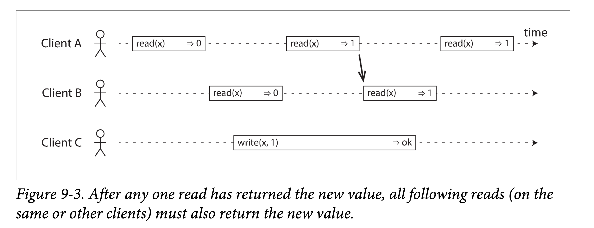

# DDIA 逐章精读（九）: 一致性和共识协议（Consistency and Consensus）

> 本章的线性一致性是在铺垫了多副本、网络问题、时钟问题后的一个综合探讨。首先探讨了线性一致的内涵：让系统表现得好像只有一个数据副本。然后讨论如何实现线性一致性，以及背后所做出的的取舍考量。其间花了一些笔墨探讨 CAP，可以看出作者很不喜欢 CAP 的模糊性。

如前所述，分布式系统中很多事情都有可能出错。解决出错最**简单粗暴**的方法是让整个**系统宕机**，并给出出错原因。但在实际生产中，这种方式多不可接受，此时我们就需要找到**容错**（tolerating faults）的方法。即，即使系统构件出现了一些问题，我们能保证系统仍然正常运行。

本章我们将会讨论一些用于构建具有容错性分布式系统的**算法**和**协议**（alogrithm and protocol）。在设计算法和协议时，我们假设第八章提到的分布式系统中的问题都会存在：

1. 数据包可能会丢失、乱序、重复和不确定延迟
2. 多机时钟最好的情况也就是**近似一致**
3. 机器节点可能会**不确定停顿**、**宕机重启**

构建一个容错系统最好的方法是：**找到一些基本抽象，可以对上提供某些承诺，应用层可以依赖这些承诺来构建系统，而不必关心底层细节**。在第七章中，通过使用事务，应用层可以假设不会发生宕机（**原子性**，意思是不会因为宕机出现让事务停留在半成功的状态），没有其他应用并发访问数据库数据（**隔离性**），且存储系统非常可靠（**持久性**）。事务模型会隐藏节点宕机、**竞态条件**（race conditions）、硬盘故障等底层细节，即使这些问题出现了，应用层也不必关心。

本章将继续讨论一些可以减轻应用层负担的分布式系统中的**基本抽象**。比如，分布式系统中最重要的一个抽象——**共识**（consensus），即，*让所有节点在**某件事情**上达成一致*。在本章稍后的讨论可以看出，让系统中的所有节点在有网络故障和节点宕机的情况下达成共识，是一件非常棘手的事情。

> 为什么共识协议如此重要呢？他和真实系统的连接点在于哪里？答曰，**操作日志**。而大部分**数据系统**都可以抽象为一系列**数据操作**的依次施加，即状态机模型。而共识协议可以让多机对某个**确定**的**操作序列**达成共识，进而对系统的任意状态达成共识。

一旦我们实现了**共识协议**，应用层可以依赖其做很多事情。例如，你有一个使用单主模型的数据库，如果主副本所在节点宕机，我们便可以使用共识协议选出新的主。在第五章处理节点下线（**Handling Node Outages**）一节中我们提到过，只有唯一的主，并且所有副本都认可该主，是一个需要确保的非常重要的特性。如果有超过一个节点都认为自己是主，我们称之为**脑裂**（split brain）。脑裂很容易导致数据丢失，而正确实现的共识协议能够避免该问题。

在本章稍后的地方，“分布式事务和共识协议”一小节里，我们将会详细讨论用以解决共识相关问题的算法。但在此之前，我们需要探索下分布式系统中我们可以提供的**保证**和**抽象**有哪些。

我们需要理解容错的边界，哪些事情可以做、哪些事情做不了：在某些情况下，系统可以容忍某些故障；但在另外情况下，系统却容忍不了。我们将通过**理论证明**和**具体实现**来深入探讨，可能与不可能的边界限制。我们会对诸多基本限制有个概览式串讲。

分布式系统领域针对这些主题的研究已经持续了数十载，因此积累了很多材料，但我们只能进行简要介绍其皮毛。由于篇幅所限，我们不会详细探究其严谨的模型描述和详细证明，相反，我们只会给一些其背后的**直觉**（informal intuitions）。如果你感兴趣，章节末尾的参考文献应该可以提供一些足够深入的细节。

# 一致性保证

在第五章中日志滞后问题（Problems with Replication Lag）小节，我们分析了一些多副本数据所遇到的时序问题。在相同时刻，如果对比多副本数据库中一份数据的两个副本，我们可能会看到不一致的数据。这是因为，写请求到达不同的数据节点，总会存在一个**时间差**。无论我们使用什么数据**副本模型**（单主、多主和无主），这种数据的不一致性都有可能会发生。

大部分**多副本数据库**（replicated databases）提供**最终一致性**（eventually consistency）的保证，这意味着，只要你对数据库停写，并等待足够长的时间，则所有对相同数据的读取请求最终会返回相同的结果。从另一个角度来说，所有的不一致都是暂时的，最终都会被解决（当然，这得是在网络故障能最终修复的假设之下）。描述相同意思的一个更好的名字可能：**收敛性**（*convergence*），即最终，所有副本都会收敛到相同的值。

但这是一个相当不靠谱的保证——没有提供任何关于**何时**收敛的信息。而在收敛之前，对于相同数据的读取，可能会返回任意值甚至不返回。举个例子，你向多副本数据库中写入了一条数据，并立即读取他。你能读到什么，最终一致性对此不会提供任何保证，因为读取请求可能会被路由到任何其他副本。

最终一致性对于应用层开发者很不友好，因为它表现出的行为和单线程程序中的变量完全不一致。在**单线程模型**里，如果对某个变量赋值后立即读取，我们默认一定会读到刚才的赋值，而不是**读到旧值**或者**读取失败**。数据库在对外表现上很像一组可读写的**变量集**，但具有复杂得多的语义。

在使用只提供弱保证的数据库时，我们需要**时刻**记得其限制，而不能偶尔自己增加额外假设，否则，会产生非常致命且难以察觉的 BUG。因为大部分时间里，应用层表现得毫无波澜，只有在系统中出现故障（网络拥塞、节点宕机）或在高负载场景下，这些边缘情况才会被触发。

本章我们会一起探究一些更强的一致性模型，但选择这些模型是有代价的。相对弱一致性模型系统来说，这么做要么会牺牲性能，要么会牺牲可用性。但提供强保证会让应用层能更加容易、正确的使用。但当然，我们最终还是得根据具体场景，来选择使用何等强度一致性模型。

> 在实践中，我们常会使用分层策略，让某些底层解决可用性、性能和容量的问题，让上层解决一致性的问题。比如云上各种基于 aws s3 的关系型数据库。另外，也有些系统会同时提供多种一致性模型供用户选择，在一致性和性能间进行取舍。

分布式系统中的**一致性模型的强弱**和第七章讲的事物的**隔离级别层次**有一些共通之处，比如在性能和隔离性/一致性间做取舍。但他们是相对独立的抽象：

1. **事务隔离级别**是为了解决并发所引起的数据竞态条件
2. **分布式一致性**是处理由于多副本间延迟和故障所引入的数据同步问题

本章涉及到很多主题，乍看起来很宽泛，但其内里是互相勾连的：

1. 首先，我们从常用的最强的一致性模型：**线性一致性**（linearizability）开始，探究其优缺点。
2. 接着，我们会考察分布式系统中时间的顺序问题，尤其是关于**因果关系**（causality）和**全序问题**（total ordering）。
3. 最后，在第三部分，我们会探索如何原子性的提交一个分布式事务，最终导出共识问题的解决方法。

# 线性一致性

在提供最终一致性语义的数据库里，如果你问不同副本同一个问题（比如说查询某条数据），则很可能得到不同的回答（响应），这就很让人迷惑了。如果多副本数据库在行为上能够表现的像只有一个副本，应用层编程将会简单很多。这样在任意时刻，每个客户端所看到的数据视图都是一样的，而不用去担心引入多副本带来的**副本滞后**（replication lag）等问题。

这就是**线性一致性**（linearizability）的基本思想，他还有很多其他称呼：原子一致性（atomic consistency）、强一致性（strong consistency）、即时一致性（immediate consistency），或者外部一致性（external consistency）。线性一致性的精确定义很精妙，本节余下部分会进行详细探讨。但其基本思想是，一个系统对外表现的像所有数据**只有一个副本**，作用于数据上的操作都可以**原子地完成**。有了这个保证，不管系统中实际上有多少副本，应用层都不用关心。这种抽象，或者说保证，类似于编程中的接口。

在一个提供线性一致性的系统中，只要某个客户端成功的进行了写入某值，其他所有客户端都可以在数据库中读到该值。提供单副本的抽象，意味着客户端任何时刻读到的都是**最近、最新**（up-to-date）的值，而不会是过期缓存、副本中的旧值。换句话说，线性一致性是一种数据**新鲜度保证**（recency guarantee）。为了理解这个说法，让我们看一个非线性一致性系统的例子：

上图显示了一个非线性一致性的体育网站。Alice 和 Bob 在一间屋子里，分别通过手机来查看 2014 年国际足联世界杯的总决赛的结果。在最终比分出来后，Alice 刷新了网页，并且看到了发布的赢家信息，并且将该结果告诉了 Bob。Bob 有点难以置信，重新刷了一下网页，但是他的请求被打到了一个滞后的数据库副本上，该副本显示比赛仍在进行。

如果 Alice 和 Bob **同时**（也就是并发）刷新网页，可能还不会对出现不同结果有太多惊讶，毕竟他们也不知道谁的查询请求先到（因为并发）。但，上述例子中，Bob 是在 Alice 告知他结果后刷新的网页，因此他才会期待至少能看到和 Alice 一样新的结果。该例子中 Bob 的请求返回了一个**过期**的结果，这便是违反了线性一致性。

## 如何让系统满足线性一致？

线性一致性背后的思想很简单：**让系统表现得好像只有一个数据副本**。但精确地将其拆解开，还需要花很多心思。下面我们来看更多的例子，以更好得理解线性一致性。

下图显示了三个客户端并发访问提供线性一致性的数据库的同一个键。在分布式系统论文中，x 被称为“**寄存器**”（register）。在实践中，x 可以是一个键值存储中的键值对、关系型数据中的一行或者文档数据中的一个文档。

为了简单起见，上图只显示了客户端角度数据读写视图，而略去了数据库的内部数据视角。每个**时间条**代表一个客户端的请求，起点代表客户端发出请求时刻、终点代表客户端收到响应时刻。由于网络延迟的不确定性，客户端不能够确切的知道数据库会在什么时刻处理其请求，而只能知道这个时间点一定在**请求发出**和**收到回复**之间，即时间条中的某个时刻。

在本例中，寄存器支持两种类型的操作：

1. `read_(x) ⇒ v`: 客户端请求读寄存器 x 的值，数据库会返回值 v
2. `write(x, v) ⇒ r`： 客户端请求将寄存器 x 的值设置为 v，数据返回结果 r（可能是成功或者失败）

在上图中，x 初始值为 0，客户端 C 发出一个写请求将其置为 1。在此期间，客户端 A 和 B 不断地向数据库请求 x 的最新值。试问 A 和 B 的每个读请求都会读到什么值？

- 客户端 A 的第一个读请求**结束在** C 的写请求**发出之前**，所以该请求一定会返回 0。
- 客户端 A 的最后一个读请求**开始于** C 的写请求**完成之后**，因此该请求一定会返回 1，当然，是在该数据库提供线性一致性保证的前提下：我们知道数据库的写操作一定发生在写请求期间的某个时间点、读操作一定也发生在读请求的某个时间点，如果读请求开始于写请求结束之后，则在数据库端，读操作一定是在写操作之后被处理的，因此该读操作一定能看到写操作所写。
- 其他的读请求时间条与该写请求都有**交集**，因此可能会返回 1，也有可能会返回 0。因为我们无从判断在数据库端，读操作和写操作的具体先后关系。从这个角度来说，这些读请求和写请求都是**并发的**（concurrent）。

不过，这也不足以刻画线性一致性：**如果和写请求并发的多个读请求既可能会返回新值，也可能会返回旧值，则在写请求持续期间，读客户端可能会看到不断交替的新旧值**。这明显不符合我们所期待的，能够提供“单数据副本”抽象的系统。

> 在多副本数据库中，如果要解决线性一致性，就要满足一旦某个客户端读取到新值，则其之后的读请求一定能读到该新值，而不是还可能看到旧值。这很难，由于上一章讲的时钟问题，我们甚至很难对多个客户端定义“**先后**”。此外，这种线性一致性的特性类似于薛定谔的猫，本来可能有多个状态，但一旦有个一个客户端进行了一次观察，就迅速的坍缩到了一个状态，其他后来者，也只能看到这一个状态。从另外一个角度理解，是读取请求**塑造**（seal）了并发请求的多状态边界。

为了让该系统满足线性一致性，我们需要增加一些额外限制，如下图：

在满足线性一致的系统中，写操作起止中间，必有一个时间点，使得 x 的值从 0 变为 1。因此一旦有一个读请求读到 1，之后的所有读请求都应该返回 1。即使此时，写请求可能还没有结束。

上图中使用箭头表示了这种时序依赖。客户端 A 首先读到 x 的新值 1。在 A 的读取返回之后，B 开始一个新的读。由于 B 的读请求严格在 A 的读请求之后，因此必然读到 1，尽管写下 1 的 C 的请求仍然没有返回。这和图 9-1 中的例子有点像，即在 Alice 读到世界杯结果之后，Bob 也应当能看到新消息。

我们将该时序图提炼一下，将所有请求生效时间**压缩到一个点**。下图中是一个更复杂一些的例子。

在上图中，我们在读和写之外，增加了第三种操作：

- $cas(x, v_{old}, v_{new}) ⇒ r$ 表示客户端发出了一个原子的 CAS（compare-and-set）请求。只有当寄存器 x 的值为 $v_{old}$ 时，才会将 x 的值替换为 $v_{new}$。如果 $x≠v_{old}$ 则 x 的值保持不变，并且返回错误。r 是数据的返回值（成功或者错误）。

上图中的所有请求都被关联上了一条竖线（在每个操作的时间条中），我们认为对应的操作在此时刻真正发生。所有的标记组成一种执行顺序，该顺序必须满足寄存器的**读写特性**（所有的读必须能返回最近的写）。

线性一致性要求所有操作标记组成序列是**永远向前的**，即满足数据**新鲜度要求：一旦我们写入或者读取到某值，所有稍后的读请求都能看到该值，直到有人再次将其改写。**

上图中还有一些有意思的点：

1. **B 读到“稍后”的值**。开始时，客户端 B 首先发出一个针对 x 的读请求，然后客户端 D 发出一个设置 x = 0 的写请求，紧接着，客户端 A 发出了另一个设置 x = 1 的写请求。然后 B 读到的值却是 1。这样是合法的，并且说明数据库先处理了 D（设置 x = 0）的写请求、接着处理了 A 的写请求，最后是 B 的读请求。尽管这个序列不符合请求发出的时间点先后，但这是一个可以接受的顺序，**因为这三个请求本质上并发的，因此事实上谁先谁后被处理都有可能**。比如，有可能是客户端 B 的请求在网络中延迟了一些，以至于在两个写之后才被处理。
2. **客户端 A 写请求还没结束客户端 B 就读到了其写的值 1**。这也是合法的：这并不是说我们在 1 写成功之前读到了，而只是说明 A 的写操作的 ok 回应回来的**有一些延迟**。
3. **这个模型对隔离性没有任何假设**：客户端可能在任何时刻更改值，并且能被其他客户端看到。例如，C 两次读取，第一次读到 1 第二次读到 2，这是因为两次读取间 B 修改了 x。使用原子的 CAS 操作可以在修改 x 的值时，避免被其他客户端并发的修改。B 和 C 的 CAS 请求成功了，但是 D 的 CAS 请求失败了（因为数据库处理其 CAS 时，x 的值已经不是 0 了）。
4. **B 的最后一个读请求不满足线性一致**。该请求和 C 的 CAS 写是并发的，C 的 CAS 将 x 从 2 更新到了 4。如果没有其他操作，B 读到 2 是合法的。但是客户端 A 读到了 4，并且在 B 请求开始前就返回了，因此 B 不允许读到比 A 更老的值。这个也和之前 Alice 和 Bob 的例子类似。

这就是线性一致性背后的一些直觉，[参考文献](https://cs.brown.edu/~mph/HerlihyW90/p463-herlihy.pdf)中有更形式化的定义。可以（但是代价很高）通过记录系统中所有请求的时间线，并检查其能否组成合法的顺序，来测试该系统是否满足线性一致性。

> **线性一致性和可串行化**
>
> **线性一致性**（Linearizability）很容易和**可串行化**（serializability）相混淆，因为他们看起来都像是：可以进行拓扑化组织。但他们是不同维度的约束，我们很有必要对其进行区分：
>
> **可串行化**（Serializability）。可串行化是事务的一种隔离级别。每个事务可能会涉及**多个数据对象**（行、文档、记录）的读写，[之前](https://ddia.qtmuniao.com/#/ch07?id=%e5%8d%95%e5%af%b9%e8%b1%a1%e5%92%8c%e5%a4%9a%e5%af%b9%e8%b1%a1%e6%93%8d%e4%bd%9c)有讨论过单对象和多对象。可串行化可以保证所有事务好像按**某种顺序依次执行**（后一个事务在前一个事务结束后才开始）。需要注意的是，如果某种串行顺序和实际执行顺序不一致也没事，只要是串行执行就行。举个例子，如果 A、B、C 三个事务并发执行，真实顺序是 A->B->C，但如果对应用层表现为 C->A->B 的执行顺序（可能由于多机时间戳不同步），也可以叫可串行化，但 C->A->B 的执行顺序在**某个**对象上可能不满足线性一致性。
>
> **线性一致性**（Linearizability）。线性一致性是一种针对寄存器（register，**单个数据对象**）的读写新鲜度保证。它不会将多个操作打包成事务，因此不能避免像之前提到的[写偏序](https://ddia.qtmuniao.com/#/ch07?id=%e5%86%99%e5%81%8f%e5%ba%8f%e5%92%8c%e5%b9%bb%e8%af%bb)等问题，除非使用某些辅助手段，如[物化冲突](https://ddia.qtmuniao.com/#/ch07?id=%e7%89%a9%e5%8c%96%e5%86%b2%e7%aa%81)。
>
> 一个数据库可以同时提供可串行化和线性一致性保证，我们称之为**严格可串行化**（*strict serializability*）或者**单副本可串行化**（strong one-copy serializability）。使用两阶段锁或者真正串行化执行实现的可串行化，通常都是线性一致的。
>
> 然而，基于快照隔离的串行化**通常**不是线性一致的。为了避免读写互相阻塞，所有的读取都会基于某个一致性的快照，则该快照之后的写入不会反映到读请求上，因此，快照读不满足线性一致性。

## 应用线性一致性

在什么场景下我们会用到线性一致性？之前提到的获取体育赛事决赛比分不是一个能凸显其重要性的例子：在该情况下延迟几分钟得到比赛结果可能并不会引起什么实质性损害。然而，在某些领域里，线性一致性是系统能够正常工作的**重要依赖**。

### 锁和主选举

在使用单主模型的系统中，需要保证任何时刻只有一个主副本，而非多个（脑裂）。一种进行主选举的方法是使用锁：每个节点在启动时都试图去获取锁，最终只有一个节点会成功并且变为主。不论使用什么方式实现锁，都必须**满足线性一致性**：所有节点必须就某节点拥有锁达成一致，否则这样的锁服务是不能用的。

像 Apache Zookeeper 和 Etcd 之类的协调服务（Coordination services）通常用来实现分布式锁和主选举。他们通常使用共识算法来实现线性一致性操作，并且能够进行容错。当然，在此之上，为了正确的实现锁服务和主选举，还需要讨论一些非常微妙的细节。像 [Apache Curator](https://github.com/apache/curator) 等库可以基于 Zookeeper 提供高层的协调服务抽象。但是，一个提供线性一致性保证的存储服务是实现这些协调任务的**基础**。

一些分布式数据库在**更细粒度上**使用了分布式锁，如 Oracle Real Application Clusters（RAC）。当有多个节点共同访问同一个磁盘存储系统时，RAC 会为每个磁盘页配一把锁。由于这些线性化的锁是事务执行的关键路径，RAC 通常将其部署在和数据节点使用专线连接起来的集群里。

### 约束和唯一性保证

**唯一性约束**在数据库中很常见：比如用户名和邮箱可以用来唯一的标识一个用户、在同一个文件系统中不可能有多个文件具有相同的路径和文件名。如果你想在数据写入时**维持这些约束**（比如两个人使用相同的用户名并发地创建账户，其中一个会失败而报错），你需要线性一致性。

这个情形和锁的语义非常类似：当一个用户注册时，可以认为他获得了一个和所注册的用户名关联的“锁”。这个操作很像原子的 CAS（compare-and-set）：如果该用户名没有被使用，就将其分配给该用户。

在以下几种情况也会面临类似的问题：

1. 保证银行账户余额不会出现负值
2. 不可能卖出比持仓多的股票数目
3. 任意两个用户不可能同时预定到相同的航班或者剧院座位

这些约束都要求所有节点在**单个最新值**（账户余额、股票水位、座位预定）上达成一致。

当然，在真实场景下，有时这些约束可以被适当放宽（比如，如果机票座位被超订了，可以将其中一个用户移到其他航班，并给予适当补偿）。在这种情况下，可能不需要严格的线性一致性，稍后我们会在及时性和完整性一节讨论这些放松的约束。

但是对于像我们平时在关系型数据库中看到的严格的唯一性约束，就需要线性一致性了。数据库中其他类型的一些约束，如外键约束和属性约束，就可以不用借助线性一致性来实现了。

### 多渠道的时序依赖

在图 9-1 中我们可以注意到一个细节：如果 Alice 没有说出决赛结果，Bob 就不会知道他看到的是过时的结果。如果 Bob 没有从 Alice 那里事先知道结果，他可能就会过几秒再刷新一次页面，最终会看到最终分数。也就是说，因为存在一个**额外的通信渠道**（addional communication chanel），导致我们注意到了系统不满足线性一致性。

计算机系统中也有类似的问题。例如，我们有一个可以让用户上传照片的网站，有个后台进程会将照片进行压缩以支持快速加载（缩略图）。架构图如下：

**图片调整服务**（image resizer）需要显式的指定任务，任务指令是通过消息队列由 web 服务器发给图片调整服务。但由于消息队列是针对短小消息（1kb 以下）而设计的，而图片通常有数 M，因此不能直接将图片发送到消息队列。而是，首先将图片写入**文件存储服务**（File Storage Service），然后将包含**该文件路径**的**调整请求**发送到消息队列中。

如果文件存储服务是线性一致的，则这个系统能正常运作。但如果他不是，则可能会存在竞态条件：**消息队列可能会比文件存储服务内部多副本同步要快**。在这种情况下，当图片调整服务去文件存储服务中捞照片时，就会发现一个旧照片、或者照片不存在。如果调整服务看到的是旧照片，却以为是新的，然后把它调整了并且存回了存储服务，就会出现永久的不一致。

出现这种情况是因为在 web 服务器和图片调整服务中间存在两条**不同的通信渠道**（communication channels）：**存储系统和消息队列**。如果没有线性一致性提供的新鲜度保证，两条通信渠道就有可能发生竞态条件（race condition）。这也和图 9-1 的情况类似，在那个场景中，也存在着两条有竞态条件的通信渠道：数据库多副本同步渠道和 Alice 的嘴到 Bob 的耳朵的声音传播。

可线性化不是唯一避免静态条件的方式，但它是最易理解的。如果你能控制所有的通信渠道（如 9-5 中的消息队列，但 9-1 中的两人交谈就不行，因为在系统外），就可以使用类似[读你所写](https://ddia.qtmuniao.com/#/ch05?id=%e8%af%bb%e4%bd%a0%e6%89%80%e5%86%99)一节中所提到的手段来解决这种竞态条件。如读走 leader、使用时间戳等等增加系统复杂度的方法来换取线性一致性。

## 实现线性一致的系统

我们已经看了一些依赖线性一致性的例子，接下来让我们思考下如何实现一个**提供线性一致语义**的系统。

线性一致性的本质是在说：**系统表现得像只有一个数据副本，且所有施加于其上的操作都会原子性（瞬间）的完成**。那么，我们最简单的实现方式就是真的只用一个数据副本。但其问题在于，不能容错：一旦该副本挂了，轻则长时间（重启之前）不可用、重则数据丢失。

最常用的让系统进行容错的方式就是多副本。让我们回顾下第五章的几种多副本模型，然后逐一考察下其是否能够做成可线性化的：

- **单主模型**（Single-leader replication，potentially linearizable）
  在一个单主模型的系统中，主副本服务于写请求，其他副本负责备份。如果我们让读取也走主副本，或者使用同步更新从副本的策略，则该系统**有可能**满足线性一致性。但是，并不是所有单主模型的数据都提供线性一致性，有时候是故意的（比如提供快照隔离），有时候是由于并发 bug。
  想让主副本也负责读请求，首先我们得确切知道哪一个是主副本。就像我们在“[真相由多数节点定义](https://ddia.qtmuniao.com/#/ch08?id=%e7%9c%9f%e7%9b%b8%e7%94%b1%e5%a4%9a%e6%95%b0%e6%b4%be%e5%ae%9a%e4%b9%89)”一节中提到的，很有可能某个节点认为他是主节点，但其事实上不是。如果这个**自以为是的主节点**（delusional leader）继续提供服务，则系统很可能会违反线性一致性。如果使用异步同步策略，节点宕机可能甚至会丢数据，从而不仅违反线性一致性，也违反了可持久性。
- **共识算法**（Consensus algorithms，linearizable）
  我们本章稍后会讨论到，有一些共识算法，看起来与单主模型类似。但这些共识协议有一些阻止脑裂和过期副本的手段。由于这些额外细节，共识算法可以实现安全的线性一致性存储。Zookeeper 和 etcd 就是用的这种手段。
- **多主模型**（Multi-leader replication，not linearizable）
  由于可以同时在多个节点上处理写入，并且异步同步写入数据，使用多主模型的系统通常不是线性一致的。由于上述原因，这种系统可能会产生需要手动解决的写入冲突。这种冲突便是违反线性一致性要求的一个点：表现得像一个副本。
- **无主模型**（Leader replication， probably not linearizable）
  对于使用无主模型的系统（Dynamo-style，参见前面[无主模型](https://ddia.qtmuniao.com/#/ch05?id=%e6%97%a0%e4%b8%bb%e6%a8%a1%e5%9e%8b)一节）来说，厂商有时候会声称你可以通过使用法定数目读写（Quorum reads and write，w+r > n）来获得强一致性。这个说法有点模糊，并不总是正确，这取决于你对法定节点的配置，也取决于你如何定义强一致性。
  “后者胜”（Last write win）的冲突解决方法会依赖于多个机器的挂历时钟（time-of-day，参见[依赖时钟同步](https://ddia.qtmuniao.com/#/ch08?id=%e4%be%9d%e8%b5%96%e5%90%8c%e6%ad%a5%e6%97%b6%e9%92%9f)），由于多机时钟存在偏差，其物理时间戳不能保证和系统事件顺序一致，因此基本上不可能做到线性一致。放松的法定策略（Quorum，见[放松的 Quorum 和提示转交](https://ddia.qtmuniao.com/#/ch05?id=%e6%94%be%e6%9d%be%e7%9a%84-quorum-%e5%92%8c%e6%8f%90%e7%a4%ba%e8%bd%ac%e4%ba%a4)）也是破坏了线性一致性。即使对于严格的法定策略，非线性一致的现象也可能出现，下一节将会详细探讨。

### 线性一致和法定策略（Quorum）

从直觉出发，在 Dynamo 风格的系统中使用严格的 Quorum 读写应该会满足线性一致性。但在具有不确定延迟的网络中，仍然可能会出现竞态条件。如下图所示：

在图 9-6 中，x 的初始值是 0。然后一个客户端想将 x 更新为 1，然后将该写请求发送到所有三个副本（n=3, w=3）。与此同时，客户端 A 使用 r = 2 的配置进行 Quorum 读，并且看到了新值 1。稍后，客户端 B 也是用 r = 2 的配置在另外两个节点进行 Quorum 读，但却读到了旧值 0。

Quorum 的配置是严格满足 w+r>n 的，然而这个读写序列却不是线性一致的：**B 的读取请求开始于 A 的读请求结束之后，却读到了比 A 旧的值**。

当然，有趣的是，我们可以通过牺牲部分性能来让 Dynamo 风格的 Quorum 读写变成线性一致的：

1. 每个读请求必须进行同步的[读取修复](https://ddia.qtmuniao.com/#/ch05?id=%e8%af%bb%e6%97%b6%e4%bf%ae%e5%a4%8d%e5%92%8c%e5%8f%8d%e7%86%b5)。
2. 发送任意写请求之前要先读取最新值。

但由于性能原因 Riak 并没有采用同步的读取修复；Cassandra 倒是会同步读取修复，但在多个请求并发写入同一个 key 时，由于采用了后者胜的策略（考虑时钟，会导致接受顺序不是真正事件发生顺序），仍然不能保持线性一致性。

此外，这种方式只能实现线性一致的读写操作，而不能实现线性一致的 CAS 操作。只有共识协议才能实现线性一致的 CAS。

总结来说，最好认为基于无主模型的 Dynamo 风格的系统不提供线性一致性保证。

## 线性一致性的代价

可以看出有些系统提供线性一致性保证，有一些却不提供。因此我们很容易好奇：线性一致性系统的优缺点是什么，接下来我们深入探讨一下。

在[第五章](https://ddia.qtmuniao.com/#/ch05)的时候我们讨论了一些使用不同副本策略的实际场景。如，对于跨数据中心（详见[多数据中心](https://ddia.qtmuniao.com/#/ch05?id=%e5%a4%9a%e4%b8%aa%e6%95%b0%e6%8d%ae%e4%b8%ad%e5%bf%83)一节）的系统来说，多主模型通常是一个好的选择。下图是一个例子：

让我们考虑两个数据中心网络无法连通的情形。我们假设每个数据中心内部网络是连通的，且客户端也可以触达每个数据中心，仅仅是数据两个中心之间**不能互相触达**。

在使用多主模型的数据库中，在上述情形下，由于向其他数据中心的数据传输是异步的，每个数据中心仍能正常工作，只是由于数据中心间网络的问题，所有数据同步都被排队了起来，待到网络恢复就会重新发出。

但如果数据库使用单主模型，主节点只会存在于某个特定的数据中心。所有的写入和线性化的读都会被路由到该数据中的该主节点。对于所有直接打到从数据中心的客户端请求，都必须被通过网络同步的路由给主数据中心。

在单主模型下，如果两个数据中心间的网络断了，连接到从数据中心的客户端不能间接触达主数据中心，所有的写入都会被阻塞然后失败，所有的线性化读取自然也会。当然该客户端可以无视该中断，直接从从数据中心的从副本进行读取，但其读到的内容可能是过期（主副本接受了新的写入），也因此不满足线性一致。如果应用层要求线性一致的读写，则**数据中心间的网络中断会造成服务的不可用**。

如果客户端能直连主数据中心，则上述问题不存在。但如果客户端只能连接到从数据中心，就会在网络修复前经历一段时间的不可用。

### CAP 定理

该问题不止是采用单主模型和多主模型的不同策略所导致的：**不管其实现方式如何，任何想要提供线性一致性的系统都会面临上述取舍问题**。该问题也不止局限于跨数据中心部署，即使是在一个数据中心之内，任何通过不可靠网络连接的系统都会有该问题。其背后的**取舍考量**如下：

- 如果应用层要求系统提供线性一致性，此时如果某些数据副本由于网络问题和系统其他部分**断开了连接**，则这些数据副本就**不再能够正常地处理请求**：要么等待网络恢复、要么进行报错。但这都意味着系统不可用。
- 如果应用不要求系统的线性一致，则即使多副本间遇到连接问题，每个副本可以独立的进行写入。从而，即使出现了网络故障，系统仍然能够保持可用，但其行为不是线性一致的。

总而言之，**如果系统不提供线性一致性，就可以对网络故障更加鲁棒**。该洞见常被称为 **CAP 定理**，于 2000 年被 Eric Brewer 提出。不过，类似的取舍考量从 1970 年代就为分布式数据的设计人员所熟知了。

CAP 最初被提出只是一个为了激发数据库取舍讨论的模糊的取舍参考，而非被精确定义的定理，Martin 还专门写过一篇[文章](https://www.qtmuniao.com/2020/02/16/not-cp-or-ap/)来探讨这件事。在当时，很多分布式数据库还在着眼于基于共享存储的一组机器上提供线性一致性语义。CAP 的提出，鼓励工程师们在 share-nothing 等更广阔的设计领域进行架构探索，以找出更加适合大规模可扩展 web 服务架构。在新世纪的最初十年里，CAP 的提出见证并推动了当时数据库设计思潮从强一致系统转向弱一致系统（也被称为 NoSQL 架构）。

**CAP 定理**的形式化定义适用范围很窄：仅包含一种一致性模型（即线性一致性）和一种故障类型（网络分区，或者说节点存活，但互不连通）。它没有进一步说明任何关于网络延迟、宕机节点、以及其他的一些取舍考量。因此，尽管 CAP 在历史上很有影响力，但他在设计系统时缺乏实际有效指导力。

在分布式系统中有很多其他难以兼顾的有趣结果，CAP 现在已经被很多更为精确的描述所取代，因此 CAP 在今天更多的作为一个历史名词。

> CAP 有时候被表述为，在做系统设计时，一致性（consistency）、可用性（Availability）、分区容错性（Partition tolerance），只能三取其二。然而，这种说法极具误导性，因为网络分区是一种故障类型，而不是一种可以取舍的选项：不管你喜欢还是不喜欢，它都在那。当然，也有人理解为用单机系统可以规避，但我们当下讨论的前提是分布式系统。

> 在网络正常连通时，系统可以同时提供一致性（线性一致性）和完全的可用性。当网络故障发生时，你必须在线性一致性和完全可用性之间二选一。因此，对于 CAP 更好的一个表述可能是：**当网络出现分区时，一致性和可用性只能二选其一**（*either Consistent or Available when Partitioned*）。一个可靠的网络，可以减少其上的系统该选择的次数，但无论如何，分布式系统中，该选择是无法避免的。

> 在有关 CAP 的讨论，有几种关于可用性的大相径庭的定义，且将 CAP 升格为定理并给出证明中的提到的**形式化的可用性**并非通常意义中所说的可用性。很多所谓“高可用”的系统通常并不符合 CAP 定理中关于可用性的独特（idiosyncratic）定义。总而言之，CAP 有很多容易误解和模糊不清的概念，并不能帮助我们更好的理解系统，因此最好不用 CAP 来描述一个系统。

### 线性一致性和网络延迟

尽管线性一致性是一个非常有用的保证，但令人惊讶的是在工程实践中，很少有系统支持真正的线性一致。甚而，即使在现代**多核 CPU 体系下的 RAM 也不是线性一致的**：如果一个核上的某个线程往某个内存地址中写了一个值，稍后另外核的一个线程读取该地址，并不一定能读到刚才的值。

这是因为每个 CPU 都有自己的缓存（memory cache）和缓冲区（store buffer）。一般缓存通常说的是读取，而缓冲区通常针对写入。线程的内存访问会首先落到缓存里，所有对于缓存的更新会**异步同步**到主存中。缓存访问的速度要（ns 级别）比内存访问（百 ns 级别）快几个数量级，由于可以用来弥合寄存器和主存的访问鸿沟，因此是现代 CPU 架构高性能的基石。但一份数据存了多个副本（比如主存中一个，一些 CPU 缓存中各有一个），且是异步更新的，导致线性一致性被破坏。

为什么会做此种取舍？当然，我们不能用 CAP 来进行考察，毕竟我们通常认为**单机系统内的通信**是稳定可靠的，并且某个 CPU 如果和系统其他部分断开连接也**不可能独自工作**。此处牺牲线性一致性的真正原因在于——**性能**，而不是容错。当然，单机系统都会提供一些同步手段（比如锁），来强制同步相应变量到主存。从而允许用户在关心一致性超过性能的地方，自行进行取舍。

很多分布式系统选择不提供线性一致性的原因也在于此：**是为了提升系统性能而非进行容错**。在任何时候，提供线性一致性都会严重拖慢系统。而非在网络故障发生时，才需要对线性一致性进行牺牲。

我们能找到一种**更高效的实现**来让存储服务提供线性一致吗？遗憾的是，暂时没有。Attiya 和 Welch 证明了，如果你想要保证线性一致，读写请求的响应时间是**正比于网络延迟**的。在一个具有高度不确定性的网络中（参见[超时和无界延迟](https://ddia.qtmuniao.com/#/ch08?id=%e8%b6%85%e6%97%b6%e5%92%8c%e6%97%a0%e7%95%8c%e5%bb%b6%e8%bf%9f%ef%bc%88unbounded-delays%ef%bc%89)），线性化的读写请求的响应时间不可避免的会很高。提供线性一致性保证可能没有更快的算法，但是我们稍微**放松一致性**，就可以设计出一个更快的系统。这种取舍在对延迟敏感的系统非常重要。在第十二章中，我们会探讨一些即使不提供线性一致性，但仍然可以保证正确性的一些方法。

# 顺序保证

我们之前提到，一个线性化的寄存器对外表现得像：

1. 数据只有一个副本
2. （施加于数据上的）操作原子的完成

该定义暗含着：**所有操作会形成一个确定的执行顺序**。在图 9-4 中，我们就根据读到的结果来推测出了一个服务器端所有操作的看起来的执行顺序。

**顺序**（ordering）是本书中不断强调的一个主题，这也确实说明顺序是一个非常重要的基础概念。我们回忆一下本书所提到顺序的相关上下文：

- 在[第五章](https://ddia.qtmuniao.com/#/ch05)，我们在单主模型中提到，主副本最重要的作用就是确定**复制日志**（replication log）中的**写入顺序**（order of writes），然后所有从副本都要遵从该顺序。如果不存在唯一的主节点作为权威来协调该顺序，则在并发的多个写入可能会产生冲突。（参见[处理写入冲突](https://ddia.qtmuniao.com/#/ch05?id=%e5%a4%84%e7%90%86%e5%86%99%e5%85%a5%e5%86%b2%e7%aa%81)）
- 在[第七章](https://ddia.qtmuniao.com/#/ch07)，我们讨论了**可串行化**（serializability），即保证所有并发的事务像以某种顺序一样串行执行（some sequential order）。可以通过物理上真的串行执行来实现，也可以通过并发执行但解决冲突（加锁互斥或者抛弃执行）来实现。
- 在[第八章](https://ddia.qtmuniao.com/#/ch08)，我们讨论了在分布式系统中使用时钟（参见[依赖同步时钟](https://ddia.qtmuniao.com/#/ch08?id=%e4%be%9d%e8%b5%96%e5%90%8c%e6%ad%a5%e6%97%b6%e9%92%9f）)，这也是一个试图对无序的真实世界引入某种顺序，以解决诸如哪个写入更靠后之类的问题。

**顺序性**（ordering）、**线性一致性**（linearizability）和**共识协议**（consensus）三个概念间有很深的联系。相比本书其他部分，尽管这几个概念更偏理论和抽象，但理解他们却有助于来厘清系统的功能边界——哪些可以做，哪些做不了。在接下来的几小节中，我们会对此进行详细探讨。

## 顺序和因果（**Ordering and Causality**）

顺序在本书中反复被提及的原因有很多，其中一个是：**它可以维持因果性**。关于因果关系的重要性，本书也举过很多例子：

- 在[一致前缀读](https://ddia.qtmuniao.com/#/ch05?id=%e4%b8%80%e8%87%b4%e5%89%8d%e7%bc%80%e8%af%bb)中我们提到一个先看到答案、后看到问题的例子。这种现象看起来很奇怪，是因为它违反了我们关于因果顺序的直觉：问题应该先于答案出现。因为只有看到了问题，才可能针对其给出答案（假设这不是超自然现象，并且不能预言将来）。对于这种情况，我们说在问题和答案之间存在着**因果依赖**（causal dependency）。
- 在第五章[图 5-9](https://ddia.qtmuniao.com/#/ch05?id=%e5%a4%9a%e4%b8%bb%e5%a4%8d%e5%88%b6%e6%8b%93%e6%89%91) 中有类似的情况，在有三个主的情况下，由于网络延迟，一些本应该先到的写入操作却居于后面。从某个副本的角度观察，就感觉像在更新一个不存在的数据。**因果**在此处意味着，某一行数据*只有先被创建才能够被更新*。
- 在[并发写入检测](https://ddia.qtmuniao.com/#/ch05?id=%e5%b9%b6%e5%8f%91%e5%86%99%e5%85%a5%e6%a3%80%e6%b5%8b)一节我们知到，对于两个操作 A 和 B，有三种可能性：A 发生于 B 之前，B 发生于 A 之前，A 和 B 是并发的。这种**发生于之前**（happened before）是因果性的另一种表现：如果 A 发生在 B 之前，则 B 有可能知道 A，进而基于 A 构建，或者说依赖于 A。如果 A 和 B 是并发的，则他们之间没有因果联系，也即，我们可以断定他们互不知道。
- 在事务的快照隔离级别下（参见[快照隔离和重复读](https://ddia.qtmuniao.com/#/ch07?id=%e5%bf%ab%e7%85%a7%e9%9a%94%e7%a6%bb%e5%92%8c%e9%87%8d%e5%a4%8d%e8%af%bb)），所有的读取都会发生在某个**一致性**的快照上。这里的一致性是什么意思呢？是**因果一致性**（consistent with causality）。如果一个快照包含某个问题答案，它一定包含该问题本身。假设我们以上帝视角，在某个**时间点**（意味着瞬时观察完）观察整个数据库可以让得到的快照满足因果一致性：所有在该时间点之前操作结果都可见，在该时间点之后的操作结果都不可见。**读偏序**（Read skew，即图 7-6 中提到的不可重复读），即意味读到了违反因果关系的状态。
- 之前提到的事务间的写偏序的例子（参见[写偏序和幻读](https://ddia.qtmuniao.com/#/ch07?id=%e5%86%99%e5%81%8f%e5%ba%8f%e5%92%8c%e5%b9%bb%e8%af%bb)）本质上也是因果依赖：在图 7-8 中，系统允许 Alice 请假，是因为事务看到的 Bob 的状态是仍然再岗；当然，对于 Bob 也同样。在这个例子中，一个医生是否允许在值班时请假，依赖于当时是否仍有其他医生值班。在**可串行的快照隔离级别**（SSI，参见[可串行的快照隔离](https://ddia.qtmuniao.com/#/ch07?id=%e5%8f%af%e4%b8%b2%e8%a1%8c%e7%9a%84%e5%bf%ab%e7%85%a7%e9%9a%94%e7%a6%bb)) 下，我们通过追踪事务间的因果依赖（即读写数据集依赖）来检测写偏序。
- 在 Alice 和 Bob 看足球比赛的例子中，Bob 在 Alice 表示结果已经出来之后，仍然没有看到网页结果，便是违反了因果关系：Alice 的说法基于比赛结果已经出来的事实，因此 Bob 在听到 Alice 的陈述之后，应该当能看到比赛结果。图片尺寸调整的例子也是类似。

因果将顺序施加于**事件**（event）：

1. 先有因，后有果
2. 先有消息发送，然后该消息被收到
3. 先有问题，后有答案

这和现实生活一样，一件事的发生会引起另一件的事的出现：一个节点读取数据之后，**依据**读取内容，（依赖于读取）写入了一些数据；另一个节点读取这些写入，进而写入了另外一些数据，循环往复。操作（operation）发生的**依赖链条**定义了系统中事件的因果——也即，**谁居先，谁处后**。

如果一个系统遵循因果约束，则我们称其为**因果一致的**（*causally consistent*）。比如，快照隔离就可以提供因果一致性：当从数据库读取数据的时候，如果你能读到某个时间点的数据，就一定能读到其之前的数据（当然，要在该数据还没有被删除的情况下）。

### 因果序非全序

**全序**（total order）意味着**系统内任意两个元素可比大小**。如，自然数是全序：任举两个自然数，比如 5 和 13，我们可以确定 13 是比 5 大的。但与此相对，数学中的集合就不是全序的，比如我们无从比较 {a, b} 和 {b, c} 的大小关系，因为他们互不为对方子集。对于这种情况，我们称其**不可比**（incomparable）。反之，集合是**偏序**（partially ordered）：在某些情况下，我们可以说一个集合比另一个集合大（两个集合间有包含关系）；但在另外一些情况下，两个集合间没有可比关系。

全序和偏序的区别还反应在不同强度**数据库一致性模型**（database consistency models）上：

- **线性一致性**（Linearizability）：让我们回忆下对于可线性化的理解，可线性化对外表现的像**所有操作都发生于单副本上，并且会原子性的完成**。这就意味着，对于任意两个操作，我们总是可以确定其发生的先后关系，也即在可线性化系统中，所有的操作顺序满足全序关系。如之前图 9-4 中给的例子。
- **因果一致性**（Causality）。如果我们无从判定两个操作的先后关系，则称之为**并发的**（concurrent，参见[发生于之前和并发关系](https://ddia.qtmuniao.com/#/ch05?id=%e5%8f%91%e7%94%9f%e4%ba%8e%e4%b9%8b%e5%89%8d%ef%bc%88happens-before%ef%bc%89%e5%92%8c%e5%b9%b6%e5%8f%91%e5%85%b3%e7%b3%bb)）。从另一个角度说，如果两个事件因果相关，则其一定有序。也即，因果性定义了一种**偏序**（partial order）关系，而非全序关系：有些操作存在因果，因此可比；而另外一些操作则是并发的，即不可比。

根据上述解释，在线性一致性的数据存储服务中，是不存在并发操作的：**因为必然存在一个时间线能将所有操作进行排序**。同一时刻可能会有多个请求到来，但是线性化的存储服务可以保证：**所有请求都会在单个副本上、一个单向向前的时间线上的某个时间点被原子地处理，而没有任何并发**。

并发（concurrency）意味着时间线的分叉与合并。但在重新合并之时，来自两个时间分支的操作就有可能出现不可比的情况。在第五章的图 5-14（参见[确定 Happens-Before 关系](https://ddia.qtmuniao.com/#/ch05?id=%e7%a1%ae%e5%ae%9a-happens-before-%e5%85%b3%e7%b3%bb)）中我们见过类似的现象，所有的事件不在一条时间线上，而是有相当复杂的图形依赖。图中的每个箭头，本质上定义了一种因果依赖，也即偏序关系。

> 理解全序和偏序、线性一致性和因果一致性的一个关键模型是**有向图**。在该图中，点代表事件，有向边代表因果关系，并且从因事件指向果事件，很自然的，因果性满足**传递性**。**如果该图中有一条单一的路径能串起所有点，且不存在环**，则该系统是线性一致的。可以看出，因果关系是一种局部特性（也即偏序关系），定义在两个点之间（如果两个点之间存在着一条单向途径，则这两点有因果关系）；而线性关系是一种全局特性（也即全序关系），定义在整个图上。

如果你熟悉一些分布式的版本管理工具，如 Git，你就会发现相似的特性。在 Git 中，版本间的依赖就类似于一个因果依赖图。大部分时候，所有人的提交（commit）是前后相继的，组成一个直线；但有时，如果团队中的几个人同时（并发的）为一个项目工作，版本历史就会产生分叉，并且在提交的时候重又合并。

> 在 Spark 的多个 RDD 之间，也有类似的感觉。如果所有算子都是单输入算子，则执行图会是一条线，即全序没有并发；如果有的算子有多个输入，则不同输入之间可以并发，此时为偏序关系。

### 线性一致性强于因果一致性

那么因果顺序和线性一致性的关系是什么？答曰：线性一致性是因果一致性的**充分（implies）条件**。所有提供线性一致性的系统都能够能够保证因果性。尤其对于有多个通信通道的系统来说，我们不需要做任何额外努力（比如在多个组件间传递时间戳，以建立因果关系），线性一致性就能够保证系统中发生的所有事件满足因果性。

> 用我们之前的图模型来说，就是**不存在环**。即，**因果一致性**（有向无环图） ⇒ **线性一致性**（在有向无环图的基础上，**存在一条能串起所有点的单向路径**）。

线性一致性能能够保证因果关系，该特点让系统易于使用，从而对应用层很有吸引力。但任何事情都是有代价的，如我们在之前线性一致性的代价一节中所讨论的：**提供线性一致性非常伤性能和可用性，在网络有显著延迟时**（如全球部署的系统）**，该副作用尤其明显**。因此，很多系统会舍弃线性一致性以换取更好的性能，但当然，代价是更难用了。

好消息是存在折中路线。线性一致性并非保持因果关系的唯一途径，还有很多其他办法。也即，一个系统可以不必承担线性一致性所带来的性能损耗，而仍然是**因果一致的**（consistent）。当然，在这种情况下，CAP 定理是不适用的。事实上，**因果一致性**是系统在保证**有网络延迟而不降低性能、在有网络故障而仍然可用**的情况下，能够提供的最强一致性模型。

在大多数情况下，我们以为我们需要线性一致模型，其实我们真实需要因果一致模型，而后者允许我们实现性能更好的系统。基于这个观察，研究人员在探寻新型数据库的设计，让系统既可以提供因果关系保证，也可以提供（堪比最终一致性系统的）高性能和高可用性。

这些研究都比较新，还存在很多挑战，也没有进行落地。但无疑，是分布式系统在将来一个很有前景发展方向。

> 真实系统中，在所有的事件集中，只有部分事件是有因果依赖的，这些事件需要在执行时保证因果顺序执行；而其他的大部分事件是没有因果依赖的，因此可以乱序、按需执行以保证性能。但这件事情的难点在于，因果关系是**应用层定义的**。而我们在系统层，就很难识别。可能需要提供某种接口，可以让应用层显示指定因果，但一来不确定这种接口是否能做的足够宽泛；二来，这种因果追踪的额外代价是非常大的。

### 捕获因果依赖

我们不会事无巨细的去探究非线性化系统如何保持因果关系的每个细节，仅就其中的一些关键点进行探讨。

为了保证因果一致性，我们首先需要知道哪些操作存在着因果关系。如之前所说，因果关系是偏序关系，有些操作是并发的，但如果确定某个操作发生在另外一个之前，则在所有的副本上都要以同样的顺序处理这两个操作。因此，当某个副本处理一个操作时，它必须确保所有其前驱（happens before）操作都已经完成；如果有任何前驱操作还未出现，则之后的操作必须等待直到其被处理。

为了确定因果依赖，我们需要某种手段来描述系统中节点的“**知识**”（knowledge）。如果某个节点在收到 Y 的写入请求时已经看到了值 X，则 X 和 Y 间可能会存在着因果关系。就如在调查公司的欺诈案时，CEO 常被问到，“你在做出 Y 决定时知道 X 吗”？

确定哪些操作先于哪些些操作发生的方法类似于我们在“[并发写入检测](https://ddia.qtmuniao.com/#/ch05?id=%e5%b9%b6%e5%8f%91%e5%86%99%e5%85%a5%e6%a3%80%e6%b5%8b)”一节讨论的技术。那一节针对无主模型讨论了如何检测针对单个 Key 的并发写入，以防止更新丢失问题。因果一致性所需更多：**需要在整个数据库范围内追踪所有 Key 间操作的因果依赖，而非仅仅单个 Key 上**。**版本向量**（version vectors）常用于此道。

为了解决确定因果顺序，数据库需要知道应用读取数据的**版本信息**。这也是为什么在图 5-13 中（参见 [确定 Happens-Before 关系](https://ddia.qtmuniao.com/#/ch05?id=%e7%a1%ae%e5%ae%9a-happens-before-%e5%85%b3%e7%b3%bb)），我们在写入数据时需要知道先前读取操作中数据库返回的版本号。在 SSI 的冲突检测（参见[可串行的快照隔离](https://ddia.qtmuniao.com/#/ch07?id=%e5%8f%af%e4%b8%b2%e8%a1%8c%e7%9a%84%e5%bf%ab%e7%85%a7%e9%9a%94%e7%a6%bb)）中也有类似的思想：当一个事务提交时，数据库需要检查其读取集合中的数据版本是否仍然是最新的。为此，数据库需要跟踪一个事务读取了哪些数据的哪些版本。

## 序列号定序

理论上来说，因果关系很重要；但在实践中，追踪所有的因果依赖非常不切实际。在很多应用场景，客户端会先读取大量数据，才会进行写入。并且我们也无从得知，之后的写入和先前有没有关系，和哪些有关系。**显式的追踪**所有**读集合**所带来的开销会非常大。

不过，我们有一种更简单的手段：**使用序列号（sequence numbers）或者时间戳（timestamps）来给事件定序**。我们不非得用物理时间戳（如日历时钟，time-of-day clock，参见[日历时钟](https://ddia.qtmuniao.com/#/ch08?id=%e6%97%a5%e5%8e%86%e6%97%b6%e9%92%9f)），而可以使用逻辑时钟（logic clock），即使用某种算法来产生一系列的数值以关联操作。最简单的，可以用一个计数器来递增地为每个操作安排一个序列号。

此种序列号和时间戳通常都非常紧凑，只占几个字节，但却能提供一种全序关系。通过给每个操作关联一个序列号，就能比较任何两个操作的先后关系。

进一步，我们可以保证我们产生序列号的方式满足因果关系：**如果操作 A 发生在 B 之前，则 A 获取到的序列号比 B 小**。并发的（无法比较谁先谁后）操作获取到的序列号顺序不确定。序列号本质上是一种全序，通过这种方式可以追踪因果关系，但也施加了一个比因果关系更为严格的全序。

> 联想我们之前用以理解的有向图，相当于在满足原来有向边（因果关系）的基础上，增加了一些有向边，串出了**一条**能串起所有点（操作）的路径。

在使用单主模型的多副本系统中，主节点上**操作日志的追加顺序**确定了一个对所有操作的全序，且满足操作发生的因果关系。主节点可以为每条日志按顺序关联一个全局递增的序列号，如果从节点上也按都按此序列号顺序应用操作日志到状态机，则每个副本总能保持一致的状态（但有可能稍落后于主节点）。

### 非因果序生成器

如果系统中没有唯一的单主节点（比如你用的是多主模型或无主模型，又或者你的系统存在多个分区），则如何为每个操作产生一个序列号就变得不那么简单直观了。常用的方式有以下几种：

1. **每个节点独立地生成不相交的序列集**。如，你的系统中有两个节点，一个节点只产生奇数序号，另一个节点只产生偶数序号。更通用一些，我们可以在生成的序号中保留一些位来编码对节点的标识，从而让不同的节点永远不会产生相同的序号。
2. **可以为每个操作关联一个日历时钟**（或者说物理时钟）。这些时间戳不是有序的（因为回拨？），但如果有足够的精读，就可以让任意两个操作关联的时间戳不同，依次也可以达到全序的目的。此种方法有时候会被用在解决冲突使用后者胜的策略（但会有风险）。
3. **每次可以批量产生一组序列号**。比如，在请求序列号时，节点 A 可以一次性声明占用 1 ~ 1000 的序列号，节点 B 会一次占用 1001~2000 的序列号。则本地的操作可以从拿到的这批序列号中直接分配，仅在快耗尽时再去请求一批。这种方法常被用在 TSO（timestamp oracle，单点授时）的优化中。

这三种方案都要比使用单点计数器生成序列号要性能好、扩展性更强，且能为系统中的每个操作产生全局唯一的、**近似递增**的序列号。但他们都存在着同样的问题：**产生的序列号不是因果一致的**。

由于这些序列号生成方法都不能够很好地捕捉跨节点的操作因果关系，因此都存在因果问题：

1. **不同节点上处理操作的速率很难完全同步**。因此，如果一个节点使用奇数序号，另一个节点时用偶数序号，则两个序号消耗的速率也会不一致。此时，当你有两个奇偶性不同的序号时，就难以通过比较大小来确定操作发生的先后顺序。
2. **物理时间戳会由于多机时钟偏差，而不满足因果一致**。例如，在图 8-3 中（参见[时间戳以定序](https://ddia.qtmuniao.com/#/ch08?id=%e6%97%b6%e9%97%b4%e6%88%b3%e4%bb%a5%e5%ae%9a%e5%ba%8f)），就出现了发生在之后的操作被分配了一个较小的时间戳。
3. 对于批量分配方式，有可能发生较早的操作被分配了 1001-2000 的序列号，而较晚的操作被分配了 1-1000 的序列号。如此一来，序列号的分配不满足因果一致。

### Lamport 时间戳

虽然上面的几种方式产生的序列号不满足因果一致性，但却有一种相对简洁的方式可以做到—— **Lamport 时间戳**。它是由 Lesilie Lamport 在 1978 年提出的，是分布式领域被引用最多的论文之一。

下图展示了 Lamport 时间戳的使用方法。在该系统中，每个节点有一个唯一的 **id** 和一个记录处理过多少个操作的计数器，Lamport 时间戳是上述两者组成的二元组：`(counter, node ID)` 。不同的节点可能会有相同的 counter 值，但通过引入 node ID，可以使所有时间戳都是全局唯一的。

Lamport 时间戳不依赖于物理时钟，但可以提供全序保证，对于任意两个 Lamport 时间戳：

1. 具有较大 counter 的时间戳较大
2. counter 相同，具有较大 node ID 的时间戳较大

但到此为止，以上表述和之前提到的奇偶时间戳没有本质区别。让 Lamport 时间戳能够满足因果一致性的核心点在于：**每个节点和客户端都会让 counter 追踪当前所看到（包括本机的和通信的）的最大值**。当节点看到请求或者回复中携带的 counter 值比自己大，就会立即用其值设置本地 counter。

如上图，客户端 A 在收到节点 2 的 counter = 5 的回复后，会使用该值向节点 1 发送请求。节点 1 本来的 counter 值是 1，在收到该请求后，会立即前移为 5。尔后，下一个请求操作到来会将其增加为 6。

> 系统中所有的事件（event），和交互方（client，server）都要被纳入 Lamport Clock 体系内，才能追踪系统内的所有因果关系。

只要最大的 counter 值通过每个操作被传播，就能保证 Lamport 时间戳满足因果一致。因为每次因果依赖的交互都会推高时间戳。

有时候我们会将 Lamport 时间戳和之前提到的**版本向量**（version vector，参见[并发写入检测](https://ddia.qtmuniao.com/#/ch05?id=%e5%b9%b6%e5%8f%91%e5%86%99%e5%85%a5%e6%a3%80%e6%b5%8b)）混淆。虽然看起来相似，但其根本目的却是不同：

1. 版本向量能够用于检测操作的并发和因果依赖
2. Lamport 时间戳只是用于确定全序

对于 2，虽然 Lamport 时间戳能够追踪因果关系，即具有因果关系中的 happens-before 关系。但是反过来，并不能通过两个 Lamport 时间戳的大小来判断其是有因果关系、还是并发的。但相对于版本向量，Lamport 时间戳占用空间小，更为紧凑。

### 时间戳定序还不够

尽管 Lamport 时间戳能够给出一种能够追踪因果关系的全序时间戳生成算法，但并不足以解决分布式系统中所面临的的很多基本问题。

举个例子，考虑一个系统，在该系统中，以用户名唯一确定一个账户。如果两个用户并发的用同一个用户名创建账户，则一个成功，另一个失败（参见[领导者和锁](https://ddia.qtmuniao.com/#/ch08?id=%e9%a2%86%e5%af%bc%e8%80%85%e5%92%8c%e9%94%81)）。

第一感觉，对所有事件进行全序定序（如使用 Lamport 时间戳）能够解决该问题：如果系统收到两个具有相同用户名的账户创建请求，让具有较小时间戳的那个请求成功，让另一个失败。由于所有时间戳满足全序关系，这两个请求的时间戳总是可以比的。

该方法能够确定赢家基于一个隐藏假设：**当你拿到系统中所有的账户创建操作后，你才可以比较他们的时间戳**。然而，在收到某个账户创建请求时，系统中单个节点并不能**立即独自的**判断该请求成功还是失败。此时此刻，该节点并不知道其他节点是否收到了具有同样用户名的账户创建请求，以及其请求的时间戳是大还是小。

如果其他节点收到同名账户的创建请求，并且获得了较小的时间戳，本节点的创建请求就得失败。为了避免这一点，它需要不断和其他节点沟通，以知晓他们在做啥。但如果沟通时，其他节点宕机或者网络出现问题，则可能会导致系统陷入停顿而不能提供服务。这显然不符合我们对一个高可用系统的期望。

上述问题的核心在于，**只有在收集到系统中所有操作之后，才能真正确定所有操作的全序**。如果其他节点正在进行某些操作，但你并不知晓，也就自然不能确定最终的事件的全序：毕竟这些未知节点的操作可能被插入到不同位置。举个例子，本节点的事件顺序为 n1e1, n1e2, n1e3，另外一个节点有两个事件，顺序为 n2e1, n2e2，将两个序列进行合并时，会有多种可能的结果。这有点类似于多个并发事务中的读写序列定序。

小结一下，在分布式系统中，为了实现类似于针对用户名的**唯一性约束**，仅为所有时间进行全局定序是不够的，你还需要知道该定序何时完成。对于某个创建账户的操作，如果我们能够确定在最终的全序里，不会有其他操作插到该操作之前，我们便可以安全的让该操作成功。

确定全局定序何时收敛，将会在接下来的小节 —— **全序广播**（*total order broadcast*）中讨论。

## 全序广播

如果你的系统只跑在**单核 CPU** 上，那确定该系统中所有操作的全局顺序是相当简单直接的——即其在 CPU 上的执行顺序。然而，在一个分布式系统中，让所有节点就所有操作的**某个确定的全局序列**达成一致是相当棘手的。在上一小节，我们讨论了使用时间戳或者序列号进行定序的问题，但发现相比单主模型这种方法容错能力很弱鸡（在使用时间戳定序的系统中，如果你想实现唯一性约束，就不能容忍任何故障）。

如前所述，单主模型通过在所有节点中选出一个主，尔后在该节点上利用某个 CPU 对所有操作进行定序，从而确定一个唯一的全局序列。但使用单主模型的系统会面临两个问题：

1. 当系统负载超过单机可以处理的尺度，如何进行扩容。
2. 当主节点宕机时如何进行故障转移（failover）。

在分布式系统的语境下，该问题也被称为**全序广播**（total order broadcast）或者**原子广播**（atomic broadcast）。

> **顺序保证的范围。** 多分区的数据库，对于每个分区使用单主模型，能够维持每个分区的操作全局有序，但并不能提供跨分区的一致性保证（比如一致性快照，外键约束）。当然，跨分区的全序保证也是可以提供的，只不过需要进行额外的协调。

全序广播是一种多个节点间交换消息的协议。它要求系统满足两个安全性质：

1. **可靠交付**。如果一个节点收到了消息，则系统内所有的相关节点都要收到该消息。
2. **全序交付**。每个节点接收到消息的顺序一致。

一个正确的全序广播算法需要保证上述两条性质在任何情况下都能够满足，包括网络故障和节点宕机。但当然，如果网络出现故障时，消息肯定不能送达所有节点；但算法可以进行重试，直到网络最终恢复（当然，恢复后也要保证所有消息送达的顺序一致）。

### 使用全序广播

像 Zookeeper 和 etcd 等共识服务都实现了全序广播算法。从这些共识服务我们能感觉到，全序广播和共识协议具有很强的关联性，我们会在本章稍后一探究竟。

在做数据库备份时其实我们真正需要的是全序广播：如果我们让“**消息**”具象为数据库中的**写入**，且每个副本以相同的顺序处理相同的输入集，则每个副本必然会保持一致（除却暂时的临时同步延迟外）。该准则也被称为：**状态机复制**（state machine replication），在第 11 章的时候我们将继续该主题。

类似的，全序广播也可以用于实现可串行化的事务：如之前[物理上串行](https://ddia.qtmuniao.com/#/ch07?id=%e7%89%a9%e7%90%86%e4%b8%8a%e4%b8%b2%e8%a1%8c)提到的，消息在此具象为作为存储过程执行的一个**确定性**的事务，如果所有节点按同样的顺序处理这些消息，则数据中的所有分区和副本最终都会在数据上保持一致。

需要注意到，全序广播的一个重要性质是：**当收到消息时，其顺序已经确定**。这是因为，节点不能将后收到的消息，插入之前的已经收到的消息序列。这让全序广播要强于时间戳排序（timestamp order）。

还可以从另外一个角度来理解全序广播——用来写日志（比如复制日志、事务日志或者写前日志）：**投递消息就像追加日志**。由于所有节点都会按照同样的顺序发送消息，则所有节点在读取日志的时候也会得到同样的消息序列。

全序广播也可以用来实现提供防护令牌功能（fencing token，参见[防护令牌](https://ddia.qtmuniao.com/#/ch08?id=%e9%98%b2%e6%8a%a4%e4%bb%a4%e7%89%8c%ef%bc%88fencing-tokens%ef%bc%89)，即关联了 id 的锁）的锁服务。每个上锁请求可以作为消息追加到日志中，依据其追加到日志中的顺序，所有请求可以被自然地编号。由于这个序列号是单调递增的，便可以充当防护令牌。在 Zookeeper 中，这个序列号便是 zxid。

### 使用全序广播实现线性一致性存储

如图 9-4，在线性一致系统中，所有操作存在着一个全局序列。这是否意味着全序广播就是线性一致性？不尽然，但他们间有很深的联系。

全序广播是**异步的**：系统保证以同样的**顺序**交付消息，但并不保证消息的交付**时刻**（即，有的消息接收者间可能存在着滞后）。与之相对，线性一致性是一种**新鲜度保证**：读取一定能看到最新成功的写。

不过，你可以基于全序广播来构建线性一致的存储系统。如，可以用于保证用户名的唯一性约束。

对于该问题，可以这样实现。对每一个可能的用户名，我们使用一个支持 CAS 操作的线性寄存器，初始值为 null（表示该用户名没有被占用）。当用户想使用某个用户名创建账户时，使用 CAS 操作，在寄存器旧值为 null 时，将其值设置为该用户 account-id。由于寄存器的原子性，最后只有一个用户会成功。

使用全序广播系统作为**日志追加服务**，便可以实现这样一个支持可线性化 CAS 操作的“寄存器”：

1. 向服务中追加一个带有某用户名的消息条目，表明你想使用该用户名。
2. （由于全序广播是异步的）不断读取日志，直到能够读到刚才你追加的消息条目。
3. 检查所有想要使用该用户名的消息，这时你可能会得到多条消息，如果你当初写下的消息在第一条，则你是成功的。此时，你可以“确认”（持久化，比如追加日志，比如写入数据库）占有该用户名的信息，然后给客户端返回成功。如果第一条消息不是你的，则终止请求。

> 这里其实隐藏了一些细节，即我们会将追加消息请求发送给全序广播系统，全序广播系统会真正将消息按之前提到的两条保证的方式（可靠送达和全序送达）同步到每个节点。因此，对于每个节点来说，会首先发起消息追加请求，然后之后某个时刻，可以等到真正同步回来的消息。如果觉得绕，可以带入 Raft 的复制日志来类比。

由于所有日志条目都会以同样的顺序送达每个节点，若有并发写入，则所有节点都能依靠日志顺序就谁“先来后到”达成一致。当有同名冲突时，可以选择第一条作为赢家，并舍弃其后的冲突请求。可以使用类似的方式，基于日志来实现涉及到多对象的事务的可串行化。

尽管该方式能够提供线性化的写入，却不能保证线性化的读取。如果你从一个异步同步日志的节点读取日志，就有可能读到陈旧的数据（更精确一点说，上述过程能够提供**顺序一致性**，s*equential consistency*，有时也被称为**时间线一致性**，*timeline consistency*，比线性一致性稍弱）。在此基础上，如果想让读取也变得可线性化，有几种做法：

- 让读取也走日志，即通过追加消息的方式将读取顺序化，然后当读取请求所在节点**收到**这条读取日志时才去真正的去读。则消息在日志中的位置定义了整个时间序列中读取真正发生的时间点。（etcd 中的法定读取就是用的类似的做法）
- 如果日志服务允许查询最新日志的位置，则可以在请求到来时，获取当时最新位置，然后不断查询日志看是否已经跟到最新位置。如果跟到了，就进行读取。（这是 Zookeeper 中 sync() 操作的背后的原理）
- 可以将读取路由到写入发生的那个节点，或者与写入严格同步的节点，以保证能够读到最新的内容。（这种技术用于**链式复制**，*chain replication* 中）

### 使用线性一致存储实现全序广播

上节展示了如何使用全序广播来实现 CAS 操作的线性化存储。我们也可以反过来，设有一个线性一致的存储系统，看如何基于其实现全序广播。

最简单的方法，假设我们有一个整数寄存器，并提供 increment-and-get 原子操作，当然提供 CAS 原子操作也是可以的，只是稍微没那么直观。

算法相当简单：对于每一个发给全序广播系统的消息，使用整数寄存器 increment-and-get 操作关联一个序列号；然后将消息发送给所有节点（重试任何丢失的消息）。每个节点接收到消息后利用序列号顺序对外交付消息。这种机制很像 TCP，但并不是描述通信双方，而是一个分布式系统。

- 如何判断消息是否丢失？
  ACK 或者是否遇到异常。

注意到，和 Lamport 时间戳不同，从线性化的寄存器中获取的数字是**连续的，非跳跃的**。如此一来，当某节点交付了消息 4 后，收到了消息 6，但不能立即交付，而需要等待消息 5 的到来。但在 Lamport 时间戳系统中则非如此——这（是否连续）**也是全序广播和时间戳顺序的核心不同**。

实现一个支持 increment-and-get 原子操作的线性化整数寄存器有多难？如果所有组件都不会出错，则很简单：**你可以直接用单台机器上的一个变量**。但如果连接到该节点的网络会出问题怎么办？这台机器机器宕机后，宕机前变量的值又该怎么恢复？理论上说，只要你对线性序列生成器思考的足够完备，就会不可避免的得到一个共识算法（consensus algorithm）。

这并不是巧合：可以证明，一个线性的 CAS 寄存器和全序广播都**等价于共识协议**（equivalent to consensus）。也即，如果你解决了其中任意一个问题，就可以通过某种手段将其转化为另一个问题的解决方案。这真是一个惊人的性质！

终于，说到了共识，这是本章余下将要全力探讨的问题。

# 分布式事务和共识协议

在分布式计算领域，共识问题是最重要而基础的问题。从表面上看含义很直接：可以粗略的理解为**多个节点就某件事达成共识**。乍看起来，你会觉得，这有什么难的？但不幸的是，很多系统都因为低估了共识算法的实现难度而问题百出。

尽管共识问题非常之重要，但在本书中直到现在才才被提及，似乎有点晚了。这是因为这个主题实在是太艰深了，而欣赏其精妙需要非常多的前置知识。即使在学术界，对共识问题的研究也是历经数十年坎坷才逐渐有了一些沉淀。在本书里，我们在第五章铺垫了**冗余**（replication），在第七章铺陈了事务，在第八章探讨了分布式系统的**系统模型**，在本章又讨论了**线性一致性和全序广**播，到现在，我们终于做足了准备来好好谈谈共识问题了。

在很多场景下让多个节点达成共识是非常重要的。比如：

- **Leader 选举**
  在使用单主模型的数据库中，所有节点需要对谁是主节点达成一致。当网络问题导致有些节点不能正常通信时，领导权就会出现争议。在这种情形下，共识对于避免错误的故障转移非常重要。引入如果出现两个领导者可以同时接受写入（**脑裂**），所有副本上的数据就会产生分叉，从而变得不一致甚而数据丢失。
- **原子提交**
  在一个横跨多节点或具有多分区的数据库中，可能会出现某个事务在一些节点执行成功，但在另外一些节点却运行失败。如果我们想保持事务的原子性（ACID 中的 A，参见[原子性](https://ddia.qtmuniao.com/#/ch07?id=%e5%8e%9f%e5%ad%90%e6%80%a7%ef%bc%88atomicity%ef%bc%89)），我们就必须让所有节点就事务的结果达成一致：要么全部回滚（只要有故障），要么提交（没有任何故障）。这个共识的特例也被称为**原子提交**（atomic commit）。

> **共识的不可能性**。你也许听过 FLP —— 以 Fischer，Lynch 和 Paterson 三位作者姓名首字母命名的一种不可能原理——在网络可靠，但允许节点宕机（即便只有一个）的**异步模型**系统中，不存在总是能够达成共识的算法。在分布式系统中，我们又必须得假设节点可能会宕机，因此稳定可靠的共识算法是不存在的。但是，我们现在却在探讨可以达成共识的算法。这又是为啥？这可能吗？

> 答案是，FLP 不可能是基于异步系统模型（参见[系统模型和现实](https://ddia.qtmuniao.com/#/ch08?id=%e7%b3%bb%e7%bb%9f%e6%a8%a1%e5%9e%8b%e5%92%8c%e7%8e%b0%e5%ae%9e)）证明的，这是一种非常苛刻的模型，不能够使用任何时钟系统和超时检测。如果允许使用**超时宕机检测**、或者任何可以**识别节点宕机**的方法，就能够实现可靠的共识算法。甚而，只让算法用随机数来进行故障检测，也能够绕过这个不可能定理。

> 因此，尽管在理论上，FLP 定理非常重要，断言异步网络中共识不可能达到；但在实践中，分布式系统达成共识是可行的。

在本小节，我们首先会详细探讨**原子提交**。特别的，我们将会讨论**两阶段提交**（2PC，two-phase commit）算法，这是一种解决原子提交的最为常见的算法，很多数据库和服务端应用都实现了该算法。可以看出，2PC 在某种程度上是一种共识协议——虽然不是很完美。

在学习完 2PC 之后，我们将会转向更完善的共识算法，比如 Zookeeper 中用的 Zab 算法和 etcd 中用的 Raft 算法。

## 原子提交和两阶段提交

在第七章我们探讨过，在多个写操作中途出现故障时，原子性能够对应用层提供一种简单的语义。事务结果是要么成功提交（事务的全部写入都成功持久化），要么全部丢弃（事务的所有写入都被回滚，即取消或者扔掉）。

原子性能够避免失败的事务通过**半完成**（half-finished）或者**半更新**（half-updated）的结果来破坏数据库系统。这一点对于**多对象事务**（参见[单对象和多对象操作](https://ddia.qtmuniao.com/#/ch07?id=%e5%8d%95%e5%af%b9%e8%b1%a1%e5%92%8c%e5%a4%9a%e5%af%b9%e8%b1%a1%e6%93%8d%e4%bd%9c)）和支持**二级索引**的数据库来说尤为重要。二级索引是独立于**原始数据**的一种数据结构，因此如果你更新了原始数据，对应的二级索引也需要进行同步更新。原子性能够保证二级索引和原始数据时刻保持一致。（如果索引不和原始数据保持同步更新，那该索引就失去了其作用）

### 从单机到分布式的原子提交

对于运行在单机数据上的事务，原子提交通常由存储引擎层来实现。当客户端请求数据库节点提交事务时，数据库会首先将事务所涉及到的写入进行持久化（通常通过写前日志 WAL 的方式，参见[让 B 树更可靠](https://ddia.qtmuniao.com/#/ch03?id=%e8%ae%a9-b-%e6%a0%91%e6%9b%b4%e5%8f%af%e9%9d%a0)），事务结束时在硬盘上追加一个特殊的**提交记录**（commit record）到日志上。如果数据库在处理事务的过程中宕机了，在重启时会从日志上对事务进行恢复：

1. 如果在宕机前，提交记录已经追加到磁盘上，则该事务被认为已经成功提交。
2. 否则，该事务所有的写入将会被回滚。

因此，在单机数据库里，事务是否提交主要取决于数据持久化到磁盘的顺序：**首先是数据，接着是提交记录**。提交事务还是中止事务，决定性时刻在于**提交记录成功刷盘**的那一瞬间：在此之前，事务可能会被中止（由于宕机）；在此之后，该事务一定会被提交（即使宕机）。也即，是唯一的硬件设备（某个特定节点上的某个具体的磁盘驱动）保证了提交的原子性。

然而，当事务涉及到多个节点时又当如何？例如，一个跨分区的多对象事务，或者基于关键词分区的二级索引（在该情况下，索引数据和基础数据可能不在一个分区里，参见[分片和次级索引](https://ddia.qtmuniao.com/#/ch06?id=%e5%88%86%e7%89%87%e5%92%8c%e6%ac%a1%e7%ba%a7%e7%b4%a2%e5%bc%95)）。大多数“NoSQL”分布式存储不支持这种跨节点的分布式事务，但很多分布式关系型数据库则支持。

在上述场景中，只是简单地在提交事务时给每个节点发送提交请求让其提交事务，是不能够满足事务基本要求的。这是因为，可能有的节点成功提交了，有的节点却提交失败了，从而违反了原子性保证：

- 有些节点在提交时检测到完整性约束被破坏了，因此中止事务；但另外一些节点却能够成功提交。
- 有些提交请求由于网络过慢而超时丢弃，另外一些提交请求却成功抵达。
- 有一些节点在写入提交记录前宕机重启，导致事务回滚；另外一些节点却成功提交。

如果有些节点提交了该事务，但另外的一些节点却中止该事务了，多个节点间就会处于不一致的状态。而且，一旦事务在一个节点上提交了（即便之后发现了该事务在其他节点上失败了）就难以进行撤销。由于这个原因，我们需要仅在确信所有相关节点都能成功提交时，本节点才能提交。

**事务提交后是不可撤销的**——在事务提交后，你不能再改变主意说，我要重新中止这个事务。这是因为，一旦事务提交了，就会对其他事务可见，从而可能让其他事务依赖于该事务的结果做出一些新的决策；这个原则构成了**读已提交**（read commited）隔离级别的基础（参见[读已提交](https://ddia.qtmuniao.com/#/ch07?id=%e8%af%bb%e5%b7%b2%e6%8f%90%e4%ba%a4)）。如果事务允许在提交后中止，其他已经读取了该事务结果的事务也会失效，从而引起事务的级联中止。

当然，事务所造成的**结果**在事实上是可以被撤销的，比如，通过**补偿事务**（*compensating transaction*）。但，从数据库的视角来看，这就是另外一个事务了；而跨事务的正确性，需要应用层自己来保证。

### 两阶段提交简介

**两阶段提交**（2PC，two-phase commit）是一种在多个节点上实现原子事务的算法——即，保证所有节点要么都提交，要么都中止。这是数据库中一个经典的算法。2PC 算法会在某些数据库内部使用，有时也会以 XA 事务（支持 Java 事务 API）或者 SOAP Web 服务原子事务形式，供应用层使用。

2PC 基本流程如下图所示。相比单机事务的一次提交请求，2PC 中的提交、中止过程被拆分成了两个阶段（即名字由来）。

> **不要混淆 2PC 和 2PL**。Two-phase commit (2PC) 和 two-phase locking (2PL，参见[两阶段锁](https://ddia.qtmuniao.com/#/ch07?id=%e4%b8%a4%e9%98%b6%e6%ae%b5%e9%94%81)) 是两个完全不同的概念。2PC 是为了在分布式系统中进行原子提交，而 2PL 是为了进行事务并发控制的一种加锁方式。为了避免歧义，可以忽略他们在名字简写上的相似性，而把它们当成完全不同的概念。

2PC 引入了一个单机事务中没有的角色：**协调者**（coordinator，有时也被称为事务管理器，transaction manager）。协调者通常以库的形式出现，并会嵌入到请求事务的应用进程中，但当然，它也可以以单独进程或者服务的形式出现。比如说，Narayana, JOTM, BTM, or MSDTC.

和单机事务一样，2PC 事务通常也由应用层对多个节点上的数据读写开始。和协调者相对，我们将这些数据节点称为事务的**参与者**（participants）。当应用层准备好提交后，协调者开始阶段一：向每个参与者发送 **prepare** 请求，询问他们是否能够提交。然后，协调者会根据参与者的返回而进行下一步动作：

1. 如果**所有参与者**都回复“可以”（yes），表示能够提交，则协调者就会进入第二阶段发出**提交**（ **commit** ）请求，此时，提交事实上才开始执行。
2. 如果有任何参与者回复“不行”（no），或者请求超时了，协调者就会进入第二阶段并发送一个 **中止**（abort）请求，中止事务。

这个过程在某种程度上很像西方文化中的**结婚仪式**：牧师会分别问新娘、新郎是否愿意与对方结婚，通常，双方都会回答“我愿意”（I do）。当牧师收到双方肯定的回答后，就会宣布他们结为夫妇：即事务提交，并将这个令人高兴的事实传达给所有宾客。如果新娘、新郎有任何一方回答否，则仪式中止。

### 基于承诺的系统

从上面的简要描述中，我们可能很难想通为什么两阶段提交能够保证原子性？而多个节点的单阶段提交就做不到这一点。毕竟，虽然是两阶段，但是两阶段中的任何一个请求都有可能在网络中丢失。让 2PC 能够保证原子性的核心原因到底是什么？

为了理解它的工作原理，我们把 2PC 各个阶段拆的更细一些：

1. 当应用想开启一个分布式事务时，它会首先向协调者要一个**事务 ID**。该事务 ID 是全局唯一的。
2. 应用会使用前述事务 ID 向所有的参与者发起一个单机事务，所有节点会各自完成读写请求，在此过程中，如果有任何出错（比如节点宕机或者请求超时），协调者或者任意参与者都可以中止事务。
3. 当应用层准备好提交事务时，协调者会向所有参与者发送**准备提交**（prepare）请求，并在请求中打上事务 ID 标记。如果有请求失败或者超时，则协调者会对所有参与者发送带有该事务 ID 的中止请求。
4. 当参与者收到**准备提交**请求时，它必须确认该事务能够在任何情况下都能被提交，才能回复“**可以**”。这包括，将所有写入刷到磁盘（一旦承诺了，就不能反悔，即使之后遇到宕机、断电或者磁盘空间不足）、检查是否有冲突或者违反约束的情况。换句话说，如果回复“可以”，意味着参与者**让渡了中止事务的权利（给协调者）**，但此时并没有真正地提交。
5. 当协调者收到所有参与者准备提交的回复后，会决定提交还是中止该事务（只有在所有参与者都回复“可以”时，才会提交）。协调者需要将该决策写入事务日志，并下刷到磁盘，以保证即使宕机重启，该决策也不会丢失。这被称为**提交点**（commit point）。
6. 协调者将决策刷入了磁盘后，就会将决策（提交或者中止）请求发给所有参与方。如果某个请求失败或者超时，则协调者会对其进行无限重试，直到成功。不允许走回头路：如果协调者决定了提交，则不管要进行多少次的重试，也必须要保证该决策的执行。如果参与者在此时宕机了，则当重启时也必须进行提交——因为它**承诺过要提交**，因此在重启后不能拒绝提交。

因此，该协议有两个重要的“不可回退点”：

1. 当某个参与者回复“可以”时，就做出了（将来无论发生什么）肯定可以提交的承诺。（当然，协调者可以中止事务）
2. 当协调者决定提交时，该决定一旦做出（写入磁盘），就是不可撤回的。

这两个承诺保证了 2PC 的原子性（其实单机事务是将上述两个事件合二为一：将提交记录写入事务日志即代表提交）。

说回婚礼的比喻，在说“我愿意”之前，双方都有说“没门”（或者任何相当言论）来中止事务的自由。然而，一旦承诺“我愿意”，就不能收回该承诺。即使你在说出“我愿意”之后昏倒过去，哪怕没有听到牧师说“你们现在已结为夫妻”，也不影响对应事务已经提交的事实。当你之后恢复意识时，可以凭借事务 ID 向牧师询问你们的婚姻状态，或者简单的等待牧师下一次重试的提交请求（重试会在你昏迷期间一直进行）。

### 协调者故障

我们已经讨论了在 2PC 中如果任何一个**参与者**（participant）或者网络故障时的系统行为：

1. 如果任意准备提交（prepare）请求失败，则协调者中止事务。
2. 如果任意提交（commit）或者中止（abort）请求失败，则协调者会进行无限重试。

然而，我们还没有讨论，当**协调者故障**（coordinator failure）时，系统应当如何应对。

如果协调者在准备提交请求发送前故障，则参与者可以放心的中止事务。然而，一旦参与者收到准备提交请求，并且回复“可以”，则根据 2PC 设定，它**不能单方面的中止事务**——而必须等待协调者的提交或者中止请求。如果此时协调者宕机或者网络故障，则参与者只能**死等**。参与者事务的这种状态称为**存疑**（in doubt）或者**未定**（uncertain）。

图 9-10 就是一个这样的例子。在该例子中，系统处于第二阶段，协调者准备提交，并且数据库实例 2 收到了提交请求。此时，协调者宕机，还没来得及给数据库实例 1 发送提交请求，因此该实例不知道是要提交还是中止事务。超时机制在这里并不能解决问题：超时后，如果数据库实例 1 单方面决定中止事务，则会和数据库实例 2 处于不一致的状态。类似的，单方面提交事务也不靠谱，毕竟另外的参与者也可能收到请求并中止了事务。

在未收到协调者的消息前，参与者无从得知是要提交还是中止。原则上，参与者之间可以**互相沟通**以确定该如何进行下一步，并最终达到一致，但这已经超脱了 2PC 协议范畴。

在 2PC 中，唯一使算法能够完成的方法就是等待协调者恢复。这也是为什么，协调者在给参与者发送提交或者中止消息时，需要先将该决策写入事务日志中：当协调者恢复时，他就能从事务日志中读取该决策，以让所有处于未决状态的参与者状态确定下来。如果协调者恢复了，发现并没有写入任何决策到事务日志中，则中止该事务。因此，2PC 的**提交点**（commit point）最终可以归结到协调者上的单机原子提交。

### 三阶段提交

由于 2PC 在等待协调者宕机恢复时系统可能会卡住，因此两阶段提交又称为**阻塞式原子提交协议**（blocking atomic commit protocol）。理论上，可以让使用某种办法让原子提交协议成为非阻塞的，从而在协调者宕机时，系统不会卡住。然而，在实践中该办法很不直观。

作为 2PC 的替代，人们又提出了三阶段提交（three-phase commit）。然而，3PC 对系统有一定假设：网络具有有界延迟，请求延迟也是有界的（bounded，参见[超时和无界延迟](https://ddia.qtmuniao.com/#/ch08?id=%e8%b6%85%e6%97%b6%e5%92%8c%e6%97%a0%e7%95%8c%e5%bb%b6%e8%bf%9f%ef%bc%88unbounded-delays%ef%bc%89)）。在具有无界网络延迟进程停顿的实际系统中，3PC 无法保证原子性。

一般来说，非阻塞的原子提交依赖于一个**完美的故障检测器**（perfect failure detector）——即，一种可以判断某个节点是否宕机的可靠机制。在具有无界延迟的网络中，超时机制就不是一个可靠的故障检测方法，即使没有任何节点故障，一个请求仍会由于网络问题而超时。出于这个原因，即使 2PC 可能会因为协调者宕机卡住，但人们仍然在使用它，而没有转向 3PC。

## 实践中的分布式事务

分布式事务，尤其是使用两阶段提交实现的分布式事务，毁誉参半。一方面，他们可以提供其他方式难以实现的**安全保证**；另一方面，由于运维复杂、降低性能、承诺过多，他们广受诟病。为了避免分布式事务带来的运维复杂度，很多云服务选择不支持分布式事务。

很多分布式事务的实现会带来严重的性能下降——如 MySQL 中的分布式事务据说比单机事务慢一个数量级，也无怪乎人们建议不要用。两阶段提交的很多性能损耗是算法内生的：

1. 处理协调者宕机恢复所需要的额外刷盘（fsync）
2. 协调者和参与者额外的网络往返开销

相较于完全弃之不用，我们应当更加细致地考量分布式事务，因为可以从其中学到相当多的经验教训。首先，我们需要精确地定义什么是“分布式事务”。有两种完全不同的分布式事务经常被混淆：

- **数据库内部分布式事务**
  在一些分布式数据中（标配支持多分区和多副本的数据库），支持跨节点的**内部分布式事务**。如，VoltDB 和 MySQL 集群的 NDB 存储引擎就有这样的内部事务支持。在这种情况下，所有事务参与节点都运行着同样的二进制代码。
- **异构的分布式事务**
  在异构的分布式事务中，所有参与者使用了两种以上的技术栈：如，来自不同厂家的两种数据库实例，甚至可能包含非数据库系统，如消息队列。即使每个子系统内部实现完全不同，构建于其上的分布式事务也能够保证原子提交。

数据库内部的事务不需要考虑和其他系统的相容性，因此在实现时可以使用任何协议、可以针对特定技术栈进行任何优化。因此，数据库内部的分布式事务通常能够很好地工作。相反，横跨多个异构系统的事务实现则充满了挑战。

### 恰好一次的消息处理

异构的分布式事务系统可以将多种异构的系统，以强大的方式进行整合。例如，**当且仅当**数据库中处理消息的事务成功提交时，消息队列才会将该消息标记为**已处理**。可以将消息确认和数据库写入打包在单个事务里进行原子提交，来实现上述行为。在分布式事务的加持下，即使消息队列和数据库是跑在不同机器上的不同技术栈的进程，上述目标也能实现。

如果**消息投递**或**数据库事务**任意一方出错，两者都会被中止。据此，消息队列可以在之后安全地重新投递该消息。通过将**消息投递**和**消息处理**打包进行原子地提交，不管成功之前重试多少次，我们都可以保证该消息只被**有效地**（effectively）处理**恰好一次**（exactly once）。中止事务时，会丢弃所有部分执行的结果。

**只有参与系统都支持原子提交时，上述分布式事务才是可行的**。例如，假设处理消息的一个副作用是发送邮件，且邮件服务器不支持两阶段提交。则在消息处理失败进行重试的过程中，可能出现邮件被发送多次的现象。但如果，在事务中止时，消息处理的所有副作用都可以回滚，则处理步骤可以像没有任何事情发生过一样，安全地进行重试。

我们在第十一章的时候会重新探讨对消息进行恰好一次的处理的话题。这里，我们首先看下异构系统上的分布式事务的**原子提交协议**（atomic commit protocol）。

### XA 事务

X/Open XA （e**X**tended **A**rchitecture 的简写）是在异构系统间实现两阶段提交的一个标准。它于 1991 年被引入，并被广泛的实现：很多传统的关系型数据库（包括 PostgreSQL，MySQL，DB2，SQL Server 和 Oracle）和消息队列（包括 ActiveMQ，HornetQ，MSMQ 和 IBM MQ）都支持 XA 协议。

XA 不是一个网络协议——它定义了一组和事务协调者交互的 C 语言 API 接口。当然，该 API 也有其他语言实现。比如，在 Java EE 应用，XA 事务使用 Java 事务 API（JTA）实现，进而被很多支持 JDBC 的数据库使用，也被 Java Message Service（JMS）的消息队列所支持。

> Open Group 组织针对 XA 定义了分布式事务处理模型，也被称为 DTP 模型。包括三个组件，
>
> - AP(Application Program)：应用程序，通过定义组成事务的特定操作来定义事务边界。
> - RM(Resouces Manager)：资源管理器，管理共享资源的服务，对应两阶段提交协议中的参与者，如数据库或消息队列服务。
> - TM(Transaction Manager)：事务管理器，管理全局事务，协调事务的提交或者回滚，并协调故障恢复。

使用事务的**应用层**会以网络驱动（network driver）或者客户端库（client library）来使用 XA 的 API 与参与者服务（数据库或者消息队列）进行交互。如果驱动程序支持 XA 协议，则意味着应用侧可以调用 XA 的 API 来确定一个操作是否是分布式事务的一部分（即通过 XA 定义的接口来确定事务所涵盖**操作的边界**）；如果是，则会发送必要的消息给参与者。XA 驱动也提供了一些回调，协调者可以使用这些回调要求参与者进行准备、提交或者中止。

事务的**协调者**实现了 XA API。XA 的标椎并没规定协调者该如何实现，并且在实践中协调者通常以**库的形式**被加载进应用程序中（作为应用程序的一部分，而非额外单独的一个服务）。它会追踪事务中的所有参与者，在要求参与者准备提交（prepare）后收集其回复，使用本地磁盘上的日志来跟踪每个事务的**提交/中止**决策。

如果应用进程崩溃、或者应用所在机器宕机，协调者也会随之而宕机。所有已经进行过提前准备过，但未真正提交的事务（未定事务）无疑会阻塞住。由于协调者的日志在应用程序的本地磁盘里，则该服务器必须能够重启，从而让协调者库能够读取磁盘上的日志，以恢复之前所做提交或中止的决策。据此，协调者才可以使用 XA 协议的回调，要求所有参与者提交或者中止。数据服务器不能直接和协调者进行通信，所有的通信必须要通过客户端的 XA 库。

### 阻塞时持有锁

为什么我们这么关心事务的参与者在**未定状态**时卡住呢？系统的其他部分不能够无视该未定事务而继续干自己的事情吗？反正该未定事务最终会被处理。

问题的关键点在于存在**锁**（locking）。在[读已提交](https://ddia.qtmuniao.com/#/ch07?id=%e8%af%bb%e5%b7%b2%e6%8f%90%e4%ba%a4)一小节中，数据库中的事务通常会使用行级别的互斥锁来保护对某一行的修改，以防止脏写。更进一步，如果想获得可串行化隔离级别，数据库在使用两阶段锁进行实现时，会对事务所有读过的行加共享锁（参见[两阶段锁](https://ddia.qtmuniao.com/#/ch07?id=%e4%b8%a4%e9%98%b6%e6%ae%b5%e9%94%81)）。

数据库在提交或者中止事务前**不能够释放获取的这些锁**。因此，在使用两阶段提交时，一个事务必须在其处于未定状态期间一直持有锁。如果协调者在宕机后花了 20 分钟才重新启动起来，则对应参与者的锁就要持有 20 分钟。如果参与者日志由于某种原因丢掉了，这些锁会被永远的持有——除非系统管理员会手动释放它们。

如果这些锁一直被持有，则其他事务不能够更改这些数据。取决于数据库的实现，有些事务甚至会在读这些行的数据是被阻塞。因此，其他的事务并不能正常的运行——如果他们要访问这些上锁的数据，就会被阻塞。这会造成应用的大部分功能不可用，直到未定事务被解决。

### 从协调者故障中恢复

理论上来说，如果协调者宕机重启后，就能够从日志读取之前决策，从而处理还在存疑的参与者事务。然而，在实践中，常会产生一些孤立的（orphaned）未定事务——即，由于某种原因，**事务的协调者**（比如由于软件 bug 事务日志丢失或者损坏）**无从判断事务的最终结果是提交还是回滚**。由是，这些事务不能够被自动的处理，从而永久的卡在那里，持有锁并且阻塞其他事务。

即使重启数据库服务器也不能让其从卡住中恢复，在一个正确实现的 2PC 系统中，参与者在重启后必须仍然持有事务相关锁（否则就会违反其承诺，进而原子性保证），这是一种非常棘手的情况。

唯一的出路是让管理员手动的来提交或者中止事务。管理员首先需要检查所有包含未定事务的参与者，看是否有任何参与者提交或者中止了，从而对其他卡主的参与者手动执行相同操作（**通过外力来让所有参与者达成一致**）。解决该问题需要大量手工操作，并且在线上环境中断服务的巨大压力和时间限制下（不然，为什么协调者会处在此种错误状态下？）。

很多 XA 事务的实现会留有紧急后门，称为**启发式决策**（*heuristic decisions*）：允许一个参与者不用等待协调者的决策，而**单方面**决定中止还是提交一个未定事务。需要说明的是，这里的启发式仅仅是**可能打破原子性**（probably breaking atomicity）的一种委婉说法。因为这么做可能会违反两阶段提交所提供的保证。因此这种启发式决策仅是为了救急，而不能进行日常使用。

### 分布式事务的限制

XA 事务解决了一些很现实而重要的难题：让异构的数据系统保持一致。但正如所见，它也引入了一些重大的运维难点。具体来说，引入这些难点的核心原因在于——从某种角度看，**事务的协调者也是一个“数据库”**（事务决策结果得存在里面）。因此，也需要像其他数据库一样小心谨慎地进行对待：

- 如果协调者没有使用多副本机制，仅运行在一台机器上，则它会成为系统的一个**单点**（因为它的宕机会造成存疑的参与者，进而阻塞其他应用服务的继续运行）。然而，令人惊讶的是，很多协调者的实现要么默认不是高可用的，要么只提供了很粗糙的冗余支持。
- 很多服务端应用本身被设计为**无状态的**（stateless，HTTP 比较偏好无状态，如 Restful 设计风格）的，然后将状态都外存到数据库中。这样做的好处是，应用侧进程可以随意增删，按需扩展和收缩。但如果事务的协调者成为了应用层的一部分，就改变了这个本质设定。协调者的日志变成了应用层一个至关重要的、需要持久化的状态——需要像数据库一样按同等重要性对待。因为在宕机重启后，参与者会利用这些日志来推进卡住的参与者。由是，应用层不再是无状态的。
- 由于 XA 需要和足够广泛的数据系统进行适配，因此其 API 只能维持一个**最小公共接口集**，由此带来了 XA 在能力上的**诸多限制**。如，XA 不能在跨系统检测死锁，因为这要求增加一种可以获取所有正在等待的锁信息接口（需要使用 Wait-For-Graph 死锁检测）；XA 也不能提供跨系统的 SSI 隔离级别（参见[可串行的快照隔离](https://ddia.qtmuniao.com/#/ch07?id=%e5%8f%af%e4%b8%b2%e8%a1%8c%e7%9a%84%e5%bf%ab%e7%85%a7%e9%9a%94%e7%a6%bb)），因为这要求支持一种可以跨系统监测冲突的协议（SSI 要在 SI 的基础上进行读写冲突检测）。
- 对于数据库的**内部分布式事务**（非 XA），就没有这些限制——例如，可以提供分布式版本的 SSI。然而，要成功地提交一个 2PC 事务仍有诸多问题：所有的参与者必须要回复（但可以异步回应）。因此，一旦系统内任何子模块损坏了，则事务也随之失败。从这个角度来说，分布式事务有**放大故障**的嫌疑，这与我们构建容错系统的目标背道而驰（这就是 tradeoff，为上层提供的更多的一致性保证，就会牺牲性能，降低可用性）。

上述事实是否意味着我们应该放弃让不同系统保持一致的努力？不尽然，有很多其他方法，既可以让我们达到同样的目标，而又不必引入异构分布式事务的痛点。我们在第 11 章和 12 章会回到对这个问题的讨论。现在让我们先把共识问题这个主题讲完。

## 容错的共识算法

通俗来说，共识（consensus）意味着让**多个节点就某件事情达成一致**。比如说，如果多个人同时抢某次航班的最后一张票、预定剧院里的同一个座位或者使用同一个用户名注册账号，则可以使用共识协议来判断这些互斥的操作中，谁是真正的赢家（这其实利用了之前提到的可线性化）。

形式化一些，共识协议通常被描述为：一个或者多个节点可能会各自**提议**（propose）一些值，共识协议需要在这些值中间做出唯一的**决策**（decide）。在预定座位的例子中，当多个客户试图并发地获取最后一个座位时，每个处理用户请求的节点会提议一个其所处理的用户 ID，然后最终决策对应着哪个用户会得到该作为。

在这种形式化表述中，一个共识协议必须满足以下条件：

- **全局一致性**（*Uniform agreement*）
  没有任何两个节点最终做出不同决策。
- **正直性**（*Integrity*）
  没有任何节点会做出两次决策（不会反复横跳）
- **有效性**（*Validity*）
  如果一个节点做出了决策，该决策所对应的值一定来自系统内某个节点的提议
- **可终止性**（*Termination*）
  任何没有宕机的节点，最终都会给出对某个值的决策

全局一致和正直性定义了共识协议的核心概念：**所有节点都要决策出同样的结果，并且一旦做出决策，就不能反悔**。加入有效性更多的是为了排除一些无效（trivial）结果：如果无论其他节点提议什么，一个算法都会选择 null 作为决策值；该算法虽然满足一致性和正直性约束，但却不满足有效性。

如果**不关心容错性，则仅满足前三个性质就足够**了：比如，可以通过硬编码指定某个节点为“独裁者”，并且让其做所有决策，其他节点只要服从即可。然而，一旦该节点故障，则整个系统不能继续决策和推进。事实上，这正是我们在两阶段提交算法中看到的：一旦协调者故障，所有处于未定状态的参与者都无法独自决策是提交还是中止。

**可终止性是对容错的一种形式化描述**（从结果来描述）。它本质上是在说，一个共识算法不能让系统陷入一种卡在那、啥也不干，直到永远的状态。换句话说，系统必须能够正常运作，即使有些节点宕机，其他节点也必须能够继续做出决策。（可结束性是存活性，liveness，而其他三个性质是安全性，safety，参见[安全性和存活性](https://ddia.qtmuniao.com/#/ch08?id=%e5%ae%89%e5%85%a8%e6%80%a7%e5%92%8c%e5%ad%98%e6%b4%bb%e6%80%a7) ）。

该模型对节点宕机做了最坏的假设——**一旦节点宕机，就会凭空消失，再也不会回来**。适用于该模型的场景不是软件故障造成的宕机，而是由火山喷发、地震等造成的数据中心不可逆转的损坏。在该系统模型下，任何需要等待节点回复的算法都不可能满足可终止性。具体来说，在这种设定下，2PC 就不满足可结束性要求。

当然，如果所有节点都宕机，则任何算法都不可能做出任何决策。共识算法有其能够承受的宕机节点数上限：事实上，可以证明，任何共识算法都要求**多数节点存活**，以确保正常运行，满足可终止性。多数派节点可以安全的构成一个**法定多数**（quorum，参见[Quorum 读写](https://ddia.qtmuniao.com/#/ch05?id=quorum-%e8%af%bb%e5%86%99)）。

因此，可终止性受限于少于半数节点宕机或不可达的假设。然而，大多数共识算法的实现在大多数节点都宕机或者网络出现大范围故障时仍然能保持安全性——一致性，正直性和有效性。也即，大范围的节点下线可能会让系统**不能继续处理请求**，但**不会因此破坏共识协议**，让其做出不合法决策。

大多数共识算法会假设系统中**不存在拜占庭故障**（参见[拜占庭错误](https://ddia.qtmuniao.com/#/ch08?id=%e6%8b%9c%e5%8d%a0%e5%ba%ad%e9%94%99%e8%af%af)）。即如果某些节点故意不遵守协议（例如，对不同节点返回完全不同的信息），就有可能破坏协议的安全性。当然，我们也有办法让系统足够鲁棒以容忍拜占庭错误，但就得要求集群中不能有超过三分之一的恶意节点（具有拜占庭错误的节点），但本书中没有足够精力来详细讨论这种算法的细节了。

### 全序广播中的共识算法

最广为人知的容错性的共识算法有——VSR（Viewstamped Replication）、Paxos、Raft 和 Zab。这些共识算法间有非常多的共同点，但他们确实不完全相同（虽然 Lamport 说过类似，世界上只有一种共识算法——Paxos）。在本书中我们不会探究每个共识算法的区别的所有细节：只需知道他们在顶层设计中有很多相似之处即可。除非，你想自己实现一个共识算法。

> 当然，并不推荐这么做，因为实现一个工业级可用的共识算法很难，需要处理特别多的边角情况，而这些情况不经过大量实践是根本不会想到的。虽然 TLA 可以验证你的算法，但并不能验证你的实现。

这些共识算法通常不会直接按上述形式化的定义（如提议并在**单值上**进行决策，同时满足一致性、正直性，有效性和可终止性）来实现。转而，他们通常会在**一系列值**上做出决策，从而事实上变成一种**全序广播算法**，本章前面小节讨论过这个问题。

全序广播等价于多轮次的共识协议（每个轮次，会使用共识协议对全序广播中的一条**消息**的全局顺序做出决策）：

- 由于共识协议的全局一致性，所有节点会以同样的顺序投递同样的消息。
- 由于正直性，具有同样 id 的消息不会重复。
- 由于有效性，消息不会是损坏的，也不会是凭空捏造的。
- 由于可终止性，消息不会丢失。

VSR，Raft 和 Zab 都直接实现了全序广播，相对多次使用共识算法，每次就单个只达成一致，这种方法要更高效。对于 Paxos，其全序广播版本是 Multi-Paxos。

### 单主复制和共识协议

在第五章，我们讨论了基于单主模型的复制协议（参见[领导者与跟随者](https://ddia.qtmuniao.com/#/ch05?id=%e9%a2%86%e5%af%bc%e8%80%85%e4%b8%8e%e8%b7%9f%e9%9a%8f%e8%80%85)），在该模型中，主节点会接管所有写入，并且以同样的顺序复制给从节点，以此保持所有副本的数据一致。这本质上不也是全序广播么？为什么我们在第五章不需要考虑共识问题呢？

该问题的核心点在于**主节点（领导者）是怎样选出的**。如果主节点由运维团队的管理员手动配置，你本质上就获得了一个“共识算法”的独裁变种：只有一个节点允许接受写入（决定复制日志中所有日志的顺序），并且一旦该主节点宕机，系统便会陷入不可用的状态，直到运维人员手动的配置另外一个节点为主节点。这样的系统在实践中也可以正常运作，但是并不满足共识算法中的可终止性，因为它在停顿后要求运维人员的干预，才能继续运转。

有些数据库在遇到主节点故障时，会自动地重新进行主选举，将一个从节点提升为新的主节点（参见[宕机处理](https://ddia.qtmuniao.com/#/ch05?id=%e5%ae%95%e6%9c%ba%e5%a4%84%e7%90%86)）。这就让我们进一步逼近了可容错的全序广播，并且解决了共识问题。

但，**这中间有个循环依赖的问题**。我们之前讨论了脑裂（split brain）问题，并且断言所有的节点必须就谁是领导者达成一致——否则，如果有两个不同节点都认为自己是领导者，则会有多个写入点，进而让数据库陷入不一致的状态。因此，我们需要共识算法来进行选主。但我们说共识算法本质上可以描述为全序广播算法，然后全序广播算法又和单主复制一样，然后单主复制又依赖时刻保证单个主，然后…

看起来，为了选出单个主节点，我们首先需要一个主节点；为了解决共识问题，我们首先要有一个共识算法；我们如何打破这个循环依赖呢？

### 纪元编号和法定人数

到目前为止所提到的共识算法都在内部需要一个**某种形式上**的主节点，但都不能保证主节点是唯一的。但，他们可以给出一个稍弱的保证：协议会定义一个**纪元编号**（epoch number；在 Paxos 中称为**投票编号**，ballot number；在 Viewstamp Replication 中称为**视图编号**，view number；在 Raft 中称为**任期编号**，term number），并且保证在每一个纪元（epoch）内，主节点是唯一的。

每次当前的主节点被认为下线时（可能是宕机，也可能只是网络不通），所有认为该主下线的节点就会发起选举，以选出新的主节点。每次选举会使用一个更高的纪元编号，因此所有的纪元编号是全序且单调递增的。如果不同纪元中有两个节点都认为自己是主（比如之前的主节点并没有宕机），则具有较高纪元编号的主节点胜出。

在一个主节点被授权做任何事之前，它必须要确认不会有更权威的主节点（具有更高的纪元编号）会做出不同决策。那该一个主节点如何知道自己没有被其他节点“赶下台”呢？会议一下，我们在[真相由多数派定义](https://ddia.qtmuniao.com/#/ch08?id=%e7%9c%9f%e7%9b%b8%e7%94%b1%e5%a4%9a%e6%95%b0%e6%b4%be%e5%ae%9a%e4%b9%89)一节中讨论过的：分布式系统中，一个节点不能无脑相信自己的判断——因为**一个节点认为自己是主，不意味着其他节点也都认可这一点**。

因此，主节点在决策前需要首先从所有节点获得法定票数（参见[Quorum 读写](https://ddia.qtmuniao.com/#/ch05?id=quorum-%e8%af%bb%e5%86%99)）。对于每个决策，主节点都必须将其作为提案发给其他所有节点，并且等待法定节点的同意。法定节点通常来说，会包含多数派节点，但也不绝对（[Flexible Paxos](https://arxiv.org/abs/1608.06696)介绍了一种不需要多数节点的放宽的 Paxos 算法）。如果法定节点的回复中没有任何更高纪元的，则当前主节点可以放心的认为没有发生新纪元的主选举，并可以据此认为他仍然“握有领导权”。从而，可以安全的对提案进行决策。

该投票过程非常像两阶段提交提交算法。最大的区别在于：

1. 2PC 中的协调者不是被选出来的。
2. 2PC 要求每一个参与者都回复“可以”，而可容错的共识算法只要求多数节点的投票。

此外，共识算法在新领导者上台时，针对数据不一致的节点，还设计了一套恢复策略。这些不同点是共识算法能够保证**正确性**和**容错性**的核心设计。

### 共识算法的局限性

共识算法对于分布式系统是一个划时代的突破：他们能够在不确定的环境里保证**安全性**（一致性、正直性和有效性），在此基础上还能够进行**容错**（只要大多数节点还活着就能正常运转）。他们还实现了全序广播，因此能够用来实现容错的线性一致的系统。

然而，共识算法并非银弹，因为这些收益都是有代价的。

**同步复制损失性能**。每次进行决策（更改数据）前都要让多数节点进行投票，意味着这是一个同步复制系统。在[同步复制和异步复制](https://ddia.qtmuniao.com/#/ch05?id=%e5%90%8c%e6%ad%a5%e5%a4%8d%e5%88%b6%e5%92%8c%e5%bc%82%e6%ad%a5%e5%a4%8d%e5%88%b6)一节中我们讲过，很多数据库都会配置为异步复制。在这种配置下，有些已经提交的数据在进行恢复时可能会丢失，但很多人仍然选择这种模式——承担这种风险，以换取更好的性能。

**多数派会增加系统冗余**。共识系统总是要求有**严格多数节点**存活才能正常运行。这意味着，如果你要容忍单节点故障就至少需要三个节点（三节点中的两个节点可以组成多数派），如果要容忍两个节点故障就至少需要五个节点（五个节点中的三个节点组成多数派）。如果网络故障切断了其中一些节点和其他节点的联系，则只有连通的多数派节点可以正常运行，其他节点都会被阻塞。

**动态成员变更复杂**。很多共识算法会假定有固定的数目节点参与投票，这意味着你不能往集群中增删节点。共识算法的**动态成员变更**（dynamic membership）扩展允许集群的节点集随时间推移而发生变动，但相对于静态成员算法，这种扩展版本非常难以理解。

**复杂网络环境性能很差**。共识系统通常通过超时机制来对故障节点进行检测。在延迟高度变化的网络中，尤其是多地部署的分布式系统中，某些存活节点由于网络的瞬时抖动常被误认为发生了故障。尽管这些问题并不会破坏安全性，但频繁的领导者选举会导致极差的性能表现——系统可能会大部分时间都在选主而不是正常干活上。

有时，**共识算法对网络故障非常敏感**。例如，我们发现 Raft 对某些边角情况处理的不尽如人意：如果整个网络都正常运行，只有某个特定的网络连接持续的抖动。Raft 会进行在两个节点间频繁切主，或者当前主节点的领导权被不断挑战，则系统不再能有效的运转，对外提供服务（这里存疑，通过预投票，pre-vote 应该可以解决这个问题）。其他共识算法也有类似的问题，针对不可靠网络设计更为鲁棒的共识算法仍是一个正在持续研究的课题。

## 成员关系和协调服务

类似于 Zookeeper 和 etcd 的项目，经常被描述为“分布式 KV 存储”或者“协调和配置服务”。这些系统的 API 看起来也非常像数据库：

1. 你可以读取或者写入给定 key 的 value
2. 你也可以遍历一组 keys

如果这些系统本质上是数据库，为什么它们要费这么大力气实现共识算法呢？到底是什么让他们区别于一般意义上的数据库？

为了弄清该问题的答案，我们需要简单的探讨下**如何使用类似 Zookeeper 这样的服务**。作为一个应用开发者，你很少直接使用 Zookeeper，因为它并不能作为通常意义上的数据库而直接被应用层使用。它更像是一种你在使用其他项目时间接依赖：例如，Hbase，Hadoop YARN，OpenStack Nove 和 Kafka 都在背后依赖了 Zookeeper。这些项目到底依赖 Zookeeper 的什么呢？

Zookeeper 和 etcd 设计目标为**存储小尺度的数据**，比如能装进内存里的（但在这些系统里，数据还是会落盘的）——因此你不能期望把所有应用层数据都存进这些系统里。这些系统使用可容错的全序广播算法，将小尺寸的数据被复制到所有节点上。如前所述，我们做数据库复制的时候真正需要的东西其实是全序广播：如果每条消息代表针对数据库的一个修改，以相同的顺序对所有副本应用相同的改动，能够将数据库保持在一致的状态。

Zookeeper 是模仿 Google 的 Chunk 锁服务实现的，不仅实现了全序广播算法（进而实现了共识），也实现了其他一些对分布式系统非常有用的功能集：

- **线性化的原子操作（lock）**
  使用原子的 CAS 操作，可以实现锁：如果多个节点并发执行同一个操作，只有一个会成功。共识协议能够保证，即使随时可能出现节点宕机或者网络故障，操作仍然是原子和线性化的。一个分布式锁通常实现为具有**过期时间的“租约”**（lease），这样即使客户端宕机，锁也能够被最终释放。
- **操作的全序保证（zxid）**
  在[领导者和锁](https://ddia.qtmuniao.com/#/ch08?id=%e9%a2%86%e5%af%bc%e8%80%85%e5%92%8c%e9%94%81)一节中我们讨论过，当某个资源被锁或者租约保护时，你需要**防护令牌机制**来防止由于进程停顿而造成的加锁冲突。防护令牌一个在每次获取锁都会单调自增的数值。Zookeeper 通过给每个操作赋予一个全局自增的事务 id（zxid）和一个版本号（cversion）来提供该功能。
- **故障检测（ephemeral node）**
  客户端和 ZooKeeper 的服务器间维持着一个长会话，客户端和服务端通过周期性的心跳来检测对端是否仍然存活。即使该连接短暂断掉，或者 ZooKeeper 节点故障，该会话仍然能够存活。但如果，心跳停顿间隔过长，超过了会话的超时阈值，ZooKeeper 会标记该会话死亡。所有该会话关联的锁在超时都将会被释放（ZooKeeper 将其称为**暂态节点**，ephemeral nodes，这类节点可以将生命周期与会话进行绑定）。
- **变动通知（watch）**
  客户端不仅可以读取其他节点创建的锁或者值，也可以直接对这些对象的变化进行**守望**（watch）。通过守望机制，客户端可以立即发现是否有其他客户端加入集群（通过这些客户端写入 ZooKeeper 的值）、其他客户端是否故障（通过这些客户端注册到 ZooKeeper 中的暂态节点的消失）。通过订阅这些通知，客户端可以避免频繁地去 ZooKeeper 拉取信息，比对以确定是否发生了某些变化。

对于这些功能，只有线性化的原子操作真正需要共识算法。但这些操作的组合，使得类似 ZooKeeper 的系统对分布式系统非常有用。

### 为节点分配任务

另一种 ZooKeeper/Chubby 非常适用的场景是选主，假设你有多个进程或服务，其中一个被选为领导者或者主服务。如果领导者故障，则另外一个节点需要接管。这不仅对于单主模型的系统非常重要，对于**任务调度器**或其他类似**有状态服务**来说，该功能也十分有用。

另一个例子是，你有一些分了片的资源（数据库、消息流、文件存储、分布式的 actor 等等），并且需要决策哪些分片要放到哪些节点上去。当新节点加入集群后，一些分片需要从现有节点挪动到这些新节点上去，以进行**负载均衡**。当有节点故障或者被移除时，其他的节点需要接管故障节点的负载。

可以通过谨慎的组合使用 ZooKeeper 中的原子操作、暂态节点和通知机制来实现这类任务。如果实现正确，则可以让应用在遇到故障时，无人工干预的情况下自动恢复。即使有很多基于 ZooKeeper 的二次封装库（如 Apache Curator）可以借助，实现正确仍然不容易。但总好过从头实现所需的共识算法，很少有人能够成功的从头实现一个工业可用的共识系统。

刚开始时，一个应用可能会运行在单机上，但最终可能会扩展到上千节点的集群上。在如此多的节点上进行多数票选举会非常低效。相反，ZooKeeper 通常运行在固定节点的集群上（通常是三个或者五个），并且只须在这几个节点间达成共识，然后就可以支持非常多的客户端访问。这样，ZooKeeper 提供了一种可以将**部分功能**（共识算法、外包定序、故障检测）“**外包**”（outsouring）给外部服务的方法。

通常来说，ZooKeeper 所管理的数据只会**很低频的改变**：比如它会维护类似“运行在 10.1.1.23 节点上的服务是分片 7 的领导者”的元信息，这种信息只会在**分钟或者小时级**的时间尺度上进行改变。这些系统不是为了存储应用运行时的数据，毕竟这些数据可能会以上千甚至上百万 QPS 的速率被修改。如果应用需要将数据从一个节点同步到另外一个节点，则需要使用其他工具（如 Apache 的 BookKeeper，一个类似于日志的存储服务，会将 log 切分并做冗余，Pulsar 的存储层在用）。

### 服务发现

ZooKeeper，etcd 和 Consul 也会用于**服务发现**（service discovery）——即根据服务名称找到其对应的 IP 地址以进行连接。在数据中心的环境中，虚拟机的来来去去非常普遍，因此很难事先知道某个服务的 IP 地址。因此，你可以对服务进行配置，让其在启动的时候在**某个服务**（通常是名字服务器，nameserver）注册自己的地址和端口，其他人就能使用名字来找到该服务的最终地址。

然而，服务发现是否真的需要共识协议暂时存疑。传统上，人们使用 DNS 服务来通过服务名找到其对应 IP 地址。DNS 通常使用多级缓存来获取高性能和高可用性。从 DNS 读取信息肯定不满足线性一致性，而且从 DNS 中偶尔读到过期的结果通常问题不大。相比线性一致性，**高可用性和对网络的鲁棒性**才是更重要的事情。

尽管服务发现不需要共识协议，但领导者选举需要。因此，如果你的共识系统已经知道领导者是谁，他就可以利用这些信息帮助别的服务来发现谁是领导者。出于这种目的，一些共识系统支持**只读的缓存副本**（如 Raft 中的 learner）。这些副本从共识协议中异步的接收数据，但并不参与投票。因此可以提供不在意线性一致性的读取。

### 成员服务

ZooKeeper 及类似服务可以视为**成员服务**（membership services）研究范畴的一部分，该研究可以上溯到上世纪八十年代，对于构建高可用系统非常重要，如空中交管系统。

成员服务可以确定当前**集群中哪些节点当前是存活的**。如第八章中所说，在具有无界延迟的网络中，不可能可靠的检测出一个节点是否故障。然而，如果你综合使用故障检测和共识算法，所有节点能够对哪些节点存活这件事达成共识。

使用共识协议也有可能错将一个节点认为下线了，尽管它事实上是存活的。但尽管如此，只要系统能够对当前系统包含哪些节点达成共识，就仍然很有用处。例如，选主算法可以是——在系统当前所有节点中选一个具有最小标号的节点。如果所有节点对系统当前包含哪些节点存在分歧，则这种方法就不能正常工作（不同节点眼中的的最小编号节点可能不一致，从而让大家选出的主不一致）。
