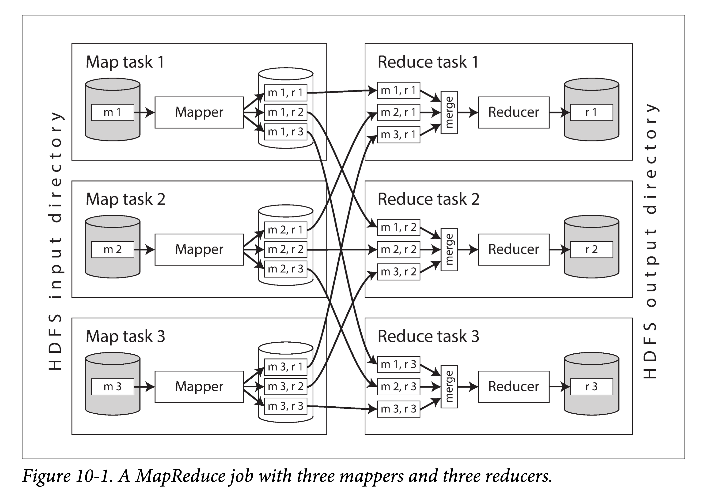
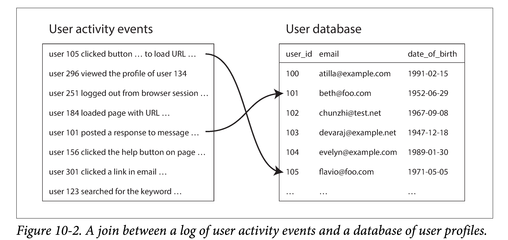
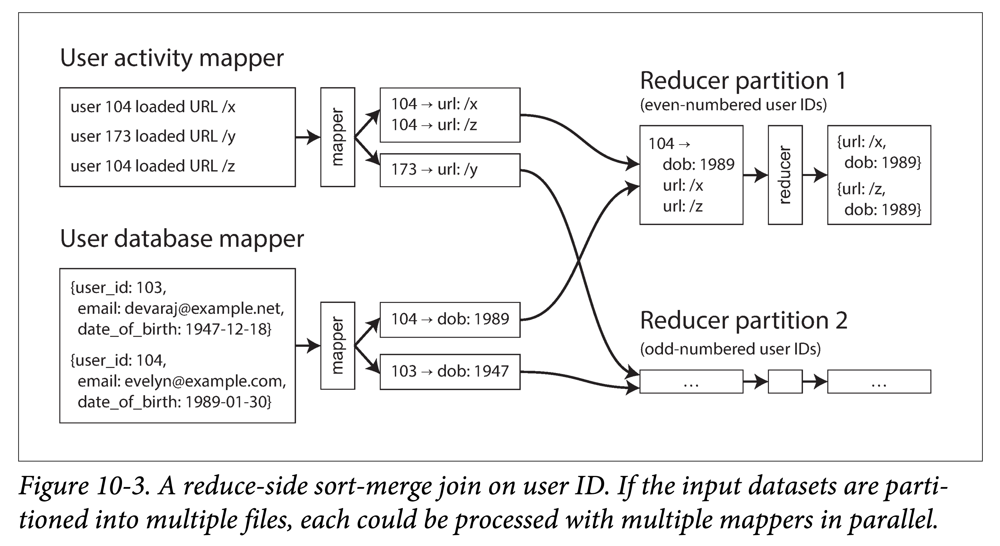

# DDIA 逐章精读（十）: 批处理（Batch Processing）

> 带有太强个人色彩的系统难以大获成功。一旦最初设计基本完成且足够鲁棒时，由于经验迥然、观点各异的人的加入，真正的考验才刚刚开始。
> 
> —— Donald Knuth

在本书的前两部分，我们讨论了**请求**（requests）和**查询**（queries），与之相对的是**响应**（responses）和**结果**（results）。这种**请求应答**风格的数据处理是很多现代系统的基本设定：你向系统询问一些事情，或者你发送一个指令，系统稍后（大概率上）会给你一个回复。数据库、缓存、搜索引擎、 web 服务器和其他很多系统，都以类似的方式工作。

在这些**在线**（online）系统中，不论是 web 浏览器请求一个页面，还是服务调用一个远程 API，我们通常假设这些请求是由真人用户触发，且会等待回复。他们不应该等太久，因此我们花很多精力在优化这些系统的**响应延迟**（response time）上（参见[衡量负载](https://ddia.qtmuniao.com/#/ch01?id=%e8%a1%a1%e9%87%8f%e8%b4%9f%e8%bd%bd)）。

web 服务和日趋增长的基于 HTTP/REST  的 API，让请求/应答风格的交互如此普遍，以至于我们理所当然的认为系统就应该长这样。但须知，这并非构建系统的唯一方式，其他方法也各有其应用场景。我们来对下面三种类型系统进行考察：

- **服务（在线系统，online systems）**
    
    服务（service）类型的系统会等待客户端发来的请求或指令。当收到一个请求时，服务会试图尽快的处理它，然后将返回应答。**响应时间**通常是衡量一个服务性能的最主要指标，且**可用性**通常很重要（如果客户端不能够触达服务，则用户可能会收到一条报错消息）。之前章节我们主要在讨论此类系统。
    
- **批处理系统（离线系统，offline systems）**
    
    一个批处理系统通常会接受大量数据作为输入，然后在这批数据上跑**任务**（job），进而产生一些数据作为输出。任务通常会运行一段时间（从数分钟到数天不等），因此一般来说没有用户会死等任务结束。相反，批处理任务通常会周期性的执行（例如，每天一次）。**吞吐量**（throughput，处理单位数据量所耗费的时间）通常是衡量批处理任务最主要指标。我们本章会主要围绕该类型系统进行讨论。
    
- **流式系统（近实时系统，near-real-time systems）**
    
    流式处理介于在线处理和离线处理（批处理）之间（因此也被称为**近实时**，near-real-time，或者**准在线处理**，nearline processing）。和批处理系统一样，流式处理系统接受输入，产生一些输出（而不是对请求做出响应，因此更像批处理而非服务）。然而，一个流式任务通常会在事件产生不久后就对其进行处理，与之相对，一个批处理任务通常会**攒够一定尺寸**的输入数据才会进行处理。这种区别让流式处理系统比同样功能的批处理系统具有更低的延迟。由于流式处理基于批处理，因此我们下一章再讨论它。
    

我们在本章将会看到，批处理是我们寻求构建**可靠的、可扩展的、可维护**的应用的重要组成部分。例如，MapReduce ，一个发表于 2004 年的批处理算法，（可能有些夸大）使得“谷歌具有超乎寻常可扩展能力”。该算法随后被多个开源数据系统所实现，包括 Hadoop，CounchDB 和 MongoDB。

相比多年前为数据仓库开发的并行处理系统，MapReduce 是一个相当底层的编程模型，但是它在基于廉价硬件上实现**大规模的数据**处理上迈出了一大步。尽管现在 MapReduce 的重要性在下降，但它仍然值得深入研究一番，因为通过这个框架，我们可以体会到批处理的为何有用、如何有用。

实际上，批处理是一种非常古老的计算形式。在可编程的数字计算机发明之前，**打孔卡制表机**——比如用于 1890 年美国人口普查的 Hollerith 制表机（IBM 前身生产的）——实现了一种对大量输入的半机械化批处理。MapReduce 与二十世纪四五十年代 IBM 生产的卡片分类机有着惊人的相似。就像我们常说的，历史总是在自我重复。

在本章，我们将会介绍 MapReduce 和其他几种批处理算法和框架，并探讨下他们如何用于现代数据系统中。作为引入，我们首先来看下使用标准 **Unix 工具**进行数据处理。尽管你可能对 Unix 工具链非常熟悉，但对 Unix 的哲学做下简单回顾仍然很有必要，因为我们可以将其经验运用到大规模、异构的分布式数据系统中。

# 使用Unix工具进行批处理

让我们从一个简单的例子开始。设你有一个 web 服务器，并且当有请求进来时，服务器就会向日志文件中追加一行日志：

```cpp
216.58.210.78 - - [27/Feb/2015:17:55:11 +0000] "GET /css/typography.css HTTP/1.1"
200 3377 "http://martin.kleppmann.com/" "Mozilla/5.0 (Macintosh; Intel Mac OS X
10_9_5) AppleWebKit/537.36 (KHTML, like Gecko) Chrome/40.0.2214.115
Safari/537.36"
```

注：上面文本其实是一行，只是为了阅读性，拆成了多行。

这行日志信息量很大。为了便于理解，你可能首先需要了解其格式：

```cpp
$remote_addr - $remote_user [$time_local] "$request"
$status $body_bytes_sent "$http_referer" "$http_user_agent"
```

因此，上面一行日志的意思是，在 2015 年的 2 月 27 号，UTC 时间 17:55:11 ，服务器从 IP 为 216.58.210.78 的客户端收到了一条请求，请求路径为 `/css/typography.css`。该用户没有经过认证，因此用户位置显示了一个连字符（-）。响应状态码是 200（即，该请求成功了），响应大小是 3377 字节。web 浏览器是 Chrome 49，由于该资源在 [http://martin.kleppmann.com/](http://martin.kleppmann.com/) 网站中被引用，因此浏览器加载了该 CSS 文件。

## 简单的日志分析

有很多现成的工具可以处理这些日志文件，以分析你网站的流量，并产生漂亮的报表。但为了学习，我们只使用基本的 Unix 命令自己造一个分析工具。假设你想获取**网站上访问频次最高的五个页面**，则可以在 Unix Shell 中输入：

```bash
cat /var/log/nginx/access.log | #(1)
      awk '{print $7}' |        #(2)
      sort             |        #(3)
      uniq -c          |        #(4)
      sort -r -n       |        #(5)
      head -n 5                 #(6)
```

每一行作用如下：

1. 读取给定日志文件
2. 将每一行按空格分成多个字段，然后取出第七个，即我们关心的 URL 字段。在上面的例子中，即：`/css/typography.css`
3. 按字符序对所有 url 进行排序。如果某个 url 出现了 n 次，则排序后他们会连着出现 n 次。
4. `uniq` 命令会将输入中相邻的重复行过滤掉。`-c` 选项告诉命令输出一个计数：对于每个 URL，输出其重复的次数。
5. 第二个 `sort` 命令会按每行起始数字进行排序（`-n`），即按请求次数多少进行排序。`-r` 的意思是按出现次数降序排序，不加该参数默认是升序的。
6. 最后，`head` 命令会只输出前 5 行，丢弃其他多余输入。

对日志文件执行这一系列命令，会得到类似如下结果：

```cpp
4189 /favicon.ico
3631 /2013/05/24/improving-security-of-ssh-private-keys.html
2124 /2012/12/05/schema-evolution-in-avro-protocol-buffers-thrift.html
1369 /
 915 /css/typography.css
```

如果你对 Unix 工具链不熟悉，读懂上面这一串命令可能会有点吃力，但只要理解之后就会发现它们非常强大。这个组合可以在数秒内处理上 G 的日志文件，并且，如果需求发生变动，也可以很方便的重新组合命令。比如，如果你想**在输出中跳过 CSS 文件**，可以将 awk 的参数改成 `'$7 !~ /\.css$/ {print $7}'` 。如果你想**统计最常访问的 IP 数**而非访问网页，则可以将 awk 的参数变为 `'{print $1}'`。如此种种。

本书中没有余力去详细讨论所有 Unix 工具使用细节，但他们都很值得一学。你可以在短短几分钟内，通过灵活组合 awk, sed, grep, sort, uniq, 和 xargs 等命令，应对很多数据分析需求，并且性能都相当不错。

### 链式命令 vs 专用程序

除了链式组合 Unix 命令，你也可以写一个简单的小程序来达到同样的目的。如，使用 Ruby，会有类似如下代码：

```ruby
counts = Hash.new(0)    # (1)

File.open('/var/log/nginx/access.log') do |file| 
  file.each do |line|
    url = line.split[6] # (2)
    counts[url] += 1    # (3)
  end
end

top5 = counts.map{|url, count| [count, url] }.sort.reverse[0...5] # (4)
top5.each{|count, url| puts "#{count} #{url}" }                   # (5)
```

标号对应代码功能如下：

1. `counts` 是一个哈希表，为每个出现过的 URL 保存一个计数器，计数器初始值为 0。
2. 对于每行日志，提取第六个字段作为 URL（ ruby 的数组下标从 0 开始）。
3. 对当前行包含的 URL 的计数器增加 1 。
4. 对哈希表中的 URL 按计数值降序排序，取前五个结果。
5. 打印这五个结果。

该程序虽不如使用 Unix 管道组合的命令行简洁，但可读性也很好，喜欢使用哪种方式是一个偏好问题。然而，两者上除了表面上的语法区别，在执行流程上差别也很大。在你分析海量数据时，这一点变的尤为明显。

### 排序 vs 内存聚合

Ruby 脚本在内存中保存了 URL 的**哈希表**，记录每个 URL 到其出现次数的映射。Unix 管道例子中并没有这样一个哈希表。作为替代，它将所有 URL 进行**排序**，从而让所有相同的 URL 聚集到一块，从而对 URL 出现次数进行统计。

那种方法更好一些呢？这取决于你有多少个不同的 URL。对于大部分**中小尺度的网站**，你大概率能够把所有 URL 都放到（比如 1 G） 内存中，并为每个 URL 配一个计数器。在该例子中，该任务的工作集（任务需要访问的内存的大小）仅取决于**不同 URL 的数量**：假设有上百万条日志，但都只针对同一个 URL ，则哈希表所需空间为该 URL 尺寸加上对应计数器尺寸（当然，哈希表本身也是占一些空间的）。如果工作集足够小，则基于内存的哈希表能够很好地工作——即使在笔记本电脑上。

但如果，任务的工作集大于可用内存，则排序方式更有优势，因为能够充分利用磁盘空间。其原理类似我们在[SSTables 和 LSM-Trees](https://ddia.qtmuniao.com/#/ch03?id=sstables-%e5%92%8c-lsm-trees)一节中提到的：可以在内存中分批次对部分进行排序，然后将有序的数据作为文件**写入磁盘中**，最后将多个有序文件合并为更大的有序文件。归并排序会对数据进行顺序访问，因此在磁盘上性能较好。（为顺序 IO 优化是[第三章](https://ddia.qtmuniao.com/#/ch03)中反复讨论过的主题，这里也出现了）

GNU 核心工具包中的 `sort` 命令，会自动的处理超过内存大小的数据集，将一些数据**外溢**（spill）到磁盘上；此外，该工具还可以充分利用多**核 CPU** 进行并发地排序。这意味着，我们之前例子中的对日志处理的 Unix 命令行能够轻松应对大数据集，而不会耗尽内存（OOM）。不过，性能瓶颈会转移到从磁盘读取输入文件的 IO 上。

## Unix 哲学

我们能够通过简单的组合 Unix 工具来进行复杂的日志文件处理并非巧合：这正是 Unix 的核心设计思想之一，且该思想在今天也仍然非常重要。让我来深入的探究一下其背后哲学，以看看有什么可以借鉴的。

Doug McIlroy，Unix 管道（pipe）的发明人，在 1964 年是这样描述管道的：“我们需要一种像软管一样可以将不同程序连接到一块的方法——当数据准备好以其他方式处理时，只需要接上就行。 IO 也应该以这种方式工作”。管道的类比到今天仍然存在，并且成了 Unix 哲学的一部分。Unix 哲学是一组在 Unix 用户和开发者中很流行的设计原则，在 1978 年被表述为：

1. **每一个程序专注干一件小事**。在想做一个新任务时，新造一个轮子，而非向已有的程序中增加新的“功能”。
2. **每个程序的输出成为其他程序（即便下一个程序还没有确定）的输入**。不要在输出中混入无关信息（比如在数据中混入日志信息），避免使用严格的列式数据（数据要面向行，以行为最小粒度？）或者二进制数据格式。不要使用**交互式输入**。
3. **尽快的设计和构建软件**，即便复杂如操作系统，也最好在几周内完成（译注：这里翻译稍微有些歧义，即到底是尽快迭代还是尽早让用户试用，当然他们最终思想差不多，即构造最小可用模型，试用-迭代）。对于丑陋部分，不要犹豫，立即推倒重构。
4. （Q：unskilled help是指？这一条没太理解）**相比不成熟的帮助，更倾向于使用工具完成编程任务**，即使可能会进行反复构建相似的工具，并且在用完之后大部分工具就再也不会用到。

这些手段——尽可能自动化、快速原型验证、小步增量迭代、易于实验测试，将大型工程拆解成一组易于管理的模块——听起来非常像今天的**敏捷开发**和 **DevOps 运动**。令人惊讶的是，很多软件工程的核心思想在四十年间并没有太多变化。

Unix 中的 sort 工具是一个程序只干好一个事情的非常典型的案例。相对大多数编程语言的标准库函数（即使在能明显提升性能时，也不能利用磁盘空间、不能利用多核性能），它给出了一个更好的实现。不过，单独使用 sort 威力还不是那么大。只有在与其他 Unix 工具（如 uniq）组合时，sort 才会变的相当强大。

使用 Unix Shell 如 bash 让我们能够轻易的将这些工具**组合**以应对数据处理任务。即使大部分的工具都是由不同人编写的，也可以很容易的组合到一块。我们不禁会问，Unix 做了什么让其有如此强的组合能力？

### 统一的接口

如果你希望一个程序的输出可以作为其他程序的输入，就意味着这些程序需要使用同样的**数据格式**——换句话说，可兼容的接口。如果你想让任意程序的输出能接到任意程序的输入上，则意味着**所有**这些程序必须使用同样的**输入输出**接口。

在 Unix 中，这种接口是**文件**（a file，更准确的说，是文件描述符，file descriptor）。文件本质上是一种**有序的字节序列**。这种接口是如此简约，以至于很多不同的实体都可以共用该接口：文件系统中真实的文件、与其他程序的通信渠道（Unix socket，标准输入 stdin，标准输出 stdout）、设备驱动（如 /dev/audio 或者 /dev/lp0）、以 socket 表示的 TCP 连接等等。站在今天的视角，这些设定看起来平平无奇、理所当然，但当时能让这么多不同的东西使用统一的接口是一种非常了不起的设计，唯其如此，这些不同的东西才能进行任意可插拔的组合。

> 另外一个非常成功的接口设计是：**URL 和 HTTP**，互联网的基石。一个 URL 能够唯一的定位网络中的一个资源，基于此，你可以在网页中任意链接其他网页。使用浏览器的用户因此能在不同的网页间进行**无缝的跳转**，即使这些网站运行在完全不同的服务器上，且由不同的组织进行运营。这些原则在今天看起来非常显而易见，但也正因为这个符合直觉的关键设计才让今天的互联网如此成功。在此之前的一些系统使用观感就没有这么统一了，比如在**公告板系统**（bulletin board systems，BBS）时代，每个系统都有其各自的**电话号码和波特率配置**（这两个名词没太懂，拨号上网？）对其他 BBS 的引用只能使用电话号码+猫（modem ，调制解调器）的配置；用户必须先挂起，拨入其他的 BBS，然后手动的查找信息。我们难以在一个 BBS 中直接引用另一个 BBS 上的内容。
> 

通常来说，大部分（并不是所有）的 Unix 程序将这些字节序列看做是 **ASCII 文本**。我们之前提到的日志分析例子中就是基于该事实：`awk`，`sort`，`uniq` 和 `head` 都将其输入文件视为由 `\n`（换行符，ASCII 码是 0x0A）分割的一系列记录。当初选择 `\n` 很随意——也许，ASCII 分隔符 0x1E 是一个更好的选项，毕竟，该字符就是为分割而生——但无论如何，只有程序使用相同的记录分隔符，才能方便的进行组合。

相对来说，对于每一个记录（如，一行）的解析是相对模糊、非统一的。Unix 工具通常使用**空格**或者 **tab** 作为分隔符将一行分解成多个字段，但有时也会用 CSV（逗号分割）、管道分割等其他编码。即使像 xargs 这样简单的工具，也提供了很多选项，以让用户指定如何对输入进行解析。

使用 ASCII 文本作为统一的接口虽然能应对非常多的场景，但远非完美：在我们的日志分析例子中，使用 `{print $7}` 来提取每一行中的 URL，可读性就很差。在理想情况下，我们最好能够使用类似 `{print $request_url}` 的方法，之后我们继续会讨论该想法。

尽管不完美，在数十年后的今天，Unix 统一的接口设计仍然**堪称伟大**。没有多少软件模块可以像 Unix 工具这样进行任意交互和组合：比如你很难快速构建一个分析软件，以轻松地将你邮件账户中的内容和网上购物的历史整合到电子表格中，并将结果发布到社交网络或者维基百科里。直到今天，让程序像 Unix 工具一样丝滑地协同工作，仍是一个**特例**，而非常态。

即使两个数据库的数据具有**相同的数据模型**（Schema），也很难快速的将数据在两个数据库间导来导去。多个系统间缺少有效整合使得数据变得[巴尔干化](https://zh.wikipedia.org/zh-hans/%E5%B7%B4%E5%B0%94%E5%B9%B2%E5%8C%96)（一种相对贬义的地缘政治学术语，指较大国家分裂成互相敌对的一系列小国的过程）。

### 逻辑和接线（数据流组织）分离

Unix 工具的另外一个显著特征是其对于标准输入（stdin）和标准输出（stdout）的使用。如果你运行程序时不做任何指定，键盘是默认的标准输入（stdin），屏幕是默认的标准输出（stdout）。当然，你也可以将文件作为程序的输入，或者将输出重定向到其他文件。**管道**（pipe）能让你将一个程序的**标准输出**（即编码实现该程序时，程序视角的 stdout）冲定向到另外一个程序的**标准输入**（仅需要一个比较小的缓冲区足矣，并不需要将所有的中间数据流写入磁盘）。

在需要时，程序当然可以直接读写文件。但若程序不关心具体的文件路径，而仅面向**标准输入**和**标准输出**进行编程，可以在 Unix 环境下和其他工具进行更好地协同。这种设定，让 shell 用户可以按任意方式对多个程序的输入输出进行组织（也即**接线**，wire up）；每个程序既不需要关心输入来自何处，也不需要知道输出去往何方（我们有时也将这种设计称为**松耦合**，**延迟绑定**或者**控制反转**）。将程序逻辑和数据流组织分离，能让我们轻松地组合小工具，形成复杂的大系统。

你也可以自己编写程序，并将其与操作系统中自带的具进行组合。只要你的工具是从标准输入读取数据，并将处理结果写入标准输出，**就能作为一环嵌入到 Unix 的数据处理流水线中**。比如，在日志分析程序中，你可以写一个将 user-agent 字符串翻译为更具体的浏览器标识符的工具，也可以写一个将 IP 地址翻译国家代码的工具，让后将其插入到流水线中即可。sort 并不关心其上下游的程序是操作系统自带的还是你写的。

不过，只是用 stdin 和 stdout 编程是有**很多限制**的。比如，如果程序使用多个输入或者产生多个输出怎么办？虽然有办法可以绕过，但是很取巧（tricky）。你不能将一个程序的输出通过管道直接输到网络中（倒也可以通过一些工具，比如 curl 或者 netcat）。如果程序直接打开文件进行读写、或者启动一个子进程、又或者打开一个网络连接，则相当于程序在标准输入输出之外自己进行了 IO 布线。倒确实可以通过配置来做到（比如命令行参数、默认配置文件等），但会大大降低由 shell 进行接线的灵活性。

### 透明性和实验性

Unix 工具生态如此成功的另外一个原因是，可以很方便让用户查看系统运行的状态：

- Unix 命令的输入文件通常被当做是**不可变的**。这意味着，你可以使用不同命令行参数，针对同样的输入跑很多次，而不用担心会损坏输入文件。
- 你可以在多个命令组成的处理流水线的任意环节停下来，将该环节的输出打到 `less` 工具中，以查看**输出格式**是否满足预期。这种可以对运行环节**随意切片**查看运行状态的能力对调试非常友好。
- 你可以将一个流水线环节的输出**写入到文件**中，并将该文件作为流水线下一个环节的输入。这样即使你中断了流水线的执行，之后想重启时就不用重新跑流水线所有环节。

因此，虽然相比关系型数据库中的查询优化，Unix 工具非常粗陋、简单，但却非常好用，尤其是在做简单的实验场景下。

然而，Unix 工具最大的局限在于**只能运行在单机上**——这也是大数据时代人们引入 Hadoop 的进行数据处理的原因——单机尺度已经无法处理如此巨量的数据。

# MapReduce和分布式文件系统

MapReduce 在某种程度上有点像 Unix 工具，但不同之处在于可以分散到上千台机器上并行执行。和 Unix 工具一样，MapReduce 虽然看起来简单粗暴，但组合起来却非常强大。一个 MapReduce 任务就像一个 Unix 进程：**接受一到多个输入，产生一到多个输出**。

和 Unix 工具一样，执行一个 MapReduce 任务**不会修改输入文件**，并且除了产生输出**没有其他的副作用**。输出文件都是**单次写入、顺序追加**而成（即 ，一旦文件写完，就不会再有任何改动）。

相比 Unix 工具使用 stdin 和 stdout 作为输入和输出，MapReduce 任务的输入和输出都是**分布式文件系统上的文件**。在 Hadoop 的 MapReduce 实现中，该文件系统被称为 HDFS（Hadoop Distributed File System），是谷歌文件系统（GFS，Google File System）的一个开源实现。

除了 HDFS 外，市面上还有很多其他的分布式文件系统，如 GlusterFS 和 QFS（Quantcast File System）。对象存储，如 Amazon S3，Azure Blob Storage 和 OpenStack Swift 也有诸多相似之处。本章我们主要以 HDFS 为例，但这些原则也适用于其他分布式文件系统。

> HDFS 和**对象存储**不同点之一是，HDFS 能够将计算**就近的**调度到存储所在的机器上（调度亲和性，本质原因在于计算和存储在同一个集群，有好处也有劣势），但对象存储会将存储和计算分离。如果网络带宽是瓶颈，从本地进行文件读取要在性能上更优。需要注意的是，如果使用 EC 编码，这些局部性就会丧失，因为所有的读取都打散到多台机器上，然后还原出原始数据。
> 

HDFS 基本设计理念是：**shared-nothing** （机器间不共享任何特殊硬件，纯通过网络来通信）架构。与**shared-disk** 架构（比如，Network Attached Storage，NAS 和 Storage Area Network，SAN）相对。Shared-disk 存储共享一个中心化的存储组件，常常会使用定制化的硬件和特殊的网络设施，如**网状通道**（Fibre Channel，一种高速网络互联技术）。而 Share-nothing 架构则不要求任何专用硬件，只要是一组使用常规数据中心网络串联起来的主机即可。

HDFS 由一组运行在每个主机上的**守护进程**（Daemon Process）组成，对外暴露网络接口，以使其他的节点可以访问存储于本机的数据文件（假设数据中心中的通用机器节点上都附有一定数量的磁盘）。一个叫做 **NameNode** 的**中心节点**会保存文件块和其所在机器的映射（也即文件块的 placement 信息）。因此，HDFS 可以利用所有运行有守护进程的机器上（**DataNode**）存储空间，在逻辑上对外提供单一且巨大的文件系统抽象。

> 当然现代大型数据中心的机型有一个**专用化趋势**，比如面向存储的机型，每个机器会挂很多硬盘，但计算能力较弱；比如面向 AI 的机型，会集成很多 GPU 。
> 

为了容忍机器和磁盘的故障，所有的**文件块**（file blocks）都会在多机上进行冗余。冗余策略有两种主要流派：

1. **多副本**：在多机上存储同样数据的**多个副本**。
2. **冗余编码**：使用**纠删码**（*erasure coding，如里索码，Reed-Solomon codes* ）的方式以更小的存储放大的方法对一份数据进行冗余。

后者类似于在单机多盘上提供数据冗余的 **RAID**（磁盘冗余阵列）；不同之处在于，在 HDFS 这类分布式文件系统中，文件访问和数据冗余仅通过普通网络连接，而无需专用硬件的支持。

HDFS 能够很好地进行**扩容**：在本书写作时（2017 年），最大的 HDFS 集群运行在了数千台机器上，具有上 PB 的容量。这种尺度的数据存储服务的商业落地，得益于使用了**开源软件**，且**廉价硬件**的成本要远低于提供同等容量的专用硬件解决方案。

## MapReduce 任务执行

MapReduce 是一个**编程框架**，你可以基于 MapReduce 编写代码以处理存储在分布式文件系统（如 HDFS）上的超大数据集。要想理解 MapReduce 的运行机制，最直观的还是举个例子。仍以上一小节提到的服务器日志分析为例。使用 MapReduce 进行数据处理的方式和使用 Unix 工具处理的方式很像：

1. **读取一组输入文件，将其切分为记录（records）**。在网站服务器日志的例子中，每个记录就是日志中的一行（即，使用 \n 作为记录分隔符）
2. **调用 Mapper 函数从每个记录中抽取 key  和 value**。在之前的例子中，mapper 函数是  `awk '{print $7}'` ：抽取 URL（$7）作为 key，value 留空。
3. **将所有的 key-value 对按 key 进行排序**。在前面例子中，该环节由 sort 承担。
4. **调用 Reducer 函数对排好序的 kv 列表迭代处理**。如果某个 key 出现了多次，排序环节会让其在在列表中集中到一块，因此可以在不在内存中保存过多状态的的情况下，对具有相同 key 的数据进行汇总处理。在前面例子中，reducer 对应命令 `uniq -c` ，功能是对所有具有相同 key 的记录值进行计数。

这四个步骤（split-map-sort-reduce）可以通过一个 MapReduce 任务来实现。你可以在步骤 2 （map）和步骤 4（reduce）编写代码来自定义数据处理逻辑。步骤 1 （将文件拆分成记录）由**输入格式解析器**（input format parser）来完成。步骤 3，排序阶段，由 MapReduce 框架**隐式完成**，所有 Mapper 的输出在给到 Reducer 前，框架都会对其进行排序。

为了创建 MapReduce 任务，你需要实现两个回调函数：mapper 和 reducer，其行为如下：

- **Mapper**
    
    对于每个输入**记录**都会调用一次 Mapper 函数，其任务是从记录中抽取 key 和 value。对于每一个输入记录，都有可能产生任意数量（包括 0 个）的 kv 对。框架不会保存任何**跨记录的状态**，因此每个记录都可以独立的被处理（即 Mapper 可以进行任意并发的运行）。
    
- **Reducer**
    
    MapReduce 框架会拿到 Mapper 输出的 kv 对，通过排序将具有相同 key 的 value 聚集到一块，以迭代器的形式给到 Reducer 函数。reducer 会继续输出一组新的记录（如 URL 的出现频次）。
    

在网站服务器日志的例子中，我们在第五步还有一个 `sort` 命令，对所有 URL **按请求频次**进行排序。在  MapReduce 中，如果你需要一个**额外的**（除了 reduce 前的那个排序）排序阶段，可以再实现一个 MapReduce 任务，将其与第一个接起来，即使用第一个 MapReduce 任务的输出作为输入。在这种情形下，第二个 MapReduce 任务的 Mapper 会将数据整理成适合排序的形式（将用于排序的字段抽取出来放到 key 中），然后 Reducer 对排好序的数据进行处理。

### MapReduce 的分布式执行

与 Unix 工具流水线的相比，MapReduce 的最大区别在于可以在**多台机器上**进行分布式的执行，但并不需要用户显式地写处理并行的代码。mapper 和 Reducer 函数每次只处理一个记录；他们不必关心输入从哪里来，输出要到哪里去，框架会处理分布式系统所带来的的复杂度（如在机器间移动数据的）。

虽然可以使用 Unix 工具作为分布式计算中的 Mapper 和 reducer，但更为常见的是使用**通用编程语言**的函数来实现这两个回调。在 Hadoop MapReduce 中，mapper 和 Reducer 是需要实现特殊接口的类（本质上只需要一个函数，因为不需要保存状态。但在 Java 老版本中，函数不是一等公民，所以需要一个类来包裹）；在 MongoDB 和 CouchDB 中，mapper 和 Reducer 是 JavaScript 函数。

图 10-1 中展示了 Hadoop MapReduce 任务中的数据流。其并行是基于分片的的：任务的输入通常是 HDFS 中的一个文件夹，输入文件夹中的每个文件或者文件块是一个可被 Map 子任务（task）处理的分片。



每个输入文件通常有数百 M，每个输入通常有多个副本，分散在多个机器上。MapReduce 的调度器（图中没有显示）在调度时，会在这多个副本所在机器上选择一个具有足够内存和 CPU 资源运行该 Mapper 任务的机器，将 map 任务调度过去。这个策略也被称为：**将计算调度到数据上**。从而省去在网络中拷贝数据的环节，提高了局部性，减少了网络带宽消耗。

多数情况下，**应用层的代码**通常不会存在于 map 任务调度到的机器上。因此，MapReduce 框架首先会将用户代码（如对于 Java 来说就是 Jar 包）**序列化后**复制过去。然后在对应机器上，动态加载这些代码，继而执行 map 任务。读取输入文件，逐个解析数据记录（record），传给 Mapper 回调函数执行。每个 Mapper 会产生一组 key-value 对。

reduce 侧的计算也是分片的。对于 MapReduce 任务来说，**map 任务的数量**，取决于该任务的输入文件数（或者文件 block 数）的数量；**但 reduce 任务的多少**，可以由用户显式的配置（可以不同于 map 任务的数量）。为了保证所有具有相同 key 的 kv 对被同一个 Reducer 函数处理，框架会使用哈希函数，将所有 Mapper 的输出的 kv 对进行分桶（桶的数量就是 Reducer 的数量），进而路由到对应的 Reducer 函数。

根据 MapReduce 的设定，reducer 接受的 kv 对需要是有序的，但任何传统的排序算法都无法在单机上对如此大尺度的数据进行排序。为了解决这个问题，mapper 和 Reducer 间的**排序被分成多个阶段**。

首先，每个 map 任务在输出时，会先将所有输出哈希后分片（一个分片对应一个 reducer），然后在每个分片内对输出进行排序。由于每个分片的数据量仍然可能很大，因此使用外排算法，类似于 [SSTable 和 LSM-Trees](https://ddia.qtmuniao.com/#/ch03?id=sstables-%e5%92%8c-lsm-trees) 一节中讨论的 append+compact 算法。

当某个 Mapper 任务读取结束，并将输出排好了序，MapReduce 调度器就会通知所有 reducers 来该 Mapper 机器上拉取各自对应的输出。最终，每个 Reducer 会去所有 Mapper 上**拉取**一遍其对应分片数据数据。这里有个推还是拉的设计权衡，拉的好处在于 reducuer 失败后，可以很方便地进行重试，再次拉取计算即可。

这个**分片**（partitioning by reducer）-**排序**（sorting）-**复制**（coping）过程也被称为**数据重排**（**shuffle**，虽然英文是洗牌的意思，但该过程并没有任何随机性，都是确定的）。

框架会在 Reducer 处将所有从 Mapper 处拿来的 kv 文件进行归并排序，然后在所有数据拉取完毕后，将排好序数据送给 reducer。这样一来，不同 Mapper 产生的具有相同 key 的记录就会被聚集到一块。

总结来说，map 和 reduce 间的排序分为**两个阶段**：

1. 在每个 Mapper 上对**输出**分片后各自排序。
2. 在每个 Reducer 上对**输入**（有序文件）进行归并排序。

Reducer 在调用时会传入一个 key 一个 Iterator（迭代器），使用该迭代器能够访问所有具有相同 key 的记录（极端情况下，内存可能放不下这些记录，因此是给一个迭代器，而非内存数组）。reducer 函数可以使用任意的逻辑对这些记录进行处理，并可以产生任意数量的输出。这些输出最终会被写到分布式文件系统中的文件里（通常该输出文件会在 Reducer 机器上放一个副本，在另外一些机器上放其他副本）。

### MapReduce 工作流

使用**单个 MapReduce 任务**能够解决的问题十分有限。回到本章一开始提到的日志分析的例子中，仅使用一个 MapReduce 任务可以算出每个 URL 被访问的次数，但无法从其中挑出最受欢迎的几个，因为后者还需要一轮额外的排序。

因此，将多个 MapReduce 首尾相接（前面任务的输出作为后面任务的输入）地串成**工作流**（workflow）极为常见。Hadoop MapReduce 框架本身没有提供任何关于工作流的支持，因此通常依赖文件夹名进行**隐式的链式调用**：

1. 第一个 MapReduce 任务将其输出写入特定的文件夹。
2. 第二个 MapReduce 任务读取这些文件夹中文件作为输入。

但从 MapReduce 框架的角度来看，这是两个独立的任务。

因此，链式调用的 MapReduce 任务不太像多个 Unix 命令组成的**流水线**（仅使用一小段缓冲区，就可以将数据流从一个命令的输出引向另一个命令的输入），而更像一组以文件为媒介进行链式调用的命令，即前一个命令将输出写入**中间文件**，后一个命令读取该文件作为输入。这种方式有利有弊，我们将会在“**对中间结果进行物化**”一节进行讨论。

仅当一个任务完全成功的执行后，其输出才被认为是有效的（也即，MapReduce 任务会丢掉失败任务的不完整输出）。因此，工作流中的任务只有在前一个任务成功结束后才能启动——即，前驱任务必须**成功地**将输出写入到对应文件夹中。为了处理多个任务间执行的依赖关系（比如 DAG 依赖），人们开发了很多针对 Hadoop的工作流调度框架，如 Oozie，Azkaban，Luigi，Airflow 和 Pinball。

在需要调度的任务非常多时，这些工作流管理框架非常有用。在构建推荐系统时，一个包含 50 到 100 个 MapReduce 的工作流非常常见。此外，在大型组织中，不同团队的任务相互依赖非常常见。在这些复杂的工作流场景中，借助工具十分必要。

很多基于 Hadoop 的高维工具：如 Pig，Hive，Cascading，Crunch 和 FlumeJava，也会对一组 MapReduce 任务，按照合适的数据流走向，进行自动地组合。

## Reduce 侧的 Join 和 Group

我们在第二章的数据模型和查询语言的上下文中讨论过**连接**（Join），但并没有讨论 Join 是如何实现的，现在我们重新捡起这个话头。

在很多数据集中，一个记录和其他记录有**关联**（association）是一个很常见的现象：关系模型中的**外键**（foreign key），文档模型中的**文档引用**（document reference），图模型中的**边**（edge）。在代码需要访问有关联的双方记录（引用记录和被引用记录）时，Join 是必须的。正如第二章所讨论的，denormalization 能够减少 Join 的需要，但并不能完全移除。

在数据库中，如果你只在少量的数据记录上进行查询，则数据库通常会使用索引来快速定位相关的数据记录。如果查询涉及 join，则需要对多个索引进行查找。然而，在 MapReduce 中并没有索引的概念——至少原始版本的 MapReduce 没有。

当一个 MapReduce 任务拿到一组输入文件时，会读取文件中的所有内容；在数据库中，这种操作称为**全表扫描**（full table scan）。如果你进项访问一小部分记录，相比索引查找，全表扫描操作会非常的重。然而，在分析型查询中（参见[事务型还是分析型](https://ddia.qtmuniao.com/#/ch03?id=%e4%ba%8b%e5%8a%a1%e5%9e%8b%e8%bf%98%e6%98%af%e5%88%86%e6%9e%90%e5%9e%8b)），针对一个非常大的数据集进行聚集性运算非常常见。在这种场景下，全盘扫描所有的输入还算是说的过去，尤其是你能在多机并行地进行处理。

> 本书中讨论的 join 多是最常见的 join 类型——**等值 join**（equi-joins），即有关联的两个记录在某个列（如 ID）上具有相同的值。有些数据库支持更一般化的 Join，如外连接，左外连接，右外连接，这里不展开讨论了。
> 

当在批处理的上下文中讨论 Join 时，我们是想找到所有相关联的记录，而不仅仅是某一些记录。比如，我们会假定一个任务会同时针对所有用户进行处理，而不是仅仅查找某个**特定用户**的数据（特定用户的话，使用索引肯定更为高效）。

### 例子：用户行为数据分析

在批处理任务中，一个典型的任务如图 10-2 所示。左侧是在网站中记录的登录用户的**行为事件**（称为 activity events 或者 clickstream data），右侧是数据库中的用户信息。你可以认为这是运用**星型建模**（参见[AP 建模：星状型和雪花型](https://ddia.qtmuniao.com/#/ch03?id=ap-%e5%bb%ba%e6%a8%a1%ef%bc%9a%e6%98%9f%e7%8a%b6%e5%9e%8b%e5%92%8c%e9%9b%aa%e8%8a%b1%e5%9e%8b)）的一个例子：事件日志是事实表，数据库中的用户表是其中的一个维度。



一个分析任务通常会协同处理**用户行为**和**用户资料**：如，如果用户资料中包含用户的年龄或生日信息，则可以分析出哪个网页在那个年龄段最受欢迎。但是，用户行为事件中一般只会包含用户的 ID，而非所有用户资料信息。将每个用户的资料信息都嵌入到每个用户事件中进行输出，会使冗余度变得非常高。因此，需要将行为事件和用户资料进行 Join 。

最简单的方法，是对行为事件中的每一个事件所包含的用户 ID，都去用户数据库中（存在远程服务器上）进行一次查询。这种方法虽然可行，但性能极差：：

1. 不做任何优化，则数据处理带宽会受制于与用户数据库通信开销
2. 如果使用缓存，本地缓存的有效性受制于行为事件数据中用户 ID 的分布
3. 如果使用并发，则大量的并发查询很可能把数据库打垮

在批处理中为了获取足够好的性能，需要把计算尽可能的**限制在机器本地**。如果对于某个待处理记录，都要进行随机的网络访问，性能将会非常差。此外，不断的查询远程数据库也会导致数据库处理的不确定性，毕竟在你的多次查询间，数据库的数据可能会发生变化。

因此，一个更好的方式是将所需数据库数据的一个副本拿到（如，从数据库的备份中通过 **ETL** ，Extract-Transform-Loading 的方式导入）用户行为数据所在的分布式文件系统。于是，用户资料在 HDFS 中的一些文件中，用户行文在 HDFS 的另外一些文件中，此时就可以使用 MapReduce 任务来关联两者，进行分析。

### 基于排序-合并的 Join

让我们回顾下 Mapper 的职责：从所有输入记录中提取 key 和 value。对于 10-2 中的例子来说，key 就是用户 ID：我们使用一些 mappers 从用户行为事件中提取用户 ID 和网页，使用另一些 mappers （**两组 mappers 从属于同一个 MapReduce 任务**）从用户资料信息中提取其他信息（如用户 ID 作为 key，用户生日作为 value）。如下图：



当 MapReduce 框架将所有 Mapper 的输出按照 key（也就是用户 ID）进行排序后，所有具有同样的用户 ID 的记录就会聚集到一块，作为输入给到 reducer。MapReduce 任务甚至可以将输出进行特殊组织，以使 Reducer 先看到同一个用户的资料信息，再看到其行为信息——这种技术也被称为**二级排序**（secondary sort，使用多个字段进行排序）。

在此基础上，reducer 可以进行轻松的进行 join：reducer 函数会在每一个用户 ID 上进行调用，由于使用了二级排序，reducer 会先看到该用户的资料信息。在实现 Reducer 时，可以首先将用户**资料信息**（比如生日）保存在局部变量里，然后对其所有**行为信息**进行迭代，提取相关信息，输出 <viewed-url, viewed age in years> kv 对。之后可以再接一个 MapReduce 任务，对每个 url 访问用户的年龄分布进行统计，并按年龄段进行聚集。

由于 Reducer 会在单个函数里处理所有同一个 user ID 的记录，因此一次只需要在内存中保存一个用户的资料信息，并且不用进行任何网络请求。这种算法也被称为**基于排序和归并的连接**（sort-merge join），由于 Mapper 的输出是按 key 有序的，则 reducers 可将来自多方的同一个 key 的输入轻松的进行合并。

### 将相关数据聚到一块

在排序-归并 join 中，mappers 和排序会确保同一个用户 id 所有用于 join 必要输入会被放到一起：**即作为一个输入给到某次 Reducer 中**。预先让所有相关数据聚集到一起，可以让 Reducer 逻辑非常简单，并且可以仅使用单个线程，就能进行高吞吐、低耗存地执行。

我们可以从另外一种角度来理解这种架构：mapper **发消息**给 reducer。当某个 Mapper 发出一个 key-value 对时，**key 是投递地址，value 就是要投递的内容**。尽管 key 在物理上仅是一个任意的字符串（而非像网络中的 IP 和端口号那样真的网络地址），但在逻辑上充当**地址**的作用：所有具有相同 key 的 kv 对都会被投递到同一个目的地（某个 Reducer 的调用处）。

MapReduce 编程模型，可以将计算的**物理拓扑**（将数据放到合适的机器上）与**应用逻辑**（当有了数据后就进行处理）**解耦**开来。这种解耦与数据库形成对比——在使用数据库的场景中，进行数据库连接（物理）通常藏在应用代码（逻辑）深处。由于 MapReduce 框架会处理所有网络通信细节，它也会让应用层代码免于关心**部分失败**（partial failure），如某些节点宕机：MapReduce 框架会透明的（应用代码无感）的对失败的子任务进行重试，而不会影响应用逻辑。

### Group By

除了 joins，另外一种“将相关数据聚到一块”（bring related data to the same place）模式经典用法是，将所有记录按某些 key 进行**分组**（对应 SQL 中的 `GROUP BY` 子句）。首先将具有相同 key 的所有记录被分到一组，然后对这些分组分别执行某些**聚集**操作（aggregation），例如：

- 统计每个分组中的记录数（如上例中的页面访问数，在 SQL 中对应 `COUNT(*)` ）
- 将某个字段进行累加（在 SQL 中对应 `SUM(fieldname)` ）
- 根据排序函数排序后取前 k 个记录

使用 MapReduce 实现 Group By 语义，最简单的方法是在 Mapper 中**抽取 key 为待分组的 key**。MapReduce 框架就会按照这些 key 将所有 Mapper 的输出记录进行分区和排序，然后按 key 聚集给到 reducer。本质上，使用 MapReduce 来实现 group 和 join ，逻辑是极为相似的。

分组的另外一个使用场景是：收集某个用户会话中的所有用户活动——也称为**会话化**（sessionization）。例如，可以用来对比用户对于新老版本网站的分别购买意愿（A/B 测试）或者统计某些市场推广活动是否起作用。

假设你的 web 服务架设在多台服务器上，则某个特定用户的活动日志大概率会分散在不同服务器上。这时，你可以实现一个会话化的 MapReduce 程序，使用会话 cookie、用户 ID或者其他类似的 ID 作为分组 key，以将相**同用户**的所有活动记录聚集到一块、并将**不同用户**分散到多个分区进行处理。

### 处理偏斜（**skew**）

如果某个 key 的数据量超级大，则“将相同 key 的数据聚集到一块” 的模型将不再适用。例如，在社交网络中，绝大多数的人都只会连接到较少的其他人，但数量较少的名人会有高达数百万的关注者。数据库中这种不成比例的记录常被称为**关键对象**（*linchpin objects* ）或者**热键**（*hot keys*）。

在单个 Reducer 中收集处理名人（celebrity）所有的活动事件（比如他们发布信息的回复），可能会造成严重的**数据倾斜**（**skew**，有时也被称为热点，hot spots）——即，一个 Reducer 处理的数据量远超其他（参见[负载偏斜和热点消除](https://ddia.qtmuniao.com/#/ch06?id=%e8%b4%9f%e8%bd%bd%e5%81%8f%e6%96%9c%e5%92%8c%e7%83%ad%e7%82%b9%e6%b6%88%e9%99%a4)）。由于只有其所属的所有 mappers 和 reducers 执行完时，该 MapReduce 任务才算完成，该 MapReduce 之后的任何任务都需要等待最慢的 Reducer （长尾任务）完成后才能启动。

如果某个 join 的输入存在热点数据，你可以借助一些算法来进行缓解。例如，Pig 中的偏斜 join（skewed join）方法会事先对所有 key 的分布进行**采样**，以探测是否有热点 key。然后，在执行真正的 Join 时，对于 Join 有热点 key 的这一测，mapper 会将含有热点 key 的记录发送到多个 reducer（每次随机挑选一个，相比之下，常规的 MapReduce 只会根据 key 的哈希确定性的选择一个 reducer）；对于 Join 的另一侧输入，所有包含热点 key 的相关记录需要每个给每个具有该 key 的 Reducer 都发一份。

该技术将处理热点 key 的工作分摊到多个 Reducer 上，从而可以让其更好的并行，当然代价就是需要将 join 的非热点侧的数据冗余多份。Crunch 中的**分片连接**（shared join）也使用类似的技术，但需要**显式地指定**热点 key，而非通过采样来**自动获取**。这种技术很像我们在[负载偏斜和热点消除](https://ddia.qtmuniao.com/#/ch06?id=%e8%b4%9f%e8%bd%bd%e5%81%8f%e6%96%9c%e5%92%8c%e7%83%ad%e7%82%b9%e6%b6%88%e9%99%a4)中讨论过的相关技术，在多分片数据中，使用随机分片的方法来消除热点。

Hive 的**偏斜连接**（skewed join）采用了另外一种方法来进行优化。Hive 要求在表的元信息中显示的指出热点 key，在收到这些 key 时会将其存到单独文件中。在对这种表进行 join 时，会使用 map 侧的 join（见下一小节）来处理热点 key。

当对热点 key 进行分组聚集（group）时，可以将分组过程拆成**两个阶段**，即使用两个相接的 MapReduce。第一个 MapReduce 会将记录随机得发给不同的 reducer，则每个 Reducer 会对热点 key 的一个子集执行分组操作，并且产生一个更为紧凑的**聚合值**（aggregated value，如 count，sum，max 等等）。第二个 MapReduce 操作会将第一阶段中 MapReduce 产生的同一个 key 的多个聚合值进行真正的归并。总结来说，就是第一阶段进行**预分组，减小数据量**；第二阶段真正的全局分组，可以想象这种方式，要求聚合操作满足**交换律和结合律**。

## Map 侧的连接

上一节讲到的 join 算法是在 reduce 阶段真正执行的 join 逻辑，因此也被称为 **reduce 侧连接**（*reduce-side join*）。其中，mapper 仅扮演准备数据的角色：从每个输入记录中提取 key 和 value，并且将每个 kv 对发给合适的 Reducer 分区，并将其进行排序。

reduce 侧的连接的好处在于，你不需要对输入数据有任何的假设：不管输入数据具有怎样的属性和结构，mappers 都可以进行合适的预处理后送给 reducers 进行连接。然而，缺点在于排序、复制到 reducers、将 Reducer 的输入进行合并等过程代价十分高昂。根据可用内存缓存大小不同，数据在流经 MapReduce 中各阶段时可能会被写入多次（写放大）。

但如果，输入数据满足某种假设，就可以利用所谓的 **map 侧连接**（map-side join）进行更快的连接。这种方式利用了一种简化过的 MapReduce 任务，去掉了 reducer，从而也去掉了对 Mapper 输出的排序阶段。此时，每个 Mapper 只需要从分布式文件系统中的输入文件块中读取记录、处理、并将输出写回到文件系统，即可。

### 广播哈希连接

使用 map 侧连接的一个最常见的场景是一个大数据集和一个小数据集进行连接时。此种情况下，小数据集需要小到能全部装进 Mapper 进程所在机器的内存。

如，设想在图 10-2 对应的场景中，用户资料数据足够小，能够装入内存。在这种情况下，当 Mapper 启动时，可以先将用户资料分布式文件系统中读取到内存的哈希表中。一旦加载完毕，mapper 可以扫描所有的用户活动事件，对于每一个事件，在内存哈希表中查找该事件对应用户资料信息，然后连接后，输出一条数据即可。

但仍然会有多个 Mapper 任务：join 的**大数据量输入侧**（在 10-2 中，用户活动事件表是大输入侧）每个文件块一个 mapper。其中 MapReduce 任务中的每个 Mapper 都会将小输入侧的数据全部加载进内存。

这种简单高效的算法称为**广播哈希连接**（broadcast hash joins）：

1. **广播（broadcast）**：处理大数据侧每个分片的 Mapper 都会将小数据侧数据全部载入内存。从另外一个角度理解，就是将小数据集**广播到了**所有相关 Mapper 机器上。
2. **哈希（hash）**：即在将小数据集在内存中组织为哈希表。

Pig（replicated join）、Hive（MapJoin）、Cascading 和 Crunch 都支持这种连接方法。

### 分区哈希连接

如果待 join 的多个输入，能够以同样的方式进行分区，则每个分区在处理时可以独立地进行 join。仍以图 10-2 为例，你可以重新组织活动事件和用户信息，都将其按用户 ID 的最后一位进行分片（则每侧输入都会有十个分片）。例如，mapper-3 首先将具有以 3 结尾的 ID 的用户资料数据加载到内存哈希表中，然后扫描所有以 3 结尾的 ID 活动事件记录，进行连接。

如果分区方式正确，则所有需要连接的双方都会落到同一个分区内，因此每个 Mapper 只需要读取一个分区就可以获取待连接双方的所有记录。这样做的好处是，每个 Mapper 所需构建哈希表的数据集要小很多（毕竟被 partition 过了）。

只有当 join 的连接输入：

1. 具有同样的分区数目
2. 使用同样的 key 进行分区
3. 以同样的哈希函数进行分区

如果之前的 MapReduce 已经做了上述分组，则按分区进行连接就顺其自然。

在 Hive 中，分区哈希连接也被称为**分桶 map 侧连接**（ bucketed map join）。

### Map 侧合并连接

map 侧连接的另一个变种是，当 map 的输入数据集不仅以相同的方式分片过了，而且每个分片是**按该 key 有序的**。在这种情况下，是否有足够小的、能够载入内存的输入已经无关紧要，因为 Mapper 可以以类似普通 Reducer 的方式对输入数据进行**归并**：都以 key 递增（都递减也可以，取决于输入文件中 key 的顺序）的顺序，增量式（迭代式）的读取两个输入文件，对相同的 key 进行匹配连接（比如对每个输入使用一个指针，进行滑动匹配即可）。

如果我们可以在 map 侧进行归并连接，说明前一个 MapReduce 的输入已经将文件分好了组、排好了序。原则上，在这种情况下，join 完全可以在前一个 MapReduce 的 reduce 阶段来做。然而，使用额外的一个 MapOnly 任务来做连接也是有适用场景的，比如分区且有序的文件集还可以被其他任务复用时。

### 使用 map 侧连接的 MapReduce 工作流

当 MapReduce 连接的输出为下游任务所用时，会因为 map 侧还是 reduce 侧的不同而影响输出结构。使用 reduce 侧的连接时，输出会按照 join key 进行分区和排序；使用 map 侧的连接时，输出会和较大数据量输入侧顺序一致（不论是使用 partitioned join 还是 broadcast join，对于大数据量侧，都是一个文件块对应一个 map 子任务）。

如前所述，使用 map 侧的 join 时，会对输入数据集的尺寸、有序性和分区性有更多的要求。事先知道输入数据集在分布式文件系统上的**分布**对优化 join 策略至关重要：只是知道文件的编码格式和文件是否有序是不够的；你必须进一步知道输入文件的分区数量，以及文件中的数据是按**哪个字段**进行分区和排序的。

在 Hadoop 生态中，这些如何分区的元信息通常会在 HCatalog 和 Hive 元信息存储中维护。

## 批处理工作流的输出

我们已经讨论了串起 MapReduce 工作流的一些算法，但我们忽略了一个重要的问题：当工作流结束后，处理结果是什么？我们一开始是为什么要跑这些任务来着？

对于数据库查询场景，我们会区分事务型处理场景（OLTP）和分析性场景（OLAP，参见[事务型还是分析型](https://ddia.qtmuniao.com/#/ch03?id=%e4%ba%8b%e5%8a%a1%e5%9e%8b%e8%bf%98%e6%98%af%e5%88%86%e6%9e%90%e5%9e%8b)）。我们观察到，OLTP 场景下的查询通常只会涉及很小的一个数据子集，因此通常会使用索引加速查询，然后将结果**展示**给用户（例如，使用网页展示）。另一方面，分析型查询通常会扫描大量的数据记录，执行**分组**（grouping）和**聚集**（aggregating）等统计操作，然后以**报表**的形式呈现给用户：比如某个指标随时间的变化曲线、依据某种排序方式的前十个数据条目、将数据按子类分解并统计其分布。这些报表通常会用于辅助分析员或者经理进行商业决策。

那批处理处于一个什么位置呢？它既不是事务型，也不是分析型。当让，从输入数据量的角度来说，批处理更接近分析型任务。然而，一组 MapReduce 任务组成的执行流通常和用于分析型的 SQL 查询并不相同（参见 Hadoop 和分布式数据库的对比）。批处理的输出通常不是一个报表，而是**另外某种格式的数据**。

### 构建查询索引

谷歌发明 MapReduce 大数据处理框架的最初动机就是解决搜索引擎的索引问题，开始时通过 5~10 个 MapReduce 工作流来为搜索引擎来构建索引。尽管谷歌后面将 MapReduce 使用拓展到了其他场景，仔细考察构建搜索引擎索引的过程，有助于深入地了解 MapReduce（当然，即使到今天， Hadoop MapReduce 仍不失为一个给 Lucene/Solr 构建索引的好办法）。

我们在“[全文索引和模糊索引](https://ddia.qtmuniao.com/#/ch03?id=%e5%85%a8%e6%96%87%e7%b4%a2%e5%bc%95%e5%92%8c%e6%a8%a1%e7%b3%8a%e7%b4%a2%e5%bc%95%ef%bc%88full-text-search-and-fuzzy-indexes%ef%bc%89%e3%80%82)”一节粗策略的探讨过像 Lucene 这样的全文索引引擎是如何工作的：倒排索引是一个**词表**（the term dictionary），利用该词表，你可以针对关键词快速地查出对应**文档列表**（the postings list）。当然，这是一个很简化的理解，在实践中，索引还需要很多其他信息，包括相关度，拼写订正，同义词合并等等，但其背后的原理是不变的。

如果你想在一个**固定文档集合**上构建全文索引，批处理非常合适且高效：

1. Mapper 会将文档集合按合适的方式进行分区
2. Reducer 会对每个分区构建索引
3. 最终将索引文件写回分布式文件系统

构建这种**按文档分区**（document-partitioned，与 term-partitioned 相对，参见[分片和次级索引](https://ddia.qtmuniao.com/#/ch06?id=%e5%88%86%e7%89%87%e5%92%8c%e6%ac%a1%e7%ba%a7%e7%b4%a2%e5%bc%95)）的索引，可以很好地并发生成。由于使用关键词进行索引查询是一种只读操作，因此，这些索引文件一旦构建完成，就是不可变的（immutable）。

如果被索引的文档集发生变动，一种应对策略是，定期针对所有文档重跑全量索引构建工作流（workflow），并在索引构建完时使用新的索引对旧的进行整体替换。如果两次构建之间，仅有一小部分文档发生了变动，则这种方法代价实在有点高。但也有优点，索引构建过程很好理解：**文档进去，索引出来**。

当然，我们也可以**增量式**的构建索引。我们在第三章讨论过，如果你想增加、删除或者更新文档集，Lucene 就会构建新的索引片段，并且异步地将其与原有索引进行归并（merge）和压实（compact）。我们将会在第十一章就增量更新进行更深入的讨论。

### 以 KV 存储承接批处理输出

搜索索引只是批处理工作流一种可能的输出。批处理其他的用途还包括构建机器学习系统，如**分类器**（classifiers，如 垃圾邮件过滤，同义词检测，图片识别）和**推荐系统**（recommendation system，如你可能认识的人，可能感兴趣的产品或者相关的检索）。

这些批处理任务的输出通常在某种程度是*数据库*：如，一个可以通过用户 ID 来查询其可能认识的人列表的数据库，或者一个可以通过产品 ID 来查询相关产品的数据库。

web 应用会查询这些数据库来处理用户请求，这些应用通常不会跟 Hadooop 生态部署在一块。那么，如何让批处理的输出写回数据库，以应对 web 应用的查询？

**最直观**的做法是，在 Mapper 或者 Reducer 代码逻辑中，使用相关数据库的**客户端库**，将 Mapper 或者 Reducer 的输出直接写入数据库服务器，每次一个记录。这种方式能够工作（须假设防火墙允许我们直接从 Hadoop 中访问**生产环境**的数据库服务器），但往往并不是一个好的做法：

- **吞吐不匹配**。正如之前 join 一节中所讨论的，通过网络一条条写入记录的吞吐要远小于一个批处理任务的吞吐。即使数据库的客户端通常支持将多个 record 写入 batch 成一个请求，性能仍然会比较差。
- **数据库过载**。一个 MapReduce 任务通常会并行地跑很多个子任务。如果所有 Mapper 和 Reducer ，以批处理产生输出的速率，并发地将输出写到同一个数据库，则该数据库很容会被打爆（overwhelmed）。此时，其查询性能大概率非常差，也因此难以对外提供正常服务，从而给系统的其他组件带来运维问题。
- **可能产生副作用**。通常来说，MapReduce 对外提供简单的“全有或全无（all-or-nothing）”的输出保证：如果整个任务成功，即使子任务一时失败重试，但最终的输出也会看起来像运行了一次；如果整个任务失败，则没有任何输出。但直接从任务内部将输出写入外部服务，会产生外部可见的**副作用**。在这种情况下，你就必须考虑任务的**部分成功**状态可能会暴露给其他系统，并要理解 Hadoop 内部重试和推测执行的复杂机制。

一个更好的方案是，在批处理任务内部生成全新的数据库，并将其以文件的形式写入分布式系统的文件夹中。一旦任务成功执行，这些数据文件就会称为**不可变的**（immutable），并且可以**批量加载**（bulk loading）进只处理只读请求的服务中。很多 KV 存储都支持使用 MapReduce 任务构建数据库文件，比如 Voldemort，Terrapin， ElephantDB 和 HBase bulk loading。另外 RocksDB 支持 ingest SST 文件，也是类似的情况。

**直接构建数据库底层文件**，就是一个 MapReduce 应用的绝佳案例：使用 Mapper 抽取 key，然后利用该 key 进行排序，已经**覆盖了**构建索引中的大部分流程。由于大部 KV 存储都是只读的（通过批处理任务一次写入后，即不可变），这些存储的底层数据结构可以设计的非常简单。例如，不需要 WAL（参见[让 B 树更可靠](https://ddia.qtmuniao.com/#/ch03?id=%e8%ae%a9-b-%e6%a0%91%e6%9b%b4%e5%8f%af%e9%9d%a0)）。

当数据加载进 Voldemort 时，服务器可以利用老文件**继续对外提供服务**，新文件会从分布式文件系统中拷贝的 Voldemort 服务本地。一旦拷贝完成，服务器可以立即将外部查询请求**原子地**切到新文件上。如果导入过程中发生了任何问题，也可以**快速地切回**，使用老文件提供服务。因为老文件是不可变的，且没有立即被删除。

### 批处理输出的哲学

本章稍早我们讨论过 Unix 的设计哲学，它鼓励在做实验时**使用显式的数据流**：每个程序都会读取输入，然后将输出写到其他地方。在这个过程中，**输入保持不变**，先前的输出被变换为新的输出，并且没有**任何其他的副作用**。这意味着，你可以任意多次的重新跑一个命令，每次可以对命令或者参数进行下微调，或者查看中间结果进行调试，而不用担心对你原来系统的状态造成任何影响。

MapReduce 任务在处理输出时，遵从同样的哲学。通过**不改变输入、不允许副作用**（比如输出到外部文件），批处理不仅可以获得较好的性能，同时也变得容易维护：

- **容忍人为错误**。如果你在代码中不小心引入了 bug，使得输出出错，你可以简单地将代码回滚到最近一个正确的版本，然后重新运行任务，则输出就会变正确。或者，更简单地，你可将之前正确的输出保存在其他的文件夹，然后在遇到问题时简单的切回去即可。使用读写事务的数据库是没法具有这种性质的：如果你部署了有 bug 的代码，并且因此往数据库中写入了错误的数据，回滚代码版本也并不能**修复这些损坏的数据**。（从有 bug 的代码中恢复，称为容忍人为错误，human fault tolerance）。这其实是通过牺牲空间换来的，也是经典的增量更新而非原地更新。
- **便于敏捷开发**。相比可能会造成不可逆损坏的环境，由于能够很方便地进行回滚，可以大大加快功能迭代的速度（因为不需要进行严密的测试即可上生产）。**最小化不可逆性**（*minimizing irreversibility*）的原则，有助于敏捷软件开发。
- **简单重试就可以容错**。如果某个 map 或者 reduce 任务失败了，MapReduce 框架会自动在相同输入上对其重新调度。如果失败是由代码 bug 引起的，在重试多次后（可以设置某个阈值），会最终引起任务失败；但如果失败是暂时的，该错误就能够被容忍。这种自动重试的机制之所以安全，是因为输入是不可变的，且失败子任务的输出会被自动抛弃。
- **数据复用**。同一个文件集能够作为不同任务的输入，包括用于计算指标的监控任务、评估任务的输出是否满足预期性质（如，和之前一个任务的比较并计算差异）。
- **逻辑布线分离**。和 Unix 工具一样，MapReduce 也将逻辑和接线分离（通过配置输入、输出文件夹），从而分拆复杂度并且提高代码复用度：一些团队可以专注于实现干好单件事的任务开发；另一些团队可以决定在哪里、在何时来组合跑这些代码。

在上述方面，Unix 中用的很好地一些设计原则也适用 Hadoop——但 Unix 工具和 Hadoop 也有一些不同的地方。比如，大部分 Unix 工具假设输入输出是无类型的文本，因此不得不花一些时间进行输入解析（比如之前的例子中，需要按空格分割，然后取第 7 个字段，以提取 URL）。在 Hadoop 中，通过使用**更结构化的数据格式**，消除了底层的一些低价值的语法解析和转换：Avro （参见[Avro](https://ddia.qtmuniao.com/#/ch04?id=avro)）和 Parquet 是较常使用的两种编码方式，他们提供基于模式的**高效编码方式**，并且支持**模式版本的演进**。

---

## 对比 Hadoop 和分布式数据库

从之前讨论我们可以感觉到，Hadoop 很像一个**分布式形态的 Unix**。其中，HDFS 对标 Unix 中的文件系统，MapReduce 类似于 Unix 进程的一个奇怪实现（在 map 阶段和 reduce 阶段间必须要进行排序）。在这些源语之上，我们可以实现各种 join 和 group 语义。

MapReduce 被提出时，并非是一种全新的思想。在其十多年前，所有前述小节我们提到的一些并行 join 算法都已经被 **MPP （massive parallel processing）数据库**所实现了。如，Gamma data base machine、Teradata 和 Tandem NonStop SQL 都是这个领域的先驱。

当然，如果硬要区分的话：

1. MPP 数据库是在一组机器上分布式地、并行执行分析型的 SQL
2. MapReduce 和分布式文件系统提供了一种类似于操作系统的、更为通用的计算方式

### 存储类型更为多样

数据库要求用户遵循特定的**模式**（schema，数据模型，如关系型或者文档型）组织数据，但分布式系统中的文件是面向**字节序列**（byte arrary，即内容对于系统是黑盒），用户可以使用任何必要的方式进行建模和编码。因此，这些文件既可以是数据库记录的集合，也可以是文本、图像、视频、传感器数值、稀疏矩阵、特征向量、基因序列，或者其他任意类型的数据。

换句话说，Hadoop 允许你以**任意格式**的数据灌入 HDFS，将如何处理的灵活性推到之后（对应之前讨论过的 schema-less，或者 schema-on-read ）。与之相反，MPP 数据库通常要求用户在数据导入之前，就要针对数据类型和常用查询模式，进行小心的建模（对应 schema-on-write）。

从完美主义者的角度来说，事先对业务场景进行仔细地建模再导入数据才是正道。只有这样，数据库用户才能够得到更高质量的数据。然而在实践中，即便不管模式快速导入数据，可能会让数据处于奇怪、难用、原始的格式，反而会比事先规划、考究建模后将限制死格式更为有价值。

这种思想和数据库仓库很像：在大型组织中，将从不同部门来的数据**快速**聚集到一块非常重要，因为这提供了将原先分离的数据进行联结（join）的各种可能性。MPP 数据库所要求的小心精确地建模，会严重拖慢中心化数据的速度。以原始格式将数据聚集到一块，之后再去考虑如何进行建模，可以大大加速数据收集速度（这个概念有时也被称为**数据湖**，data lake，或者企业数据中心，enterprise data hub）。

无脑数据导入其实是将数据理解的复杂度进行了转移：**数据生产者无需关心数据会被如何使用**，这是数据消费者的问题（类似读时模式，参见[文档模型中 Schema 的灵活性](https://ddia.qtmuniao.com/#/ch02?id=%e6%96%87%e6%a1%a3%e6%a8%a1%e5%9e%8b%e4%b8%ad-schema-%e7%9a%84%e7%81%b5%e6%b4%bb%e6%80%a7)）。在数据生产者和消费者处于不同团队、具有不同优先级时，这种方式的优势非常明显。因为可能没有一种通用的理想模型，出于不同目的，会有不同的看待数据方式。将数据以原始方式导入，允许之后不同消费者进行不同的数据变换。这种方式被总结为 sushi 原则：数据越原始越好。

因此 Hadoop 经常用于 **ETL 处理**：将数据以某种原始的格式从事务型的处理系统中引入到分布式文件系统中，然后编写 MapReduce 任务以处理这些数据，将其转换回关系形式，进而导入到 MPP 数据仓库汇总以备进一步分析之用。**数据建模**依然存在，但是拆解到了其他的步骤，从而与数据收集**解耦**了开来。由于分布式文件系统不关心**应用方以何种方式对数据进行编码**，仅面向字节数组存储，让这种解耦成为了可能。

### 处理模型更为多样

MPP 数据库是一种将硬盘上的存储布局、查询计划生成、调度和执行等功能模块紧密糅合到一块的整体式软件。这些组件都可以针对数据库的特定需求进行调整和优化，针对目标查询类型，系统在整体上可以获得很好的性能。此外，SQL 作为一种声明式的查询语言， 表达能力很强、语义简洁优雅，让人可以通过图形界面而无需编写代码就可以完成对数据进行访问。

但从另外的角度来说，**并非所有类型的数据处理需求都可以合理地表达为 SQL 查询**。例如，如果你想要构建机器学习和推荐系统、支持相关性排序的全文索引引擎、进行图像分析，则可能需要更为通用的数据处理模型。这些类型的数据处理构建通常都和特定应用强耦合（例如，用于机器学习的特征工程、用于机器翻译的自然语言模型、用于欺诈预测的风险预估函数），因此不可避免地需要用通用语言写代码来实现，而不能仅仅写一些查询语句。

MapReduce 使工程师能够在大型数据集尺度上轻松的运行自己的代码（而不用关心底层分布式的细节）。如果你已经有 HDFS 集群和 MapReduce 计算框架，你可以基于此构建一个 SQL 查询执行引擎， Hive 项目就是这么干的。当然，对于一些不适合表达为 SQL 查询的处理需求，也可以基于 Hadoop 平台来构建一些其他形式的批处理逻辑。

但后来人们又发现，对于某些类型的数据处理， MapReduce 限制太多、性能不佳，因此基于 Hadoop开发了各种其他的处理模型（在之后 “MapReduce 之外”小节中会提到一些）。仅有 SQL 和 MapReduce 这两种处理模型是不够的，我们需要更多的处理模型！由于Hadoop平台的开放性，我们可以较为容易实现各种处理模型。然而，在 MPP 数据库的限制下，我们想支持更多处理模型基本是不可能的。

更为重要的是，基于 Hadoop 实现的各种处理模型可以**共享集群并行运行**，且不同的处理模型都可以访问 HDFS 上的相同文件。在 Hadoop 生态中，无需将数据在不同的特化系统间倒来倒去以进行不同类型的处理：**Hadoop 系统足够开放，能够以单一集群支持多种负载类型**。**无需移动数据**让我们更容易的从数据中挖掘价值，也更容易开发新的处理模型。

Hadoop 生态系统既包括随机访问型的 OLTP 数据库，如HBase（参见“[SSTables和LSM-Trees](https://ddia.qtmuniao.com/#/ch03?id=sstables-%e5%92%8c-lsm-trees)”），也包括 MPP 风格的分析型数据库，例如 Impala。HBase 和 Impala 都不依赖 MapReduce 进行计算，但两者都使用 HDFS 作为底层存储。它们访问数据和处理数据的方式都非常不同，但却可以神奇的并存于 Hadoop 生态中。

### **面向频繁出错设计**

在对比 MapReduce 和 MPP 数据库时，我们会发现设计思路上的两个显著差异：

1. **故障处理方式**：取决于对处理成本、故障频次的假设
2. **内存磁盘使用**：取决于对数据量的假设

相对在线系统，批处理系统对故障的敏感性要低一些。如果批处理任务失败，并不会立即影响用户，而且可以随时重试。

如果在执行查询请求时节点崩溃，大多数 MPP 数据库会中止整个查询，并让用户进行重试或自动重试。由于查询运行时通常会持续数秒或数分钟，这种简单粗暴的重试的处理错误的方式还可以接受，毕竟成本不算太高。MPP 数据库还倾向**将数据尽可能地存在内存里**（例如在进行 HashJoin 的 HashBuild 时），以避免读取磁盘的额外损耗。

与之相对，MapReduce 在遇到某个 map 或 reduce 子任务运行出错时，可以单独、自动地进行重试，而不会引起整个 MapReduce 任务的重试。此外，MapReduce 倾向于将数据（甚至是 map 到 reduce 中间环节的数据）进行落盘，一方面是为了容错，另一方面是因为 MapReduce 在设计时假设面对的数据量足够大，内存通常装不下。

因此，MapReduce 通常更适合**大任务**：即那些需要处理大量数据、运行较长时间的任务。而巨量的数据、过长的耗时，都会使得处理过程中遇到故障司空见惯。在这种情况下，由于一个**子任务（task）** 的故障而重试整个**任务（job）** 就非常得不偿失。当然，即使只在子任务粒度进行重试，也会让那些并不出错的任务运行的更慢（数据要持久化）。但对于频繁出错的任务场景来说，这个取舍是合理的。

但这种假设在多大程度上是正确的呢？在大多数集群中，机器确实会故障，但非常低频——甚至可以低到大多任务在运行时不会遇到任何机器故障。在这种情况下，为了容错引入的巨量额外损耗值得吗？

为了理解 MapReduce 克制使用内存、细粒度重试的设计原因，我们需要回顾下 MapReduce 的诞生历程。当时谷歌内部的数据中心很多都是共享使用的——集群中的同一个机器上，既有在线的生产服务，也有离线的批处理任务。每个任务使用容器（**虚拟化**）的方式进行（CPU、RAM、Disk Space）**资源预留**。不同任务之间存在优先级，如果某个高优先级的任务需要更多资源，则该任务所在机器上的低优先级任务可能就会被干掉以让出资源。当然，优先级是和计算资源的价格挂钩的：团队需要为用到的资源付费，高优先级的资源要更贵。

这种架构设计的好处是，可以面向非线上服务**超发（overcommitted）资源**（这也是云计算赚钱的理由之一）。因为系统通过优先级跟用户约定了，在必要时这些超发的资源都可以被回收。相比在线离线服务分开部署，这种混合部署、超发资源的方式能够更加充分的利用机器资源。当然代价就是，以低优先级运行的 MapReduce 的任务可能会随时被抢占。通过这种方式，批处理任务能够充分地利用在线任务等高优先级任务留下的资源碎片。

统计来说，在谷歌当时集群中，为了让位给高优先级任务，持续一小时左右 MapReduce 子任务大约有 5% 的概率被中止。这个概率大概比由于硬件问题、机器重启和其他原因造成的子任务重启要**高一个数量级**。在这种抢占率下，对于一个包含 100 个子任务、每个子任务持续 10 分钟的 MapReduce 任务来说，在运行过程中，有超过一半的概率会发生至少一个子任务被中止。

这就是为什么 MapReduce 面向频繁异常中止设计的原因：**不是为了解决硬件的故障问题，而是给了系统随意中止子任务的自由，进而在总体上提高计算集群的资源利用率**。

但在开源的集群调度系统中，可抢占调度并不普遍。YARN 的 CapacityScheduler 支持抢占以在不同队列间进行资源的均衡，但到本书写作时，YARN、Mesos、Kubernetes 都不支持更为通用的按优先级抢占调度。在抢占不频繁的系统中，MapReduce 这种设计取舍就不太有价值了。在下一节，我们会考察一些做出不同取舍的 MapReduce 的替代品。

# MapReduce之外

尽管 MapReduce 在本世纪10年代最后几年中被炒的非常热，但它其实只是众多分布式系统编程模型中的一种。在面对不同的数据量、数据结构和数据处理类型时，很多其他计算模型可能更为合适。

但作为分布式系统之上的一种抽象， MapReduce 非常干净、简洁，很适合作为入门的学习对象，因此我们本章花了很多篇幅来讨论它。但需要指出，这里的**简洁**指的是**易于理解，而非易于使用**。恰恰相反，使用裸的 MapReduce 接口来完成复杂的处理任务时，实现会变得非常复杂。比如，你需要从头实现数据处理中常见的各种 join 算法。

为了降低直接使用裸 MapReduce 接口的复杂度，人们在其上**封装了**很多高层编程模型（Pig，Hive，Cascading 和 Crunch）。如果你知道 MapReduce 是怎么工作的，这些框架也很容易理解。 且。有了这些高层框架，很多基本的批处理任务变得非常容易实现。

然而，MapReduce 执行模型存在很多问题，即使在其上多封装几层也并不能解决，反而会使得性能变得更差。一方面，MapReduce 容错性非常好，你可以使用该模型，在工作线程很不稳定的多租户系统上处理几乎任意尺度的数据（尽管非常慢）。另一方面，针对某些类型的数据处理，有些其他合适工具的速度可能要快上几个数量级。

在本章余下部分，我们会考察一些可替代 MapReduce 的批处理模型。从某种意义上来说，我们下一章要讨论的**流处理**模型，也可以认为是对针对批处理的一种优化。

## 中间状态的物化

之前讨论过，每个 MapReduce 任务都是互相独立的。每个任务和外界的唯一交互点就是分布式系统上的文件夹。如果想让某个任务的输出成为另一个任务的输入，你只需将第二个任务的输入文件夹配置为第一个任务的输出文件夹。跨 MapReduce 的调度框架必须保证：**只有前序任务完全结束后，后序任务才能开始执行**。

如果我们需要将前序任务的输出数据进行大范围发布，那么 MapReduce 的这种结果物化机制（持久化到分布式系统中）是合理的。在这种情况下，其他任务无须关心是哪个任务生产了这些数据，而只需通过名字定位到输出数据所在文件夹即可，这符合我们工程中常用的解耦和复用的理念。

然而，在大多数情况下，我们事先就明确地知道某个任务的输出**只会为**同一团队的另一个任务所使用。在这种情况下，保存到分布式文件系统上的两个任务间的数据其实只是一种**中间状态**（intermediate state）：只是一种将数据从前序任务传递到后继任务的方式。在诸如推荐系统等复杂的**数据流**中，通常会包含 50~100 个 MapReduce 任务，其中绝大部分任务间的数据都属于数据流中间状态。

将中间状态写入文件的过程称为**物化**（materialization）。我们在之前[聚合：数据立方和物化视图](https://ddia.qtmuniao.com/#/ch03?id=%e8%81%9a%e5%90%88%ef%bc%9a%e6%95%b0%e6%8d%ae%e7%ab%8b%e6%96%b9%e5%92%8c%e7%89%a9%e5%8c%96%e8%a7%86%e5%9b%be)一节中也提到过相关概念——**物化视图**（materialized view）。在当时上下文中，物化视图意味着将某些操作的结果写到外存中，而非每次都按需计算。

与 MapReduce 相对，在之前日志分析的例子中，我们使用 **Unix 管道**而非文件将不同的命令的输入输出进行耦合。Unix 管道并不会将中间结果物化，而是使用一个基于内存的小块缓存（buffer）将一个命令的输出导向另一个命令输入。

相比 Unix 管道，MapReduce 将工作流中间结果进行物化的方式有很多缺点：

- **无谓等待**。一个 MapReduce 任务只能在所有前置依赖任务完成后才能启动。然而由 Unix 管道缀连起来的命令却能够并行运行，只要一个任务开始产生输出，下一个任务就可以开始消费处理。由于机器配置和负载的不同，总会在某些机器上出现一些执行时间过长**拖后腿的任务**（struggler）。而 MapReduce 的这种等待机制，会让单个任务拖垮整个工作流。
- **Mapper 冗余**。Mapper 职责非常简单，仅是读出前置 Reducer 产生的数据，并为之后 Reducer 的分片和排序做准备。在很多情况下，mapper 的职责其实可以并到前序任务的 Reducer 中：如果可以将  Reducer 的输出按照后继 Reducer 的要求准备好，则可将 Reducer 直接串起来，从而省去中间夹杂的 Mapper 阶段。
- **数据冗余**。在分布式文件系统中存储中间结果，意味着将数据在不同机器上冗余了几份。对于并不需要共享的中间结果来说，这种方式太过奢侈。

### 数据流引擎

为了解决 MapReduce 的这些问题，针对分布式系统中的批处理负载，人们开发了很多新的执行引擎。其中最知名的是 Spark、Tez 和 Flink。这几个处理引擎的设计有诸多不同之处，但有一点是相同的：他们将**整个数据流看做一个任务，而非将其拆分成几个相对独立的子任务**。

由于这些引擎会显式地考虑跨越多个阶段的全局数据流，因此也常被称为**数据流引擎**（dataflow engines）。和 MapReduce 一样，这些引擎也会对每个数据记录在单个线程中，重复调用用户的定制函数（包裹用户逻辑）。并且会将输入数据集进行**切片**（partition），并行地执行（数据并行），然后将一个函数的输出通过网络传递给下一个函数作为输入。

和 MapReduce 不同的是，这些函数可以进行更灵活地组织，而不需要严格遵循 map 或者 reduce 格式。我们成这些函数为**算子**（operators），且 dataflow 引擎会提供多种选择，以将一个算子的数据输出导入到下一个算子（**类似数据流接线方式**）：

- **repartition + sort（sort merge join）**：一种方法是进行 repartition 并按 key 对 record 进行排序，就像 MapReduce 的 shuffle 阶段一样。该功能能够提供像 MapReduce 一样的 **sort-merge join** 和分区方式。
- **only repartition（partition hash join）**：另一种可能是接受多个输入，并且用同样的方式进行**分区**（partitioning），但是会跳过排序阶段。这对于分区哈希 join 很有用，因为该算子只关心记录的分区，但其顺序并不重要，因为总会过哈希表重新组织。
- **broadcast（broadcast hash join）**：对于广播哈希 join，一个算子的输出会被发送到多个待 join 分区算子。

这种风格的处理引擎思想来自于 Dryad 和 Nephele 等系统，相比 MapReduce 模型，有如下优点：

- **按需 shuffle**：对于排序等高代价负载，只有在需要的时候才会执行，而不是总强制发生在 map 和 reduce 之间。
- **省掉无用 Mapper**：由于 map 本身并没有进行 repartition，因此可以将其合并到前一个算子中的 reduceer 阶段。
- **数据传输优化**：由于所有 join 和依赖等数据拓扑是显式声明的，调度器可以事先知道哪些数据在哪里被需要。因此可以尽可能地做**局部性优化**（locality optimization）。例如，可以尽量将消费某分区数据的任务放到生产该数据的机器上执行，从而通过共享内存而非网络来共享数据。
- **中间结果只存一份**：通常来说，只需要将算子的中间结果，在内存中或者本地硬盘中放一份就够了，而不用写到分布式文件系统中。在 MapReduce 中 Mapper 的输出其实也是用了此优化，只不过 dataflow 引擎将该思想扩展到了所有中间状态的存储中。
- **算子执行流水化**：大部分算子只要有输入了就可以执行，而不用等到前置任务都完成了才能够执行。
- **进程复用**：同一个工作流中，前面算子所使用的 JVM 进程池可以为之后算子所复用，而不用像 MapReduce 一样每个任务都要开一个新的 JVM 进程。

你可以使用数据流引擎实现和 MapReduce 数据流一样的计算逻辑，并且由于上面的优化，执行速度通常更快。由于**算子**是 map 和 reduce 的泛化，同样处理逻辑的代码，仅简单调整下配置，便可以无缝的跑在两种数据流引擎上：

1. 基于 MapReduce 的数据流引擎（如 Pig，Hive 或者 Cascading）
2. 新型的的数据流引擎（如 Tez 或者 Spark）

Tez 是一个依赖 YARN 的 shuffle 服务在节点间进行数据拷贝的**轻量级库**；而 Spark 和 Flink 是各有其自身一套完整的网络通信层、调度模块和用户 API 的**重量级框架**。我们稍后将会讨论这些高层接口（high-level API）。

### 容错

将所有中间状态持久化到分布式文件系统中的一个好处是——**持久性**（durable），这会使得 MapReduce 的容错方式变得非常简单：如果某个任务挂了，仅需要在其他机器上重新启动，并从文件系统中读取相同的输入即可。

Spark、Flink 和 Tez 都会避免将中间状态写到 HDFS 中，因此他们采用了完全不同的容错方式：**如果某个机器上的中间结果丢了，就回溯工作流的算子依赖（DAG 依赖），找到最近可用的数据按照工作流重新计算**（最差的情况会一直找到输入数据，而输入数据通常存在于 HDFS 上）。

为了能够通过重新计算来容错，框架必须跟踪每一部分数据的**计算轨迹**（DGA 依赖，或者说数据谱系，data lineage）——涉及哪些输入分片、应用了哪些算子。Spark 使用**弹性分区数据集**（RDD）抽象来追踪数据的祖先；Flink 使用了快照来记录所有算子状态，以从最近的**检查点**（checkpoint）重启运行出错的算子。

当通过重算来容错时，最重要的是要明确**计算过程**（即算子）是否为**确定性的**（deterministic）：即，**给定同样的输入数据，多次运行同一算子总会产生同样的输出吗**？当算子的数据已经发到下游后出错时，该问题变的非常重要。如果算子重新运行时产生的数据和之前不一致，则下游算子很难在新老数据间进行冲突处理。对于非确定性算子的容错方案，通常是将下游算子也都清空状态一并重启。

为了规避这种级联重启，用户需要确保每个算子逻辑是确定的。但需要注意的是，计算过程中有很多情况会引入不确定性：

1. 很多编程语言不保证哈希表遍历顺序的稳定
2. 很多概率和统计算法会显式地依赖随机数
3. 所有使用系统时钟或者外部数据源的算子也是非确定的

这些导致不确定性的原因需要从算子逻辑中移除，以保证能够**通过重算进行容错**。比如，可以通过使用固定种子的伪随机算法来消除随机数的不确定性。

当然，通过重算数据进行出错恢复并非总是正确选择。在中间数据相比原始输出要小很多、计算过程非常耗 CPU 等情况下，相比重算，将中间数据物化到文件中代价可能会更低。

### 物化的一些讨论

回到 Unix 哲学上，MapReduce 可类比为将每个命令的输出都写入临时文件中，而现代数据流引擎则更像 Unix 管道。Flink 更是直接基于流水线的思想构建的：即，**将上游算子的输出增量地送给下游算子，下游算子一经收到数据，便可开始着手处理**。

但有些算子，比如排序，不可避免的需要等待所有输出，才可以开始处理并产生输出。这是因为后来的数据，可能会具有较小的 key，因此需要被放到输出流前面。所有需要排序的算子都需要等待输入数据到齐，但其他大部分算子都是可以流水化执行的。

当工作流任务完成后，其输出通常要进行持久化，以让用户能够**引用并使用**——最常见的，就是写回分布式文件系统。因此，当使用数据流引擎时，数据流的输入和最终输出通常都会物化在 HDFS 上。和 MapReduce 一样，数据流任务的输入也是**不可变的**，输出不会在原地更新，而会写入其他地方。相比 MapReduce，这些数据流引擎的提升就是避免将所有子任务的中间状态也写入分布式文件系统中。


## 图计算和迭代处理

在[图状数据建模](https://ddia.qtmuniao.com/#/ch02?id=%e5%9b%be%e6%a8%a1%e5%9e%8b)一节中我们讨论过使用图模型对**数据进行建模**、使用图查询语言对图中的**点边属性进行查询**。但第二章相关讨论主要集中在偏 **OLTP 方向**——对符合要求的小数据集的查询。

在批处理的上下文中，我们可以重新审视图模型——也就是常说的**图计算**，在全图做一些离线处理和分析。这种需求通常来自推荐系统（比如购物平台的“你可能喜欢”模块）、排名系统中。比如，最出名的图分析算法—— PageRank，最初就是一个对网页权重的排名算法。该算法的基本原理是根据链接到网页的数量和质量，来评估每个网页的受欢迎程度，以最终决定搜索引擎对搜索结果的展示排名。

> **DAG 和图计算**
> 

> 上一小结提到的 Spark、Flink 和 Tez 等数据流引擎通常以**有向无环图**（directed acyclic graph，DAG）的形式组织一个计算任务中的算子。但这并不是**图计算**（graph processing），尽管数据在不同算子间进行流动时，会构成图一样的**计算拓扑**（SQL 的执行引擎实现也是类似），但这是数据在计算时形成的计算拓扑，而数据集本身的结构仍然是关系型的。但在图计算中，数据本身就具有**图结构**。比如 PageRank 中的网页间通过链接关系构成的**引用图**。这又是一个典型的容易引起混淆的、不同领域却具有相似命名的场景。
> 

大部分图计算的算法都是**迭代式的**，其基本思路是：

```bash
1. 每次遍历一条边
2. 和起点进行 join，以传递、连接某些信息
3. 重复 1、2 直到满足某种条件。比如
    1. 遍历完了所有边
    2. 某些指标开始收敛
```

在第二章的例子中，就是沿着 localion_in 的边来找到所有从属于北美大陆的地点列表。

如果我们想用 Hadoop 生态来进行图计算，使用分布式文件系统**存储图数据**很容易（比如使用文件来顺序的存点和边），但是使用 MapReduce 来**处理这些图数据**，就很难表达“不断迭代处理，直到某些条件满足时停止”的语义。因为 MapReduce 只着眼于数据的单次处理，而很难表达这种**递归**或者**迭代**的语义。这种迭代风格的算法通常包含以下几步：

1. **执行一轮**：全局调度器针对算法的一个步骤调度一个批处理任务。
2. **条件检查**：在一次迭代执行完成后，调度器会检查某些条件是否满足，来判断算法是否可以停止。（比如是否还有边需要遍历、结果指标是否收敛等等）。
3. **继续执行**：如果结束条件不满足，全局调度器就继续步骤 1 ，调度一轮新的批处理任务。

使用 MapReduce 实现上述过程通常非常低效，因为 MapReduce 在设计时并没有专门面向迭代算法：即使一次迭代只需要**增量地**读图中的很小一部分数据，MapReduce 也总是无脑读全部输入（本质上是因为 MapReduce 无法针对数据文件中的图结构进行增量调度）。

### **Pregel 处理模型**

**BSP**（*bulk synchronous parallel 模型*），作为一种专门为图批处理优化的计算模型，近年来变的越来越流行。Apache Giraph，Spark’s GraphX  和 Flink’s Gelly 都在 API 中实现了该计算模型。由于谷歌的一篇名为 **Pregel** 的论文将该图计算模型大规模的推广，因此 BSP 模型有时也被称为 Pregel 模型。

在 MapReduce 中，由于 Reducer 需要将具有同样 Key 的数据聚到一块，因此 Mapper 在处理完数据后，会将结果分别“**发送**” 给对应的 Reducer。Pregel 也有类似的思想——图中的点（vertex）可以“**发消息**”给其他点。但与 MapReduce 不同的是，由于有边的存在，点通常会顺着边发送消息。

在图计算的每一轮迭代中，会对每个点调用回调函数，处理该点收到的消息，这点和 MapReduce 中的 Reducer 很像。但 Reducer 不会保存跨 MapReduce 的状态，但在 Pregel 中，每个点是会**保存跨轮次状态**（历史处理结果）的，因此可以每次增量式得处理信息。边界情况，如果该节点没有收到任何消息，则无需调用回调函数。

如果你把每个点认为是一个 actor 的话，Pregel 在某种程度上很像我们之前提到的 [Actor 模型](https://ddia.qtmuniao.com/#/ch04?id=%e5%88%86%e5%b8%83%e5%bc%8f%e7%9a%84-actor-%e6%a1%86%e6%9e%b6)。但与 Actor 模型不同的是，Pregel 中点的**状态**和**消息**是持久化且容错的。此外，Pregel 的通信会以固定的形式执行：**执行框架总是将消息从上一轮完全投递到下一轮中**。而 Actor 模型则没有该保证。

### 容错

Pregel 中限定只能通过消息传递（而不是通过主动拉取）来进行通信，因此可以方便的将消息 batch 起来以减少等待。确切的说，所有的等待只存在于相邻的两次迭代之间，因为消息总是从上一轮次的点发出，在通过网络全部发给发给对应节点后，才会开启下一个轮次的计算。这也是 BSP 模型的特点——计算是一轮一轮的，每轮之间存在着一个同步点。

即使在消息传输的过程中，可能会出现丢失、重复和不定时延迟，Pregel 仍然能够保证所有消息在目的节点上严格的被处理一次。和 MapReduce 一样，Pregel 会进行对上层无感的错误恢复，以期简化所有基于 Pregel 的上层算的实现。

容错的方式也很简洁——在每个迭代轮次末尾，将所有顶点的状态做 checkpoint，且持久化到外存。如果某个节点故障，内存中的状态丢失，最简单的恢复方式就是**回滚该轮次所有计算**，恢复到上一个 checkpoint，然后重启该轮次的所有计算。如果计算是**确定性**的，且消息也被记录了下来，则代价相对的小的方式是只对故障节点所包含部分的数据进行重新计算（就像之前讨论过的数据流工具，比如 Spark 中的 Partition 容错方式一样）。

### 并行执行

每个节点并不需要感知其所运行的物理机器；当其想要发消息时，只需要知道下游节点的 VertexID 即可（类似于 MapReduce 中使用 key 进行路由）。如何对图结构进行划分是框架的职责：

1. 每个顶点运行在哪个机器
2. 每条消息路由到目标顶点

由于模型中的计算只针对单个计算顶点，换句话说，就是每个计算过程都是站在**顶点的视角**进行“思考”，也即，计算粒度是顶点。这给了框架以任何方式对**图结构在不同机器进行划分的自由**，理想情况下，将频繁交换信息的节点调度到相同机器上性能最好。但这很难，因为计算是动态的，我们很难事先预知通信的频繁程度，进而依此对顶点进行划分。在实践中，通常使用最简单粗暴的方式，将每个节点随机调度到机器上。

但这样的调度通常会导致大量的**跨节点通信开销**，甚而，节点间传递的消息规模甚至会比原图数据都大。这种数据传输的额外开销，会非常显著地降低分布式图算法的性能。

故此，如果能将待计算的图数据放进**单机内存中**，那使用单机图算法效率大概率要比分布式图批处理效率高。即使图结构比单机存大一些，但可以放到**单机硬盘上**，相较分布式系统，像 GraphChi 这样的单机处理引擎也往往是更好的选择。只有单机存储无法容纳所有数据，再来考虑类似 Pregel 的分布式图计算框架。也因此，最大限度地并行化图计算过程、提升性能的算法，仍然是一个然活跃的研究领域。

## 高层 API 和语言

在 MapReduce 流行这些年之后，针对大数据集的**分布式批处理执行引擎**已经逐渐成熟。到现在（2017年）已经有比较成熟的基础设施可以在上千台机器上处理 PB 量级的数据。因此，针对这个量级的**基本数据处理问题**可以认为已经被解决，大家的注意力开始转到其他问题上：

1. 完善编程模型
2. 提升处理性能
3. 扩大处理领域

之前我们讨论过，由于 MapReduce 提供的编程接口实在太过难用，像 Hive， Pig，Cascading 和 Crunch 等处理 API 和框架逐渐流行。[Apache Tez](https://tez.apache.org/) 更进一步，可以让原来的代码不做过多改动就可以迁移。Spark 和 Flink 也各自有其高层的数据流 API，基本借鉴自 [FlumeJava](https://static.googleusercontent.com/media/research.google.com/en//pubs/archive/35650.pdf)。

这些数据流工具基本都是用关系型的算子来表达计算过程：

1. 基于某些字段对数据集进行连接的 Join 算子
2. 基于关键字对元组进行聚类的 Group 算子
3. 基于条件对元组进行过滤的 Filter 算子
4. 对元素进行聚合和统计的 Aggregate 算子

等等。这些算子内部实现时，会用到我们本章之前提到的各种 join 和 group 算法。

除了能够显著降低使用方的代码量外，这些高层的框架通常还支持**交互式**的使用。因此，你可以在 shell 中增量式的构建分析代码，且能够方便的多次跑以查看运行结果。当我们拿到一个新的数据集，需要做实验探索该如何对其进行分析时，这种交互式的方式非常方便。这其实也是我们之前讨论过的 Unix 编程哲学的一个体现。

这些高层的 API 不仅让用户可以更高效的使用体验，还能够提升任务在物理层面的执行效率。

### 向声明式方向靠拢

相比直接实现代码进行 Join，使用关系型的 Join 算子给了处理框架分析数据集特点、选择最高效 Join 算的**优化空间**。Hive，Spark 和 Flink 都有基于代价的优化器，可以对执行路径进行优化。甚至，可以交换 Join 的顺序，来最小化中间数据集的物化。

不同 Join 算法的选择对批处理任务的性能影响极大，但我们最好避免将选择的心智负担推给用户，而可以自动地根据情况进行优化。使用**声明式**风格的接口使这种自动优化称为可能：用户侧仅需要指定哪些数据集需要 Join，而查询优化器会根据数据特点动态的决定其最优 Join 方式。我们在[数据查询语言](https://ddia.qtmuniao.com/#/ch02?id=%e6%95%b0%e6%8d%ae%e6%9f%a5%e8%af%a2%e8%af%ad%e8%a8%80)一节中讨论过这种思想。

但从另一方面来说，MapReduce 和其后继的数据流框架和 SQL 这种完全的声明式语言又不一样。MapReduce 是基于**回调函数**来构建的：对于任意的一条或一批数据，用户可以自定义处理函数（Mapper 或者 Reducer），调用任何库代码、决定其输出格式。这种方式的优点是，你可以复用很多现成的库来减少开发工作量，比如 Parsing、自然语言分析、图像分析和一些数理统计算法方面的库。

在很长一段时间内，能够自由地跑任意的代码是批处理系统和 MPP 数据库的一个重要区分点。尽管数据库也支持 UDF（user defined function），但使用起来较为复杂，且不能很好的和编程语言的包管理工具（比如 Maven 之于 Java，npm 之于 JavaScript，Rubygems 之于 Ruby）相整合。

然而，在 Join 之外，更进一步地引入**声明式功能**也对数据流工具有诸多好处。例如，一个过滤函数只有很简单的过滤条件（过滤行）、或只是从原数据集中选择几列（过滤列），则针对每条数据都调用一遍回调函数会有很大的额外性能损耗。如果这些简单的过滤和投影能够用声明式的方式表达，则优化器可以充分利用面向**列的存储格式**（参见[列存](https://ddia.qtmuniao.com/#/ch03?id=%e5%88%97%e5%ad%98)），只读取需要的列。Hive，Spark DataFrames 和 Impala 还使用了**列式执行引擎**（vectorized execution）：

> 以一种 CPU 缓存友好的方式，紧凑地进行迭代（每次取一个 Cache Line，使用 SIMD 指令进行运算），以减少函数调用次数。
> 

Spark 使用 JVM 字节码、Impala 使用 LLVM 来通过生成代码的方式优化这些 Join 内层循环。

通过在高层 API 中注入声明式的特性、在运行时使用优化器动态地优化，批处理框架长得越来越像 MPP 数据库（也获得了类似**性能**）。但同时，仍然保持原来允许运行任意库代码、读取任意格式数据的**扩展性**，让这些框架仍然可以保持原有的灵活性。

### 不同领域的特化

保留运行任意代码的自由度很有必要，但对于很多非常通用、反复出现的处理模式，我们有必要**提供系统实现以方便用户复用**。传统上，MPP 数据库通常充当商业智能（BI）分析和商业汇报领域的生态位，但这个方向只是批处理众多应用方向的一个。

另外一个越来越重要的方向是**数值统计算法**，其在推荐和分类的机器学习算法中常常用到。可复用的实现逐渐多了起来：例如 Mahout 在 MapReduce、Spark 和 Flink 之上实现了很多机器学习算法；MADlib 也在 MPP 数据库之上实现了类似的功能模块。

其他有用的算法还有—— **k 最近邻算法**（*k-nearest neighbors*）——一种在多维空间中搜索与给定数据条目相似度最高的数据算法，是一种近似性搜索算法。近似搜索对于基因组分析算法也很重要，因为在基因分析中，常需要找不同但类似的基因片段。近年来较火的向量数据库也是主要基于该算法。

批处理引擎被越来越多的用到不同领域算法的分布式执行上。随着批处理系统越来越多支持**内置函数**和**高层声明式算子、**MPP 数据库变的越来越**可编程**和**灵活度高**，他们开始长的越来越像——说到底，本质上他们都是用于存储和处理数据的系统。

# 小结

在本章，我们探讨了批处理的话题。我们从 Unix 的命令行工具 awk、grep 和 sort 开始，探讨其背后的思想被如何应用到 MapReduce 框架和更近的数据流框架中。这些核心设计原则包括：

1. 输入数据不可变
2. 一个组件的输出可以喂给另一个组件成为输入
3. 通过组合“解决好一件事的小工具”来解决复杂问题

在 Unix 世界中，让所有命令行具有可组合性的统一抽象是——**文件和管道**，在 MapReduce 中，这个抽象是**分布式文件系统**。之后我们注意到，数据流工具通过增加各自的“**类管道**”的数据传输方式，避免了将中间结果物化到分布式文件系统中的额外损耗，但最外侧的输入和输出仍然是在 HDFS 上。

分布式处理框架最主要解决的两个问题是：

- **分片**
    
    在 MapReduce 中，会根据输入数据的文件块（file chunk）的数量来调度 mappers。mappers 的输出会在**二次分片、排序、合并**（我们通常称之为 shuffle）到用户指定数量的 Reducer 中。该过程是为了将所有相关的数据（如具有相同 key）集结到一块。
    
    后 MapReduce 时代的数据流工具会尽量避免不必要的排序（因为代价太高了），但他们仍然使用了和 MapReduce 类似的分区方式。
    
- **容错**
    
    MapReduce 通过频繁的（每次 MapReduce 后）**刷盘**，从而可以避免重启整个任务，而只重新运行相关子任务就可以从其故障中快速恢复过来。但在错误频率很低的情况下，这种频繁刷盘做法代价很高。数据流工具通过尽可能的减少中间状态的刷盘（当然，shuffle 之后还是要刷的），并将其尽可能的保存在内存中，但这意味着一旦出现故障就要从头重算。算子的**确定性**可以减少重算的数据范围（确定性能保证只需要算失败分区，并且结果和其他分区仍然一致）。
    

接下来我们讨论了几种基于 MapReduce 的 Join 算法，这些算法也常被用在各种数据流工具和 MPP 数据库里。他们很好的说明了基于**数据分区**的算法的工作原理：

- **Sort-merge joins**
    
    **分桶排序**。将多个待 join 的输入数据使用一个 MapReduce 处理，在 Mapper 中提取待 join key ，然后通过再分区、排序和合并，会将具有相同 join key 的 records 送到同一个 Reducer 中进行 join。然后 Reducer 函数会将 join 结果进行输出。
    
- **Broadcast hash joins**
    
    **小表广播**。如果 join 中的一个表数据量很小，可以完全加载进内存的哈希表里，则不用对其进行分片。我们可以将大表进行分片，分发给各个 mapper，每个 Mapper 将小表加载到内存里，然后逐个遍历大表每个 record，提取相应 join key，再与小表中的记录值进行 Join。
    
- **Partitioned hash joins**
    
    **分桶哈希**。如果两个待 join 输入使用相同的方式进行分片（相同的 key、相同的哈希函数和分区数），则广播哈希算法可以在每个分区内单独应用。
    

分布式批处理引擎使用了**受限的编程模型**：回调函数需要是无状态的，且除了输出之外没有其他的副作用。在此设定下，框架可以向应用层屏蔽很多分布式系统的实现细节：当遇到宕机或者网络问题时，子任务可以安全的进行重试；失败任务的输出可以自由抛弃；如果有多个冗余计算过程都成功了，则只有其中一个可以作为输出对后面可见。

由于框架的存在，用户侧的批处理代码无需关心容错机制的**实现细节**：即使在**物理上**有大量错误重试的情况下，框架可以保证在**逻辑上**最终的输出和没有任何故障发生是一致的。这种**可靠性语义保证**（reliable semantics）通常远强于我们在在线服务中常见到的、将用户的请求写到数据库中的容错性。

批处理任务的基本特点是——读取输入，进行处理，产生输出的过程中，**不会修改原数据**。换句话说，输出是输入的衍生数据。其中一个重要特点是，输入数据是**有界的**（bounded）：**输入的大小是固定的、事先确定的**（比如输入是包含一组日志的数据或者一个快照点的数据）。唯其有界，处理任务才能知道什么时候输入读取结束了、什么时候计算完成了。

但在下一章中，我们将会转到流处理（stream processing）上，其中，输入是**无界的**（unbounded）——你的任务面对的是不知道何时结束的**无限数据流**。在这种情况下，任何时刻都有可能有新的数据流入，任务会永不结束。我们之后可以看到，虽然批处理和流处理在某些方面有相似之处，但对于输入的无界假设，会在构建系统时对我们的设计产生诸多影响。
