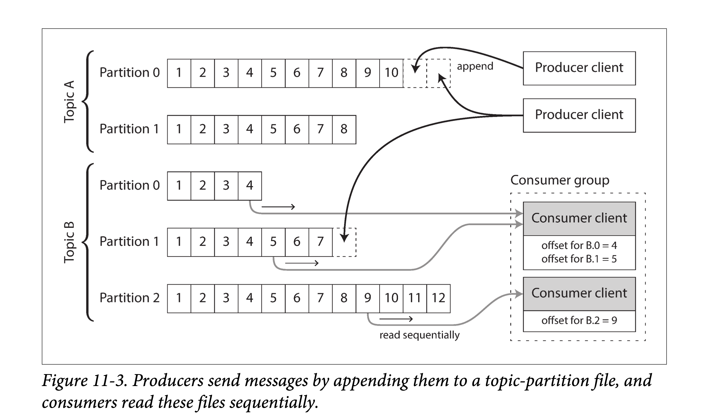

# DDIA 逐章精读（十一）: 流处理（Stream Processing）

> 一个 work 的复杂系统，总是从一个 work 的简单系统演化而来的；其逆命题似乎也是正确的：从一个不 work 的原型构建的复杂系统，也难以让其变的 work。
> 
> — John Gall, *Systemantics* (1975)

在第十章的时候，我们讨论了**批处理**——它总是读取一些文件作为输入，产生一些新文件作为输出。这里的输出就是一种“**衍生数据**”：即，如果有需要，我们可以通过再跑一遍批处理任务获取相同的结果集。从之前章节的讨论我们可以看出，这种思想简单却强大：像搜索引擎、推荐系统、分析系统等很多现代常见的数据系统都是基于这种思想构建的。

然而，在第十章进行讨论时我们有一个很强的假设：**输入数据集是有界的**——即事先知道输入尺寸——因此批处理的程序知道输入何时结束。举个例子，MapReduce 中非常重要的排序操作，就必须读入所有待排序的输入数据后才能开始排序并输出。这是因为，最后一条数据，没准可能是被需要排在最前面（具有最小的 key），因此不可能过早对数据排序。

但在现实中，很多数据都是无界的且随着时间**持续**到来的：我们的（各种服务的）用户昨天会产生数据、今天会产生数据，明天也将以同样的方式继续产生数据。除非你关门大吉，否则这些程序将会永无休止地工作，因此我们的数据库永远也不会到达一个“**终态**”（complete state）。因此，如果使用批处理的思想来处理这种持续来到的数据流，就会引出一个数据集切分的问题：例如，在一天结束时处理这一整天的数据、在每小时结束时处理这一小时的数据等等。

但上述切分+批处理的方式有个问题：太慢了，用户可能等不及。比如按天处理是，则其处理结果只有当这一天结束后，再花些时间去批处理，才能最终看到结果。为了降低这个延迟，我们确实可以用更小的粒度进行处理——比如，每秒进行一次处理。甚而，干脆抛弃时间分片的概念，任意数据到来的时候就触发数据处理逻辑。这就是**流式处理**（steam processing）背后的基本思想。

通常来说，一个“**流**”（steam）指的是随时间推移而增量产生的数据。这个概念其实很多地方都有：Unix 中标准输入输出中（stdin、stdout），编程语言中（迭代器），文件系统相关的 API 中（如 Java 的 `FileInputStream`），TCP 连接中，网络中传输的音视频等等。

在本章中，我们会将**事件流**（event stream）当做一种数据管理机制：即将我们上一章讨论的批量数据**无界化、增量化**。我们首先会讨论如何表示、存储和传输数据流。在“数据库和数据流”一节中，我们会探索数据流和数据库的管理。最后，在“处理数据流”一节中，我们将会讨论对这些不间断的数据流进行处理的方法和工具，以及基于其构建应用的一些方法。

# 事件流的传输

在批处理系统中，任务的输入和输出都是文件（可能是单机文件系统中的、也可能是分布式文件系统中的），那么在流式系统中，承载输入和输出的是什么呢？

在批处理系统中，虽然输入是文件，但第一步也通常是解析成一系列的**数据记录**（records）。在流式处理的上下中，对应数据记录的实体通常被称为**事件**（event）。但他们本质上都是一个东西：**一段小的、自包含的（self-contained、不引用其他数据）、不可变的某个时间点发生的信息数据**。流式系统中的一个事件通常会包含一个时间戳，来标志该事件在某个时钟系统（time-of-day clock）中发生的时间点。

下面举几个事件的例子。事件可以是由用户活动产生的，如浏览网页、网上购物；也可以由机器产生，如周期性的温度传感器、CPU 利用率指标；在[使用Unix工具进行批处理](https://ddia.qtmuniao.com/#/ch10?id=%e4%bd%bf%e7%94%a8unix%e5%b7%a5%e5%85%b7%e8%bf%9b%e8%a1%8c%e6%89%b9%e5%a4%84%e7%90%86)一节的例子中，我们提到的 web 服务器中的每一行日志，也是一个事件。

我们在第四章中讨论过数据编码的事情。事件本质上也是数据，因此可以被编码为字符串、JSON 或者二进制形式。只有编码之后，事件才能被存储，如：

1. 追加到文件末尾
2. 插入到关系表中
3. 写到文档数据库里

也只有在编码之后，事件才能够在网络中进行传输，以发送到其他工作节点进行处理。

在批处理系统中，一个文件通常是一次写多次读的。类似的，在流式处理系统中，一个事件在被生产者（producer，在不同系统中，也可以称为 publisher 或者 sender）生成之后，可能会被多个感兴趣的消费者（consumer，对应的，也可以称为 subscribers 和 recipients）处理。在文件系统中，**文件名**可以标识一组数据记录；在流式系统中，相关的事件通常会聚拢到**主题**（topic）下或者**流**（stream）中。换句话说，命名后的流类似于文件，但不同的是，流中的是无界数据。

原则上，使用文件或者数据库也足够用以沟通生产者和消费者：

1. 生产者将每个产生的事件写入**数据存储**（date store）中（文件系统或者数据库）
2. 消费者定期的去从数据系统中拉取，并上次拉取比对，看是否有新事件到来

批处理系统在以天为粒度处理数据时，正是用的这种办法。

但是，在放到低延迟的持续数据流的上下文中时，如果存储系统不是专门为此定制的，定时去拉取（polling）数据的代价会变得很高。且，在数据量一定的情况下，你拉取的频次越高，单次拉到新数据的概率就越低，则无效负载也会随之升高。因此，在流式系统中，当有新事件产生时，按需通知消费者会比频发拉取更高效（即推比拉高效）。

传统上，数据库对于这种通知机制支持的并不是很好：虽然关系型数据中的确有**触发器**（triggers），且可以对数据表中的一些事件（如，新插入一行）做出响应，但响应逻辑中能做的很有限（比如做一致性检查），且通常局限在数据库内部（而不能通知到客户端）。为此，一些专用的工具被开发出来以进行专门的事件通知。

## 消息系统

通知消费者有新事件产生的一个常见方法是**消息系统**（messaging system）：生产者将事件以消息的形式发送到消息系统，消息系统将其推送给消费者。我们在[经由消息传递的数据流](https://ddia.qtmuniao.com/#/ch04?id=%e7%bb%8f%e7%94%b1%e6%b6%88%e6%81%af%e4%bc%a0%e9%80%92%e7%9a%84%e6%95%b0%e6%8d%ae%e6%b5%81)一节简单提过消息系统，本节我们将会讨论更多细节。

实现消息系统最简单的方式，就是使用 Unix 管道或者 TCP连接来沟通生产者和消费者。但大部分消息系统不会如此简单。比如，Unix 管道和 TCP 连接都是一对一的发送者和接受者，但成熟的消息系统通常要支持**多对多**的生产消费——即多个生产者可以将数据发送到一个**主题**（ topic ）下，多个消费者可以共通消费这个 topic。

但在这种**发布/订阅**（publish/subscribe）模式之下，不同具体的系统实现方式千差万别。没有一种方案能满足所有需求。为了理解不同系统的实现，我们可以带着两个问题去考察各个系统：

1. **如果生产者的生产速度快于消费者的消费速度会发生什么**？通常来说，有三种选择：**丢掉部分消息、缓存多余消息、背压阻止新消息**（backpressure，也被称为**流控**，即在消费者处理完之前，阻止生产者产生更多数据）。具体来说，Unix 管道和 TCP 都使用背压的方式：他们都有一个很小的缓冲区（Buffer），如果缓冲区被填满，则发送方阻塞直到接收方消费掉缓冲区中一些消息，以空出新的位置。如果使用队列缓冲消息，则需要了解当数据量增大到一定地步之后该怎么办？当内存装不下数据之后是宕机还是刷到硬盘上？如果刷到硬盘上，硬盘的访问将如何影响消息系统的性能？
2. **当系统中一些节点短时间下线会发生什么？会有消息因此而丢失吗**？和数据库一样，要想保证持久性，是需要付出一些代价的：如将数据写到硬盘中、将数据冗余到其他节点上等等。如果你能够接受偶尔丢一些数据，那在同样的硬件配置下，你或许能获得更高的吞吐和更低的延迟。

**是否能够接受消息丢失取决于应用层**。例如，对于一些周期性上报的传感器读数来说，偶尔的一两个采点的丢失影响不大， 因为后面的数据会很快的报上来。然而需要注意，如果消息大面积的丢失，可能也很难立即看出来。另外，如果你的目标是对所有到来的事件进行计数，则每条信息都要可靠的传输，因为任何一条信息的丢失都会导致计数错误。

我们在上一章中讨论过批处理的一个非常友好的性质——**提供很好的容错保证**。即，所有失败的子任务会自动的进行重试、所有失败任务的部分输出会被丢弃。这种做法会让系统看起来像没有发生过任何故障一样，从而可以让应用层大大简化编程模型（这些分布式故障如果系统不处理，就要应用层自己来处理）。在本章稍后的部分，我们会探讨如何在流式处理的上下文中提供类似的保证。

### 生产者到消费者的直接消息

很多消息系统并不借助中间系统节点，而直接使用网络来沟通生产者和消费者双方：

- **UDP 多播**。UDP 多播广泛用在金融系统的数据流中，如对时延要求很高的股票市场中的大盘动态。尽管 UDP 本身是不可靠的，但是可以在应用层增加可靠性算法（类似在应用层实现 TCP 的一些算法），对丢失的信息进行恢复（生产者需要记住所有已发送的消息，才可以按需进行重传）。
- **无 broker 的消息队列**。像 ZeroMQ 和 nanomsg 等不使用消息 broker 的以库形式提供的消息队列，依赖 TCP 或者 IP 多播等方式实现了支持发布订阅的消息队列。
- **StatsD 和 Brubeck**。这两个系统底层依赖 UDP 协议进行传递消息，以监控所有机器、并收集相关数据指标。（在 **StatsD**协议中，只有事件都收到，counter 相关指标才会正确；使用 UDP 就意味者使用一种**尽可能正确**的保证）。
- **Webhooks**。如果消费者在网络上暴露出了一个服务，则生产者可以通过 HTTP 或者 RPC 请求（参见[经由服务的数据流：REST 和 RPC](https://ddia.qtmuniao.com/#/ch04?id=%e7%bb%8f%e7%94%b1%e6%9c%8d%e5%8a%a1%e7%9a%84%e6%95%b0%e6%8d%ae%e6%b5%81%ef%bc%9arest-%e5%92%8c-rpc)）来将数据打到消费者中。这就是 webhooks 背后的思想：一个服务会向另一个服务进行注册，并在有事件产生时向该服务发送一个请求。

这种直接消息系统在其目标场景中通常能够工作的很好，但需要应用层代码自己承担、处理消息丢失的可能性。此外，这些系统能够进行的容错很有限：虽然这些系统在检测到丢包后会进行重传，但它们通常会假设**生产者和消费者都一直在线**（这是一个很强的假设）。

如果消费者由于某种原因下线了，它可能会错过一些消息。有些协议会允许生产者重发失败的消息，但如果生产者也挂了，这种方法也无济于事——生产者会丢掉保存有需要进行重试的消息缓存。

> 这本质上是因为，这些没有 broker 的消息系统多表现为库的形式，本身是没有状态的。如果没有状态，就没有办法应对消息传输过程中生产者、消费者宕机重启的故障。这也是引入 broker 的初衷，但因此消息系统也会变的更加**重**。
> 

### 消息代理

一种广泛使用的替代方案就是使用**消息代理**（message broker，也称为消息队列）来发送消息。消息代理本质上是一种专门为消息数据优化过的*数据库*。它通常以进程的形式跑在服务器上，生产者和消费者作为客户端与之通信。生产者将消息写入消息代理，消费者从其中读取以进行消费。

通过引入一个消息数据存储代理，消息系统可以更加容易的对客户端（包括生产者和消费者）的来来去去（连接、失联和宕机）进行**容错**。这样，数据的**持久化职责**被转移到了消息代理上。有些系统中的消息代理将数据保存在内存中，那么宕机重启就仍然有问题；但另一些系统中的消息代理就会把消息持久化到硬盘（通常可配置）中，则就可以容忍宕机问题。如果遇到慢的消费者，就可以使用无限队列的方式（而不是丢消息或者背压）对没来得及消费的数据进行缓存，当然通常来说，能够存多少数据通常也会以配置的方式交给用户去选择。

使用消息代理的另外一个原因是消费者通常是**异步消费**的：即当发送一条消息后，生产者等待消息代理确认收到（缓存或者持久化）就会结束，而不会去等待这条消息最终被消费者所消费。而消息最终被消费者所消费，会发生在将来的某个时间点——大多数很快，比如几秒内，但如果出现大量消息积压时，这个时间也可能会很久。

### 对比消息代理和数据库

有一些消息代理甚至能够参与两阶段提交（使用 XA 或者 JTA，参见[实践中的分布式事务](https://ddia.qtmuniao.com/#/ch09?id=%e5%ae%9e%e8%b7%b5%e4%b8%ad%e7%9a%84%e5%88%86%e5%b8%83%e5%bc%8f%e4%ba%8b%e5%8a%a1)）。这种功能让消息代理看起来非常像数据库，尽管在实践中他们有一些非常重要的区别：

- **删除过程**：数据库会一直保存数据，直到其被**显式地**删除。然而，大部分的消息代理会在消息被消费后，隐式的对其自动删除。这种类型的消息代理并不适合对数据的长时间存储。
- **尺寸假设**：由于消息代理会在消息被消费后将其删除，因此大部分消息代理都会**假设**其所存数据并不是很多——所有队列都很短。在这样的假设下，如果由于消费者过慢而造成消息在消息代理中堆积（当内存中存不下后可能需要放到硬盘中），则可能造成消息代理的性能降级，所有消息都需要更长时间才能被处理。
- **数据过滤**：数据库通常支持二级索引其他一些对数据进行查找的方法，而消息代理也通常会支持对某个 topic 下符合某种条件的数据进行订阅。虽然机制不同，但在本质上，两者都支持客户端读取其所关心数据的方法。
- **数据隔离**：当对数据库进行查询时，其结果通常是基于某个时间点的快照；换句话说，如果另外一个客户端在其发起查询之后插入了一些数据，第一个客户端通常是看不到这些更新的（这要“归功于”数据库事务的隔离级别），除非其进行再次查询。与之相对，消息代理虽然不支持任意条件的查询，但当数据发生变化时（新的事件到来），系统会将其立即告知消费者。

以上都是传统视角下的消息代理，这些语义被抽象成了像 JMS 和 AMQP 之类的协议，并且为 RabbitMQ、ActiveMQ、HornetQ、Qpid、TIBCO 企业消息服务、IBM MQ、Azure Service Bus 和 Google Cloud Pub/Sub 等系统实现。

### 多消费者

当多个消费者同时消费一个 topic 下的数据时，有两种主要的消费方式，

- **负载均衡**（Load Balancing，互斥）
    
    **每个消息被投递给其中一个消费者进行消费**。即所有的消费者会共同处理一个 topic 下的所有消息。消息代理可能以任意策略将消息分发给不同消费者。当每条消息消费代价很高，用户想通过增加消费者的数量来并行消费某个 topic 时，这种方式很有用。（在 AMQP 中，可以通过多个客户端消费同一个队列来实现负载均衡；在 JMS 中，这种方式被称为共享订阅）
    
- **扇出**（Fan-out，独立）
    
    **每个消息都被发送到所有消费者**。扇出的方式会让每个消费者独立的对同样的数据进行消费，而不会互相影响。这种方式有点类似于批处理中对于同一份数据进行多次处理。（JMS 中称为 topic subcription；AMQP 中称为 exchange bindings）
    


两种消费模式也可以组合起来：如有两组用户都订阅了某个 topic，组间进行独立消费（fan-out）、组内进行互斥消费（load balancing）。

### 确认和重传

消费者可能会在任意时刻宕机，因此可能会出现：消息代理将消息发送给了消费者，但是消费者却没有对其进行消费或者仅进行了部分消费，就宕机了。为了保证该消息不丢，消息代理使用了一种确认机制（类似 TCP 中的 ack）：**每个消费者必须显式地告诉消息代理它消费完了消息，这样消息代理才能安全的将消息从队列中删除**。

如果消息代理和消费者之间的链接关闭或者超时了，消息代理仍然没有收到确认，则会假设消息没有被处理，并且重新给另一个消费者发送消息。但此时有可能出现，在重发之前消息实际已经被处理过了，只是确认消息由于网络的原因丢失了。在这种情况下，需要消费者进行幂等消费。

在负载均衡模式下，重传可能会造成消费者处理消息的**乱序**。在下图中，在没有任何故障时，消费者大体是按照消息的生产顺序来消费的。然而，某一时刻，消费者 2 号在处理消息 m3 时宕机了，此时消费者 1 号正在处理消息 m4。由于迟迟没有等到 m3 的消费确认，消息代理将其重新发送给了消费者 1 号，从而导致消费者 1 号以 m4，m3，m5 的顺序来处理的消息。即，发生了乱序处理。


即使消息代理试图以顺序的方式给消费者发送消息（JMS 和 AMQP 都有此类规定），但由于负载均衡和重传机制的组合，乱序消费难以避免。为了避免这个问题，你可以让每个消费者使用单独的队列（即，不用负载均衡功能，也可以理解，毕竟并行总是有代价的）。在每条消息都是互相独立时，乱序消费不是问题；但如果消息间有**前后因果依赖**，则消息的保序消费非常重要。

## 分区日志

通过网络发送数据包或者给一个服务发送网络请求都是透明的操作，不会留下任何永久痕迹。尽管，我们可以将其永久的记下来（通过抓包工具或者日志工具），但通常不会这么做。即使消息代理会暂时地将消息写到外存中，但在其被消费后也通常会删除，这一切是因为，我们认为消息是一种**暂态数据**。

与之相对，数据库和文件系统是另外一种思想：一旦数据被写入数据库或者文件中，就会被认为是**持久数据**，直到其他人将其**显式地**删除。

这两种不同的思路，对我们如何生成衍生数据有很大的影响。我们在第十章中讨论过，批处理的一个核心特点是，你可以针对同一个输入，做不同实验、跑多次处理，而不用担心输入会发生变化（因为输入是只读的）。但在 AMQP/JMS 协议下，事件或者说消息，并不具有此类特性。因为一旦消息被确认消费后，就会被删除。因此，你不能再将消费者重新跑一遍，并期望相同结果。

**时间回溯**。在某个时刻 t，如果你往消息系统中新加入一个消费者，则该消费者只能消费时刻 t 以后新到来的消息；所有之前的消息都已经不在了，且不能恢复。与之相对，对于文件系统和数据库，当你新加入一个客户端时，它可以读取之前任意时刻写入的数据（只要该数据没有被显式删除）。

于是一个想法就出现了——我们能不能取两者之长，造一个系统，兼有数据库的**持久存储**特性和消息系统的**低时延通知**特性？这就是**基于日志的消息代理**（log-based message brokers）的基本思想。

### 使用日志作为消息存储

**日志是一种基于硬盘的、只允许追加的记录序列**。我们在第三章讨论基于日志结构的存储引擎时，讨论过写前日志（WAL），在第五章的讨论冗余时，也提过。

这种结构也能够用于实现消息代理：

1. 生产：生产者将消息追加到日志的末尾
2. 消费：消费者顺序读取日志序列，读到末尾时阻塞等待

Unix 工具 `tail -f` 就是使用的类似的思想，以监视是否有新数据追加到文件末尾。

为了对 IO 平滑扩容以突破单机硬盘限制，日志可以被**切片**（Partition）。进而，将不同的日志切片摊到不同的机器上去，从而让不同机器上的日志分片能够独立的应对读写负载。这样，一个逻辑上的 topic，在物理上可以表现为分散在多机上的，存有同样类型消息的多个日志分片的集合。如下图所示：



在每个日志分片内部，消息代理会给每条消息安排一个全局递增的序列号（或称为偏移量，offset），由于每个分片都是只允许追加的，因此在分片内，其消息是按序号局部有序的。但在不同分片间，消息的顺序是没有办法保证的。

Apache Kafka，Amazon Kinesis Streams 和 Twitter 的 DistributedLog 背后都是类似的原理。谷歌云的上的 Pub/Sub 在架构上更像 JMS 风格的 API，而不是日志的抽象。即使这些消息代理会将所有消息落盘，但由于**多机、顺序写**等特点，总体仍然能够达到每秒数百万条消息的吞吐，且能够通过多机冗余进行容错。

### 对比日志和传统消息

日志和传统消息的一个很大不同是，不会在消费者消费完后立即删除。因此基于分区日志的消息系统可以很容易的支持并行消费（ fan-out）。由于有分区的存在，支持负载均衡（ load-balance） 也很方便，可以将每个分区直接给某个消费者进行消费。

每个客户端会消费分配给他的所有分区的消息。通常来说，在一个分区内部，消费者会对所有消息进行单线程、顺序地消费。这种基于分区粒度的负载均衡有一些缺点：

1. **并发限制**：由于一个分区最多安排给一个消费者，因此互斥消费一个 topic 的消费者数量不能多于分区数。
2. **单条阻塞**：如果某个消息处理过慢，则会阻塞其所在分区后续所有消息的消费。

因此，总结来说：

1. 如果每条消息的处理代价很高，你不关心消费的顺序，但想在消息粒度进行并行的处理以加快整体处理速度，则 **JMS/AMQP 风格的消息代理**更合适。
2. 如果你想要高吞吐，每条消息能够很快处理，且消息间顺序很重要，则**基于日志的消息代理**工作得更好。

### 消费者偏移量

在分区内顺序消费使得追踪消费者的消费进度非常容易：只需要记住一个偏移量即可，所有小于该偏移量的消息都被消费了，所有大于该偏移量的消息尚未被消费。因此，消息代理无需在消息粒度上追踪其是否被确认，只需要定期持久化**消费偏移量**即可。这种方法减少了元信息开销，但同时也降低了 batch 化（将一批消息一块发送出去，乱序确认）和**流水线化**（不等确认就给 Consumer 发送下一条）以提高系统吞吐的可能性。

这种偏移量的记录方式，很像单主模型数据库中的**序列号**（log sequence number），我们在[新增副本](https://ddia.qtmuniao.com/#/ch05?id=%e6%96%b0%e5%a2%9e%e5%89%af%e6%9c%ac)一节中讨论过。在多副本数据库中，使用序列号能让从副本在宕机重启后，从固定位置重新消费，以不错过任何写。同样的原则也适用于此，本质上，**消息代理就类似主节点，而消费者就类似从节点**。

如果一个消费者节点挂掉之后，会从消费者组中另挑选消费者来分担其原负责分区，并且从上次记录的偏移量处继续消费。如果之前的消费者处理了某些消息，但还没来得及更新消费偏移量。则这些消息会被其他节点**重复消费**，本章稍后我们会讨论解决这个问题的一些方法。

### 硬盘空间用量

如果你无休止的在硬盘上追加日志，最终硬盘空间会被耗尽。为了回收硬盘空间，日志通常会被切分成多**段**（segments），旧的日志段会被定期删掉。（之后我们会讨论一些更复杂的硬盘空间释放策略）

这意味着，如果一个消费者过于慢，以至于日志段都要被删掉了还没消费完。这种情况下，消费者可能会丢失一些消息。通常来说，我们会将日志组织成固定尺寸的消息序列，称为**环形缓冲区**（circular buffer 或者 ring buffer）。当然，我们的缓冲区是基于磁盘的，因此尺寸可以做到非常大。

让我们来粗估一下。截至成书时（2017），一块用于存储的大磁盘通常为 6T 大小，并提供 150 M/s 的吞吐。如果我们的日志追加能够打满 IO 带宽，则大概需要 11 个小时能将硬盘全部写满。这意味着，硬盘可以存 11 小时的消息，之后旧的数据就会被新数据覆写。即使我们用多机、多盘，但是这个单盘的指标不会变。但实际上，我们通常不可能时刻都能**打满磁盘带宽**，因此一块盘通常能够保存更长时间的消息，数天甚至数周。

但在基于日志的消息代理中，日志保存的长短，并不会影响消息的吞吐。因为所有的消息都是要落盘的。但对于之前讨论的无代理的消息系统则不然，因为在那些系统中，会优先把消息缓存在内存中，只有内存装不下了才会往外存写。因此，缓存的数据一多，吞吐就会降下来。

### 消费者落后生产者时

在消息系统小节一开始，我们讨论过如果消费者不能跟上生产者速率后的几种选择：丢消息、缓存或者使用背压。在基于日志的消息系统中，我们无疑采用了缓存的方式，使用固定但巨大的缓存（受限于磁盘空间）。

如果某个消费者掉队太远，以至于消费进度调出本机所存日志范围，则该消费者就不能再消费这些已经被丢弃的消息——因为消息代理已经把他们删掉了。一种解决办法是，你可以**监控每个消费者的进度**，如果某个消费者落后太多，就及时进行报警，让运维人员介入来看下为啥这个消费者这么慢，能不能修复或者干脆重新分配。通常来说，硬盘能够容纳足够长时间的消息，因此运维人员通常有充足的时间来介入。

即使一个消费者掉队太远，也只会影响他自己；而不会干扰其他消费者。这对运维同学来说是重大利好：你可以任意的针对线上日志进行消费、测试、调试，而不用担心影响线上服务。当一个消费者主动下线或者意外宕机时，它不会对线上系统造成任何影响——除了留下一个专属于它的消费者偏移量外。

这种设定与传统的消息代理形成鲜明对比。在那些不基于日志的消息代理中，你需要小心的回收每个已下线的消费者的相应队列缓存，否则即使他们下线了，他们所占的资源（每个消费者都会维护不少元信息）也会慢慢耗尽消息代理的内存。

### 回放旧消息

我们注意到，在之前的 AMQP 和 JMS 风格消息代理中，对消息的处理和确认是一个**破坏性**的操作——会导致消息被删除。另一方面，在基于日志的消息代理中，消费消息更像读取一个文件：消费是一个只读操作，并不会对日志本身造成任何改变。

除了产生输出外，消费者进行消费的唯一**副作用**就是——更新消费偏移量。但偏移量是受消费者本身控制的（不像 AMQP 的消息删除操作并不是受消费者直接控制），举个例子，如果想重新消费昨天的数据，你可以启动一个消费者，从昨天的偏移量开始消费，并将消费输出放到不同的地方，以重放昨天的消息处理。你可以修改调试代码，将这个过程重复任意多次。

从这个方面看，基于日志的消息系统很像上一章讨论的批处理——衍生数据和输入数据通过可重复的变换过程连接，但总体上来说是**解耦的**。这种特性可以让我们很容易的对相关消息数据做实验，并且很方便地从错误和 bug 中恢复过来，从而让这种类型日志系统很容易被整合到企业中其他的数据流里。

# 数据库和流

我们已经对比了消息代理和数据库的诸多方面。在传统上，他们被认为是两个完全不同类别的系统，但在之前小节的分析我们看到，基于日志的消息系统中成功地从数据库中借鉴了许多经验。其实，我们也可以有另外一条路，从消息系统中借鉴一些思想，应用到数据库中。

我们在之前提到过，事件（event）是对某个时间点发生的事情记录。事件可以是一个用户行为（如，一次搜索），可以是传感器数值，但其实也可以是**写入数据库**（write to a database）。写入数据库这个事情本身也可以被当做一个事件被捕获、存储和处理。我们通过这个连接可以发现，硬盘上的日志只是数据库和流数据之间最基本的牵连，其更深层次的关联远不止于此。

事实上，复制日志（在[日志复制](https://ddia.qtmuniao.com/#/ch05?id=%e6%97%a5%e5%bf%97%e5%a4%8d%e5%88%b6)小节中讨论过）就是数据库主节点在处理事务时产生的一系列写入事件。从节点将这些写入事件按顺序应用到本地数据库副本上，就会得到一样的数据库副本。复制日志中的这些事件**完整描述**了数据库中的所有**数据变更**。

我们在[全序广播](https://ddia.qtmuniao.com/#/ch09?id=%e5%85%a8%e5%ba%8f%e5%b9%bf%e6%92%ad)也提到过状态机的复制（state machine replication）原则：如果将所有数据库的更改都表达为事件，且每个数据库副本都按照同样的顺序处理这些事件，则所有的数据库副本最终会具有相同的状态。（当然这里的前提是，所有事件都是**确定性**的操作。）这里状态机的复制正是事件流的一种典型例子。

在本节中，我们首先看下异构数据系统中的一些问题，然后探索下如何从消息系统中借鉴一些思想来解决数据库中的这些问题。

## 跨系统数据同步

从贯穿全书的思想可以看出，没有任何单一系统能够满足所有的数据存储、查询和处理需求。在实际中，大部分的问题场景都是由**不同的技术**组合来解决的：如，使用 OLTP 数据库来服务用户请求，使用缓存来加速常见查询，使用全文索引来处理用户搜索，使用数据仓库来进行数据分析。所有这些系统都保有一份为其服务场景优化的**专用形式**的数据副本。

当**同一份数据**以不同形式出现在多个数据系统中时，就需要某种手段来保持其同步：如数据库中数据条目更新后，也需要同时在缓存、搜索引擎和数据库仓库中进行同步更新。对于数据仓库来说，我们通常将该过程称之为：**ETL**。ETL 通常会拿到数据库中的所有数据、进行变换然后一次性载入数仓中。可以看出 ETL 通常是一个批处理的过程。类似的，在[批处理工作流的输出](https://ddia.qtmuniao.com/#/ch10?id=%e6%89%b9%e5%a4%84%e7%90%86%e5%b7%a5%e4%bd%9c%e6%b5%81%e7%9a%84%e8%be%93%e5%87%ba)一节中我们提到过，如何用批处理来构建搜索引擎、推荐系统和其他衍生数据系统的过程。

如果你觉得定期全量同步数据太慢了，另一种替代方法是“**双写**”（dual writes）：当有数据变动时，应用层代码会显示的更新所有系统，如写入数据的同时更新搜索引擎、让缓存失效等等。双写本质上一中**推**的方式，“推”的方式的一大特点就是及时性好，但容错性差。

然而，双写的方式有一些严重的问题，其中的一个就是竞态条件（race condition），如下图所示。在这个例子中，两个客户端想并发的更新数据条目 X：client 1 想将 X 设为 A，与此同时 client 2 想将其设为 B。两个客户端都会先写数据库、再写搜索引擎。但在通信时两者的请求不幸地交错到一块了：数据库先接到 client 1 请求将 X 设为 A，继而接到 client 2 请求将 X 设为 B，则最终数据库中 X 的值是 B。但对于搜索引擎来说，却是先看到了 client 2 的请求，再看到 client 1 的请求，则搜索引擎中 X 最终的值为 A。在这种并发且交错的情况下，即使没有发生任何出错，但这两个系统却出现了永久的数据不一致。


除非你使用了某些并发检测机制（参见[并发写入检测](https://ddia.qtmuniao.com/#/ch05?id=%e5%b9%b6%e5%8f%91%e5%86%99%e5%85%a5%e6%a3%80%e6%b5%8b)），否则你可能根本注意不到并发写的发生——一个值就这样悄悄的被其他值覆盖了。

双写的另一个重要问题是：一个系统中的写入成功了而往另外一个系统中的写入却失败了。当然，这本质上是一个容错问题而非并发写问题，但仍然会导致两个数据系统处于不一致的状态。想要保证两个系统的写入“要么都成功、要么都失败”是一个原子提交问题（参见[原子提交和两阶段提交](https://ddia.qtmuniao.com/#/ch09?id=%e5%8e%9f%e5%ad%90%e6%8f%90%e4%ba%a4%e5%92%8c%e4%b8%a4%e9%98%b6%e6%ae%b5%e6%8f%90%e4%ba%a4)），解决这个问题的代价十分高昂（两阶段提交代价很大）。

在使用单主模型的数据库中，主节点会决定写入的顺序，从节点会跟随主节点，最终数据库中所有节点的状态机都会收敛到相同的状态。但在上图中，并没有一个跨系统的、全局的主节点：数据库和搜索引擎都会**独立地**接受写入（主节点本质上就是一个对外的数据接收点，而如果有多个写入接收点，本质上是多主），而互不跟随，因此很容易发生冲突（参见[多主模型](https://ddia.qtmuniao.com/#/ch05?id=%e5%a4%9a%e4%b8%bb%e6%a8%a1%e5%9e%8b)）。

如果我们对于多个系统真正的只有一个主节点，让其他系统跟随这个主节点，这种情况才会被解决。比如，在上面的例子中，让数据库充当主节点，让存储引擎成为数据库的从节点跟，跟随其写入。但在实践中，这可能吗？

## 数据变更捕获

其中一个主要问题是，充当主从复制机制中关键角色的**复制日志**（replication log），是数据库的一个内部实现模块，而非一个公共服务。客户端对数据库查询时，只能通过基于数据模型、使用相应的查询语言，走查询引擎。而不能直接读取复制日志，并从其中解析数据。

数十年来，大多数的数据库实现都没有选择将相关日志作为服务开放出来，并用文档详细阐明日志记录数据库变更的机制。出于此，我们很难将数据库的日志模块拿出来，作为复制中介，同步给外部系统（如存储引擎、缓存和数仓）。

近些年（本书出版于 2017），**CDC**（**change data capture，数据变更捕获**）受到越来越多的关注。CDC 是一种捕获数据库中数据变更，并且以某种方式将其导出，供其他外部系统使用的技术。如果我们将 CDC 进行流式的导出，事情将会变得更有意思。

例如，你可以跟踪数据库中的变更，将其持续导出，应用到搜索引擎中。如果对于所有的修改日志按同样的顺序进行应用，则你可以期望搜索引擎中的数据是和数据库中的一致的。从消息系统的角度看，搜索引擎和其他的衍生数据系统都是数据变更流的消费者。如下图所示：


### CDC 的实现

如本书第三部分的标题，我们可以将 CDC 数据的消费者当做是**衍生数据系统**（derived data system）：存储引擎和数据仓库中的数据本质上是数据库中同一份数据的不同视图。CDC 是一种将所有数据中变更精确同步给所有数据视图的手段。

本质上，CDC 实现了我们上面提到的，让数据库成为领导者（事件捕获的源头），让其他系统成为跟随者。由于对消息的保序性，基于日志的消息代理非常适合将 CDC 的事件流导给其他数据系统。

数据库的触发器可以用来实现 CDC（参考[基于触发器的复制](https://ddia.qtmuniao.com/#/ch05?id=%e5%9f%ba%e4%ba%8e%e8%a7%a6%e5%8f%91%e5%99%a8%e7%9a%84%e5%a4%8d%e5%88%b6)）。具体来说，可以注册一些触发器来监听所有数据库表的变更，然后将变更统一写入 changelog 表。然而，这种方式容错性很低且有性能问题。需要用比较鲁棒的方式来解析复制日志，尽管可能会遇到一些问题，比如处理模式变更。

在工业界中，LinkedIn 的 Databus，Facebook 的 Wormhole 和 Yahoo 的 Sherpa 就大规模的使用了这种思想。Bottled Water 依托解析 PostgreSQL 的 WAL 实现了 CDC，Maxwell 和 Debezium 通过解析 MySQL 的 binlog 实现的 CDC，Mongoriver 通过读取 MongoDB 的 oplog 实现 CDC，GoldenGate 也针对 Oracle 实现了类似的功能。

和日志代理一样，CDC 通常是异步的：数据库在导出事件流时通常不会等待消费者应用完成后才提交。这种设计的优点是给 CDC 增加慢的消费者并不会对源系统造成影响；但缺点就是不同系统间可能会存在日志应用滞后。（参见 [复制滞后问题](https://ddia.qtmuniao.com/#/ch05?id=%e5%a4%8d%e5%88%b6%e6%bb%9e%e5%90%8e%e9%97%ae%e9%a2%98)）

### 初始快照

如果你有数据库从开始以来的所有日志，你可以通过重放来恢复数据库的整个状态机。但，在大多数情况下，保存所有变更日志非常占用硬盘空间，恢复的时候重放也非常耗时。为此，我们必须定期对老日志进行截断。

构建全文索引需要一份数据库中的全量数据，只使用包含最近变动的日志是不够的，因为丢失之前的一些数据。因此，如果你没有全量的日志记录，也可以从某个一致性的快照开始，应用该快照对应时间点之后的所有日志，也可以得到一份全量状态。我们在[新增副本](https://ddia.qtmuniao.com/#/ch05?id=%e6%96%b0%e5%a2%9e%e5%89%af%e6%9c%ac)一节中讨论过这个问题。

要达到上述目的，就需要数据库的快照能够和变更日志中的**某个下标对应上**，这样我们在从快照中恢复之后，才能知道从哪个变更日志开始回放。有些 CDC 工具直接集成了快照功能，但有的就需要自己手动做快照。

### 日志压缩

如果我们只能保存很少的历史日志，则在每次添加新的衍生系统时，都需要加载快照。而，日志压缩提供了另一种可能性。

我们在哈希索引一节中，在日志结构的存储引擎的上下文中讨论过日志压缩。其原理很简单：存储引擎定期扫描所有日志记录，找到具有相同 key 的数据，丢掉老的日志，只留下最新的。这个压缩、合并的过程会在后台一直默默执行。

在日志结构的存储引擎中，会使用一个特殊空标记（一个墓碑标记，tombstone）来标识某个 key 被删掉了，最终在后台压缩的时候，会据此真正的去删除所有日志中的相关 key。从另一方面来说，只要一个 key 没有被覆写或者删除，他就会一直留在日志中。这样，只要压缩的足够快和彻底，一个压缩后的日志所占的硬盘空间就只与数据库中的内容（即 key 的数量）有关，而和数据库接收了多少个写入事件无关。如果某个 key 被频繁的覆写，该 key 之前的所有修改日志最终都会被压回收掉，只剩下最后该 key 相关的一个日志。

同样的原理也可以应用到基于日志的消息代理和 CDC 中。如我们给每条变更日志**关联一个主键**（primary key），且可以保证同一个 key 后面的变更会覆盖之前变更，则我们可以基于此对日志进行压缩，对于每个 primary key 只保存最后一个变更日志即可。

在这种设定下，当我们想基于现有变更日志构建一个新的衍生系统时（如搜索引擎），就可以启动一个新的消费者从下标 0 开始对压缩后的日志进行顺序消费，直到扫描完所有的日志。使用压缩日志，你就不再需要额外的快照了，因为这种日志包含你恢复数据库状态所需要的所有 key。

Apache Kafka 就支持这种日志压缩的方式。我们在本章稍后会看到，这种特性让消息代理不仅可用于暂时的消息传递，而且可用于持久化的存储。

### 变更流的 API 支持

越来越多的数据库支持将数据变更流（change streams）接口作为第一等公民，而不需要用户去修改底层代码以 hack 的方式支持 CDC。例如，RethinkDB 允许通过查询订阅结果集变更；Firebase 和 CouchDB 基于变更流进行数据同步，且将其开放给了应用层使用；Meteor 使用 MongoDB 的操作日志（oplog）来订阅数据变更，并更新用户接口。

VoltDB 允许将表以流的形式导出（可参考其[文档](https://docs.voltdb.com/UsingVoltDB/ChapExport.php)）。数据库将关系数据模型中的输出流表示为一个数据库表，可以通过事务向其中插入元组，但不能对该表进行查询。于是，该导出流中就会包含所有已提交事务的元组，外部消费者（以 connector 的形式）就可以异步的消费这些日志，并将更新应用到衍生数据系统中。

Kafka Connect 是一个可以将数据库 CDC 导出的流接入 Kafka 的工具。一旦事件流导入进了 Kafka，下游衍生系统就可以按需进行消费，生成倒排索引、打入流式系统中等等。

## 事件溯源

我们在这里讨论的**事件溯源**（event souring）和**领域驱动设计**（domain-driven design，DDD）社区中的相关概念有些相似之处。由于这个概念会牵扯出流式系统中的一些重要的思想，因此我们这里简单讨论一下。

和 CDC 类似，事件溯源也是将应用状态的所有变更存储为事件变更日志。最大的区别是事件溯源使用了不同层次的抽象：

- 在 CDC 中，应用层以**可修改的方式**（mutable way）使用数据库，可以按需更新或者删除记录。变更日志是从数据库底层导出的（如解析复制日志），该变更日志可以保证日志导出的顺序和其真正的写入顺序一致，从而避免了图 11-4 中交错的情况出现。从另一个角度说，往数据库写数据的应用无需感知和关心 CDC 的存在。
- 在事件溯源中，应用层的逻辑是显式地基于写入事件日志的不可变之上的。在这种情况下，事件存储是仅追加的，任何更新和删除都是禁止的。也就是说，这里的事件是在应用层而非更底层来追踪状态变更的。

事件溯源是一种非常强大的**数据建模技术**：从应用层的视角来说，与其记录用户行为对数据库造成的影响，不如直接记录下用户的行为本身更有物理意义。事件溯源使得追踪应用随着时间的演化过程非常容易，通过全景式展现每个步骤发生了什么、追踪应用层 bug 等等，让调试变得非常容易。

例如，我们如果保存事件“学生取消了选课”，就很清晰直观；但如果保存事件“从选课表中删除一行，往学生反馈表中增加一个取消原因”，其实就隐含了对系统底层的很多假设。如果之后应用层产生一个新的事件，例如“该课空缺将会被分配给等待列表中的下一个人”，则使用事件溯源的方式可以轻松将所有事件串联起来。但如果使用**记录副作用**的方式，一旦底层系统发生变更，就没办法将跨系统事件关联上了。

数据溯源模型很像**编年表数据模型**（chronicle data model）；与此同时，**事件日志**（event log）又很像星型模型（参见[AP 建模：星状型和雪花型](https://ddia.qtmuniao.com/#/ch03?id=ap-%e5%bb%ba%e6%a8%a1%ef%bc%9a%e6%98%9f%e7%8a%b6%e5%9e%8b%e5%92%8c%e9%9b%aa%e8%8a%b1%e5%9e%8b)）中的事实表（fact table）。

人们也开发了一些专用的数据库用来进行事件溯源，如 [Event Store](https://www.eventstore.com/)。但一般来说，事件溯源并不和任何特定的底层存储绑定。也可以基于传统的数据库和消息代理来构建事件溯源的应用。

### 从事件日志中算出当前状态

当然，单纯事件日志本身用处并不是很大，因为通常来说用户需要的是当前最新的状态，而非变更记录。举个例子，在购物网站中，用户会想看到当前购物车中有什么商品，而非购物车中商品被添加的历史。

因此，使用事件溯源的应用需要将事件（**写入**系统的数据更改）日志转化成方便进行展示某时刻的状态（因此数据才能被**读取**）。可以使用任何逻辑完成这个转换，但要确保这个过程是**确定性的**，这样能够保证即使多次重放（replaying），仍然会得到相同的状态。

和 CDC 一样，重放事件日志能够让你还原系统当前的状态。但在 CDC 和事件溯源对日志压缩的处理稍有不同：

- CDC 中对于日志的更新事件通常包含该记录的全量状态而非增量状态。因此，某个主键对应的最新值通常可以由该主键的最新事件来确定，那么此时的日志压缩就很简单，直接丢弃相同键的所有较旧事件即可。
- 但在事件溯源中，通常是站在应用层，即用户视角来记录的用户行为。在这种情况下，后续事件不会覆盖、而是依赖之前的事件，因此你需要全量的事件历史才能还原最终状态。因此，我们是不能对事件溯源的日志进行压缩的。

使用事件溯源的应用通常会有一些快照机制，可以将从事件日志中物化而来的状态保存下来。则在重启时，就不需要每次都重复的处理全量日志了。不过这只是加快宕机恢复性能的一种手段，事件溯源系统本身的最终目的仍是要保存下所有原始的事件、在有需要时可以从任意时刻起来重新处理日志。之后我们还会在“不可变的局限性”中对此进行详细讨论。

### 命令和事件

在事件溯源的哲学里，会仔细甄别**事件**（event）和**命令**（commands）。当用户的请求刚到达系统时，表现形式是一个*命令*：因为还有可能失败，比如不符合系统的一致性检查。应用层必须先要校验该命令可以执行，如果校验成功，命令被接受，就会转变为系统内部的一个持久化的、不可变的*事件*。

举个例子，如果用户想用某个用户名进行注册、在剧院或者航班上预定一个座位时，相关系统首先检查用户名有没有被使用、相关座位还在不在。（我们在[容错的共识算法](https://ddia.qtmuniao.com/#/ch09?id=%e5%ae%b9%e9%94%99%e7%9a%84%e5%85%b1%e8%af%86%e7%ae%97%e6%b3%95) 小节中讨论过这个例子）如果检查通过，系统就会产生一个事件，表明该用户名被该用户 ID 注册了，或者特定的座位给该用户预留了。

在事件产生的那一刻，就变成了一个**事实**。即使客户之后打算更改或者取消预定，也只是会新产生一个新的事件，而不会修改或者删除之前的事件。

所有事件流的消费者不能够拒绝执行任何一个事件：因为在消费者看到该事件的那一刻，该事件就已经是日志中不可变的一部分了，并且**可能**已经被其他消费者看到和消费了。因此，所有命令的校验都需要在其变成事件前同步的完成，如可以使用可串行事务自动地对命令校验并将其转化为事件。

另一种方法是，用户也可以将预定座位的请求拆成两个事件：

1. **意向预定**。系统会进行完整性校验。
2. **确认预定**。收到系统校验通过回复后，再发一个请求进行确认。

我们在[使用全序广播实现线性一致性存储](https://ddia.qtmuniao.com/#/ch09?id=%e4%bd%bf%e7%94%a8%e5%85%a8%e5%ba%8f%e5%b9%bf%e6%92%ad%e5%ae%9e%e7%8e%b0%e7%ba%bf%e6%80%a7%e4%b8%80%e8%87%b4%e6%80%a7%e5%ad%98%e5%82%a8)一节中讨论过。这种拆分使得校验环节可以异步的发生。

## 状态、流和不可变性

在第十章中，对于批处理来说，我们看到过输入文件不可变的优点：你可以做各种批处理的实验而不用担心影响到原输入文件。这种**不可变的原则**也可以给事件溯源和 CDC 带来诸多益处。

通常我们可以认为，数据库保存了应用的当前状态——这本质上是对读优化的，可以很方便、高效的处理读请求。但**状态的本质在于变化**，因此数据库允许对数据进行插入、更新和删除。那这种情况下，怎么保持不变性呢？

无论状态如何变化，都是**事件序列**按时间顺序依次施加的结果。例如，当前可用的座位列表是所有座位减去所有接收到的预定的结果、当前的账户余额是是该账户所有收支事件累加的结果、web 服务器的响应分布图是所有 web 请求的单个相应事件累加的结果。

不管系统的状态如何变化，总是和一个固定的事件序列对应。无论事件内容是什么，是发生还是取消，但不变的是——他们都作为事件发生了。其背后的关键点在于，**可变化的状态和不可变的事件序列并不冲突：他们是一体两面的**。所有变化的日志，**变更日志**（change log），正是状态随时间的演进过程。

如果从数学角度来思考这个问题，可以认为：

1. 应用当前的状态是所有历史事件流**对时间的积分**。
2. 变化流是应用状态函数**对时间的微分**。

当然，这个类比会有一些局限，比如应用状态的二阶导并没有什么物理意义。但总的来说，这种类比能给我们一种看待状态和事件间关系的角度。


如果我们将变更日志持久化，本质上来说，就获得了状态回溯、重现的能力。如果我们将事件日志认为是系统的“本源记录”，而其他可变的状态都是从其衍生而来，则系统中的数据流理解起来会容易得多。正如 Pat Helland 所说：

> 事务日志记录下了所有施加于数据库之上的更改。高速的追加操作是记录这种变化的唯一途径。从这个角度来看，数据库的内容其实日志所有**最新状态**的一个**缓存**，而日志才是真相本源。数据库只是日志序列子集的一个缓存，且该缓存中每个值恰好是日志中每个记录的最新值。
> 

日志压缩的过程，是沟通事件日志和数据库状态的桥梁：日志压缩会保存日志中出现过的所有记录的最新状态，而抛弃被覆盖的值。

### 不可变事件的优点

在数据库中，**不可变性是一个相当古老的思想**。例如，几个世纪以来，会计就一直在用“不可变性”来记账。当一个交易发生时，就会记到分类账簿里。这类账簿，本质上就是一串针对钱、商品和服务事件的日志。而各种账户，如利润、损失和资产负债表都是由上述分类账簿累加算出来的。

如果某条记录出错了，会计通常不会直接更改账簿中的出错记录，而是通过追加一条修正该出错的交易。例如一条对客户多收了的钱的退款交易。由于审计需要等原因，这条错误交易会在账簿中一直存在下去。如果从错误账簿的计算出的报表已经对外发布，则需要在下一个记账周期中进行修正。这种不可变性在会计行业中很常见。

这种保存所有不可变记录的**可审计性**不仅在财务系统中很重要，在其他没有那么严监管的系统中也有很多好处。我们在 [批处理输出的哲学](https://ddia.qtmuniao.com/#/ch10?id=%e6%89%b9%e5%a4%84%e7%90%86%e8%be%93%e5%87%ba%e7%9a%84%e5%93%b2%e5%ad%a6)中讨论过，如果我们允许对原始数据进行破坏性的**原地修改**，则在部署的有 bug 的代码后造成了数据破坏时，恢复原始数据会非常困难。如果我们使用 append-only 的不可变事件日志形式来进行修改，**定位故障位置**和**进行错误恢复**都会变得简单很多。

另一方面，**不可变的事件记录下了比当前状态更多的信息**。例如，在购物网站的场景中，一个用户将某个商品加到了购物车中，后来又删掉了。尽管从最终下单的状态来说，第二个事件抵消了第一个事件的影响。但从分析用户先增后删意图的角度来讲，这两个事件并不能抵消。可能是因为他们想之后再买，也可能是因为他们找到了替代品。这个先增后删的信息回被事件日志中记录下来，但是数据库中的订单表中却没有相关条目。

### 日志衍生多视图

除此之外，将可变的状态从不可变的事件日志中解耦开来，你还可以针对同一份事件日志来中构造面向不同读取场景的多种状态表示。这种方法本质上是给一个事件流增加多个**不同类型的消费者**：举个例子，从 Kafka 中注入数据到分析型数据库 Druid 中、使用 Kafka 保存提交日志的分布式 KV 存储 Pistachio 和使用 Kafka Connect 将数据导出到各种数据库和索引中。其他一些存储和索引系统中，也使用类似的方式来从分布式日志中读取输入。

将从事件日志到数据库的**翻译过程**显式化，会使得我们的应用更容易随着时间**进行演进**。某个时刻，你想引入一个新的功能，但其要求使用某种新的**组织方式对数据进行组织**。此时，如果有一个日志来记录所有事件，你就可以使用事件日志来构建一个额外的、面向新功能优化的读取视图，而不用修改原来的数据系统。让新老系统并存，会比在老系统上进行复杂的数据模式迁移简单。并且，一旦将来确定老数据系统没用了，就可以简单地将其关停然后回收其所占资源。

如果你无需担心数据将来会被怎么读取和使用，那么存储数据是一件非常简单的事情；很多复杂的模式设计、索引构建和存储布局都是为了支持**特定的查询和访问模式**。基于此，如果你将数据的**写入形式和读取形式分开**（很多云原生数据库就是这么干的，如谷歌 [AlloyDB](https://cloud.google.com/alloydb)，微软 [Socrates](https://www.microsoft.com/en-us/research/uploads/prod/2019/05/socrates.pdf)），由此，我们可以获得极大的设计弹性。这种思想有时也被称为：**命令查询职责分离**（*command query responsibility segregation，CQRS*）。

传统数据库的和模式设计有一种误解：**数据必须以面向查询的方式进行写入**（注：其实也不算误解，因为这样可以避免翻译计算耗费和额外存储耗费）。如果你能自由的将数据从对写优化的格式转化为对读优化的数据状态，那么针对数据**规范化**（去除冗余）和**去规范化**（保持冗余）的考量讨论就变的无关紧要了：因为可以使用翻译过程来保证冗余数据的一致性性，且同时按所需方式按利于读的方式来去规范化（也就是冗余）地组织数据。

在[衡量负载](https://ddia.qtmuniao.com/#/ch01?id=%e8%a1%a1%e9%87%8f%e8%b4%9f%e8%bd%bd)一节中我们讨论过 Twitter 的首页时间线（也称“瀑布流”），本质上是对所有关注人最近发的推文的缓存（类似于一个信箱）。这也是一个针对状态进行读优化的例子：首页时间线是非常去规范化的，因为你的推文会被所有关注你的用户首页冗余了一份。然而，**扇出服务**（fan-out service，类似我们上面提到的“翻译服务”）会保持这些首页“瀑布流”信息和新发推文、新的关注关系保持同步和一致，从而让这些冗余的一致性可控。

### 并发控制

事件溯源（event souring）和 CDC 的最大缺点在于，事件日志的产生和消费过程通常是**异步的**，因此可能会出现：用户已经写入了某个事件到日志中，但从某个日志衍生视图中去读取，却发现该写入还并没有反映到该**读取视图**中。我们在[读你所写](https://ddia.qtmuniao.com/#/ch05?id=%e8%af%bb%e4%bd%a0%e6%89%80%e5%86%99)一节中讨论过该问题和一些可用的解决方案。

一种方案是将**追加事件到日志**和**更新读取视图**两个过程进行同步。但这要求使用事务将两者包进一个原子单元中，具体来说，你需要：

1. 将日志更新和视图读取放到一个存储系统中，或者
2. 使用一个分布式事务来协调这两个系统，又或
3. [使用全序广播实现线性一致性存储](https://ddia.qtmuniao.com/#/ch09?id=%e4%bd%bf%e7%94%a8%e5%85%a8%e5%ba%8f%e5%b9%bf%e6%92%ad%e5%ae%9e%e7%8e%b0%e7%ba%bf%e6%80%a7%e4%b8%80%e8%87%b4%e6%80%a7%e5%ad%98%e5%82%a8)

但另一方面，从事件日志中计算当前系统状态也会简化并发控制。很多针对多对象的事务（参见[单对象和多对象操作](https://ddia.qtmuniao.com/#/ch07?id=%e5%8d%95%e5%af%b9%e8%b1%a1%e5%92%8c%e5%a4%9a%e5%af%b9%e8%b1%a1%e6%93%8d%e4%bd%9c) ）需求本质上是因为单个用户需要在**多个物理位置**同时更改数据。但使用事件溯源，我们可以设计一个对用户的多个行为自包含的事件，从而将所有单用户的写入点收束到一处——对事件日志进行追加——从而很容易实现原子性。

如果事件日志和应用状态使用相同的分区方式（例如，消费分区 3 的事件日志，产生的更新也只需要作用于分区 3 的应用状态），则只需要用一个单线程消费事件日志即可，而无需任何对写的并发控制 —— 我们可以通过安排，让其每次只消费一个事件即可（参见[物理上串行](https://ddia.qtmuniao.com/#/ch07?id=%e7%89%a9%e7%90%86%e4%b8%8a%e4%b8%b2%e8%a1%8c)）。通过确定该分区中所有事件的状态，日志本身就已经消除了并发带来的不确定性。但如果单个事件会涉及多个分区状态的更新，就需要做一些额外的工作了，我们下一章中会继续讨论。

### 不可变性的一些局限

很多不使用事件溯源的系统很多时候也**间接地依赖**了不可变性：很多数据库在内部实现时，使用了不可变的数据结构和**多版本的数据管理**来支持基于时间点的**快照**（参见[索引和快照隔离](https://ddia.qtmuniao.com/#/ch07?id=%e7%b4%a2%e5%bc%95%e5%92%8c%e5%bf%ab%e7%85%a7%e9%9a%94%e7%a6%bb)）。像 Git、Mercurial 和 Fossil 之类的版本控制系统，也是依赖不可变数据来保存每个文件的历史版本。

我们若想将所有**不可变的**事件变更历史保存下来，在多大程度上是可行的？其回答取决于我们数据集的“**流失量**”（the amount of churn）。在某些负载中，读取居多而增删极少，因此很容易做成不可变的。但在另外一些负载中，但涉及更改的数据子集在整体数据集中占比很大；在这种情况下，不可变的更改历史将会非常大，数据的碎片化会变成一个大问题，**数据压缩**和**垃圾回收**的性能便成为维持系统稳定性和鲁棒性中至关重要的因素了。

除了性能问题之外，在有些场景下，由于运维管理原因，需要对数据进行永久删除，然而由于不可变的事件日志的存在，**真正的物理删除变的很麻烦**。比如，由于隐私条例，如果用户删除账户后，其所有相关信息应该都被删除；数据保护相关条例要求删除所有错误信息；或者防止敏感信息的意外泄露。

在这些情况下，通过追加一个新的删除事件来标记这些数据被删除了是不够的。你需要真正的重写之前的事件日志历史，来删除所有相关数据，以达到这些数据**看起来像从来就没有出现在系统中**的效果。例如，Datomic 称该功能为**切除**（excision），Fossil 版本控制系统也有类似的概念称为**避免**（shunning，这个翻译不太好。）。

反直觉的是，真正地、彻底地删除数据其实非常困难，因为一份数据的各种副本可能以多种形式存在很多地方：例如，存储引擎、文件系统和 SSD 在底层实现时，通常会不会覆盖数据，而会在新的地方写入；备份数据通常做成整体不可变的，以防止误删或者误改。因此，对于数据系统来说，删除一条数据，本质上可以理解为：“让查询这份数据更难”，而非“无从查到这份数据”。然而，有些时候你不得不尽力保证后者，我们之后会在立法和自律小节中讨论更多。

# 处理流

本章到此为止，我们已经讲了流从哪里来（用户活动事件、传感器和写入数据库），我们也讨论了流如何进行传输（通过直接消息，通过消息代理，使用事件日志）。

余下部分要讨论的是，当你已经有一个流了要如何做——即，如何处理流。广义上来说，我们有三种选择：

1. **写入存储系统**。我们可以将事件流中的数据写入到数据库、缓存、搜索引擎等类似的存储系统中，以供其他客户端来查询。如图 11-5 所示，这种方法可以和那好的保持数据库和其他数据系统的一致。尤其当流写入作为数据库的唯一数据来源时，更是如此。我们在[批处理工作流的输出](https://ddia.qtmuniao.com/#/ch10?id=%e6%89%b9%e5%a4%84%e7%90%86%e5%b7%a5%e4%bd%9c%e6%b5%81%e7%9a%84%e8%be%93%e5%87%ba)讨论过将批数据写入存储系统中，此处流也是类似的。
2. **给人看**。可以将流中的事件以某种方式（比如邮件或者通知）推送给用户，或者将流中的事件渲染到实时可视化的数据面板上。在这些情形中，人是数据流最终的消费者。
3. **产生新的流形成拓扑**。可以在一个系统内处理多个流。并生成多个新的流作为输出。此时，一个数据流在最终产生输出前，可能会经过由多个处理阶段组成的流水线。

在本章余下的部分，我们将主要聚焦第三种选择：**处理数据流以产生新的数据流，即衍生数据流**。其中进行处理的一个个代码片段，我们称为“**算子**”（operator）或“**任务**”（job）。这个概念很类似于我们在上一章讨论过的 Unix 进程和 MapReduce 任务；对数据流的处理方式也很类似：每个流处理算子会以只读的方式消费一个输入流，然后会将输出以追加的形式写到另外的地方（而不会修改输入流）。

对输入流进行**分区**和**并行**的模式也和第十章中对 MapReduce 和数据流引擎中讨论过的很像，这里不再赘述。像过滤和变换等基本的 Mapping 算子的原理也类似。

流和批处理的一个最大的不同在于——**流数据永远不会结束**。这个不同会对流式系统造成很多影响，如章节开始提到的，在无界数据集上进行排序是没有意义的，因此 sort-merge join 算法不能用于流的 join。**容错机制**也需要相应的调整：对于一个只运行几分钟的批处理子任务，简单的从头开始跑即可，但对于一个可能持续运行数年的流式任务，宕机后从头开始跑恐怕是不可接受的。

## 流处理使用场景

流处理广泛应用于**监控场景**中。在这些场景中，如果某些特定事件发生了，要第一时间进行通知。试举几例：

- **反欺诈系统**需要判定信用卡的使用模式是否发生了变化，以在疑似被盗时及时冻结消费。
- **交易系统**需要根据金融市场上的价格变化，及时执行对应交易策略。
- **制造系统**需要监控工程中的设备状态，如果有故障及时识别。
- **军队智能系统**需要识别潜在的入侵者，如果识别到攻击信号要及时报警。

这些类型的应用系统都需要复杂的模式匹配和关联分析。当然，更多的流式处理的使用场景也在随着的时间推移不断涌现。本节，我们将会简单的比对其中的一些应用特点。

### 复杂事件处理

**复杂事件处理**（complex event processing，CEP）是 1990 年代兴起的一种分析事件流的方法，主要用于需要**搜索特定事件模式**（event pattern）的应用。和在字符串中使用正则表达式（regular expression）进行模式匹配一样，CEP 能让你在事件流中定制一些规则以对特定的模式进行匹配。

CEP 系统常使用偏高层的描述式查询语言，如 SQL 或者图形用户接口，来描述需要检测的模式。这些带有模式的查询提交到处理引擎后，会在引擎内部维护一个状态机，以在不断到来的事件流中寻找相关模式。当匹配到相关模式时，处理引擎就会产生一个包含检测到的事件内容的**复杂事件**（complex event，也是该方法得名的原因）。

相对传统数据库，这种系统里查询和数据的关系是反过来的。通常来说，**传统数据库会将数据进行持久化而将查询语句当做暂态的**：当查询到来时，数据库会根据查询语句查找所存数据中匹配子集，当查询处理完成后，就会忘掉该查询（不会将其存储，当然存储过程可能会这么干）。而 CEP 引擎将**这两个角色翻转了过来**：查询被（相对）长时间的存了下来，而数据流中的事件会持续的流过该查询，以检查是否有匹配的事件模式。

实现了 CEP 的业界系统有 Esper、IBMS 的 infoSphere Stream，Apama，TIBCO StreamBase 和 SQLStream。像 Samza 等分布式数据流处理系统也支持使用 SQL 在流上进行声明式的查询。

### 流分析

流处理的另一个主要应用方向是**基于流的分析**。流分析和 CEP 系统的在概念上的界限有些模糊，但总体来说，流分析不太关心在事件序列上寻找特定模式，而更趋向于**分析一些统计指标**，如：

- 测算某类事件的速率（单位时间间隔内的出现频次）
- 估算某段时间窗口内某值的滑动平均
- 比对当前和前段时间的统计数据（比如，通过和上周同段时间对比，看指标的高低变化，以检测趋势或者进行报警）

这些统计信息通常是针对固定时间间隔计算出来的——例如，你可能想知道过去五分钟内的平均 QPS 和九十九分位的响应延迟。取几分钟内的平均延迟能够平滑掉突发的尖刺，但仍能够展示出流量变化的趋势。我们用于聚合数据进行计算的时间段通常称为“**窗口**”（window，或称时间窗口），在“时间推理”一节我们将会讨论时间窗口的更多细节。

数据流分析中有时会使用一些概率算法，如使用布隆过滤器（我们[性能优化](https://ddia.qtmuniao.com/#/ch03?id=%e6%80%a7%e8%83%bd%e4%bc%98%e5%8c%96)小节中遇到过）来管理成员资格、使用 HyperLogLog 来进行基数估计，还有各种各样的分位数值估计算法。概率算法会产生近似结果，但通常比确定算法需要更少的资源（如 CPU，内存）。使用近似算法容易让人们认为流式处理系统总是损失精度和不精确的，但这种看法并不正确：**流式处理本身并非近似的，概率算法只是一种在分析场景中的处理优化**。

很多开源的分布式流处理库框架都是针对分析场景设计的：例如，Apache Storm、Spark Streaming、Flink、Concord、Samza 和 Kafka Streams。有一些云上的托管服务也是，如Google Cloud Dataflow 和 Azure Stream Analytics。

### 管理物化视图

我们在数据库和流处理（TODO: link）一节中提到过，数据库的变更流可以用来维护一些衍生数据系统，如缓存、搜索索引和数据仓库。这些衍生数据系统可以看做物化视图（参见[聚合：数据立方和物化视图](https://ddia.qtmuniao.com/#/ch03?id=%e8%81%9a%e5%90%88%ef%bc%9a%e6%95%b0%e6%8d%ae%e7%ab%8b%e6%96%b9%e5%92%8c%e7%89%a9%e5%8c%96%e8%a7%86%e5%9b%be)）的一些特例：构造一个面向某种查询优化的视图，并将新到来的更改不断更新到该视图上。

类似的，在事件溯源系统中，应用层的状态也是通过持续应用事件日志来维持的；这里的应用层的状态本质上也是一种物化视图。但和**数据流分析**场景不同，在**物化视图**场景中仅考虑固定的时间窗口内的状态是不够的——物化视图通常需要将所有时间以来的事件进行叠加应用，除非，有些过时日志已经通过日志紧缩（TODO: link）被删掉了。如果仍然用时间窗口来解释的话，就是——在物化视图的场景中，你需要一个足够长的、一直延伸到事件流起点的时间窗口。

尽管物化视图“需要事件流永远运行”的需求和一些面向分析框架“仅针对有限时间窗口”的假设大相径庭，但原则上来说，任何可用于流处理的组件都可以用来维护物化视图。基于 Kafka 对日志压缩功能（只针对有 key 的 topic，原理就是只保留相同 key 的最后一条日志），Samza 和 Kafka Streams 就可以支持这种需求。

### 在流上进行搜索

我们之前讨论过，CEP 支持对多个事件某种模式的搜索。但在此之外，我们有时会有一些针对单个事件的复杂查询需求，如针对事件的一些**全文搜索**（所谓全文索引，就是将文本字段进行分词，在词的粒度上建立更细粒度的索引）。

例如，**媒体监控服务**（media monitoring services）会从各个新闻源处（新闻网站、媒体广播）订阅新闻流，然后对相关公司、产品或者感兴趣话题进行搜索过滤。通常的实现方法是，预先定制一个针对特定条件的查询，然后对所有流过的新闻条目与该查询进行匹配，看是否命中。有些网站中也有类似的功能：例如在房地产网站中，用户可以定制在市场中出现满足某些条件的房产时，及时通知用户。[Elasticserach](https://www.elastic.co/elasticsearch) 中的 [Percolate Query](https://www.elastic.co/guide/en/elasticsearch/reference/8.9/query-dsl-percolate-query.html) 接口就可以实现类似的需求。

传统的搜索引擎会首先将文档进行索引（倒排索引）然后在索引上进行查询。与之相对，在流上进行查询将这个过程翻转了过来——先构建和存储查询，然后让每个文档逐一通过查询。这种倒置我们在 CEP 的小结中也提到过。如果你只有很少量的查询，则你可以让每个流过来的文档针对所有查询进行过滤，但如果你有大量的查询条件，这个过程可能会变的非常慢。为了对该过程进行优化，我们可以**对查询本身构建索引**（就像针对文档建立索引一样），以此来将每个文档针对所有索引的线性搜索过程，优化成 logN 的搜索过程。

### 消息传递和 RPC

在 [经由消息传递的数据流](https://ddia.qtmuniao.com/#/ch04?id=%e7%bb%8f%e7%94%b1%e6%b6%88%e6%81%af%e4%bc%a0%e9%80%92%e7%9a%84%e6%95%b0%e6%8d%ae%e6%b5%81)一节中我们讨论过，消息传递系统在某种程度上可以替代 RPC——即，消息系统也可以作为一种服务间的沟通机制，比如在 Actor 模型中。尽管这些系统也是基于消息和事件的，但我们通常**并不会**将其当成一种流式处理：

- Actor 框架本质上是一种管理**并发实体**间的分布式执行和通信沟通的机制，而流处理则更多是侧重**数据处理**技术。
- Actor 之间的通信通常是短暂且一对一的，而事件日志则是持久的且通常是多下游的（多个订阅者/消费者）。
- Actor 间可以用任意模式（注意区分模式和方式，Actor 的通信方式肯定是消息传递）进行通信（包括循环往复的请求-应答模式），但流处理通常由有向无环的流水线构成。每个任务通常以多个流作为输入，进行处理后，然后产生一个新的流。

也就是说，类 RPC 系统和流处理系统间在定位上有一些交叉。举个例子，Apache Storm 有一个叫做分布式 RPC的功能，可以将用户的一个查询分发到所有处理事件流上的节点。在这些节点上，查询请求和事件会被交替的执行，之后所有查询结果会被聚合后返回给用户（参阅多分区的数据处理）。

当然，也可以使用 Actor 框架来进行流处理。但在系统节点宕机时，这些框架通常不对消息的交付有任何保证。因此，除非你实现额外的逻辑，否则这种方式通常不能够进行容错。

## 对时间的推断

在流处理中，尤其是在频繁使用时间窗口“过去五分钟的平均值”分析场景，经常要处理时间相关逻辑。看起来“过去五分钟”含义十分明确，但不幸的是，这个概念并非如看上去这么简单。

在批处理任务中，进行处理的任务通常会在短时间内处理大量的历史数据。如果需要对事件按照时间格子进行细分，则批处理任务需要查看每个事件关联的时间戳。在批处理任务运行时，读取所在机器的系统时钟没有任何意义，因为一个事件被处理的时间点和其产生的时间点没有任何关系。

在某个场景中，一个批处理任务可能会在短短几分钟内读取一年跨度的历史数据；多数情况下，我们感兴趣的是事件所产生的这一年的时间线，而非事件几分钟被处理的时间。此外，使用事件本身的时间戳可以让处理过程保持**确定性**：针对相同的输入多次运行同样任务，会产生相同的输出。

但在与之相对，很多流式处理框架会使用处理机器的本地事件戳（即事件的处理时间）来计算**时间窗口**。这种方法的优点就是**简单**，当事件产生时间和处理事件间隔很小以至可忽略不计时，这种方法很实用。然而，一旦处理延迟很大，即上述间隔大到一定地步时，这种近似方法就不再奏效。

### 事件时间点 vs 处理时间点

有很多原因会造成**处理延迟**：处理排队、网络故障（参见[不可靠的网络](https://ddia.qtmuniao.com/#/ch08?id=%e4%b8%8d%e5%8f%af%e9%9d%a0%e7%9a%84%e7%bd%91%e7%bb%9c)）、机器性能低下造成的消息在消息代理和处理节点的堆积、流消费者的重启或者 bug 修复后对之前事件进行重新处理。

更有甚者，**消息延迟可能会导致无法预知的消息乱序**。举个例子，一个用户首先发送了一个 web 请求（被 web 服务器 A 处理），然后发送了第二个请求（被服务器 B 处理）。A 和 B 各自将其包装成事件消息进行发送，但是 B 的事件比 A 的事件先到达消息代理。则此时，流处理任务会首先看到 B 事件，然后才看到 A 事件，但他们的实际产生顺序其实是相反的。

下面用一个类比或许能帮助理解，对于《星球大战》电影系列：第四部是 1977 年上映，第五部 1980 年上映，第六部 1983 年，然后一，二，三部（作为前传）分别于 1999，2002 和 2005 年上映，最后，第七部于 2015 年上映。如果你按照上映的顺序来看这个系列，就会发现你“处理”电影的顺序和电影叙事顺序是不一致的（在这个例子中，电影内容的编号类似于事件发生的时间戳，你看电影的时间是事件处理的时间）。当然，作为人类，我们可以处理这种不连续型，但流处理算法就得针对性的编写特殊逻辑才能应对这种乱序问题。

**混淆事件产生时间和事件处理时间可能会导致错误数据**。举个例子，设有一个流处理任务在测算请求速率（每秒请求数量）。如果由于某种原因，我们**重新部署**了该任务，则可能会暂停处理一分钟，然后再开始处理积压的事件。如果请求速率是根据处理时间来算的，则在重启后由于处理堆积事速率可能会出现一个**异常的突发**，但实际上，服务请求的速率并没有任何变化。


### 确定何时准备完成

如果我们使用事件本身的时间戳来定义时间窗口，上述问题是不是就可以解决了？是，但这就引出了新的问题：对于某一个窗口来说，**我们很难确定是否已经收齐了所有事件**。

举个例子，假设你正在将事件按照一分钟的时间窗口进行聚集，以统计每分钟内的请求数。然后你已经统计了某小时内第 37 分钟内的一些事件，并向前移动窗口；现在，大部分到来的事件都落到了第 38 分钟和第 39 分钟内。那么，何时你才能够说第 37 分钟内的所有事件已经全部到来了，可以输出计数了呢？

当然，你可以在一段时间（比如一个统计阈值）没有看到某个窗口的事件之后，就说该窗口中的数据已经准备完成了。但其实，仍然可能由于网络等原因，导致该窗口内的某个事件在某个机器上卡了很久才过来。所以，即使你已经宣布某个窗口已经完成了，但仍然要能够处理这种姗姗来迟的“**拖油瓶**”（**straggler**）。总体上，我们有两种选择：

1. **忽略**这些“拖油瓶”事件，如果这部分事件只占很小的一部分，这种做法就可以接受。当然，为了保险起见，你可以不断追踪这些被忽略事件的数量，如果某个时刻其比例变的很大，就及时给运维人员告警。
2. **修正**。对“拖油瓶”事件所在时间窗口的结果进行修正（correction）。可能还需要召回（retract）之前的输出。

在某些情况下，也可以使用一个**特殊的消息**（通常称为 watermark）来标识：“从现在起，不会再有任何时间戳 t 之前的消息了”，消费者就可以利用这些特殊的消息来标记窗口的完成。然而，如果有来自多个机器的多个消费者并发的产生事件，则可能由于每个生产者的生产速度不同，导致消费者要分别对其进度进行跟踪。此时，如果动态的增删生产者，就会造成一些棘手问题。

### 用谁的时钟？

当事件能够在系统中的不同环节进行缓存时，使用给事件附加时间戳的方式就会变得问题多多。举个例子，考虑一个手机定时上报使用参数给服务器的场景。当设备**离线**时，该 APP 也可能被使用，此时只能选择先将这些指标**缓存**到设备本地，等待将来（可能是数小时甚至数天后）重新联网后再次发送。对于该事件流的消费者来说，这些事件都会成为“拖油瓶”事件。

在这个场景中，原则上事件的时间戳应该是用户交互发生时的手机本地始终所显示的时间点。但由于该时钟可能会被用户有意或者无意的进行错误设置（参阅[时钟同步和精度问题](https://ddia.qtmuniao.com/#/ch08?id=%e6%97%b6%e9%92%9f%e5%90%8c%e6%ad%a5%e5%92%8c%e7%b2%be%e5%ba%a6%e9%97%ae%e9%a2%98)），该设备时钟系统通常是不可信的。相比来说，由于服务器是受我们控制的，其收到事件的时间点通常更为准确一些。但如果用其来去近似用户交互时间，又可能会有很大偏差。

为了校正可能有误的设备时钟，一种方法是给每个事件记录三个时间戳：

1. 根据设备时钟，记录事件产生时的时间戳 t1
2. 根据设备时钟，记录事件被发送给服务器的时间戳 t2
3. 根据服务器时钟，记录服务器收到事件的时间戳 t3

通过计算 t3 和 t2 的差值，我们可以大致估算出设备时钟和服务器时钟的**偏移量**（当然，此处假设网络延迟相比时钟偏移可以忽略不计，需要注意，这个假设并不一定总对）。然后再利用此偏移量和 t1 ，就可以大致估算出事件的真正产生时间（这里也有假设——即设备和服务器的时钟偏移量在整个事件产生和处理期间没有发生过变化）。

这个问题并不限于流式处理——批处理也有同样地对时间进行推断的问题。只不过在流式处理的上下文中，时间的流逝更容易被注意到。

### 时间窗口的类型

一旦你明白了如何给事件确定时间戳之后，下一步就是如何针对时间段来定义**时间窗口**。时间窗口可以用于聚集操作，例如对事件进行计数、或者计算时间窗口内的一些指标的平均值。常用的**时间窗口类型**有以下几种：

- **滚动窗口**（Tumbling window）。滚动窗口具有固定时间长度，且每个事件只会唯一的属于某个窗口。例如，如果你使用一分钟粒度的滚动窗口，所有时间戳落到 `10:03:00` 和 `10:03:59` 之间的事件会被分到一个窗口中；所有时间戳落到 `10:04:00` 和 `10:04:59` 之间的事件会被分到下一个窗口中，以此类推。我们可以通过将每个事件的时间戳按分钟向下取整以确定时间窗口，就能实现一个一分钟的滚动窗口。
- **跳跃窗口**（Hopping window）。跳跃窗口的时间长度也固定，但允许有交叠。例如，带有一分钟跳步的五分钟跳跃窗口，包括落在`10:03:00` 至 `10:07:59` 中的所有事件；下一个窗口会包含落在`10:04:00` 至 `10:08:59` 窗口内的事件，依次类推。通常，你可以先实现一分钟的滚动窗口，然后在按规则聚集为跳跃窗口。
- **滑动窗口**（Sliding window）。滑动窗口会包含一定时间间隔内发生的所有事件。例如，一个 5 分钟的滑动窗口可能会包含 `10:03:39` 和 `10:08:12` 的所有事件，因为他们小于五分钟（注意滑动窗口和跳跃窗口基本不会这么分，因为他们的界限会对齐到整点）。滑动窗口通常可以通过一个时间戳有序的缓存来实现，每次插入最新的事件，挤掉过期事件。
- **会话窗口**（Session window）。和其他窗口类型不一样，会话窗口没有固定的长度。相反，它由从属于一个用户的相近事件段的所有事件聚集在一块定义而成的，窗口会在用户不活跃一段时间后（例如，三十分钟内没有新的事件了）结束。按会话对用户数据进行聚集，是网站分析的一个常见需求。

## 多流 Join

在第十章中我们讨论过批处理如何对数据集按 key 进行 join，并且展示了 join 如何构成了数据流水线中非常重要的一环。由于流式处理在某种程度上是对无界数据集进行增量处理的流水线的泛化，因此流式处理中同样有 Join 的需求。

然而，在流中，新的事件可能会出现在流中的任意时刻，这使得数据流的 join 比批处理任务更加有挑战性。为了更好的理解其背后原因，让我们来仔细区分下以下三种类型的 Join：流流连接（streams-streams join），流表连接（stream-table join） 和表表连接（ table-table join）。在接下来的小节，我们将分别举例来阐述三种 join。

### 流流连接（窗口连接）

假设你有个网站，支持搜索功能，然后你想知道最近 URL 的搜索趋势。于是每当有人进行搜索时，你都会生成一个包含**查询条件**和**返回结果**的事件。每次有人点击其中一个搜索结果时，你又会记录另一个包含该点击内容的事件。为了估算搜索结果中每个 URL 的**点击率**（click through rate，`CTR = URL 被点击次数 / URL 被展示的次数`），你需要将搜索动作中的事件和点击动作中的事件放到一块，即按照会话 ID 将两种事件连接到一块。在广告系统中也需要进行类似的分析以衡量广告投放效果。

如果用户搜索后抛掉了结果，则本次会话中的点击事件可能永远不会到来。此外，即使点击事件最后来了，查找事件和点击事件间的时间差可能参差不齐：该时间差大多数情况下可能只有几秒，但也有可能长达数天或者数星期（比如用户进行了搜索，但是没有关相应浏览器页面，过了很久之后回到这个页面进行了点击）。此外，由于网络的不可控延迟，同一会话的点击事件甚至有可能比搜索事件提前到达。因此，我们需要评估该时间差的分布以选择一个合适大小的 join 窗口——例如，如果大部分同会话的搜索和点击会到到一小时内，就可以选择一小时跳步的跳跃 join 窗口。

需要注意的是，在点击事件中嵌入查询细节和对两事件流进行 join 并不等价：将查询嵌入点击事件中，只有在用户对所有的搜索都进行点击时，才能保证点击率的正确性，而可能有很多搜索结果，用户是没有任何点击的。因此，两种流要分开，且我们都需要，才能计算出精确的点击率。

为了实现这种类型的 join，流处理任务需要维护一定的状态：例如，记下所有过去一小时的事件，并用会话 id 进行索引。当一个新的搜索或者点击事件到来时，就会记录到对应的索引中去。同时，流处理任务也会检查同会话 id 中是否已经有另外类型的事件。如果有匹配的事件，则可以产生一个新的事件——某个搜索结果被点击了。如果时间窗口已经过去了，查询事件仍然没有看到匹配的点击事件，则此时我们可以认为该查询的搜索结果没有被点击，于是也产生一个 join 结果。

### 流表连接（流扩充）

在[例子：用户行为数据分析](https://ddia.qtmuniao.com/#/ch10?id=%e4%be%8b%e5%ad%90%ef%bc%9a%e7%94%a8%e6%88%b7%e8%a1%8c%e4%b8%ba%e6%95%b0%e6%8d%ae%e5%88%86%e6%9e%90)（图 10-2）一节中，我们讨论了使用批处理任务对两个数据集进行 join 的例子——对用户活动事件集和用户资料数据库进行 join。可以把用户活动事件看做流，然后在流处理任务中进行持续的、但同样逻辑的 join 。在这种情形下，输入是一个包含用户 ID 的事件流，输出是附加了用户的个人资料信息扩充事件流。因此，该过程有时候也被称为使用数据库中的信息对活动事件进行**扩充**。

为了进行该 join，在处理时需要每次从流中取一个活动事件，然后依据事件中的用户 ID 在数据库中查找相关信息，最后将找到的用户资料信息附加到事件中。数据库的查找可能**发生在远端**；然而，就像我们在[例子：用户行为数据分析](https://ddia.qtmuniao.com/#/ch10?id=%e4%be%8b%e5%ad%90%ef%bc%9a%e7%94%a8%e6%88%b7%e8%a1%8c%e4%b8%ba%e6%95%b0%e6%8d%ae%e5%88%86%e6%9e%90)中讨论过的，这些远端查询通常会比较慢而且有打垮数据库的风险。

另外一种方式是将数据库的数据加载一份到各个流处理节点的内存中，则每次 join 直接从本地内存查找即可，省掉了 RPC 往返的网络开销。这种技术很像我们在[Map 侧的连接](https://ddia.qtmuniao.com/#/ch10?id=map-%e4%be%a7%e7%9a%84%e8%bf%9e%e6%8e%a5)中讨论过的哈希 join：如果数据库表足够小，可以将其以哈希表的形式缓存在各个节点内存，或以索引的形式放在本地磁盘中。

这种方式和批处理任务的区别在于，批处理在进行 join 时用的是某个时间点的数据库的快照作为输入。但流式处理任务是常驻的，随着时间的推移，数据库中的数据就可能发生变化，因此每个流处理节点的数据库副本需要不断更新。我们可以用 CDC 来解决这个问题：流处理任务去同时订阅数据库中用户信息表的变更日志。当用户资料在数据库中被创建或者更新时，流处理任务就会收到相关事件以更新其本地副本。如此一来，我们**本质上也是在 join 两个流**：活动事件流和资料变更流。

流表连接和流流连接非常像，但与流流连接（基于时间窗口范围的 Join）不同的是，在流表连接中：

1. 对于 join 一侧的数据库表的日志变更，我们使用了一个从 join 起始的无限大的窗口，且新的数据会覆盖旧的数据。
2. 对于 join 另一侧的普通流来说，完全不用维持一个窗口的数据，一个个事件看就行。

### 表表连接（维持物化视图）

考虑我们在[衡量负载](https://ddia.qtmuniao.com/#/ch01?id=%e8%a1%a1%e9%87%8f%e8%b4%9f%e8%bd%bd)一节中讨论过的 Twitter 时间线例子。当时我们说，每次用户在看其首页瀑布流时，如果都去所有关注者那拉取一遍最近的推文后进行合并，代价会非常高。

相反，我们想要对该时间线进行缓存：**某种程度上类似于用户粒度的“信箱”，即以用户为单位保存其所有关注者发的推文**。基于此缓存，为每个用户生成时间线时，只需要从“信箱”中拉取最近的推文即可。对该缓存进行物化和维护需要进行以下处理：

- 当某个用户 u 发送一条新的推文时，该推文会被推送到所有关注了 u 的用户时间线上。
- 当某个用户删除一条推文时，将其从所有用户的时间线上删除。
- 当用户 u1 开始关注用户 u2 时，u2 的所有最近的推文都要合并到 u1 的时间线上。
- 当用户 u1 取关用户 u2 时，u2 的所有推文都要从 u1 的时间线上删除。

为了在流处理任务中实现这种**缓存更新**策略，我们需要综合考虑推文**增删事件流**和**关注取关流**。流处理任务需要维护一个小型数据库，包含每个用户的关注集合。这样，当新的推文来到时，才能知道要更新哪些用户的时间线。

从另一种角度来看待这种流处理任务，我们发现它其实是在维护如下一个将两个表（推文表和关系表）进行 join 的查询的**物化视图**：

```sql
SELECT follows.follower_id AS timeline_id, 
  array_agg(tweets.* ORDER BY tweets.timestamp DESC)
FROM tweets
JOIN follows ON follows.followee_id = tweets.sender_id 
GROUP BY follows.follower_id
```

对数据流的 join 可以直接映射到上述查询中对表的 join。时间线可以理解为是上述查询结果的缓存，每当底层表修改后，该缓存也会更新。

> 可以从需要维护的状态来看三者区别：流流 Join 只需要维护 Join 前两流某个时间窗口的状态；流表 Join 需要维护 Join 前表侧任务开始以来所有的状态；表表 Join 则需要维护 Join 之后的物化视图的状态。
> 

### join 的时间依赖

上述三种类型的连接（流流连接，流表连接和表表连接）有很多共通之处：流处理任务都是会根据其中一个流来维持某种状态（查询和点击事件、用户资料信息和关注者列表），然后针对另一个流中的每个事件来查询上述状态。

用于维护状态的事件的顺序很重要（比如说你对某个用户是先关注再取关，还是反过来，结果完全不同）。在具有分区的日志中，单个分区中的事件顺序能够被保序，但通常来说跨分区或者不同流间很难进行顺序保证。

这引出了一个问题：不同流间的事件在很近的时间并发产生，它们最终将会以何种顺序进行处理？在流表连接的例子中，如果用户更新了资料，哪些活动事件和老的资料信息 join 了（即 join 发生在用户资料缓存更新前）？哪些活动事件却和新的资料信息进行 join 了（即 join 发生在用户缓存更新后）？换个角度，如果状态会随着时间不断变化，而你需要和状态进行 join，你需要和哪个时间点的状态进行 join？

这种时间先后的依赖（本质上就是因果依赖）会发生在各种各样的场景中。举个例子，你在卖东西，因此需要在发票上计算税率，而税率取决于多种因素，如国家甚至省份、产品类型、销售日期（税率可能会随着时间而变化）。当我们将销售事件和税率进行 join 时，你会想其 join 到销售发生的时间点的税率而非处理时的税率（因为有可能发生变化）。

由于不同流间的事件的相对顺序是不确定的，因此不同流间的 join 本身也变成了不确定的——这意味着，即使你针对同样的输入流重跑同样的 join，也可能会得到不同的结果：因为当你再次跑任务时，输入流可能会以不同的方式进行了交叠和 join。

在数据仓库中，这种现象也被成为**缓慢变化维**（slowly changing dimension, SCD）。通常可以给每个待 join 的记录关联一个唯一的全局 id 或者时间戳来解决。例如，每次税率发生变化时，我们给其一个新的 id，然后在为销售事件生成发票时需要关联上 id。这会使得 join 变成确定性的，但有个不好的后果就是，阻止了数据压缩，因为同一个 key 的所有版本的记录都不能删除。

## 容错

在本章的最后一部分，让我们来考虑下流处理任务如何进行容错。在第十章中，我们可以看到，批处理的容错很轻松：如果某个 MapReduce 任务出错了，可以很简单地在另外的机器重新拉起一个同样任务，并将所有失败任务的输出丢弃即可。在批处理中，容错可以做的如此简单、透明，原因有以下几点：

1. 输入文件**不可变**
2. 输出会放到另外 HDFS 文件中
3. 任务结束时，输出才对外可见

且，即使有些子任务失败，批处理的容错方式也能够保证输出结果是一样的，看起来就像没有发生过任何不好的事情一样。所有的输入记录看起来就像只被严格的处理过一次一样——没有任何记录被跳过、也没有任何记录被处理了两次。尽管失败任务被重启时可能会导致某些输入被多次处理，但是对于输出的**可见性控制**会让这些输入“看起来”像只被处理过一次。这种保证被称为“严格的一次”（exactly-once）的语义，虽然在这里“有效的一次”（effectively-once）的名字可能更准确一些。

流式处理中也会有类似的容错需求，但是处理起来会更加棘手一些。因为在流中，我们做不到等待流任务结束后，再将任务输出对外可见——流是无限的，你永远不要期待等到任务结束。

### 微批和检查点

一种容错方法是将流拆成小段，然后将每一小段当做一个小批的数据（化流为小批）。这种方法称为**微批**（**microbatching**），Spark Streaming 用的就是这种方法。微批的粒度通常在一秒左右，这是根据性能折中的一个结果：如果批太小，会带来太多的调度和协调的额外开销；如果批太大，则流处理的结果延迟就会太高。

微批隐式的引入了批大小的滚动窗口（基于事件被处理时的时间戳的 tumbling window）。如果基于微批窗口的任务，用户需要自己定义更大的事件窗口，就需要显式的将状态从一个微批带到下个微批中。

Apache Flink 使用的是一种变种容错方式——周期性地将状态做检查点（checkpointing）然后持久化到外部存储。如果某个流算子挂掉后，就可以从最近的检查点重启，并且丢弃宕机前所有检查点之后产生的输出。检查点的创建是由混在流里的**界障**（barriers）触发的，两个界障会界定出一段类似微批的数据，但和微批不同的是，其大小不是固定的。

在流处理框架的限制下，使用微批和检查点等手段，能够提供和批处理中“严格一次”一样的语义。然而，如果结果出了流处理边界（如，写入数据库、发送消息到外部消息代理、发送邮件等**外部副作用**），流处理框架就没有办法在遇到错误时，撤销掉这些输出。在这种情况下，简单的重启失败任务会造成这些副作用发生多次，而仅靠微批和检查点又不足以解决这些问题。

### 原子提交回顾

为了在出错时仍然让外界看起来像只发生了一次一样，我们需要保证所有事件处理后产生的输出或者副作用仅在处理成功时才生效。这些影响包括：发送消息到下游算子或外部消息系统（包括发邮件或者其他通知）、写入外部数据库、修改算子状态或者对输入消息的 ACK（比如将基于日志的消息系统中消费者的偏移量往前拨）。

这些事情要么全部发生，要么没有任何一个发生，也就是说需要某种跨模块的同步机制来保证原子性。对此你可能听起来很熟悉，因为我们在“严格一次的消息传递”一节中讨论过这个问题，当时的上下文是分布式事务和两阶段提交。

在第九章我们讨论过该问题的解决办法——分布式事务，如 XA。然而，在更特定的环境里，我们可以将原子提交实现的更高效。如，在 Google Cloud Dataflow 和 VoltDB 中，Kafka 也有增加类似功能的计划。和 XA 不同的是，这些实现没有试图在异构系统中提供事务保证，而是仅在流式系统框架内部**保证状态变更**和**消息发送**间的原子性。事务引入的额外开销可以通过在单个事务中处理多条输入来摊平。

### 幂等性

我们的目的是丢弃任何失败任务的部分输出，以便可以安全地重试这些失败任务，而不会产生重复影响。分布式事务是一种解决办法，另一种常用的方法是：幂等性（**idempotence**）。

所谓幂等操作，就是该操作执行多遍造成结果和仅执行一次一样。例如，在 key-value 存储中设置一个 key 为某个特定的值就是幂等的（使用同样的 kv 对重复 put 多次，结果是一样的）；而给计数器加一就不是一个幂等操作（重复执行该操作，会使得计数器增加多次，而不是一次）。

即使某些操作不是幂等的，但是可以通过附加一些额外信息来使之幂等。例如，Kafka 中的每条消息都有持久化的、全局递增的偏移量。当将某条消息写入外部数据库时，你可以将该偏移量带上。这样，写入逻辑可以维护一个写入偏移量的水位，如果发现该消息已经被应用过了，就可以跳过该消息，避免重复更新。Storm’s Trident 对于状态的管理使用了类似的理念。

使用幂等性进行容错时依赖一些假设：

1. 重启错误任务后，必须按照同样的顺序应用消息（基于日志的消息代理能干这件事）
2. 消息的处理需要是确定性的
3. 没有其他节点来并发地更新同样值

当由于故障，在其他机器上拉起同样子任务时，需要一些防护。否则，如果原任务只是假死，就仍然会干扰系统。尽管有很多需要注意的点，但幂等操作仍然是高效地实现严格一次语义的一种手段。

### 故障后状态重建

所有流处理都会有一些中间状态——例如，基于窗口的聚合操作（计数、求平均、直方图）和待 join 的表或索引。这些状态都需要定期持久化，以保证算子失败重启后能够恢复。

一种选择是将状态放到外部存储中，但如果每条消息都要去查远端数据库可能会很慢。另一种方法是将状态保存到流处理算子本地，并定期将其复制到其他机器。如此一来，当算子从失败中重启时，新的任务就可以从其他机器的副本来读取原状态，从而不丢失数据地”断点重启“。

例如，Flink 会定期的将算子状态做快照，并将其持久化到外部存储，如 HDFS 中；Samza 和 Kafka Stream 则会将状态变更发送到具有日志压缩功能的专用 Kafka 的 Topic 中，有点类似于 CDC；VoltDB 则会通过在多个节点冗余的处理每条消息来保持高可用性。

在某些情况下，如果我们能够根据输入流再次构建状态，我们就不需要对其进行冗余。例如，如果状态只包含一个很小时间窗口的聚集结果，则可以通过重放相关输入来很快地重建该状态。如果状态是通过 CDC 来维护的一个数据库的本地副本，则可以从压缩过后的变更流来重建该数据库副本。

当然，如何在上面不同手段间（主要是本地还是远端）进行取舍取决于**底层基础设施的环境特点**：在一些系统中，网络延迟甚至会比本地磁盘读写低，且网络带宽甚至能比得上磁盘吞吐带宽。没有一种取舍能满足任何场景，并且随着技术的不断发展，本地和远端访问的指标对比可能也会发生变化。

# 小结

在本章中我们讨论了事件流、其所服务的场景以及如何对其进行处理。在某些方面，流处理很像我们前一章讨论过的批处理，但两者对输入的假设不同——批处理是固定、有限输入，而流处理事持续、无界输入。从这个角度看，消息代理和事件日志充当了流处理系统中的文件系统和文件的生态位。

我们花了一些时间来比较两种类型的消息代理：

- **AMQP/JMS 风格消息代理**
    
    消息代理会将消息逐条分配给某个消费者，消费者在成功处理消息后会给消息代理返回 ACK。一旦收到 ACK，消息代理就会将对应消息删除。在异步 RPC 的场景中使用这种风格很合适，例如在异步**任务队列**场景中，每条消息被处理的顺序并不重要，且消息（任务）通常也无需被回退以进行二次处理。
    
- **基于日志风格消息代理**
    
    这种消息代理会将某个消息分区中的消息作为整体安排给某个消费节点，并且（在分区内部）总是以同样的顺序来交付消息。消费的并行是做在分区粒度的，每个消费者仅需要定期持久化偏移量就可以保存消费进度。消息代理会将消息保存在硬盘中，因此可在必要时可以进行回退对消息进行重复消费。
    

这种基于日志的手段，和在[第五章](https://ddia.qtmuniao.com/#/ch05)中讨论数据库时提到的冗余日志和在[第三章](https://ddia.qtmuniao.com/#/ch03)中提到的日志结构的存储引擎有诸多相似之处。这种手段在流式处理中非常适用，因为流处理就是消费输入流、然后生成衍生状态或者新的衍生流。

说到**流从哪里来**，我们讨论了多种可能的情况：用户活动、传感器读数、数据 feed 流（如财务中的市场数据）都可以表达为流。我们也看到了，将对数据库的按时间次序的更新也看做流是一种非常有效的抽象：可以通过隐式的 CDC 或者显式的事件溯源来捕获数据库的变更日志（即对数据库的更新历史）。日志压缩使得我们能够以较低成本保存数据库的所有内容。

将数据库表达为流带来了对不同系统进行整合的诸多机会。可以通过消费变更日志并应用到衍生系统，来保持存储引擎、缓存和数仓等衍生系统和原系统的一致性。我们也可以从头消费所有变更日志来对现有数据构建高效的物化视图。

**维护流状态**和**重放消息**也是实现各种流处理框架中流 Join 和容错技术的基础。我们讨论了流处理的几个目的，包括搜索事件模式（复杂事件处理）、计算窗口聚合（流分析）以及保持派生数据系统的最新状态（物化视图）。

然后我们讨论了在流处理器中对时间进行推断的困难性，包括事件附加时间戳和事件处理时间点的区别、在某窗口处理完后有事件姗姗来迟的应对等等。

在流处理中，我们区别出了三种不同的 join 类型：

- **流流 Join**
    
    两个输入流都包含用户活动事件，join 算子会搜索某些事件窗口内所有相关的事件。例如，可能会将同一个用户 30 分钟内发生的两个事件匹配起来。如果你想 join 同一个流中的不同事件，可以让 join 两侧是同一个流。
    
- **流表 Join**
    
    一个输入流包含用户事件，另一个输入流是数据库变更日志。通过变更日志可以在算子本地维护一个实时的数据库副本。对于每个到来的用户事件，join 算子会在该数据库中进行查询，然后输出所有匹配上的扩展后的事件。
    
- **表表 Join**
    
    输入流两侧都是数据库的变更日志。在这种情况下，每一侧的到来的变更都要和另一侧的最新状态来 Join。其结果其实是两表 Join 的物化视图的变更流。
    

最后，我们讨论了在流处理器中进行容错和实现严格一次语义的一些技术。对于批处理来说，我们可以简单的抛掉故障任务的中间输出。但流处理是长时间运行的、并持续产生输出的。因此我们不能将所有历史输出都丢掉，然后重算。相反，我们需要引入一些细粒度的恢复机制，可以基于微批、检查点、事务或者幂等更新来实现。
